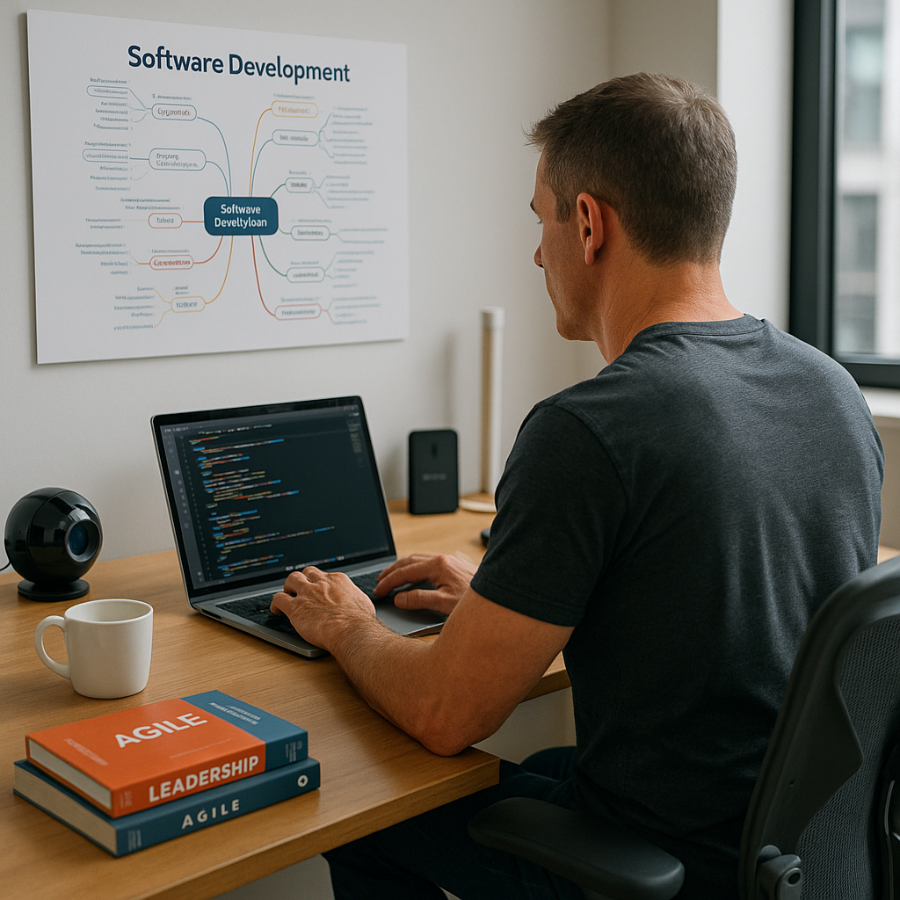
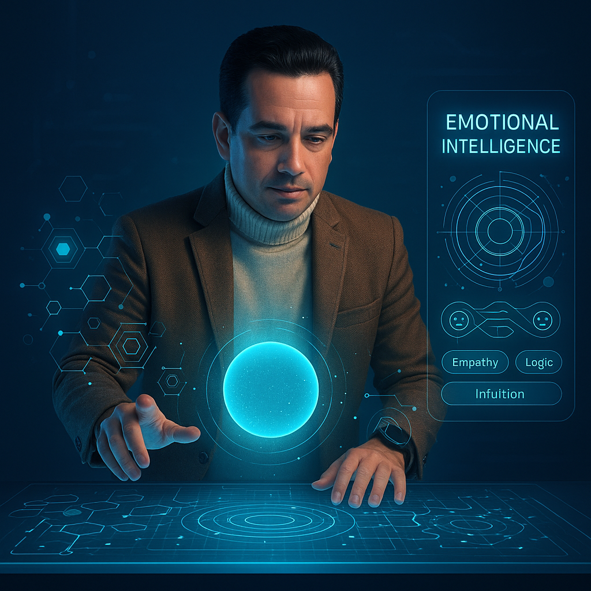
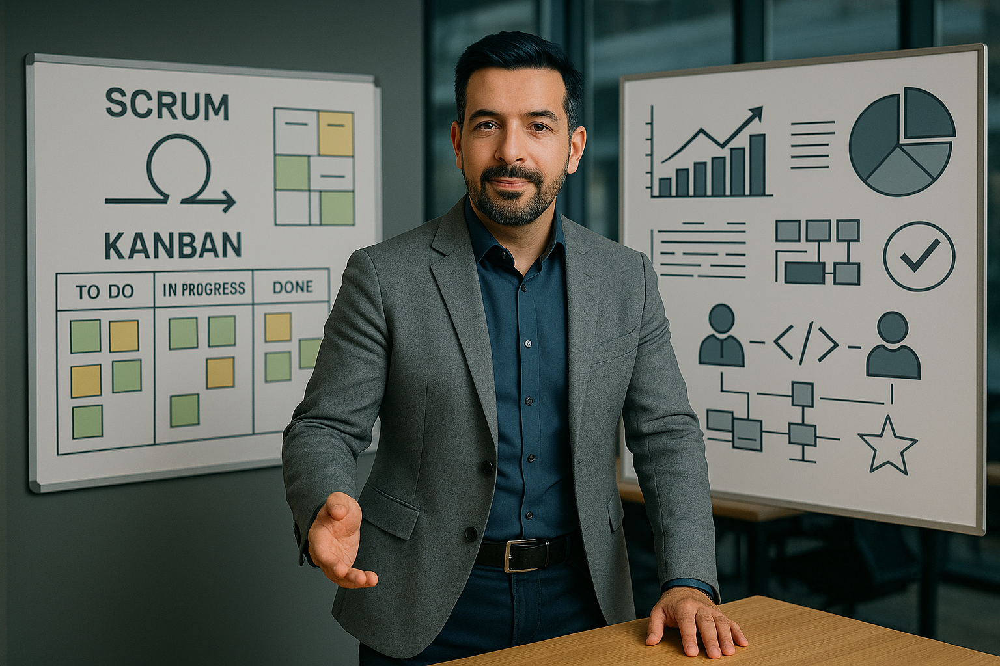
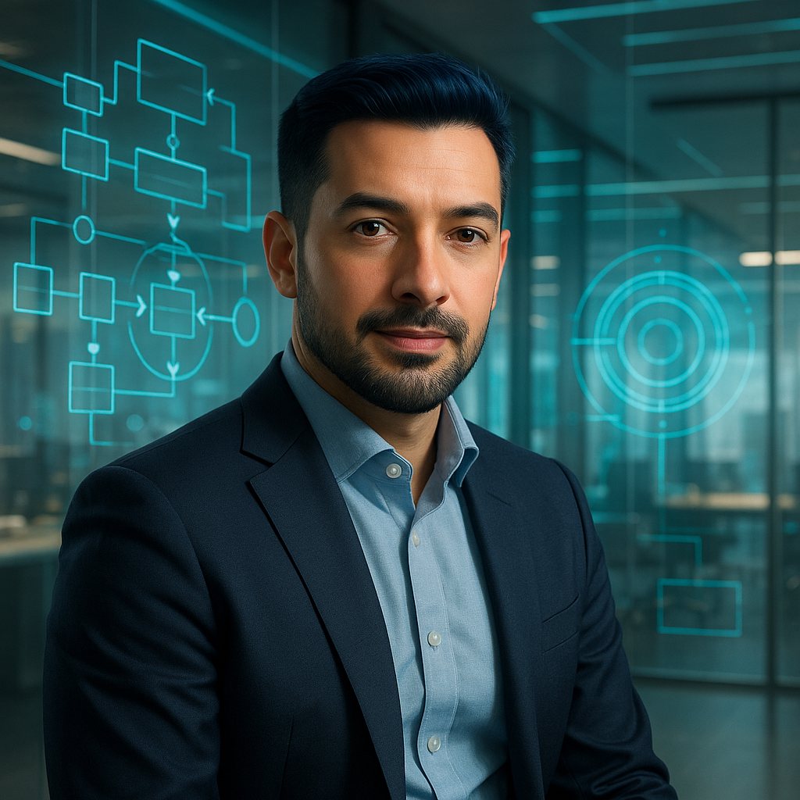

# Ingeniero de Sistemas con pasión por la tecnología, los negocios y la innovación

> *Transformar con propósito. Conectar lo técnico, lo humano y lo estratégico.*

---

## 🚀 ¿Qué encontrarás en esta documentación?

- **Trayectoria profesional**: roles, habilidades y evolución como desarrollador, ingeniero y estratega.
- **Exploraciones técnicas**: programación, automatización, arquitectura y patrones de diseño.
- **Gestión y liderazgo**: BPM, metodologías ágiles, toma de decisiones y liderazgo técnico.
- **Hobbies y aprendizajes personales**: desde juegos y deportes hasta ciencia, arte y vínculos familiares.

---
<!-- markdownlint-disable MD033 -->
|  | **Ingeniero de Sistemas con más de 20 años de experiencia en desarrollo de software y gestión de proyectos, liderando equipos de entre 3 y 9 personas.**  Mi pasión por el conocimiento y la tecnología 🔥 me impulsa a buscar nuevas formas de resolver problemas y mejorar la vida de las personas. |
|--|--|

| **He explorado a fondo temas como la Inteligencia Artificial y su aplicación en la transformación de negocios, entendiendo su potencial para cambiar industrias enteras.** |  |
|--|--|

|  | **Durante mi carrera he participado en proyectos de diversa escala, desde iniciativas personales hasta soluciones empresariales.**  Tengo experiencia en metodologías ágiles y tradicionales, con foco en calidad y colaboración. |
|--|--|

| **He complementado mi perfil técnico con habilidades de inteligencia emocional, liderazgo y resolución de conflictos.**  Estas competencias me han permitido liderar equipos de alto rendimiento y contribuir a transformaciones organizacionales. |  |
|--|--|

|  | **Recientemente obtuve mi Maestría en Gestión de Procesos de Negocio (BPM), fortaleciendo mis capacidades en análisis, diseño y optimización de procesos.**  Esta formación me posiciona para liderar la transformación digital desde lo estratégico. |
|--|--|

---

> 🎯 Actualmente estoy consolidando y expandiendo mi carrera hacia roles de liderazgo tecnológico y estratégico, con el objetivo de emprender y liderar mi propia compañía tecnológica.
