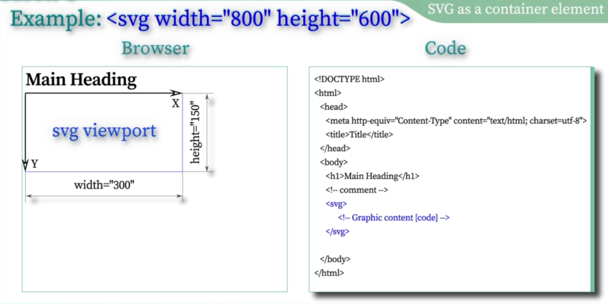
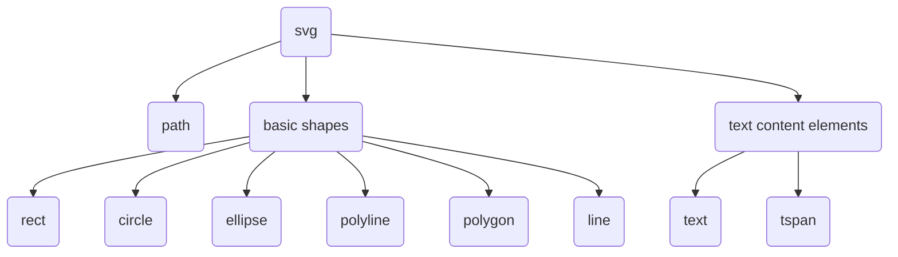

# LANGUAGE SVG

SVG ([Scalable Vector Graphics](https://es.wikipedia.org/wiki/Gr%C3%A1ficos_vectoriales_escalables)) es un formato vectorial poco conocido pero muy útil para su uso online por su flexibilidad y por la capacidad de ofrecer gráficos con calidad.

Este lenguaje está basado en [HTML](../../hardSkills/html/README.md) y [XML](./hardSkills/xml.md), por lo que es muy fácil de aprender. SVG es un lenguaje de marcado, por lo que se puede editar con cualquier editor de texto. No es necesario instalar ningún programa adicional.

## ¿Por qué usar SVG?

SVG es un lenguaje de marcado, por lo que es muy fácil de editar con cualquier editor de texto. No es necesario instalar ningún programa adicional.

Al ser vectorial, SVG ofrece gráficos con calidad y sin perder calidad al aumentar el tamaño.

SVG es compatible con todos los navegadores modernos.

SVG permite modificar el tamaño y el color de los gráficos sin perder calidad y sin necesidad de generar nuevos archivos.

Los modificadores de estilos [CSS](./hardSkills/css.md) se pueden aplicar a los gráficos SVG.

Comandos y funciones [JavaScript](./hardSkills/javascrip.md) se pueden aplicar a los gráficos SVG.

Atributos padre pueden ser aplicados a los elementos SVG desde el código [HTML](./hardSkills/html.md).

## NOTAS

En ésta página solo se encuentra notas y ejemplos de los cursos realizados en SVG. Uno de los cursos gratuitos es el que se encuentra en [w3schools](https://www.w3schools.com/graphics/svg_intro.asp).

## CONCEPTOS BÁSICOS

### sistema de coordenadas

El sistema de coordenadas de SVG se define con el atributo `viewBox` de la etiqueta `<svg>`. El atributo `viewBox` define un rectángulo en el que se dibujará el gráfico SVG. El rectángulo se define con cuatro valores: `x`, `y`, `width` y `height`.

El origen del sistema de coordenadas se define en la esquina superior izquierda del rectángulo. El eje `x` se define horizontalmente a la derecha, y el eje `y` se define verticalmente hacia abajo.

### Contenedores

SVG admite los siguientes contenedores:

- `<svg>`: define un contenedor para gráficos SVG.
- `<g>`: define un grupo de elementos.
- `<defs>`: define definiciones para el gráfico SVG.
- `<symbol>`: define un símbolo para el gráfico SVG.
- `<use>`: define un uso de un símbolo para el gráfico SVG.
- `<image>`: define una imagen para el gráfico SVG.
- `<switch>`: define un conjunto de alternativas para el gráfico SVG.
- `<foreignObject>`: define un objeto externo para el gráfico SVG.
- `<desc>`: define una descripción para el gráfico SVG.
- `<title>`: define un título para el gráfico SVG.



### Formas básicas

SVG admite las siguientes formas básicas:

- `<circle>`: define un círculo.
- `<ellipse>`: define una elipse.
- `<line>`: define una línea.
- `<rect>`: define un rectángulo.
- `<polygon>`: define un polígono.
- `<polyline>`: define una polilínea.
- `<path>`: define una ruta.

Las formas básicas se definen con los atributos `cx`, `cy`, `r`, `rx`, `ry`, `x1`, `y1`, `x2`, `y2`, `x`, `y`, `width`, `height`, `points` y `d`.

Las formas básicas se pueden usar como máscara de recorte con el atributo `clip-path`. ejemplo:

```html
<svg width="100" height="100">
  <circle cx="50" cy="50" r="40" fill="red" />
  <circle cx="50" cy="50" r="40 " fill="url(#grad1)" clip-path="url(#clip)" />
</svg>
```

### Unidades de medida

SVG admite las siguientes unidades de medida:

- px: píxeles
- %: porcentaje
- em: ems
- ex: exs
- pt: puntos
- pc: picas
- cm: centímetros
- mm: milímetros
- in: pulgadas

## Estilos

SVG admite los estilos en diferentes niveles de importancia:

1. Inline: se define en el elemento SVG. ejemplo: `<svg style="fill:red;">`
2. Id: se define en el atributo `id` del elemento SVG. ejemplo: `<svg id="mySVG">`
3. Class: se define en el atributo `class` del elemento SVG. ejemplo: `<svg class="mySVG">`
4. Element and pseudo-element: se define en el elemento SVG. ejemplo: `<svg>`

## Pintado

Cabe destacar que SVG usa los atributos `fill` y `stroke` para pintar. El atributo `fill` define el color de relleno, y el atributo `stroke` define el color de línea.

Tanto el atributo `fill` como el atributo `stroke` soportan diferentes tipos de valores como lo son:

- color: define el color de relleno o de línea. ejemplo: `fill="red"`
- url: define el color de relleno o de línea con una URL. ejemplo: `fill="url(#grad1)"`
- none: define el color de relleno o de línea como transparente. ejemplo: `fill="none"`
- inherit: define el color de relleno o de línea como heredado. ejemplo: `fill="inherit"`
- currentColor: define el color de relleno o de línea como el color actual. ejemplo: `fill="currentColor"`
- context-fill: define el color de relleno o de línea como el color de relleno del contexto. ejemplo: `fill="context-fill"`
- context-stroke: define el color de relleno o de línea como el color de línea del contexto. ejemplo: `fill="context-stroke"`
- gradient: define el color de relleno o de línea como un gradiente. ejemplo: `fill="gradient"`
- pattern: define el color de relleno o de línea como un patrón. ejemplo: `fill="pattern"`
- radial-gradient: define el color de relleno o de línea como un gradiente radial. ejemplo: `fill="radial-gradient"`
- linear-gradient: define el color de relleno o de línea como un gradiente lineal. ejemplo: `fill="linear-gradient"`
- paint: define el color de relleno o de línea como un pintado. ejemplo: `fill="paint"`
- transparent: define el color de relleno o de línea como transparente. ejemplo: `fill="transparent"`
- initial: define el color de relleno o de línea como inicial. ejemplo: `fill="initial"`
- unset: define el color de relleno o de línea como no establecido. ejemplo: `fill="unset"`
- var: define el color de relleno o de línea como una variable. ejemplo: `fill="var(--myColor)"`
- hsl: define el color de relleno o de línea como un color HSL. ejemplo: `fill="hsl(0, 100%, 50%)"`
- hsla: define el color de relleno o de línea como un color HSLA. ejemplo: `fill="hsla(0, 100%, 50%, 1)"`
- rgb: define el color de relleno o de línea como un color RGB. ejemplo: `fill="rgb(255, 0, 0)"`
- rgba: define el color de relleno o de línea como un color RGBA. ejemplo: `fill="rgba(255, 0, 0, 1)"`
- hex: define el color de relleno o de línea como un color hexadecimal. ejemplo: `fill="#ff0000"`
- system-color: define el color de relleno o de línea como un color de sistema. ejemplo: `fill="system-color(red)"`
- color-name: define el color de relleno o de línea como un nombre de color. ejemplo: `fill="red"`
- color-keyword: define el color de relleno o de línea como una palabra clave de color. ejemplo: `fill="currentColor"`
- color-function: define el color de relleno o de línea como una función de color. ejemplo: `fill="rgb(255, 0, 0)"`
- color-token: define el color de relleno o de línea como un token de color. ejemplo: `fill="var(--myColor)"`

Los valores de `paint` pueden ser:

- none: define el color de relleno o de línea como transparente. ejemplo: `fill="none"`
- color: define el color de relleno o de línea como el color actual. ejemplo: `fill="currentColor"`
- url: define el color de relleno o de línea con una URL. ejemplo: `fill="url(#grad1)"`

Para svg 2.0 se agregaron los siguientes valores de `paint`:

- checked: define el color de relleno o de línea como el color de relleno del elemento marcado. ejemplo: `fill="checked"`
- child: define el color de relleno o de línea como el color de relleno del hijo. ejemplo: `fill="child"`
- context-fill: define el color de relleno o de línea como el color de relleno del contexto. ejemplo: `fill="context-fill"`
- context-stroke: define el color de relleno o de línea como el color de línea del contexto. ejemplo: `fill="context-stroke"`
- default: define el color de relleno o de línea como el color de relleno del elemento predeterminado. ejemplo: `fill="default"`
- disabled: define el color de relleno o de línea como el color de relleno del elemento deshabilitado. ejemplo: `fill="disabled"`
- empty: define el color de relleno o de línea como el color de relleno del elemento vacío. ejemplo: `fill="empty"`
- enabled: define el color de relleno o de línea como el color de relleno del elemento habilitado. ejemplo: `fill="enabled"`
- first-child: define el color de relleno o de línea como el color de relleno del primer hijo. ejemplo: `fill="first-child"`
- first-of-type: define el color de relleno o de línea como el color de relleno del primer tipo. ejemplo: `fill="first-of-type"`
- gradient: define el color de relleno o de línea como un gradiente. ejemplo: `fill="gradient"`
- in-range: define el color de relleno o de línea como el color de relleno del elemento dentro del rango. ejemplo: `fill="in-range"`
- indeterminate: define el color de relleno o de línea como el color de relleno del elemento indeterminado. ejemplo: `fill="indeterminate"`
- invalid: define el color de relleno o de línea como el color de relleno del elemento inválido. ejemplo: `fill="invalid"`
- last-child: define el color de relleno o de línea como el color de relleno del último hijo. ejemplo: `fill="last-child"`
- last-of-type: define el color de relleno o de línea como el color de relleno del último tipo. ejemplo: `fill="last-of-type"`
- linear-gradient: define el color de relleno o de línea como un gradiente lineal. ejemplo: `fill="linear-gradient"`
- nth-child: define el color de relleno o de línea como el color de relleno del n-ésimo hijo. ejemplo: `fill="nth-child(1)"`
- nth-last-child: define el color de relleno o de línea como el color de relleno del n-ésimo hijo desde el final. ejemplo: `fill="nth-last-child(1)"`
- nth-last-of-type: define el color de relleno o de línea como el color de relleno del n-ésimo tipo desde el final. ejemplo: `fill="nth-last-of-type(1)"`
- nth-of-type: define el color de relleno o de línea como el color de relleno del n-ésimo tipo. ejemplo: `fill="nth-of-type(1)"`
- only-child: define el color de relleno o de línea como el color de relleno del único hijo. ejemplo: `fill="only-child"`
- only-of-type: define el color de relleno o de línea como el color de relleno del único tipo. ejemplo: `fill="only-of-type"`
- optional: define el color de relleno o de línea como el color de relleno del elemento opcional. ejemplo: `fill="optional"`
- out-of-range: define el color de relleno o de línea como el color de relleno del elemento fuera del rango. ejemplo: `fill="out-of-range"`
- parent: define el color de relleno o de línea como el color de relleno del padre. ejemplo: `fill="parent"`
- pattern: define el color de relleno o de línea como un patrón. ejemplo: `fill="pattern"`
- radial-gradient: define el color de relleno o de línea como un gradiente radial. ejemplo: `fill="radial-gradient"`
- required: define el color de relleno o de línea como el color de relleno del elemento requerido. ejemplo: `fill="required"`
- root: define el color de relleno o de línea como el color de relleno de la raíz. ejemplo: `fill="root"`
- self: define el color de relleno o de línea como el color de relleno del elemento. ejemplo: `fill="self"`
- target: define el color de relleno o de línea como el color de relleno del elemento objetivo. ejemplo: `fill="target"`
- user-active: define el color de relleno o de línea como el color de relleno del elemento de actividad de usuario. ejemplo: `fill="user-active"`
- user-error: define el color de relleno o de línea como el color de relleno del elemento de error de usuario. ejemplo: `fill="user-error"`
- user-focus-visible: define el color de relleno o de línea como el color de relleno del elemento de enlace de usuario. ejemplo: `fill="user-focus-visible"`
- user-focus-within: define el color de relleno o de línea como el color de relleno del elemento de enlace de usuario. ejemplo: `fill="user-focus-within"`
- user-focus: define el color de relleno o de línea como el color de relleno del elemento de enlace de usuario. ejemplo: `fill="user-focus"`
- user-inactive: define el color de relleno o de línea como el color de relleno del elemento de inactividad de usuario. ejemplo: `fill="user-inactive"`
- user-invalid: define el color de relleno o de línea como el color de relleno del elemento de invalidación de usuario. ejemplo: `fill="user-invalid"`
- user-link: define el color de relleno o de línea como el color de relleno del elemento de enlace de usuario. ejemplo: `fill="user-link"`
- user-pending: define el color de relleno o de línea como el color de relleno del elemento de pendiente de usuario. ejemplo: `fill="user-pending"`
- user-valid: define el color de relleno o de línea como el color de relleno del elemento de validación de usuario. ejemplo: `fill="user-valid"`
- user-visited: define el color de relleno o de línea como el color de relleno del elemento de visitado de usuario. ejemplo: `fill="user-visited"`
- user-warning: define el color de relleno o de línea como el color de relleno del elemento de advertencia de usuario. ejemplo: `fill="user-warning"`
- valid: define el color de relleno o de línea como el color de relleno del elemento válido. ejemplo: `fill="valid"`

### Unidades de color

Se pueden usar las siguientes unidades de color:

- basic color keywords: define el color de relleno o de línea como el color de relleno del elemento. ejemplo: `fill="red"`
- numerical color values: define el color de relleno o de línea como el color de relleno del elemento. ejemplo: `fill="rgb(255, 0, 0)"`
  - rgb: define el color de relleno o de línea como el color de relleno del elemento. ejemplo: `fill="rgb(255, 0, 0)"`
  - rgba: define el color de relleno o de línea como el color de relleno del elemento. ejemplo: `fill="rgba(255, 0, 0, 0.5)"`
  - hsl: define el color de relleno o de línea como el color de relleno del elemento. ejemplo: `fill="hsl(0, 100%, 50%)"`
  - hsla: define el color de relleno o de línea como el color de relleno del elemento. ejemplo: `fill="hsla(0, 100%, 50%, 0.5)"`
  - transparent: define el color de relleno o de línea como el color de relleno del elemento. ejemplo: `fill="transparent"`
- extended color keywords: define el color de relleno o de línea como el color de relleno del elemento. ejemplo: `fill="aliceblue"`
- `currentColor`: define el color de relleno o de línea como el color de relleno del elemento. ejemplo: `fill="currentColor"`
- CSS system colors: define el color de relleno o de línea como el color de relleno del elemento. ejemplo: `fill="Canvas"`

### Fill-rule property

La propiedad fill-rule define el algoritmo para determinar qué partes de un elemento se incluyen en el área de relleno.

- nonezero rule: define un camino como un área de relleno si atraviesa el camino en sentido horario. ejemplo: `fill-rule="nonzero"`
- evenodd rule: define un camino como un área de relleno si atraviesa el camino en sentido horario. ejemplo: `fill-rule="evenodd"`

### stroke

La propiedad stroke define el color de línea de un elemento.

Aquí se puede usar color, gradiente o patrón.

Cuando se aplique stroke hay que tener en cuenta en agrandar el viewBox para que no se corte la línea.

### stroke-width

La propiedad stroke-width define el ancho de línea de un elemento.

### stroke-opacity

La propiedad stroke-opacity define la opacidad de línea de un elemento.

### stroke-linecap

La propiedad stroke-linecap define el estilo de línea de un elemento.

Puede ser:

- `butt`: el extremo de la línea es recto sin extenderse, es el valor por defecto.
- `round`: el extremo de la línea es redondeado, expande el ancho de línea en la mitad del radio del círculo con el mismo valor definido en stroke-width.
- `square`: el extremo de la línea es cuadrado, expande el ancho de línea en el valor definido en stroke-width.

### stroke-linejoin

La propiedad stroke-linejoin define el estilo de unión de línea de un elemento.

Puede ser:

- `bevel`: el extremo de la línea es cuadrado, expande el ancho de línea en el valor definido en stroke-width.
- `round`: el extremo de la línea es redondeado, expande el ancho de línea en la mitad del radio del círculo con el mismo valor definido en stroke-width.
- `miter`: el extremo de la línea es recto sin extenderse, es el valor por defecto.
- `arcs`: el extremo de la línea es cuadrado, expande el ancho de línea en el valor definido en stroke-width.
- `miter-clip`: el extremo de la línea es cuadrado, expande el ancho de línea en el valor definido en stroke-width.

## ETIQUETAS

El siguiente es un gráfico de las etiquetas SVG y sus atributos.



### SVG

La etiqueta `<svg>` define un contenedor para gráficos SVG.

| Atributo              | Descripción                                                                          | Ejemplo                                                           |
| --------------------- | ------------------------------------------------------------------------------------ | ----------------------------------------------------------------- |
| `baseProfile`         | Define el perfil de SVG.                                                             |
| `class`               | Define una o más clases para el gráfico SVG.                                         | `class="mySVG"`                                                   |
| `contentScriptType`   | Define el tipo de script.                                                            | `contentScriptType="text/ecmascript"`                             |
| `contentStyleType`    | Define el tipo de estilo.                                                            | `contentStyleType="text/css"`                                     |
| `dir`                 | Define la dirección del gráfico SVG.                                                 | `dir="ltr"`                                                       |
| `height`              | Define el alto del gráfico SVG.                                                      | `height="100%"`                                                   |
| `id`                  | Define un identificador único para el gráfico SVG.                                   | `id="mySVG"`                                                      |
| `lang`                | Define el lenguaje del gráfico SVG.                                                  | `lang="en"`                                                       |
| `onabort`             | Define una función a ejecutar cuando se aborta el gráfico SVG.                       |
| `onactivate`          | Define una función a ejecutar cuando se activa el gráfico SVG.                       |
| `onclick`             | Define una función a ejecutar cuando se hace clic en el gráfico SVG.                 |
| `onerror`             | Define una función a ejecutar cuando se produce un error en el gráfico SVG.          |
| `onfocusin`           | Define una función a ejecutar cuando se recibe el foco en el gráfico SVG.            |
| `onfocusout`          | Define una función a ejecutar cuando se pierde el foco en el gráfico SVG.            |
| `onkeydown`           | Define una función a ejecutar cuando se pulsa una tecla en el gráfico SVG.           |
| `onkeypress`          | Define una función a ejecutar cuando se pulsa una tecla en el gráfico SVG.           |
| `onkeyup`             | Define una función a ejecutar cuando se suelta una tecla en el gráfico SVG.          |
| `onload`              | Define una función a ejecutar cuando se carga el gráfico SVG.                        |
| `onmousedown`         | Define una función a ejecutar cuando se pulsa un botón del ratón en el gráfico SVG.  |
| `onmousemove`         | Define una función a ejecutar cuando se mueve el ratón sobre el gráfico SVG.         |
| `onmouseout`          | Define una función a ejecutar cuando se sale del gráfico SVG con el ratón.           |
| `onmouseover`         | Define una función a ejecutar cuando se pasa el ratón por encima del gráfico SVG.    |
| `onmouseup`           | Define una función a ejecutar cuando se suelta un botón del ratón en el gráfico SVG. |
| `onresize`            | Define una función a ejecutar cuando se redimensiona el gráfico SVG.                 |
| `onscroll`            | Define una función a ejecutar cuando se desplaza el gráfico SVG.                     |
| `onunload`            | Define una función a ejecutar cuando se descarga el gráfico SVG.                     |
| `onunload`            | Define una función a ejecutar cuando se descarga el gráfico SVG.                     |
| `onzoom`              | Define una función a ejecutar cuando se hace zoom en el gráfico SVG.                 |
| `preserveAspectRatio` | Define cómo se ajusta el gráfico SVG al área visible.                                | `preserveAspectRatio="xMinYMin meet"`                             |
| `style`               | Define estilos en línea para el gráfico SVG.                                         | `style="fill:blue;stroke:pink;stroke-width:5;fill-rule:evenodd;"` |
| `tabindex`            | Define la secuencia de tabulación del gráfico SVG.                                   | `tabindex="0"`                                                    |
| `title`               | Define un título para el gráfico SVG.                                                | `title="My first SVG"`                                            |
| `transform`           | Define una transformación del gráfico SVG.                                           | `transform="rotate(30 50 50)"`                                    |
| `version`             | Define la versión de SVG.                                                            | `version="1.1"`                                                   |
| `viewBox`             | Define el área visible del gráfico SVG.                                              | `viewBox="0 0 100 100"`                                           |
| `width`               | Define el ancho del gráfico SVG.                                                     | `width="100%"`                                                    |
| `x`                   | Define la posición horizontal del gráfico SVG.                                       | `x="0"`                                                           |
| `xml:lang`            | Define el lenguaje del gráfico SVG.                                                  | `xml:lang="en"`                                                   |
| `xml:space`           | Define si se preservan los espacios en blanco del gráfico SVG.                       | `xml:space="preserve"`                                            |
| `xmlns:xlink`         | Define el espacio de nombres xlink.                                                  | `xmlns:xlink="http://www.w3.org/1999/xlink"`                      |
| `xmlns`               | Define el espacio de nombres SVG.                                                    | `xmlns="http://www.w3.org/2000/svg"`                              |
| `y`                   | Define la posición vertical del gráfico SVG.                                         | `y="0"`                                                           |
| `zoomAndPan`          | Define si se puede hacer zoom y pan.                                                 | `zoomAndPan="magnify"`                                            |

### G

La etiqueta `<g>` define un grupo de elementos.

| Atributo                       | Descripción                                                             | Ejemplo                                   |
| ------------------------------ | ----------------------------------------------------------------------- | ----------------------------------------- |
| `class`                        | Define una o más clases para el grupo de elementos.                     | `class="myGroup"`                         |
| `clip-path`                    | Define el área de recorte del grupo de elementos.                       | `clip-path="url(#myClipPath)"`            |
| `clip-rule`                    | Define la regla de recorte del grupo de elementos.                      | `clip-rule="evenodd"`                     |
| `color`                        | Define el color del grupo de elementos.                                 | `color="red"`                             |
| `color-interpolation`          | Define la interpolación de color del grupo de elementos.                | `color-interpolation="sRGB"`              |
| `color-interpolation-filters`  | Define la interpolación de color de los filtros del grupo de elementos. | `color-interpolation-filters="linearRGB"` |
| `color-profile`                | Define el perfil de color del grupo de elementos.                       | `color-profile="sRGB"`                    |
| `color-rendering`              | Define el modo de renderizado de color del grupo de elementos.          | `color-rendering="auto"`                  |
| `cursor`                       | Define el cursor del grupo de elementos.                                | `cursor="pointer"`                        |
| `direction`                    | Define la dirección del grupo de elementos.                             | `direction="ltr"`                         |
| `display`                      | Define si se muestra o no el grupo de elementos.                        | `display="inline"`                        |
| `dominant-baseline`            | Define la línea base dominante del grupo de elementos.                  | `dominant-baseline="auto"`                |
| `enable-background`            | Define el modo de fondo del grupo de elementos.                         | `enable-background="accumulate"`          |
| `fill`                         | Define el color de relleno del grupo de elementos.                      | `fill="red"`                              |
| `fill-opacity`                 | Define la opacidad de relleno del grupo de elementos.                   | `fill-opacity="1"`                        |
| `fill-rule`                    | Define la regla de relleno del grupo de elementos.                      | `fill-rule="nonzero"`                     |
| `filter`                       | Define los filtros del grupo de elementos.                              | `filter="url(#myFilter)"`                 |
| `flood-color`                  | Define el color de inundación del grupo de elementos.                   | `flood-color="blue"`                      |
| `flood-opacity`                | Define la opacidad de inundación del grupo de elementos.                | `flood-opacity="1"`                       |
| `font-family`                  | Define la familia de fuentes del grupo de elementos.                    | `font-family="Verdana"`                   |
| `font-size`                    | Define el tamaño de fuente del grupo de elementos.                      | `font-size="16"`                          |
| `font-size-adjust`             | Define el ajuste de tamaño de fuente del grupo de elementos.            | `font-size-adjust="0.5"`                  |
| `font-stretch`                 | Define la estiramiento de fuente del grupo de elementos.                | `font-stretch="normal"`                   |
| `font-style`                   | Define el estilo de fuente del grupo de elementos.                      | `font-style="normal"`                     |
| `font-variant`                 | Define la variante de fuente del grupo de elementos.                    | `font-variant="normal"`                   |
| `font-weight`                  | Define el grosor de fuente del grupo de elementos.                      | `font-weight="normal"`                    |
| `glyph-orientation-horizontal` | Define la orientación horizontal de los glifos del grupo de elementos.  | `glyph-orientation-horizontal="0"`        |
| `glyph-orientation-vertical`   | Define la orientación vertical de los glifos del grupo de elementos.    | `glyph-orientation-vertical="0"`          |
| `image-rendering`              | Define el modo de renderizado de imagen del grupo de elementos.         | `image-rendering="auto"`                  |
| `kerning`                      | Define el kerning del grupo de elementos.                               | `kerning="auto"`                          |
| `letter-spacing`               | Define el espaciado de letras del grupo de elementos.                   | `letter-spacing="0"`                      |
| `lighting-color`               | Define el color de iluminación del grupo de elementos.                  | `lighting-color="white"`                  |
| `marker-end`                   | Define el marcador final del grupo de elementos.                        | `marker-end="url(#myMarker)"`             |
| `marker-mid`                   | Define el marcador intermedio del grupo de elementos.                   | `marker-mid="url(#myMarker)"`             |
| `marker-start`                 | Define el marcador inicial del grupo de elementos.                      | `marker-start="url(#myMarker)"`           |
| `mask`                         | Define la máscara del grupo de elementos.                               | `mask="url(#myMask)"`                     |
| `opacity`                      | Define la opacidad del grupo de elementos.                              | `opacity="1"`                             |
| `overflow`                     | Define si se muestra o no el grupo de elementos.                        | `overflow="visible"`                      |
| `pointer-events`               | Define si se activan o no los eventos del grupo de elementos.           | `pointer-events="visiblePainted"`         |
| `shape-rendering`              | Define el modo de renderizado de forma del grupo de elementos.          | `shape-rendering="auto"`                  |
| `stop-color`                   | Define el color de parada del grupo de elementos.                       | `stop-color="blue"`                       |
| `stop-opacity`                 | Define la opacidad de parada del grupo de elementos.                    | `stop-opacity="1"`                        |
| `stroke`                       | Define el color de trazo del grupo de elementos.                        | `stroke="red"`                            |
| `stroke-dasharray`             | Define el array de trazo discontinuo del grupo de elementos.            | `stroke-dasharray="5,5"`                  |
| `stroke-dashoffset`            | Define el desplazamiento de trazo discontinuo del grupo de elementos.   | `stroke-dashoffset="0"`                   |
| `stroke-linecap`               | Define la terminación de línea de trazo del grupo de elementos.         | `stroke-linecap="butt"`                   |
| `stroke-linejoin`              | Define la unión de línea de trazo del grupo de elementos.               | `stroke-linejoin="miter"`                 |
| `stroke-miterlimit`            | Define el límite de miter de trazo del grupo de elementos.              | `stroke-miterlimit="4"`                   |
| `stroke-opacity`               | Define la opacidad de trazo del grupo de elementos.                     | `stroke-opacity="1"`                      |
| `stroke-width`                 | Define el grosor de trazo del grupo de elementos.                       | `stroke-width="1"`                        |
| `text-anchor`                  | Define el anclaje de texto del grupo de elementos.                      | `text-anchor="start"`                     |
| `text-decoration`              | Define la decoración de texto del grupo de elementos.                   | `text-decoration="none"`                  |
| `text-rendering`               | Define el modo de renderizado de texto del grupo de elementos.          | `text-rendering="auto"`                   |
| `unicode-bidi`                 | Define el bidi de unicode del grupo de elementos.                       | `unicode-bidi="normal"`                   |
| `visibility`                   | Define si se muestra o no el grupo de elementos.                        | `visibility="visible"`                    |
| `word-spacing`                 | Define el espaciado de palabra del grupo de elementos.                  | `word-spacing="0"`                        |
| `writing-mode`                 | Define el modo de escritura del grupo de elementos.                     | `writing-mode="lr-tb"`                    |

### rect

La etiqueta `rect` define un rectángulo.

| Atributo            | Descripción                                                   | Ejemplo                           |
| ------------------- | ------------------------------------------------------------- | --------------------------------- |
| `x`                 | Define la posición en el eje x del rectángulo.                | `x="0"`                           |
| `y`                 | Define la posición en el eje y del rectángulo.                | `y="0"`                           |
| `width`             | Define el ancho del rectángulo.                               | `width="100"`                     |
| `height`            | Define el alto del rectángulo.                                | `height="100"`                    |
| `rx`                | Define el radio de esquina en el eje x del rectángulo.        | `rx="0"`                          |
| `ry`                | Define el radio de esquina en el eje y del rectángulo.        | `ry="0"`                          |
| `fill`              | Define el color de relleno del rectángulo.                    | `fill="red"`                      |
| `fill-opacity`      | Define la opacidad de relleno del rectángulo.                 | `fill-opacity="1"`                |
| `fill-rule`         | Define la regla de relleno del rectángulo.                    | `fill-rule="nonzero"`             |
| `stroke`            | Define el color de trazo del rectángulo.                      | `stroke="red"`                    |
| `stroke-dasharray`  | Define el array de trazo discontinuo del rectángulo.          | `stroke-dasharray="5,5"`          |
| `stroke-dashoffset` | Define el desplazamiento de trazo discontinuo del rectángulo. | `stroke-dashoffset="0"`           |
| `stroke-linecap`    | Define la terminación de línea de trazo del rectángulo.       | `stroke-linecap="butt"`           |
| `stroke-linejoin`   | Define la unión de línea de trazo del rectángulo.             | `stroke-linejoin="miter"`         |
| `stroke-miterlimit` | Define el límite de miter de trazo del rectángulo.            | `stroke-miterlimit="4"`           |
| `stroke-opacity`    | Define la opacidad de trazo del rectángulo.                   | `stroke-opacity="1"`              |
| `stroke-width`      | Define el grosor de trazo del rectángulo.                     | `stroke-width="1"`                |
| `transform`         | Define la transformación del rectángulo.                      | `transform="rotate(30 50 50)"`    |
| `visibility`        | Define si se muestra o no el rectángulo.                      | `visibility="visible"`            |
| `clip-path`         | Define la ruta de recorte del rectángulo.                     | `clip-path="url(#myClipPath)"`    |
| `clip-rule`         | Define la regla de recorte del rectángulo.                    | `clip-rule="nonzero"`             |
| `mask`              | Define la máscara del rectángulo.                             | `mask="url(#myMask)"`             |
| `opacity`           | Define la opacidad del rectángulo.                            | `opacity="1"`                     |
| `overflow`          | Define si se muestra o no el rectángulo.                      | `overflow="visible"`              |
| `pointer-events`    | Define si se activan o no los eventos del rectángulo.         | `pointer-events="visiblePainted"` |
| `shape-rendering`   | Define el modo de renderizado de forma del rectángulo.        | `shape-rendering="auto"`          |
| `stop-color`        | Define el color de parada del rectángulo.                     | `stop-color="blue"`               |
| `stop-opacity`      | Define la opacidad de parada del rectángulo.                  | `stop-opacity="1"`                |
| `text-anchor`       | Define el anclaje de texto del rectángulo.                    | `text-anchor="start"`             |
| `text-decoration`   | Define la decoración de texto del rectángulo.                 | `text-decoration="none"`          |
| `text-rendering`    | Define el modo de renderizado de texto del rectángulo.        | `text-rendering="auto"`           |
| `unicode-bidi`      | Define el bidi de unicode del rectángulo.                     | `unicode-bidi="normal"`           |
| `visibility`        | Define si se muestra o no el rectángulo.                      | `visibility="visible"`            |
| `word-spacing`      | Define el espaciado de palabra del rectángulo.                | `word-spacing="0"`                |
| `writing-mode`      | Define el modo de escritura del rectángulo.                   | `writing-mode="lr-tb"`            |

### circle

La etiqueta `circle` define un círculo.

| Atributo            | Descripción                                                | Ejemplo                           |
| ------------------- | ---------------------------------------------------------- | --------------------------------- |
| `cx`                | Define la posición en el eje x del centro del círculo.     | `cx="50"`                         |
| `cy`                | Define la posición en el eje y del centro del círculo.     | `cy="50"`                         |
| `r`                 | Define el radio del círculo.                               | `r="50"`                          |
| `fill`              | Define el color de relleno del círculo.                    | `fill="red"`                      |
| `fill-opacity`      | Define la opacidad de relleno del círculo.                 | `fill-opacity="1"`                |
| `fill-rule`         | Define la regla de relleno del círculo.                    | `fill-rule="nonzero"`             |
| `stroke`            | Define el color de trazo del círculo.                      | `stroke="red"`                    |
| `stroke-dasharray`  | Define el array de trazo discontinuo del círculo.          | `stroke-dasharray="5,5"`          |
| `stroke-dashoffset` | Define el desplazamiento de trazo discontinuo del círculo. | `stroke-dashoffset="0"`           |
| `stroke-linecap`    | Define la terminación de línea de trazo del círculo.       | `stroke-linecap="butt"`           |
| `stroke-linejoin`   | Define la unión de línea de trazo del círculo.             | `stroke-linejoin="miter"`         |
| `stroke-miterlimit` | Define el límite de miter de trazo del círculo.            | `stroke-miterlimit="4"`           |
| `stroke-opacity`    | Define la opacidad de trazo del círculo.                   | `stroke-opacity="1"`              |
| `stroke-width`      | Define el grosor de trazo del círculo.                     | `stroke-width="1"`                |
| `transform`         | Define la transformación del círculo.                      | `transform="rotate(30 50 50)"`    |
| `visibility`        | Define si se muestra o no el círculo.                      | `visibility="visible"`            |
| `clip-path`         | Define la ruta de recorte del círculo.                     | `clip-path="url(#myClipPath)"`    |
| `clip-rule`         | Define la regla de recorte del círculo.                    | `clip-rule="nonzero"`             |
| `mask`              | Define la máscara del círculo.                             | `mask="url(#myMask)"`             |
| `opacity`           | Define la opacidad del círculo.                            | `opacity="1"`                     |
| `overflow`          | Define si se muestra o no el círculo.                      | `overflow="visible"`              |
| `pointer-events`    | Define si se activan o no los eventos del círculo.         | `pointer-events="visiblePainted"` |
| `shape-rendering`   | Define el modo de renderizado de forma del círculo.        | `shape-rendering="auto"`          |
| `stop-color`        | Define el color de parada del círculo.                     | `stop-color="blue"`               |
| `stop-opacity`      | Define la opacidad de parada del círculo.                  | `stop-opacity="1"`                |
| `text-anchor`       | Define el anclaje de texto del círculo.                    | `text-anchor="start"`             |
| `text-decoration`   | Define la decoración de texto del círculo.                 | `text-decoration="none"`          |
| `text-rendering`    | Define el modo de renderizado de texto del círculo.        | `text-rendering="auto"`           |
| `unicode-bidi`      | Define el bidi de unicode del círculo.                     | `unicode-bidi="normal"`           |
| `visibility`        | Define si se muestra o no el círculo.                      | `visibility="visible"`            |
| `word-spacing`      | Define el espaciado de palabra del círculo.                | `word-spacing="0"`                |
| `writing-mode`      | Define el modo de escritura del círculo.                   | `writing-mode="lr-tb"`            |

### ellipse

La etiqueta `ellipse` define una elipse.

| Atributo            | Descripción                                                 | Ejemplo                           |
| ------------------- | ----------------------------------------------------------- | --------------------------------- |
| `cx`                | Define la posición en el eje x del centro de la elipse.     | `cx="50"`                         |
| `cy`                | Define la posición en el eje y del centro de la elipse.     | `cy="50"`                         |
| `rx`                | Define el radio en el eje x de la elipse.                   | `rx="50"`                         |
| `ry`                | Define el radio en el eje y de la elipse.                   | `ry="50"`                         |
| `fill`              | Define el color de relleno de la elipse.                    | `fill="red"`                      |
| `fill-opacity`      | Define la opacidad de relleno de la elipse.                 | `fill-opacity="1"`                |
| `fill-rule`         | Define la regla de relleno de la elipse.                    | `fill-rule="nonzero"`             |
| `stroke`            | Define el color de trazo de la elipse.                      | `stroke="red"`                    |
| `stroke-dasharray`  | Define el array de trazo discontinuo de la elipse.          | `stroke-dasharray="5,5"`          |
| `stroke-dashoffset` | Define el desplazamiento de trazo discontinuo de la elipse. | `stroke-dashoffset="0"`           |
| `stroke-linecap`    | Define la terminación de línea de trazo de la elipse.       | `stroke-linecap="butt"`           |
| `stroke-linejoin`   | Define la unión de línea de trazo de la elipse.             | `stroke-linejoin="miter"`         |
| `stroke-miterlimit` | Define el límite de miter de trazo de la elipse.            | `stroke-miterlimit="4"`           |
| `stroke-opacity`    | Define la opacidad de trazo de la elipse.                   | `stroke-opacity="1"`              |
| `stroke-width`      | Define el grosor de trazo de la elipse.                     | `stroke-width="1"`                |
| `transform`         | Define la transformación de la elipse.                      | `transform="rotate(30 50 50)"`    |
| `visibility`        | Define si se muestra o no la elipse.                        | `visibility="visible"`            |
| `clip-path`         | Define la ruta de recorte de la elipse.                     | `clip-path="url(#myClipPath)"`    |
| `clip-rule`         | Define la regla de recorte de la elipse.                    | `clip-rule="nonzero"`             |
| `mask`              | Define la máscara de la elipse.                             | `mask="url(#myMask)"`             |
| `opacity`           | Define la opacidad de la elipse.                            | `opacity="1"`                     |
| `overflow`          | Define si se muestra o no la elipse.                        | `overflow="visible"`              |
| `pointer-events`    | Define si se activan o no los eventos de la elipse.         | `pointer-events="visiblePainted"` |
| `shape-rendering`   | Define el modo de renderizado de forma de la elipse.        | `shape-rendering="auto"`          |
| `stop-color`        | Define el color de parada de la elipse.                     | `stop-color="blue"`               |
| `stop-opacity`      | Define la opacidad de parada de la elipse.                  | `stop-opacity="1"`                |
| `text-anchor`       | Define el anclaje de texto de la elipse.                    | `text-anchor="start"`             |
| `text-decoration`   | Define la decoración de texto de la elipse.                 | `text-decoration="none"`          |
| `text-rendering`    | Define el modo de renderizado de texto de la elipse.        | `text-rendering="auto"`           |
| `unicode-bidi`      | Define el bidi de unicode de la elipse.                     | `unicode-bidi="normal"`           |
| `visibility`        | Define si se muestra o no la elipse.                        | `visibility="visible"`            |
| `word-spacing`      | Define el espaciado de palabra de la elipse.                | `word-spacing="0"`                |
| `writing-mode`      | Define el modo de escritura de la elipse.                   | `writing-mode="lr-tb"`            |

### line

La etiqueta `line` define una línea.

| Atributo            | Descripción                                                   | Ejemplo                           |
| ------------------- | ------------------------------------------------------------- | --------------------------------- |
| `x1`                | Define la posición en el eje x del punto inicial de la línea. | `x1="0"`                          |
| `y1`                | Define la posición en el eje y del punto inicial de la línea. | `y1="0"`                          |
| `x2`                | Define la posición en el eje x del punto final de la línea.   | `x2="100"`                        |
| `y2`                | Define la posición en el eje y del punto final de la línea.   | `y2="100"`                        |
| `fill`              | Define el color de relleno de la línea.                       | `fill="red"`                      |
| `fill-opacity`      | Define la opacidad de relleno de la línea.                    | `fill-opacity="1"`                |
| `fill-rule`         | Define la regla de relleno de la línea.                       | `fill-rule="nonzero"`             |
| `stroke`            | Define el color de trazo de la línea.                         | `stroke="red"`                    |
| `stroke-dasharray`  | Define el array de trazo discontinuo de la línea.             | `stroke-dasharray="5,5"`          |
| `stroke-dashoffset` | Define el desplazamiento de trazo discontinuo de la línea.    | `stroke-dashoffset="0"`           |
| `stroke-linecap`    | Define la terminación de línea de trazo de la línea.          | `stroke-linecap="butt"`           |
| `stroke-linejoin`   | Define la unión de línea de trazo de la línea.                | `stroke-linejoin="miter"`         |
| `stroke-miterlimit` | Define el límite de miter de trazo de la línea.               | `stroke-miterlimit="4"`           |
| `stroke-opacity`    | Define la opacidad de trazo de la línea.                      | `stroke-opacity="1"`              |
| `stroke-width`      | Define el grosor de trazo de la línea.                        | `stroke-width="1"`                |
| `transform`         | Define la transformación de la línea.                         | `transform="rotate(30 50 50)"`    |
| `visibility`        | Define si se muestra o no la línea.                           | `visibility="visible"`            |
| `clip-path`         | Define la ruta de recorte de la línea.                        | `clip-path="url(#myClipPath)"`    |
| `clip-rule`         | Define la regla de recorte de la línea.                       | `clip-rule="nonzero"`             |
| `mask`              | Define la máscara de la línea.                                | `mask="url(#myMask)"`             |
| `opacity`           | Define la opacidad de la línea.                               | `opacity="1"`                     |
| `overflow`          | Define si se muestra o no la línea.                           | `overflow="visible"`              |
| `pointer-events`    | Define si se activan o no los eventos de la línea.            | `pointer-events="visiblePainted"` |
| `shape-rendering`   | Define el modo de renderizado de forma de la línea.           | `shape-rendering="auto"`          |
| `stop-color`        | Define el color de parada de la línea.                        | `stop-color="blue"`               |
| `stop-opacity`      | Define la opacidad de parada de la línea.                     | `stop-opacity="1"`                |
| `text-anchor`       | Define el anclaje de texto de la línea.                       | `text-anchor="start"`             |
| `text-decoration`   | Define la decoración de texto de la línea.                    | `text-decoration="none"`          |
| `text-rendering`    | Define el modo de renderizado de texto de la línea.           | `text-rendering="auto"`           |
| `unicode-bidi`      | Define el bidi de unicode de la línea.                        | `unicode-bidi="normal"`           |
| `visibility`        | Define si se muestra o no la línea.                           | `visibility="visible"`            |
| `word-spacing`      | Define el espaciado de palabra de la línea.                   | `word-spacing="0"`                |
| `writing-mode`      | Define el modo de escritura de la línea.                      | `writing-mode="lr-tb"`            |

### polyline

La etiqueta `polyline` define una polilínea.

Los atributos de la polilinea se pueden escribir separandolos por un espacio, por un salto de linea, por un tabulador opor una coma. También se puede hacer una combinación de estos separadores.

| Atributo            | Descripción                                                    | Ejemplo                            |
| ------------------- | -------------------------------------------------------------- | ---------------------------------- |
| `points`            | Define los puntos de la polilínea.                             | `points="0,0 100,0 100,100 0,100"` |
| `fill`              | Define el color de relleno de la polilínea.                    | `fill="red"`                       |
| `fill-opacity`      | Define la opacidad de relleno de la polilínea.                 | `fill-opacity="1"`                 |
| `fill-rule`         | Define la regla de relleno de la polilínea.                    | `fill-rule="nonzero"`              |
| `stroke`            | Define el color de trazo de la polilínea.                      | `stroke="red"`                     |
| `stroke-dasharray`  | Define el array de trazo discontinuo de la polilínea.          | `stroke-dasharray="5,5"`           |
| `stroke-dashoffset` | Define el desplazamiento de trazo discontinuo de la polilínea. | `stroke-dashoffset="0"`            |
| `stroke-linecap`    | Define la terminación de línea de trazo de la polilínea.       | `stroke-linecap="butt"`            |
| `stroke-linejoin`   | Define la unión de línea de trazo de la polilínea.             | `stroke-linejoin="miter"`          |
| `stroke-miterlimit` | Define el límite de miter de trazo de la polilínea.            | `stroke-miterlimit="4"`            |
| `stroke-opacity`    | Define la opacidad de trazo de la polilínea.                   | `stroke-opacity="1"`               |
| `stroke-width`      | Define el grosor de trazo de la polilínea.                     | `stroke-width="1"`                 |
| `transform`         | Define la transformación de la polilínea.                      | `transform="rotate(30 50 50)"`     |
| `visibility`        | Define si se muestra o no la polilínea.                        | `visibility="visible"`             |
| `clip-path`         | Define la ruta de recorte de la polilínea.                     | `clip-path="url(#myClipPath)"`     |
| `clip-rule`         | Define la regla de recorte de la polilínea.                    | `clip-rule="nonzero"`              |
| `mask`              | Define la máscara de la polilínea.                             | `mask="url(#myMask)"`              |
| `opacity`           | Define la opacidad de la polilínea.                            | `opacity="1"`                      |
| `overflow`          | Define si se muestra o no la polilínea.                        | `overflow="visible"`               |
| `pointer-events`    | Define si se activan o no los eventos de la polilínea.         | `pointer-events="visiblePainted"`  |
| `shape-rendering`   | Define el modo de renderizado de forma de la polilínea.        | `shape-rendering="auto"`           |
| `stop-color`        | Define el color de parada de la polilínea.                     | `stop-color="blue"`                |
| `stop-opacity`      | Define la opacidad de parada de la polilínea.                  | `stop-opacity="1"`                 |
| `text-anchor`       | Define el anclaje de texto de la polilínea.                    | `text-anchor="start"`              |
| `text-decoration`   | Define la decoración de texto de la polilínea.                 | `text-decoration="none"`           |
| `text-rendering`    | Define el modo de renderizado de texto de la polilínea.        | `text-rendering="auto"`            |
| `unicode-bidi`      | Define el bidi de unicode de la polilínea.                     | `unicode-bidi="normal"`            |
| `visibility`        | Define si se muestra o no la polilínea.                        | `visibility="visible"`             |
| `word-spacing`      | Define el espaciado de palabra de la polilínea.                | `word-spacing="0"`                 |
| `writing-mode`      | Define el modo de escritura de la polilínea.                   | `writing-mode="lr-tb"`             |

### polygon

La etiqueta `polygon` define un polígono.

Los atributos del polígono se pueden escribir separandolos por un espacio, por un salto de linea, por un tabulador opor una coma. También se puede hacer una combinación de estos separadores.

| Atributo            | Descripción                                                 | Ejemplo                            |
| ------------------- | ----------------------------------------------------------- | ---------------------------------- |
| `points`            | Define los puntos del polígono.                             | `points="0,0 100,0 100,100 0,100"` |
| `fill`              | Define el color de relleno del polígono.                    | `fill="red"`                       |
| `fill-opacity`      | Define la opacidad de relleno del polígono.                 | `fill-opacity="1"`                 |
| `fill-rule`         | Define la regla de relleno del polígono.                    | `fill-rule="nonzero"`              |
| `stroke`            | Define el color de trazo del polígono.                      | `stroke="red"`                     |
| `stroke-dasharray`  | Define el array de trazo discontinuo del polígono.          | `stroke-dasharray="5,5"`           |
| `stroke-dashoffset` | Define el desplazamiento de trazo discontinuo del polígono. | `stroke-dashoffset="0"`            |
| `stroke-linecap`    | Define la terminación de línea de trazo del polígono.       | `stroke-linecap="butt"`            |
| `stroke-linejoin`   | Define la unión de línea de trazo del polígono.             | `stroke-linejoin="miter"`          |
| `stroke-miterlimit` | Define el límite de miter de trazo del polígono.            | `stroke-miterlimit="4"`            |
| `stroke-opacity`    | Define la opacidad de trazo del polígono.                   | `stroke-opacity="1"`               |
| `stroke-width`      | Define el grosor de trazo del polígono.                     | `stroke-width="1"`                 |
| `transform`         | Define la transformación del polígono.                      | `transform="rotate(30 50 50)"`     |
| `visibility`        | Define si se muestra o no el polígono.                      | `visibility="visible"`             |
| `clip-path`         | Define la ruta de recorte del polígono.                     | `clip-path="url(#myClipPath)"`     |
| `clip-rule`         | Define la regla de recorte del polígono.                    | `clip-rule="nonzero"`              |
| `mask`              | Define la máscara del polígono.                             | `mask="url(#myMask)"`              |
| `opacity`           | Define la opacidad del polígono.                            | `opacity="1"`                      |
| `overflow`          | Define si se muestra o no el polígono.                      | `overflow="visible"`               |
| `pointer-events`    | Define si se activan o no los eventos del polígono.         | `pointer-events="visiblePainted"`  |
| `shape-rendering`   | Define el modo de renderizado de forma del polígono.        | `shape-rendering="auto"`           |
| `stop-color`        | Define el color de parada del polígono.                     | `stop-color="blue"`                |
| `stop-opacity`      | Define la opacidad de parada del polígono.                  | `stop-opacity="1"`                 |
| `text-anchor`       | Define el anclaje de texto del polígono.                    | `text-anchor="start"`              |
| `text-decoration`   | Define la decoración de texto del polígono.                 | `text-decoration="none"`           |
| `text-rendering`    | Define el modo de renderizado de texto del polígono.        | `text-rendering="auto"`            |
| `unicode-bidi`      | Define el bidi de unicode del polígono.                     | `unicode-bidi="normal"`            |
| `visibility`        | Define si se muestra o no el polígono.                      | `visibility="visible"`             |
| `word-spacing`      | Define el espaciado de palabra del polígono.                | `word-spacing="0"`                 |
| `writing-mode`      | Define el modo de escritura del polígono.                   | `writing-mode="lr-tb"`             |

### path

La etiqueta `path` define una ruta.

Los atributos de la ruta se pueden escribir separandolos por un espacio, por un salto de linea, por un tabulador opor una coma. También se puede hacer una combinación de estos separadores.

| Atributo            | Descripción                                               | Ejemplo                               |
| ------------------- | --------------------------------------------------------- | ------------------------------------- |
| `d`                 | Define los comandos de la ruta.                           | `d="M 100 100 L 300 100 L 200 300 z"` |
| `fill`              | Define el color de relleno de la ruta.                    | `fill="red"`                          |
| `fill-opacity`      | Define la opacidad de relleno de la ruta.                 | `fill-opacity="1"`                    |
| `fill-rule`         | Define la regla de relleno de la ruta.                    | `fill-rule="nonzero"`                 |
| `stroke`            | Define el color de trazo de la ruta.                      | `stroke="red"`                        |
| `stroke-dasharray`  | Define el array de trazo discontinuo de la ruta.          | `stroke-dasharray="5,5"`              |
| `stroke-dashoffset` | Define el desplazamiento de trazo discontinuo de la ruta. | `stroke-dashoffset="0"`               |
| `stroke-linecap`    | Define la terminación de línea de trazo de la ruta.       | `stroke-linecap="butt"`               |
| `stroke-linejoin`   | Define la unión de línea de trazo de la ruta.             | `stroke-linejoin="miter"`             |
| `stroke-miterlimit` | Define el límite de miter de trazo de la ruta.            | `stroke-miterlimit="4"`               |
| `stroke-opacity`    | Define la opacidad de trazo de la ruta.                   | `stroke-opacity="1"`                  |
| `stroke-width`      | Define el grosor de trazo de la ruta.                     | `stroke-width="1"`                    |
| `transform`         | Define la transformación de la ruta.                      | `transform="rotate(30 50 50)"`        |
| `visibility`        | Define si se muestra o no la ruta.                        | `visibility="visible"`                |
| `clip-path`         | Define la ruta de recorte de la ruta.                     | `clip-path="url(#myClipPath)"`        |
| `clip-rule`         | Define la regla de recorte de la ruta.                    | `clip-rule="nonzero"`                 |
| `mask`              | Define la máscara de la ruta.                             | `mask="url(#myMask)"`                 |
| `opacity`           | Define la opacidad de la ruta.                            | `opacity="1"`                         |
| `overflow`          | Define si se muestra o no la ruta.                        | `overflow="visible"`                  |
| `pointer-events`    | Define si se activan o no los eventos de la ruta.         | `pointer-events="visiblePainted"`     |
| `shape-rendering`   | Define el modo de renderizado de forma de la ruta.        | `shape-rendering="auto"`              |
| `stop-color`        | Define el color de parada de la ruta.                     | `stop-color="blue"`                   |
| `stop-opacity`      | Define la opacidad de parada de la ruta.                  | `stop-opacity="1"`                    |
| `text-anchor`       | Define el anclaje de texto de la ruta.                    | `text-anchor="start"`                 |
| `text-decoration`   | Define la decoración de texto de la ruta.                 | `text-decoration="none"`              |
| `text-rendering`    | Define el modo de renderizado de texto de la ruta.        | `text-rendering="auto"`               |
| `unicode-bidi`      | Define el bidi de unicode de la ruta.                     | `unicode-bidi="normal"`               |
| `visibility`        | Define si se muestra o no la ruta.                        | `visibility="visible"`                |
| `word-spacing`      | Define el espaciado de palabra de la ruta.                | `word-spacing="0"`                    |
| `writing-mode`      | Define el modo de escritura de la ruta.                   | `writing-mode="lr-tb"`                |

Los comandos escritos en mayúsculas son absolutos y los escritos en minúsculas son relativos.

Los comandos se pueden escribir separandolos por un espacio, por un salto de linea, por un tabulador opor una coma. También se puede hacer una combinación de estos separadores.

Los comandos que recibe en el atributo `d` son los siguientes:

| Comando | Descripción                                                                                              | Ejemplo                     |
| ------- | -------------------------------------------------------------------------------------------------------- | --------------------------- |
| `M`     | Mueve el cursor a la posición especificada.                                                              | `M 100 100`                 |
| `L`     | Dibuja una línea desde la posición actual hasta la especificada.                                         | `L 300 100`                 |
| `H`     | Dibuja una línea horizontal desde la posición actual hasta la especificada.                              | `H 300`                     |
| `V`     | Dibuja una línea vertical desde la posición actual hasta la especificada.                                | `V 100`                     |
| `C`     | Dibuja una curva de Bezier desde la posición actual hasta la especificada, usando dos puntos de control. | `C 100 100 300 100 200 300` |
| `S`     | Dibuja una curva de Bezier desde la posición actual hasta la especificada, usando un punto de control.   | `S 300 100 200 300`         |
| `Q`     | Dibuja una curva de Bezier desde la posición actual hasta la especificada, usando un punto de control.   | `Q 300 100 200 300`         |
| `T`     | Dibuja una curva de Bezier desde la posición actual hasta la especificada, usando un punto de control.   | `T 200 300`                 |
| `A`     | Dibuja un arco de elipse desde la posición actual hasta la especificada.                                 | `A 150 150 0 0 0 200 300`   |
| `Z`     | Cierra la ruta.                                                                                          | `Z`                         |

### arc

La etiqueta `arc` define un arco de elipse.

Los atributos del arco se pueden escribir separandolos por un espacio, por un salto de linea, por un tabulador opor una coma. También se puede hacer una combinación de estos separadores.

| Atributo            | Descripción                                             | Ejemplo                               |
| ------------------- | ------------------------------------------------------- | ------------------------------------- |
| `d`                 | Define los comandos del arco.                           | `d="M 100 100 L 300 100 L 200 300 z"` |
| `fill`              | Define el color de relleno del arco.                    | `fill="red"`                          |
| `fill-opacity`      | Define la opacidad de relleno del arco.                 | `fill-opacity="1"`                    |
| `fill-rule`         | Define la regla de relleno del arco.                    | `fill-rule="nonzero"`                 |
| `stroke`            | Define el color de trazo del arco.                      | `stroke="red"`                        |
| `stroke-dasharray`  | Define el array de trazo discontinuo del arco.          | `stroke-dasharray="5,5"`              |
| `stroke-dashoffset` | Define el desplazamiento de trazo discontinuo del arco. | `stroke-dashoffset="0"`               |
| `stroke-linecap`    | Define la terminación de línea de trazo del arco.       | `stroke-linecap="butt"`               |
| `stroke-linejoin`   | Define la unión de línea de trazo del arco.             | `stroke-linejoin="miter"`             |
| `stroke-miterlimit` | Define el límite de miter de trazo del arco.            | `stroke-miterlimit="4"`               |
| `stroke-opacity`    | Define la opacidad de trazo del arco.                   | `stroke-opacity="1"`                  |
| `stroke-width`      | Define el grosor de trazo del arco.                     | `stroke-width="1"`                    |
| `transform`         | Define la transformación del arco.                      | `transform="rotate(30 50 50)"`        |
| `visibility`        | Define si se muestra o no el arco.                      | `visibility="visible"`                |
| `clip-path`         | Define la ruta de recorte del arco.                     | `clip-path="url(#myClipPath)"`        |
| `clip-rule`         | Define la regla de recorte del arco.                    | `clip-rule="nonzero"`                 |
| `mask`              | Define la máscara del arco.                             | `mask="url(#myMask)"`                 |
| `opacity`           | Define la opacidad del arco.                            | `opacity="1"`                         |
| `overflow`          | Define si se muestra o no el arco.                      | `overflow="visible"`                  |
| `pointer-events`    | Define si se activan o no los eventos del arco.         | `pointer-events="visiblePainted"`     |
| `shape-rendering`   | Define el modo de renderizado de forma del arco.        | `shape-rendering="auto"`              |
| `stop-color`        | Define el color de parada del arco.                     | `stop-color="blue"`                   |
| `stop-opacity`      | Define la opacidad de parada del arco.                  | `stop-opacity="1"`                    |
| `text-anchor`       | Define el anclaje de texto del arco.                    | `text-anchor="start"`                 |
| `text-decoration`   | Define la decoración de texto del arco.                 | `text-decoration="none"`              |
| `text-rendering`    | Define el modo de renderizado de texto del arco.        | `text-rendering="auto"`               |
| `unicode-bidi`      | Define el bidi de unicode del arco.                     | `unicode-bidi="normal"`               |
| `visibility`        | Define si se muestra o no el arco.                      | `visibility="visible"`                |
| `word-spacing`      | Define el espaciado de palabra del arco.                | `word-spacing="0"`                    |
| `writing-mode`      | Define el modo de escritura del arco.                   | `writing-mode="lr-tb"`                |

Los comandos recibidos en el atributo `d` en la etiqueta `arc` son los siguientes:

| Comando | Descripción                                                                                              | Ejemplo                     |
| ------- | -------------------------------------------------------------------------------------------------------- | --------------------------- |
| `M`     | Mueve el cursor a la posición especificada.                                                              | `M 100 100`                 |
| `L`     | Dibuja una línea desde la posición actual hasta la especificada.                                         | `L 300 100`                 |
| `H`     | Dibuja una línea horizontal desde la posición actual hasta la especificada.                              | `H 300`                     |
| `V`     | Dibuja una línea vertical desde la posición actual hasta la especificada.                                | `V 100`                     |
| `C`     | Dibuja una curva de Bezier desde la posición actual hasta la especificada, usando dos puntos de control. | `C 100 100 300 100 200 300` |
| `S`     | Dibuja una curva de Bezier desde la posición actual hasta la especificada, usando un punto de control.   | `S 300 100 200 300`         |
| `Q`     | Dibuja una curva de Bezier desde la posición actual hasta la especificada, usando un punto de control.   | `Q 300 100 200 300`         |
| `T`     | Dibuja una curva de Bezier desde la posición actual hasta la especificada, usando un punto de control.   | `T 200 300`                 |
| `A`     | Dibuja un arco de elipse desde la posición actual hasta la especificada.                                 | `A 150 150 0 0 0 200 300`   |
| `Z`     | Cierra la ruta.                                                                                          | `Z`                         |
