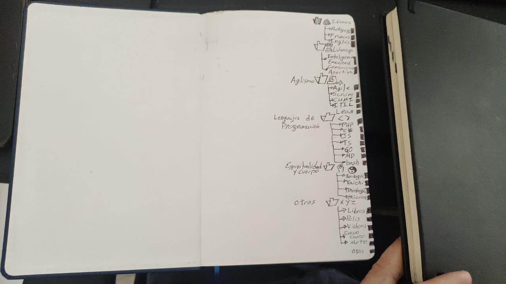
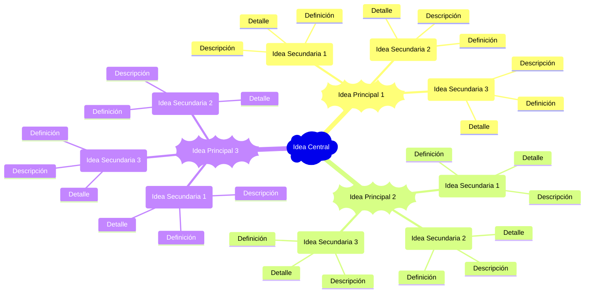

# 📖 Agendas: Organización, Aprendizaje y Desarrollo Personal

Las agendas y los cuadernos son herramientas poderosas para la organización, la reflexión y el desarrollo de nuevas habilidades. Más allá de un simple registro de tareas, los utilizo como un espacio vital para la experimentación con métodos de aprendizaje y mejora personal. La experiencia táctil y el proceso cognitivo de escribir con lápiz y papel facilitan una interiorización más profunda del conocimiento, transformando la información en comprensión duradera.

## 1. Sistema de Marcado Visual por Tema

**Problema:** Al usar agendas para múltiples temas, es un desafío encontrar información específica rápidamente sin abrirlas.

**Solución Creativa:** He implementado un sistema de marcas visuales en el borde de las hojas. Este método permite identificar el tema de una sección con la agenda cerrada, basándose en la posición de una pequeña marca a lo largo del borde.

**Metodología:**

1. **Definición de categorías:** Asigna tus principales áreas temáticas a segmentos específicos del borde de la hoja (ej. "Trabajo", "Proyectos personales", "Ideas", "Reflexiones").
2. **Definición de temas:** A cada categoría se le puede asignar temas especificos de los que se va a escribir en la agenda.
3. **Asignación de posiciones:** Frente a cada tema se marca el borde de la hoja. _Esto también se puede hacer con colores_.
4. **Aplicación de la marca:** Luego de escribir en la agenda o cuaderno, se realiza la marca en el borde de la página correspondiente al tema escrito en la posición asignada en la primera página (leyenda).
5. **Consistencia:** Mantén la misma asignación de posiciones y el método de marcado en todas tus agendas para una identificación intuitiva y rápida. _Para ser mas eficiente, cada agenda o cuaderno puede tratar temas diferentes_.

**Ventajas:**

- **Acceso instantáneo:** Localiza secciones de la agenda de forma rápida.
- **Organización intuitiva:** Ofrece una representación visual de la distribución temática.
- **Adaptabilidad:** Funciona con cualquier tipo de agenda y número de temas.



## 2. Ejercicios con Manos No Dominantes: Desarrollo de Habilidades Motoras y Cognitivas

**Objetivo:** Mejorar la coordinación motora fina, potenciar la habilidad y agilidad de ambas manos, y estimular el cerebro a través de la escritura bilateral.

**Método:**
Al escribir cualquier tipo de contenido en mis cuadernos o agendas, utilizo la mano derecha para las páginas izquierdas y la mano izquierda para las páginas derechas.

**Propósitos:**

- **Comodidad ergonómica:** Al escribir con la mano contraria de la hoja, evita llegar hacia el borde de la hoja sin apoyo natural para la muñeca (Esto por el grosor del cuaderno o agenda).
- **Desarrollo de la mano no dominante:** Fomenta activamente la habilidad y la agilidad de la mano menos utilizada, promoviendo la creación de nuevas conexiones neuronales y fortaleciendo la plasticidad cerebral.
- **Relajación y enfoque mental:** He notado que el movimiento más consciente y deliberado requerido al escribir con mi mano izquierda induce un estado de relajación, ayudando a desconectar de preocupaciones y a fomentar una mayor atención al presente.

**Resultados y Motivación:**

La práctica constante ha rendido frutos notables. Al comparar mi caligrafía con la mano izquierda de hace apenas tres meses con la actual, la mejora en la fineza, control y velocidad del trazo es **visualmente evidente**. Esta evolución tangible no solo valida el método, sino que también me impulsa a continuar perfeccionando la destreza de mi mano no dominante.

## 3. Práctica de Idiomas a través de la Escritura Diaria

**Objetivo:** Perfeccionar el dominio del idioma inglés de forma constante y orgánica.

**Método:**
Siempre que sea posible, escribo mis notas y reflexiones diarias íntegramente en inglés.

**Excepciones y Estrategias:**

- **Reuniones rápidas:** Durante reuniones donde la velocidad y la captura precisa de conceptos son cruciales, priorizo escribir con mi mano dominante (derecha) y en español (mi idioma nativo) para asegurar la máxima eficiencia.
- **Inmersión gradual:** Esta práctica permite una inmersión continua en el idioma, reforzando vocabulario, gramática y fluidez de pensamiento en inglés.

## 4. Metodología para la Creación de Mapas Mentales Eficientes

**Objetivo:** Generar mapas conceptuales claros y completos sin perder ideas importantes, optimizando el proceso de captura y organización de información.

**Método:**
Antes de construir el mapa mental final, sigo un proceso estructurado para la recopilación y jerarquización de ideas:

1. **Lista Inicial de Ideas Principales:** Anoto todas las ideas principales o conceptos clave en una lista sencilla.
2. **Sub-niveles Conceptuales:** Para cada idea principal, desgloso los conceptos internos o relacionados en sub-niveles, manteniendo una estructura de lista anidada. Esto asegura que no se omita ninguna información relevante.
3. **Conversión orgánica:** Para convertirlo en un grafico o dibujo, se parte de la idea principal en el centro de la hoja, dependiendo de la cantidad de ideas que surgen a partir de la idea principal, distribuyo los 360° en la cantidad de ideas, es decir si son 3 ideas comienzo en la parte superior y girando 120° aprox, escribo la siguiente idea, Cuando llego al tercer nivel, tomo cada idea y de allí se reparten los conceptos secundarios distribuyendo el espacio restante.
4. **Conversión a Mermaid:** Una vez organizada la estructura de ideas en este formato de lista jerárquica, la transcribo fácilmente a la sintaxis de [Mermaid](https://mermaid.js.org/syntax/mindmap.html).

**Ventajas:**

- **Eficiencia:** Permite una rápida captura de ideas iniciales sin preocuparse por la disposición gráfica.
- **Exhaustividad:** Ayuda a asegurar que todos los conceptos importantes sean registrados antes de la visualización.
- **Generación Rápida de Mapas:** La estructura de lista facilita la conversión directa a un diagrama de Mermaid, lo que acelera la creación del mapa conceptual final y lo hace fácilmente editable.

**Ejemplo:**

```text
- Idea central
    - Idea principal 1
        - Idea Secundaria 1
            - Definición
            - Detalle
            - Descripción
        - Idea Secundaria 2
            - Definición
            - Detalle
            - Descripción
        - Idea Secundaria 3
            - Definición
            - Detalle
            - Descripción
    - Idea principal 2
        - Idea Secundaria 1
            - Definición
            - Detalle
            - Descripción
        - Idea Secundaria 2
            - Definición
            - Detalle
            - Descripción
        - Idea Secundaria 3
            - Definición
            - Detalle
            - Descripción
    - Idea principal 3
        - Idea Secundaria 1
            - Definición
            - Detalle
            - Descripción
        - Idea Secundaria 2
            - Definición
            - Detalle
            - Descripción
        - Idea Secundaria 3
            - Definición
            - Detalle
            - Descripción
```

**Resultado:**



---

[⏪ Creatividad y manualidades](/hobbies/creatividad/README.md) | [⏫ Hobbies, aprendizajes y exploraciones personales](/hobbies/README.md) | [⏩ Dibujo](dibujo.md)
