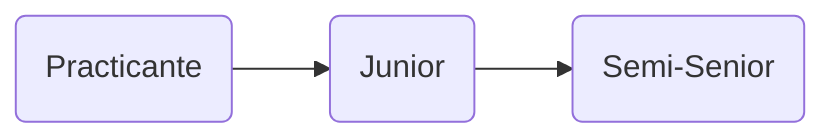
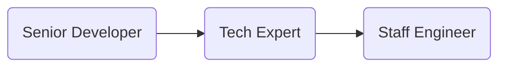
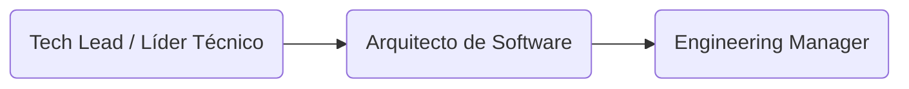
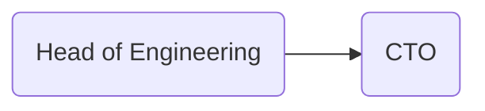
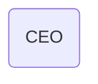
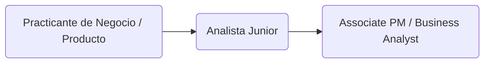
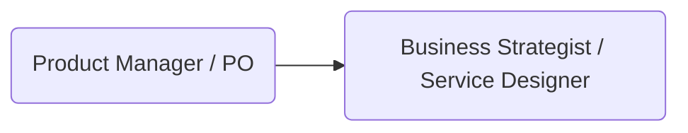
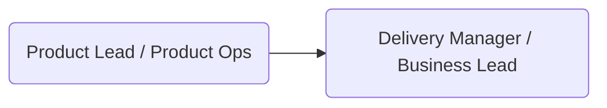
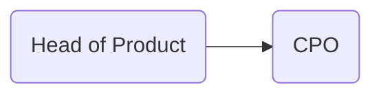
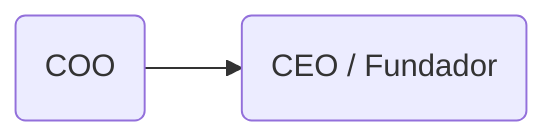

# Áreas de conocimiento y competencia

Explora en profundidad las habilidades, conocimientos y roles que componen las rutas profesionales en tecnología y negocios. Aquí detallo cómo se construye el perfil profesional desde una perspectiva técnica y de gestión, incluyendo los puntos de intersección entre ambas.

## ⚙️Path técnico en detalle

Esta sección cubre el desarrollo de capacidades técnicas a lo largo de la carrera, desde la programación y arquitectura de software hasta la dirección técnica estratégica. Se destacan las habilidades clave, herramientas, buenas prácticas y métricas de progreso para cada rol.

### ETAPA 1: Fundamentos y crecimiento técnico

🎯**Objetivo**: Adquirir habilidades sólidas de programación, buenas prácticas y trabajo en equipo.

#### 1. Practicante / Intern de Desarrollo de Software

En esta primera etapa, el [practicante](./knowledge/tech/intern.md) se inicia en el mundo del desarrollo de software profesional. Su enfoque está en aprender, explorar herramientas básicas y comenzar a participar en tareas reales dentro de un equipo. Es un periodo fundamental para cultivar hábitos, adquirir confianza técnica y desarrollar habilidades blandas esenciales para el trabajo en equipo. Aquí se siembra la curiosidad y la capacidad de adaptación, pilares del crecimiento futuro.

#### 2. Desarrollador Junior (Frontend / Backend / Fullstack)

En esta etapa, el [desarrollador junior](./knowledge/tech/junior.md) comienza a aplicar sus conocimientos técnicos en proyectos reales con mayor autonomía. Aún requiere guía y acompañamiento frecuente, pero ya es capaz de desarrollar funcionalidades básicas, colaborar en sprints y proponer soluciones sencillas. Es un rol clave para consolidar buenas prácticas, afianzar la lógica de programación y ganar experiencia en entornos colaborativos.

#### 3. Desarrollador Semi Senior / Mid-Level Developer

El [desarrollador semi senior](./knowledge/tech/ssr-engineer.md) se desempeña con autonomía técnica en tareas de mediana y alta complejidad. Participa activamente en decisiones técnicas del equipo, guía a perfiles más junior y propone mejoras tanto en código como en procesos. Este nivel representa un punto de inflexión hacia roles de mayor liderazgo técnico y especialización. Se espera pensamiento crítico, compromiso con la calidad y una visión más estratégica del desarrollo.

### ETAPA 2: Especialización y seniority

🎯**Objetivo**: Convertirse en referente técnico en un stack o dominio.

#### 4. Senior Developer (Frontend / Backend / Fullstack)

El [Desarrollador Senior](./knowledge/senior.md) domina su stack de tecnologías y es capaz de entregar soluciones robustas, escalables y bien estructuradas. Es autónomo, proactivo y cumple un rol clave dentro del equipo, participando en decisiones técnicas, mentoría de perfiles más juniors y contribución directa a la calidad y evolución del producto.

##### 🔧 Hard Skills (Senior Developer)

- Dominio completo de su stack (frameworks, testing, patrones).
- CI/CD
- Performance
- Buenas prácticas

##### 🧠 Essential Skills (Senior Developer)

- Mentoring activo
- Ownership
- Comunicación técnica efectiva

##### ✅ Criterios de desempeño (Senior Developer)

- Lidera el desarrollo de módulos o features completas.
- Mejora la calidad del código, cubrimiento de pruebas y rendimiento.
- Apoya la evolución del stack y detecta deuda técnica.

#### 5. Especialista Técnico / Tech Expert

El [Experto en Tecnología](./knowledge/tech-expert) profundiza en un área específica del desarrollo (frontend, backend, cloud, testing, performance, etc.) y se convierte en una autoridad técnica dentro de la organización. Su rol implica investigar, proponer y aplicar soluciones avanzadas, colaborar en la estandarización de prácticas, y brindar soporte técnico de alto nivel en su especialidad.

##### 🔧 Hard Skills (Tech Expert)

- Experticia profunda en una tecnología o disciplina.
- Tooling
- Auditoría técnica, performance y escaneo continuo.

##### 🧠 Essential Skills (Tech Expert)

- Curiosidad profesional
- Liderazgo técnico no jerárquico
- Pensamiento crítico

##### ✅ Criterios de desempeño (Tech Expert)

- Se enfoca en un área crítica: DevOps, QA, Arquitectura, Seguridad, Data.
- Define estándares y mejores prácticas del área.
- Participa en la toma de decisiones estratégicas de producto desde su expertise.

#### 6. Staff Engineer / Principal Engineer

El [Staff Engineer](./knowledge/staff-engineer.md) es un líder técnico transversal que conecta equipos, proyectos y dominios. Combina visión estratégica con ejecución técnica para resolver problemas complejos a nivel de arquitectura y plataforma. Su trabajo no solo impacta un producto, sino múltiples sistemas o áreas, convirtiéndose en una figura clave en la toma de decisiones técnicas de alto nivel.

##### 🔧 Hard Skills (Staff Engineer)

- Sistemas distribuidos
- Arquitectura evolutiva
- Diseño de plataformas

##### 🧠 Essential Skills (Staff Engineer)

- Pensamiento sistémico
- Influencia sin autoridad
- Visión técnica de largo plazo

##### ✅ Criterios de desempeño (Staff Engineer)

- Diseña e influencia la arquitectura general de sistemas.
- Trabaja transversalmente entre múltiples equipos.
- Promueve cultura de ingeniería, escalabilidad, y sostenibilidad del stack.

---

### ETAPA 3: Liderazgo técnico y gestión

🎯**Objetivo**: Transicionar de contribución individual a liderazgo de equipos y proyectos.

#### 7. Tech Lead / Líder Técnico

El [Tech Lead](./knowledge/tech-lead) es responsable de guiar técnica y estratégicamente a un equipo de desarrollo. Actúa como puente entre la ingeniería y el negocio, tomando decisiones técnicas alineadas con los objetivos del producto. Supervisa la calidad del código, impulsa buenas prácticas, facilita la planificación técnica y mentoriza al equipo.

##### 🔧 Hard Skill (Tech Lead)

- Propiedad de la base de código y la arquitectura a nivel de equipo
- Revisión y calidad de código en PRs
- Conocimiento de metodologías ágiles y su aplicación en el equipo
- Gestión de tareas y estimaciones técnicas

##### 🧠 Essential Skill (Tech Lead)

- Liderazgo técnico
- Capacidad de motivar al equipo
- Toma de decisiones técnicas con enfoque en el impacto a largo plazo
- Habilidad para equilibrar la mentoría con las entregas del equipo
- Comunicación efectiva entre el equipo y otros stakeholders

##### ✅ Criterios de desempeño (Tech Lead)

- Coordina las tareas técnicas y entrega del equipo
- Toma decisiones técnicas informadas y justifica sus elecciones
- Mentorea a los miembros del equipo
- Fomenta un ambiente de colaboración

#### 8. Arquitecto de Software / Software Architect

El [Software Architect](./knowledge/architect.md) diseña y valida las decisiones estructurales que guían el desarrollo de software en términos de escalabilidad, rendimiento, seguridad y mantenibilidad. Define patrones, evalúa tecnologías y asegura la coherencia de la arquitectura en múltiples proyectos o productos. Su enfoque es holístico y de largo plazo.

##### 🔧 Hard Skills (Software Architect)

- Definición de la arquitectura global de sistemas y aplicaciones
- Selección de herramientas y tecnologías adecuadas para el equipo
- Diseño de soluciones escalables, seguras y eficientes
- Integración de sistemas y coordinación técnica entre equipos

##### 🧠 Essential Skills (Software Architect)

- Pensamiento sistémico y visión a largo plazo
- Capacidad para guiar decisiones críticas que impactan toda la organización
- Habilidad para comunicar complejas soluciones técnicas de manera clara y accesible
- Adaptabilidad ante cambios en la arquitectura o nuevos requerimientos

##### ✅ Criterios de desempeño (Software Architect)

- Toma decisiones sobre la arquitectura de alto nivel
- Asegura la cohesión técnica entre equipos y sistemas
- Realiza presentaciones claras a stakeholders para justificar decisiones arquitectónicas

#### 9. Engineering Manager

El [Engineering Manager](./knowledge/engineering-manager.md) combina habilidades técnicas y de gestión para liderar equipos de ingeniería. Su foco está en el desarrollo de las personas, la entrega efectiva de proyectos y la alineación entre los objetivos técnicos y del negocio. Gestiona capacidades, facilita procesos ágiles y crea un ambiente propicio para la productividad y el crecimiento.

##### 🔧 Hard Skill (Engineering Manager)

- Gestión de proyectos técnicos y visión a largo plazo
- Conocimiento profundo de procesos de contratación y gestión de recursos humanos
- Estrategias de optimización de equipos y procesos dentro de la ingeniería
- Evaluación y análisis de rendimiento técnico y personal

##### 🧠 Essential Skill (Engineering Manager)

- Liderazgo de personas, enfoque en el crecimiento individual del equipo
- Toma de decisiones organizacionales en cuanto a personal y proyectos
- Capacidad para gestionar relaciones entre múltiples equipos y stakeholders
- Empatía y habilidades para manejar conflictos dentro del equipo

##### ✅ Criterios de desempeño (Engineering Manager)

- Lidera un equipo técnico alineado con los objetivos de la empresa
- Mantiene la moral alta del equipo y promueve un entorno de trabajo colaborativo
- Supervisa el desempeño y crecimiento de los miembros del equipo

---

### ETAPA 4: Dirección de tecnología y visión organizacional

🎯**Objetivo**: Tener impacto en decisiones de negocio a través de la tecnología.

#### 10. Head of Engineering / Director de Tecnología

El [Head of Engineering](./knowledge/head-of-engineering.md) es responsable de coordinar a múltiples equipos de desarrollo, asegurando la calidad técnica, la entrega eficiente y el crecimiento del talento. Actúa como puente entre la estrategia técnica y la ejecución, liderando procesos de mejora continua, planificación técnica de alto nivel y alineación con las metas de negocio. Su enfoque está en la escala, la organización del talento técnico y la madurez de los procesos de ingeniería.

##### 🔧 Hard skills (Head of Engineering)

- Diseño y evolución de arquitectura a gran escala.
- Gestión de múltiples equipos y portafolios técnicos.
- Definición de KPIs técnicos y métricas de performance.
- Selección y evolución del tech stack.
- Gestión de presupuestos técnicos y decisiones de compra.

##### 🧠 Essential skills (Head of Engineering)

- Liderazgo organizacional y pensamiento sistémico.
- Comunicación estratégica con otros departamentos (Producto, Negocio, Finanzas).
- Influencia transversal.
- Mentoreo a líderes técnicos.
- Gestión del cambio y escalabilidad de procesos.

##### ✅ Criterios de desempeño (Head of Engineering)

- Supervisa y empodera a Tech Leads y Engineering Managers.
- Promueve una cultura de excelencia técnica y colaboración.
- Participa en decisiones de negocio y roadmap estratégico.
- Escala estructuras de equipo técnico acorde a las metas de la empresa.

#### 11. CTO (Chief Technology Officer)

El [CTO](./knowledge/cto.md) define la visión tecnológica de la compañía, lidera la innovación y establece la dirección a largo plazo para el uso estratégico de la tecnología. Tiene un rol clave en la toma de decisiones a nivel ejecutivo, conectando la evolución técnica con los objetivos de negocio. Es responsable de construir una cultura técnica sólida, supervisar las arquitecturas a gran escala y representar el área técnica frente a stakeholders internos y externos.

##### 🔧 Hard skills (CTO)

- Definición de visión tecnológica alineada al negocio.
- Innovación en productos y servicios desde el frente técnico.
- Diseño de estrategia de escalamiento y transformación digital.
- Gobernanza técnica y ciberseguridad organizacional.
- Supervisión de arquitectura global y estándares técnicos.

##### 🧠 Essential skills (CTO)

- Visión holística y pensamiento estratégico de largo plazo.
- Habilidades de comunicación ejecutiva (con CEO, inversores, etc.).
- Capacidad de traducir conceptos técnicos a lenguaje de negocio.
- Construcción de cultura tech-first.
- Alta adaptabilidad al cambio tecnológico y del mercado.

##### ✅ Criterios de desempeño (CTO)

- Representa el área técnica en el comité ejecutivo.
- Define la visión tecnológica y coordina su implementación global.
- Lidera decisiones fundacionales de producto, innovación y escalabilidad.
- Influye en decisiones de inversión técnica y expansión.

---

### ETAPA 5: Dirección ejecutiva y/o emprendimiento

🎯**Objetivo**: Tomar decisiones integrales de negocio y crear impacto a gran escala.

#### 12. CEO (Chief Executive Officer)

El [CEO](./knowledge/ceo.md) con formación técnica lidera la compañía con una perspectiva integral que fusiona tecnología, producto y negocio. Utiliza su experiencia en ingeniería para tomar decisiones estratégicas informadas sobre innovación, escalabilidad, inversión en tecnología y cultura organizacional. A diferencia de otros CEO, su enfoque está profundamente alineado con la transformación digital y el uso de la tecnología como motor de crecimiento. Es el responsable último de la visión, misión y éxito global de la organización.

##### 🔧 Hard Skills (CEO)

- Dirección estratégica, finanzas, cultura y relaciones públicas.
- Toma de decisiones sobre modelo de negocio y crecimiento.
- Supervisión de todos los C-Level (CTO, CPO, COO, etc.).

##### 🧠 Essential Skills (CEO)

- Liderazgo visionario.
- Inteligencia emocional y política.
- Adaptabilidad y resiliencia.

##### ✅ Criterios observables (CEO)

- Toma decisiones finales sobre la empresa.
- Define la visión organizacional.
- Lidera relaciones con inversionistas y stakeholders clave.

---

## 🧭 Path de Negocio (Business & Product)

Aquí se detalla la evolución del perfil de negocio, incluyendo roles como Product Owner, Product Manager, y líderes de transformación digital. Se exploran competencias en estrategia, liderazgo, análisis de negocio y diseño de productos centrados en el usuario.

### ETAPA 1: Fundamentos de negocio

🎯**Objetivo**: Comprender procesos de producto/negocio, colaborar en validación, investigación y tareas operativas.

#### 1. Practicante de Negocio / Producto

El [practicante de negocio](./knowledge/business/intern.md) o producto se enfoca en observar, aprender y colaborar en tareas operativas y de soporte al equipo de producto o estrategia. Participa en actividades como la investigación de usuarios, validación de hipótesis, análisis básico de datos y documentación de procesos. Su rol es clave para adquirir una comprensión inicial del negocio, mientras desarrolla habilidades de comunicación, observación crítica y colaboración interdisciplinaria.

##### 🔧 Hard skills (Business Intern)

- Conocimientos básicos en análisis.
- Herramientas y metodologías ágiles.

##### 🧠 Essential skills (Business Intern)

- Comunicación clara.
- Curiosidad.
- Apertura al feedback.

##### ✅ Criterios de desempeño (Business Intern)

- Participa en documentación.
- Entrevistas.
- Pruebas o investigaciones.

#### 2. Analista Junior / Asistente de Producto

El [analista junior](./knowledge/business/junior.md) da soporte en la recopilación y análisis de datos de negocio, estudios de mercado, identificación de puntos de mejora en procesos, y documentación de requerimientos. Comienza a interactuar con stakeholders de distintas áreas y traduce necesidades del negocio en entregables accionables. Es una etapa de consolidación de habilidades analíticas, atención al detalle y pensamiento estructurado.

##### 🔧 Hard skills (Junior analyst)

- Métricas básicas.
- Wireframes simples.
- Backlog grooming.

##### 🧠 Essential skills (Junior analyst)

- Trabajo colaborativo.
- Responsabilidad.
- Proactividad.

##### ✅ Criterios de desempeño (Junior analyst)

- Apoya definiciones funcionales.
- Mantiene tareas operativas al día.

#### 3. Associate Product Manager / Business Analyst

Este [rol](./knowledge/business/analyst.md) intermedio actúa como nexo entre la visión del producto y su ejecución operativa. Colabora con Product Managers, equipos técnicos y stakeholders para definir requerimientos, validar soluciones y hacer seguimiento de entregables. Participa en la priorización y aporta en la toma de decisiones con base en datos y conocimiento contextual. Es un paso clave hacia el liderazgo de producto o estrategia de negocio.

##### 🔧 Hard skills (Business analyst)

- Recolección de datos.
- Definición de requisitos.
- Colaboración con tech.

##### 🧠 Essential skills (Business analyst)

- Pensamiento crítico.
- Iniciativa.
- Presentación de insights.

##### ✅ Criterios de desempeño (Business analyst)

- Identifica oportunidades de mejora e impacto en usuarios o negocio.

---

### ETAPA 2: Especialización y Seniority Business

🎯**Objetivo**: Ser responsable de áreas funcionales, definir roadmap, trabajar con KPIs y liderar equipos pequeños.

#### 4. Product Manager / Product Owner

El [Product Manager](./knowledge/business/product-owner.md) (o Product Owner en contextos ágiles) lidera la visión, estrategia y roadmap de un producto o funcionalidad. Actúa como puente entre negocio, usuarios y equipo técnico, priorizando iniciativas con base en valor, impacto y viabilidad. Define KPIs, valida hipótesis, gestiona backlog y asegura que el producto evolucione en línea con los objetivos organizacionales. Su rol es clave para entregar soluciones útiles, usables y viables.

##### 🔧 Hard skills (Product owner)

- Roadmapping.
- OKRs.
- Métricas de producto.
- Priorización.

##### 🧠 Essential skills (Product owner)

- Visión estratégica.
- Gestión de stakeholders.

##### ✅ Criterios de desempeño (Product owner)

- Dirige equipos de desarrollo, alinea producto con objetivos de negocio.

#### 5. Business Strategist / Service Designer

Este rol se enfoca en diseñar e implementar estrategias de negocio centradas en el usuario y la sostenibilidad. A través de metodologías como Design Thinking, Service Design o Business Model Canvas, identifica oportunidades, mapea experiencias, optimiza servicios y redefine modelos de negocio. Es un perfil híbrido con visión sistémica, pensamiento creativo y fuerte orientación a resultados. Colabora de cerca con liderazgo, marketing, tecnología y operaciones.

##### 🔧 Hard skills (Service Designer)

- Diseño de servicios.
- Customer journeys.
- Análisis de propuestas de valor.

##### 🧠 Essential skills (Service Designer)

- Empatía
- Visión de sistema.
- Comunicación con equipos multifuncionales.

##### ✅ Criterios de desempeño (Service Designer)

- Mejora experiencia.
- Entrega de valor al cliente.

---

### ETAPA 3: Liderazgo y Gestión business

🎯**Objetivo**: Liderar equipos de producto, escalar procesos y lograr resultados medibles.

#### 6. Product Lead / Product Operations

El [Product Lead](./knowledge/business/product-lead.md) supervisa varios equipos o líneas de producto, asegurando alineación estratégica, eficiencia en la entrega y evolución del portafolio. Coordina con stakeholders clave, gestiona objetivos compartidos y fomenta buenas prácticas de gestión de producto. En organizaciones más maduras, puede trabajar en conjunto con Product Ops, un rol orientado a escalar procesos, métricas y herramientas que optimicen el trabajo de los equipos de producto.

##### 🔧 Hard skills (Product lead)

- Gobierno de producto.
- Alineación cross-funcional.
- Definición de procesos.

##### 🧠 Essential skills (Product lead)

- Accountability.
- Mentoring.
- Toma de decisiones basadas en datos.

##### ✅ Criterios de desempeño (Product lead)

- Supervisa otros PMs.
- Optimiza estrategia y rendimiento de producto.

#### 7. Delivery Manager / Business Lead

El [Delivery Manager](./knowledge/business/delivery-manager.md) asegura que los equipos entreguen valor de manera efectiva y predecible. Coordina personas, procesos y prioridades para cumplir compromisos y mantener la calidad. En empresas más orientadas a negocio, este rol puede tener el nombre de Business Lead: una figura híbrida que combina conocimiento técnico, visión estratégica y liderazgo operativo para llevar productos o servicios al mercado con éxito, colaborando estrechamente con áreas como ventas, marketing y operaciones.

##### 🔧 Hard skills (Delivery Manager)

- Planificación.
- Cumplimiento de entregas.
- Seguimiento de objetivos.

##### 🧠 Essential skills (Delivery Manager)

- Enfoque a resultados.
- Resolución de conflictos.
- Liderazgo operativo.

##### ✅ Criterios de desempeño (Delivery Manager)

- Asegura el delivery de alto impacto con calidad y eficiencia.

---

### ETAPA 4: Dirección y Visión Organizacional business

🎯**Objetivo**: Escalar productos, equipos y cultura desde una perspectiva estratégica.

#### 8. Head of Product

El [Head of Product](head.md) lidera múltiples equipos de producto o áreas estratégicas dentro de la organización. Su rol combina dirección táctica y estratégica, alineando la visión del producto con los objetivos del negocio. Es responsable de formar líderes de producto, establecer frameworks de priorización y coordinarse con otras áreas clave como tecnología, ventas, marketing y operaciones. También promueve una cultura centrada en el usuario y basada en datos.

##### 🔧 Hard skills (Head of Product)

- Dirección de portafolio.
- Gobernanza.
- Métricas globales.

##### 🧠 Essential skills (Head of Product)

- Liderazgo organizacional.
- Visión estratégica.
- Influencia cultural.

##### ✅ Criterios de desempeño (Head of Product)

- Define objetivos de toda el área de producto y mide impacto general.

#### 9. CPO (Chief Product Officer)

El [CPO](./knowledge/business/cpo) (Chief Product Officer) es el máximo responsable de la estrategia de producto en la organización. Define la visión, la propuesta de valor y el enfoque a largo plazo del portafolio de productos o servicios. Trabaja junto al CEO y otros ejecutivos para alinear producto, negocio y mercado. Además, crea las condiciones organizacionales para la innovación, la experimentación y la escalabilidad del producto. Es un rol fundamental en compañías con mentalidad digital o de producto.

##### 🔧 Hard skills (CPO)

- Innovación a nivel organizacional.
- Alineación con visión y negocio.

##### 🧠 Essential skills (CPO)

- Influencia transversal.
- Pensamiento sistémico.
- Visión de impacto global.

##### ✅ Criterios de desempeño (CPO)

- Escala la estrategia de producto con impacto en la organización completa.

---

### ETAPA 5: Dirección Ejecutiva y Visión Global

🎯**Objetivo**: Liderar o crear empresas con visión completa de negocio, crecimiento e innovación.

#### 10. COO (Chief Operating Officer)

El [COO](./knowledge/business/coo.md) es responsable de la operación diaria del negocio. Su enfoque está en ejecutar la estrategia definida junto al CEO, optimizar procesos, gestionar recursos y asegurar la eficiencia de las operaciones. Actúa como puente entre la visión estratégica y la ejecución operativa, trabajando estrechamente con líderes de producto, ingeniería, ventas y otras áreas. Es un rol ideal para personas con enfoque en la entrega, resultados y coordinación de múltiples áreas funcionales.

##### 🔧 Hard skills (COO)

- Estrategia operacional.
- Gestión de recursos.
- Procesos y eficiencia.

##### 🧠 Essential skills (COO)

- Coordinación de áreas.
- Orientación al rendimiento global.

##### ✅ Criterios de desempeño (COO)

- Supervisa ejecución y entrega de valor en todos los frentes del negocio.

#### 11. CEO / Fundador de Empresa

El [CEO](./knowledge/tech/ceo.md) (Chief Executive Officer) o Fundador es quien encarna la visión global de la compañía. Su misión es guiar a la organización hacia su propósito, tomando decisiones clave sobre estrategia, cultura, alianzas, crecimiento y sostenibilidad. Es la figura de mayor influencia y responsabilidad, y su perfil puede ser técnico, de negocio o híbrido. Un CEO debe saber rodearse de líderes competentes, adaptarse a los cambios del mercado y mantener el rumbo en contextos de alta incertidumbre.

##### 🔧 Hard skills

- Liderazgo de alto nivel.
- Estrategia corporativa.
- Relaciones con inversores.

##### 🧠 Essential skills

- Cultura organizacional.
- Visión de mercado.
- Innovación constante.

##### ✅ Criterios de desempeño

- Representa a la empresa.
- Toma decisiones estratégicas y asegura crecimiento.

## 🔀 ¿Puede alguien saltar entre el path técnico y el path de negocio?

✅ Sí, es posible moverse entre el path técnico y el path de negocio, pero no en cualquier momento ni de cualquier rol.
Generalmente, el salto ocurre en roles donde ya existe una intersección natural entre habilidades técnicas y de negocio.

### 🚀 ¿Desde qué roles se puede hacer el cambio?

#### **De Path Técnico ➡️ a Path de Negocio**

| Rol de Origen (Técnico) | Rol de Destino (Negocio)               | Explicación                                                                                                       |
| ----------------------- | -------------------------------------- | ----------------------------------------------------------------------------------------------------------------- |
| Tech Lead               | Product Manager / Product Owner        | Un Tech Lead que domina negocio, usuarios y tecnología puede asumir la definición de producto.                    |
| Engineering Manager     | Delivery Manager / Business Lead       | Un Engineering Manager que ha gestionado entregas, KPIs y equipos puede pasar a gestionar entregas desde negocio. |
| Staff Engineer          | Business Strategist / Service Designer | Un Staff Engineer con visión de usuario y ecosistema podría especializarse en diseño de servicios.                |

> 🔥 Nota: El salto es más natural cuando la persona ya participa en discusiones de producto, clientes o roadmap.

#### **De Path de Negocio ➡️ a Path Técnico**

| Rol de Origen (Negocio)          | Rol de Destino (Técnico)                      | Explicación                                                                                                              |
| -------------------------------- | --------------------------------------------- | ------------------------------------------------------------------------------------------------------------------------ |
| Product Manager / Product Owner  | Tech Lead (en proyectos muy técnicos)         | Si domina muy bien aspectos técnicos de producto (APIs, arquitecturas, flujos de datos) podría liderar equipos técnicos. |
| Business Analyst / Associate PM  | Mid-Level Developer (con formación adicional) | Si decide profundizar en programación podría reinsertarse como desarrollador intermedio.                                 |
| Business Lead / Delivery Manager | Engineering Manager                           | En casos de fuerte experiencia gestionando equipos técnicos y proyectos de ingeniería.                                   |

> 🔥 Nota: Este tipo de salto requiere generalmente re-skilling técnico (aprender programación avanzada, arquitecturas, etc.).

#### 📌 Consideraciones importantes

- No se recomienda saltar antes del nivel Semi-Senior o Mid-Level, porque antes no se domina lo suficiente ningún área.
- Tener habilidades híbridas (como programación + visión de usuario) facilita mucho los saltos.
- Comunicación, liderazgo y pensamiento sistémico son habilidades clave en cualquier cambio.
