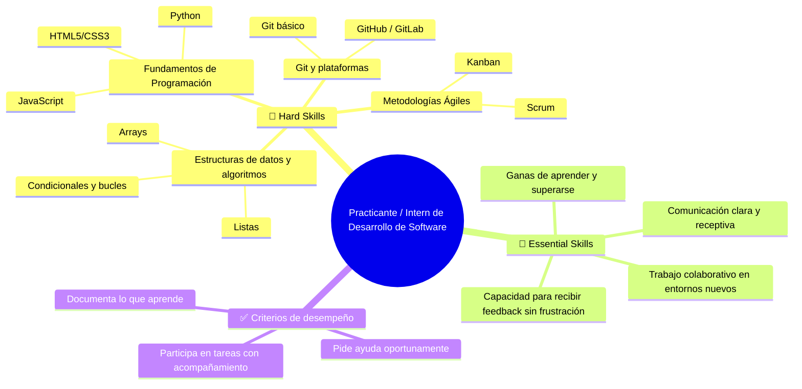
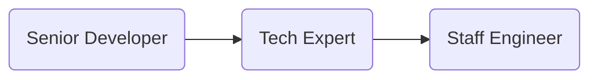

# Conocimientos y tips

Compendio de conocimientos y tips para repasar y mantener.

## ETAPA 1: Fundamentos y crecimiento técnico

🎯 Objetivo: Adquirir habilidades sólidas de programación, buenas prácticas y trabajo en equipo.

Esta etapa representa el inicio del camino profesional en tecnología, donde se forma la base que sustentará todo el crecimiento futuro. Aquí, el foco está en aprender haciendo: familiarizarse con el código, entender cómo se trabaja en un equipo de desarrollo, adoptar buenas prácticas desde el comienzo y cultivar una actitud abierta y resiliente frente al aprendizaje constante.

Los roles en esta etapa están diseñados para desarrollar la autonomía técnica inicial, la colaboración efectiva y la capacidad de adaptación a entornos cambiantes. Se comienza participando en tareas sencillas con acompañamiento, y se avanza hacia una ejecución más autónoma, siempre bajo una cultura de feedback continuo.

Esta etapa es esencial para descubrir fortalezas personales y preferencias técnicas, entendiendo que el aprendizaje no solo es técnico, sino también humano y organizacional.

### Practicante / Intern de Desarrollo de Software

[Más Detalle](/knowledge/intern.md)

   - 🔧 Hard Skills
     - Fundamentos de programación (ej. JavaScript, Python, HTML5/CSS3)
     - Uso básico de Git y plataformas como GitHub/GitLab
     - Comprensión inicial de estructuras de datos y algoritmos
     - Introducción a metodologías ágiles (Scrum, Kanban)
   - 🧠 Essential Skills
     - Ganas de aprender y superarse
     - Comunicación clara y receptiva
     - Capacidad para recibir feedback sin frustración
     - Trabajo colaborativo en entornos nuevos
   - ✅ Criterios de desempeño
     - Participa en tareas con acompañamiento
     - Pide ayuda oportunamente
     - Documenta lo que aprende

2. Desarrollador Junior (Frontend / Backend / Fullstack)
   - 🔧 Hard Skills
     - Programación orientada a objetos (POO)
     - Uso de frameworks (React, Angular, Vue, Django, Next, etc.)
     - Construcción de APIs simples (REST/GraphQL)
     - Bases de datos relacionales y NoSQL básicas
   - 🧠 Essential Skills
     - Organización personal y manejo del tiempo
     - Resolución básica de bugs o errores
     - Colaboración fluida con el equipo
     - Adaptabilidad a cambios técnicos
   - ✅ Criterios de desempeño
     - Cumple tareas técnicas con supervisión
     - Participa activamente en sprints o entregas
     - Mejora continua con base en feedback

3. Desarrollador Semi Senior / Mid-Level Developer
   - 🔧 Hard Skills
     - Desarrollo de componentes reutilizables y eficientes
     - Testing unitario y de integración
     - Integración y consumo de APIs externas
     - Gestión avanzada de ramas en Git (merge, rebase, PRs)
     - Documentación técnica eficiente
   - 🧠 Essential Skills
     - Pensamiento crítico en la toma de decisiones
     - Autonomía técnica en tareas asignadas
     - Capacidad para estimar esfuerzos y tiempos
     - Propuesta activa de mejoras al código y procesos
   - ✅ Criterios de desempeño
     - Ejecuta tareas complejas con mínima supervisión
     - Apoya a desarrolladores junior
     - Participa en decisiones técnicas a nivel de equipo

___

### ETAPA 2: Especialización y seniority

🎯**Objetivo**: Convertirse en referente técnico en un stack o dominio.

<!-- markdownlint-disable MD029 -->
4. Senior Developer (Frontend / Backend / Fullstack)
   - 🔧 Hard Skills:
     - Dominio completo de su stack (frameworks, testing, patrones).
     - CI/CD
     - Performance
     - Buenas prácticas
   - 🧠 Essential Skills:
     - Mentoring activo
     - Ownership
     - Comunicación técnica efectiva
   - ✅ Criterios de desempeño:
     - Lidera el desarrollo de módulos o features completas.
     - Mejora la calidad del código, cubrimiento de pruebas y rendimiento.
     - Apoya la evolución del stack y detecta deuda técnica.

5. Especialista Técnico / Tech Expert
   - 🔧 Hard Skills:
     - Experticia profunda en una tecnología o disciplina.
     - Tooling
     - Auditoría técnica, performance y escaneo continuo.
   - 🧠 Essential Skills:
     - Curiosidad profesional
     - Liderazgo técnico no jerárquico
     - Pensamiento crítico
   - ✅ Criterios de desempeño:
     - Se enfoca en un área crítica: DevOps, QA, Arquitectura, Seguridad, Data.
     - Define estándares y mejores prácticas del área.
     - Participa en la toma de decisiones estratégicas de producto desde su expertise.

6. Staff Engineer / Principal Engineer
   - 🔧 Hard Skills:
     - Sistemas distribuidos
     - Arquitectura evolutiva
     - Diseño de plataformas
   - 🧠 Essential Skills:
     - Pensamiento sistémico
     - Influencia sin autoridad
     - Visión técnica de largo plazo
   - ✅ Criterios de desempeño:
     - Diseña e influencia la arquitectura general de sistemas.
     - Trabaja transversalmente entre múltiples equipos.
     - Promueve cultura de ingeniería, escalabilidad, y sostenibilidad del stack.

___
