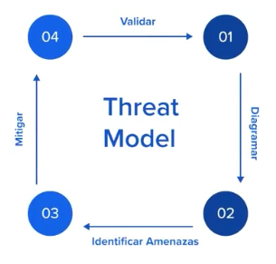

# Desarrollo seguro

Parte de la expertise que se va adquiriendo durante los años de trabajo, es el desarrollo seguro siempre evitando que las comunicaciones via web no tengan vulnerabilidades.

## BACKEND FOR FRONTEND ([BFF](/others/glossary.md#b))

Es una estrategia de seguridad que consiste en tener un backend específicamente diseñado para cada frontend o interfaz de usuario. Esta estrategia se utiliza para optimizar la seguridad de una aplicación al limitar el acceso a datos y funciones específicas de cada frontend y evitar posibles vulnerabilidades o ataques.

Al separar el backend en varios componentes específicos para cada frontend, se limita la superficie de ataque y se facilita la gestión de permisos y autorizaciones. Esto significa que cada frontend solo tiene acceso a las funciones y datos necesarios para su funcionamiento, minimizando el riesgo de exposición de información sensible o la ejecución de acciones no autorizadas.

Además, al utilizar BFF como estrategia de seguridad, se pueden implementar medidas de autenticación y autorización específicas para cada frontend, lo que aumenta la protección de la aplicación y brinda mayor control sobre quién puede acceder a determinados recursos y funciones.

En resumen, la estrategia de seguridad de utilizar [BFF](/others/glossary.md#b) (Backend for Frontend) ayuda a optimizar la seguridad de una aplicación al limitar el acceso a datos y funciones específicas de cada frontend, reduciendo la exposición a posibles ataques y mejorando la gestión de permisos y autorizaciones.

## Tipos de datos

Validar el tipo de dato es un aspecto fundamental en la seguridad de un software por varias razones:

1. Prevención de inyección de código: Si los datos ingresados por los usuarios no se validan correctamente, existe el riesgo de que un atacante pueda introducir código malicioso en la aplicación a través de campos de texto, formularios o cualquier otro tipo de entrada de datos. Al validar el tipo de dato se asegura que solo se permitan datos del tipo esperado y se evitan ataques de inyección de código, como SQL injection o XSS (Cross-Site Scripting).

2. Protección contra vulnerabilidades: Validar el tipo de dato también ayuda a proteger la aplicación contra vulnerabilidades como desbordamiento de búfer (buffer overflow) u otros problemas de seguridad relacionados con el manejo incorrecto de datos. Al asegurarse de que los datos ingresados cumplan con el tipo de dato esperado, se reducen los riesgos de errores de programación que podrían comprometer la seguridad del sistema.

3. Garantizar la integridad de los datos: Validar el tipo de dato también ayuda a garantizar la integridad de los datos almacenados en la aplicación. Si los datos ingresados no cumplen con el tipo de dato esperado, se pueden generar inconsistencias en la información, lo que podría afectar el funcionamiento correcto de la aplicación y la confiabilidad de los datos almacenados.

En resumen, validar el tipo de dato es esencial en la seguridad de un software porque ayuda a prevenir ataques de inyección de código, proteger contra vulnerabilidades y garantizar la integridad de los datos. Al implementar una adecuada validación de tipos de datos, se reduce significativamente la exposición a posibles vulnerabilidades y se mejora la seguridad general del sistema.

## Integridad de datos

La integridad de los datos es un aspecto crítico en la seguridad de un software, ya que garantiza que la información almacenada en la aplicación sea precisa, consistente y confiable. Validar que el usuario sea quien hace las peticiones es una medida importante para asegurar la integridad de los datos, ya que ayuda a prevenir posibles suplantaciones de identidad y accesos no autorizados a la información.

Al validar la identidad del usuario que realiza una petición a la aplicación, se puede asegurar que solo las personas autorizadas pueden acceder a los datos y realizar operaciones en el sistema. Esto ayuda a evitar que un atacante se haga pasar por otro usuario legítimo para acceder a información confidencial, modificar registros o llevar a cabo acciones malintencionadas.

Para validar la identidad del usuario, es importante implementar medidas de autenticación sólidas, como el uso de contraseñas seguras, autenticación de dos factores, certificados digitales, tokens de acceso o biometría, entre otras técnicas. Además, es importante establecer políticas de gestión de sesiones y control de accesos para garantizar que solo los usuarios autorizados puedan acceder a las funcionalidades y datos específicos de la aplicación.

En resumen, validar que el usuario sea quien hace las peticiones es fundamental para garantizar la integridad de los datos en un software, ya que ayuda a prevenir suplantaciones de identidad y accesos no autorizados a la información. Al implementar medidas sólidas de autenticación y control de accesos, se fortalece la seguridad de la aplicación y se protege la integridad de los datos almacenados en el sistema.

## Seguridad en el ciclo de desarrollo

A continuación se describen tips que pueden mejorar los parámetros de seguridad en las etapas del ciclo del desarrollo de aplicaciones.

### Requerimiento

En etapas tempranas como la definición de RFC se puede hacer un checklist de requerimientos no funcionales donde se incluya elementos de seguridad como **Privacidad** y **Seguridad**.

<!-- Repaso activo
¡Bienvenido/a al quiz! Este desafío te permitirá poner a prueba tus conocimientos. Durante el quiz, se te presentarán una serie de preguntas, algunas de opción única y otras de opción múltiple, cada una con varias opciones de respuesta. Tu tarea será seleccionar la opción correcta para cada pregunta. ¡Diviértete y buena suerte!

En la reunión de planificación del sprint se incluyen tareas de análisis de requerimientos de un nuevo proyecto/feature ¿Qué tarea de seguridad deberíamos priorizar durante el sprint?

Evaluar e introducir los requerimientos no funcionales de seguridad con ayuda de la Security Cheat-Sheet.
¡Lo lograste!

Evaluar los requerimientos funcionales con ayuda de la Security Cheat-Sheet.
Ups, parece que no has acertado. ¡Pero no te rindas!.

Analizar el diseño en búsqueda de potenciales vulnerabilidades.
¡Vaya! Esa no es la respuesta correcta.

En esta instancia no es necesario priorizar tareas de seguridad.
Oh, parece que esa no es la respuesta correcta.
Producto nos compartió los requerimientos funcionales y estamos listos para arrancar a diseñar la aplicación. ¿Qué podría suceder si no tenemos en cuenta los requerimientos no funcionales de seguridad durante la etapa de definición de requerimientos?

Los lineamientos de seguridad no serán tenidos en cuenta durante el diseño de la aplicación.
Oh, parece que esa no es la respuesta correcta.

Los lineamientos de seguridad no serán introducidos en los casos de uso a programar.
Ups, parece que no has acertado. ¡Pero no te rindas!.

Los lineamientos de seguridad no serán tenidos en cuenta durante las pruebas de la aplicación.
¡Vaya! Esa no es la respuesta correcta.

Todas las respuestas anteriores.
¡Lo lograste! -->

### Diseño

Se puede realizar un **Threat Model** el cual es una practica de desarrollo que permite Analizar, Documentar y Debatir las implicaciones de seguridad. Lo cual ayuda a los equipos a identificar pro-activamente potenciales bugs de seguridad y definir las mitigaciones adecuadas.

El **Threat Model** es muy recomendable hacerlo en etapas tempranas, cuanto mas cerca del producto final, mas difícil será implementar cambios.

Esta tarea lleva en promedio entre 1 a 3 horas de un sprint.

Para realizar la tarea se contemplan 4 etapas.

1. Entender que hace nuestra aplicación y cómo funciona: Todos los miembros del equipo que intervienen en el ejercicio, comprendan como debería funcionar la aplicación. La forma más fácil de hacerlo es mostrar toda la documentación y diagramas que se tengan a mano.([DFD](<https://es.wikipedia.org/wiki/Diagrama_de_flujo_de_datos#:~:text=Un%20diagrama%20de%20flujo%20de,de%20datos%20(dise%C3%B1o%20estructurado).>), [diagrama de flujo](https://es.wikipedia.org/wiki/Diagrama_de_flujo) o [diagrama de secuencia](https://es.wikipedia.org/wiki/Diagrama_de_secuencia)).
2. Buscar posibles amenazas: Aprovechando la experiencia y conocimiento del equipo, se documentar que comportamiento no debería tener nuestra aplicación, por cada requerimiento funcional. Aquí podemos ampliar las [US](/others/glossary.md#u)
3. Identificar y priorizar correcciones para mitigar las amenazas.
4. Probar que el cambio efectivamente mitiga la amenaza.
