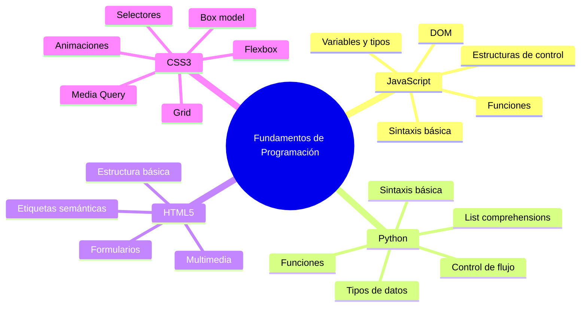
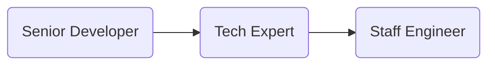

# ETAPA 1: Fundamentos y crecimiento técnico

🎯 Objetivo: Adquirir habilidades sólidas de programación, buenas prácticas y trabajo en equipo.

Esta etapa representa el inicio del camino profesional en tecnología, donde se forma la base que sustentará todo el crecimiento futuro. Aquí, el foco está en aprender haciendo: familiarizarse con el código, entender cómo se trabaja en un equipo de desarrollo, adoptar buenas prácticas desde el comienzo y cultivar una actitud abierta y resiliente frente al aprendizaje constante.

Los roles en esta etapa están diseñados para desarrollar la autonomía técnica inicial, la colaboración efectiva y la capacidad de adaptación a entornos cambiantes. Se comienza participando en tareas sencillas con acompañamiento, y se avanza hacia una ejecución más autónoma, siempre bajo una cultura de feedback continuo.

Esta etapa es esencial para descubrir fortalezas personales y preferencias técnicas, entendiendo que el aprendizaje no solo es técnico, sino también humano y organizacional.

## Practicante / Intern de Desarrollo de Software

El rol de Practicante marca el primer paso dentro del camino profesional en tecnología. Es una etapa enfocada completamente en el aprendizaje, la curiosidad y la adquisición de fundamentos sólidos. El objetivo principal es entender cómo se trabaja en un entorno de desarrollo real, aplicar los conocimientos básicos adquiridos en la formación académica y comenzar a integrarse a la dinámica de equipos ágiles.

En esta fase, es normal cometer errores: lo valioso es aprender de ellos rápidamente, hacer muchas preguntas y comenzar a construir una mentalidad de mejora continua. La práctica deliberada, la observación activa y la documentación del aprendizaje son claves en este punto.

Este rol sienta las bases tanto técnicas como personales para el crecimiento profesional, permitiendo descubrir intereses, entender el flujo de trabajo colaborativo y prepararse para asumir mayores responsabilidades.

### Fundamentos de programación

📘 Descripción general
Los fundamentos de programación permiten adquirir la lógica y pensamiento computacional necesarios para resolver problemas con código. Esta etapa se enfoca en conocer la sintaxis básica, estructuras de control y cómo interactuar con el navegador.



#### 📌 JavaScript

- Sintaxis básica: `let`, `const`, `function`, `=>`, `if`, `for`, `while`

- Tipos de datos: `Number`, `String`, `Boolean`, `Object`, `Array`, `null`, `undefined`

- Estructuras de control: `if`, `switch`, `for`, `while`, `do while`

- Funciones: Declaración, expresión, flecha, callbacks

- DOM: ``document.querySelector``, ``addEventListener``, manipulación de nodos

#### 🐍 Python

- Tipos de datos: ``int``, ``float``, ``str``, ``list``, ``dict``, ``set``, ``tuple``, ``bool``

- Control de flujo: ``if``, ``elif``, ``else``, ``for``, ``while``

- Funciones: ``def``, parámetros, retorno, argumentos por defecto

- List comprehensions: ``new_list = [x for x in iterable if condition]``

#### 🌐 HTML5

- Estructura básica:
  - Estructura del documento: ``<html>``, ``<head>``, ``<body>``.
  - Información del documento y recursos externos: ``<title>``, ``<meta>``, ``<link>``, ``<script>``.
- Semántica:
  - Organizan el contenido de forma lógica y accesible: ``<header>``, ``<footer>``, ``<nav>``, ``<main>``, ``<article>``, ``<section>``.
  - Contenido relacionado o decorativo: ``<aside>``, ``<figure>``, ``<figcaption>``.
- Formularios: ``<form>``, ``<input>``, ``<label>``, ``<select>``, ``<textarea>``, ``<button>``.
- Nuevos tipos de input: ``<email>``, ``<date>``, ``<range>``, ``<color>``
- Multimedia: ````, ``<audio>``, ``<video>``, ``<source>``, ``<track>``

    Soporte nativo para contenido visual y sonoro sin plugins externos.

- ✏️ Atributos HTML
    Los atributos proporcionan información adicional sobre los elementos HTML. Siempre van en la etiqueta de apertura y tienen la forma nombre="valor".

    Ejemplos comunes: ``id``, ``class``, ``style``, ``src``, ``href``, ``alt``, ``disabled``, ``placeholder``, ``type``, ``value``

    ```html
    <input type="text" placeholder="Escribe tu nombre" />
    <a href="https://openai.com" target="_blank">Ir a OpenAI</a>
    ```

- SVG (Scalable Vector Graphics)
    SVG permite representar gráficos vectoriales directamente en HTML.

    Se utiliza para íconos, diagramas, animaciones o ilustraciones escalables.

    Ejemplo básico:

    ```html
    <svg width="100" height="100">
        <circle cx="50" cy="50" r="40" stroke="black" stroke-width="2" fill="skyblue" />
    </svg>
    ```

    <svg width="100" height="100">
        <circle cx="50" cy="50" r="40" stroke="black" stroke-width="2" fill="skyblue" />
    </svg>

    > 🔎 Puedes manipular SVG con CSS y JavaScript igual que otros elementos HTML.


#### 🎨 CSS3

Selectores: element, .class, #id, combinadores

Box Model: margin, border, padding, content

Flexbox: display: flex, justify-content, align-items

Grid: display: grid, grid-template-areas

Animaciones: @keyframes, transition, transform
Media Queries: permiten aplicar estilos según el tamaño o características del dispositivo. Muy útiles para diseño responsive.

Sintaxis básica:

css
Copy
Edit
@media (max-width: 768px) {
  body {
    background-color: lightblue;
  }
}
Condiciones comunes:

max-width / min-width: adaptan el diseño según el ancho del viewport.

orientation: detecta si el dispositivo está en modo vertical u horizontal.

prefers-color-scheme: detecta si el usuario prefiere modo oscuro o claro.


   - 🔧 Hard Skills
     - Fundamentos de programación (ej. JavaScript, Python, HTML5/CSS3)
     - Uso básico de Git y plataformas como GitHub/GitLab
     - Comprensión inicial de estructuras de datos y algoritmos
     - Introducción a metodologías ágiles (Scrum, Kanban)
   - 🧠 Essential Skills
     - Ganas de aprender y superarse
     - Comunicación clara y receptiva
     - Capacidad para recibir feedback sin frustración
     - Trabajo colaborativo en entornos nuevos
   - ✅ Criterios de desempeño
     - Participa en tareas con acompañamiento
     - Pide ayuda oportunamente
     - Documenta lo que aprende

1. Desarrollador Junior (Frontend / Backend / Fullstack)
   - 🔧 Hard Skills
     - Programación orientada a objetos (POO)
     - Uso de frameworks (React, Angular, Vue, Django, Next, etc.)
     - Construcción de APIs simples (REST/GraphQL)
     - Bases de datos relacionales y NoSQL básicas
   - 🧠 Essential Skills
     - Organización personal y manejo del tiempo
     - Resolución básica de bugs o errores
     - Colaboración fluida con el equipo
     - Adaptabilidad a cambios técnicos
   - ✅ Criterios de desempeño
     - Cumple tareas técnicas con supervisión
     - Participa activamente en sprints o entregas
     - Mejora continua con base en feedback

2. Desarrollador Semi Senior / Mid-Level Developer
   - 🔧 Hard Skills
     - Desarrollo de componentes reutilizables y eficientes
     - Testing unitario y de integración
     - Integración y consumo de APIs externas
     - Gestión avanzada de ramas en Git (merge, rebase, PRs)
     - Documentación técnica eficiente
   - 🧠 Essential Skills
     - Pensamiento crítico en la toma de decisiones
     - Autonomía técnica en tareas asignadas
     - Capacidad para estimar esfuerzos y tiempos
     - Propuesta activa de mejoras al código y procesos
   - ✅ Criterios de desempeño
     - Ejecuta tareas complejas con mínima supervisión
     - Apoya a desarrolladores junior
     - Participa en decisiones técnicas a nivel de equipo

___

### ETAPA 2: Especialización y seniority

🎯**Objetivo**: Convertirse en referente técnico en un stack o dominio.



<!-- markdownlint-disable MD029 -->
4. Senior Developer (Frontend / Backend / Fullstack)
   - 🔧 Hard Skills:
     - Dominio completo de su stack (frameworks, testing, patrones).
     - CI/CD
     - Performance
     - Buenas prácticas
   - 🧠 Essential Skills:
     - Mentoring activo
     - Ownership
     - Comunicación técnica efectiva
   - ✅ Criterios de desempeño:
     - Lidera el desarrollo de módulos o features completas.
     - Mejora la calidad del código, cubrimiento de pruebas y rendimiento.
     - Apoya la evolución del stack y detecta deuda técnica.

5. Especialista Técnico / Tech Expert
   - 🔧 Hard Skills:
     - Experticia profunda en una tecnología o disciplina.
     - Tooling
     - Auditoría técnica, performance y escaneo continuo.
   - 🧠 Essential Skills:
     - Curiosidad profesional
     - Liderazgo técnico no jerárquico
     - Pensamiento crítico
   - ✅ Criterios de desempeño:
     - Se enfoca en un área crítica: DevOps, QA, Arquitectura, Seguridad, Data.
     - Define estándares y mejores prácticas del área.
     - Participa en la toma de decisiones estratégicas de producto desde su expertise.

6. Staff Engineer / Principal Engineer
   - 🔧 Hard Skills:
     - Sistemas distribuidos
     - Arquitectura evolutiva
     - Diseño de plataformas
   - 🧠 Essential Skills:
     - Pensamiento sistémico
     - Influencia sin autoridad
     - Visión técnica de largo plazo
   - ✅ Criterios de desempeño:
     - Diseña e influencia la arquitectura general de sistemas.
     - Trabaja transversalmente entre múltiples equipos.
     - Promueve cultura de ingeniería, escalabilidad, y sostenibilidad del stack.

___

[Regresar](../knowledge.md)
