# ETAPA 1: Fundamentos y crecimiento técnico

🎯 Objetivo: Adquirir habilidades sólidas de programación, buenas prácticas y trabajo en equipo.

Esta etapa representa el inicio del camino profesional en tecnología, donde se forma la base que sustentará todo el crecimiento futuro. Aquí, el foco está en aprender haciendo: familiarizarse con el código, entender cómo se trabaja en un equipo de desarrollo, adoptar buenas prácticas desde el comienzo y cultivar una actitud abierta y resiliente frente al aprendizaje constante.

Los roles en esta etapa están diseñados para desarrollar la autonomía técnica inicial, la colaboración efectiva y la capacidad de adaptación a entornos cambiantes. Se comienza participando en tareas sencillas con acompañamiento, y se avanza hacia una ejecución más autónoma, siempre bajo una cultura de feedback continuo.

Esta etapa es esencial para descubrir fortalezas personales y preferencias técnicas, entendiendo que el aprendizaje no solo es técnico, sino también humano y organizacional.

## Practicante / Intern de Desarrollo de Software

El rol de Practicante marca el primer paso dentro del camino profesional en tecnología. Es una etapa enfocada completamente en el aprendizaje, la curiosidad y la adquisición de fundamentos sólidos. El objetivo principal es entender cómo se trabaja en un entorno de desarrollo real, aplicar los conocimientos básicos adquiridos en la formación académica y comenzar a integrarse a la dinámica de equipos ágiles.

En esta fase, es normal cometer errores: lo valioso es aprender de ellos rápidamente, hacer muchas preguntas y comenzar a construir una mentalidad de mejora continua. La práctica deliberada, la observación activa y la documentación del aprendizaje son claves en este punto.

Este rol sienta las bases tanto técnicas como personales para el crecimiento profesional, permitiendo descubrir intereses, entender el flujo de trabajo colaborativo y prepararse para asumir mayores responsabilidades.

### Hard Skills para Practicante / Intern

#### 🦾Fundamentos de programación

📘 Descripción general
Los fundamentos de programación permiten adquirir la lógica y pensamiento computacional necesarios para resolver problemas con código. Esta etapa se enfoca en conocer la sintaxis básica, estructuras de control y cómo interactuar con el navegador.

```mermaid
mindmap
  root((Fundamentos de Programación))
    JavaScript
      Sintaxis básica
      Variables y tipos
      Estructuras de control
      Funciones
      DOM
    Python
      Sintaxis básica
      Tipos de datos
      Control de flujo
      Funciones
      List comprehensions
    HTML5
      Estructura básica
      Etiquetas semánticas
      Formularios
      Multimedia
    CSS3
      Selectores
      Box model
      Flexbox
      Grid
      Media Query
      Animaciones
```



##### 📌 JavaScript

- Sintaxis básica: `let`, `const`, `function`, `=>`, `if`, `for`, `while`

- Tipos de datos: `Number`, `String`, `Boolean`, `Object`, `Array`, `null`, `undefined`

- Estructuras de control: `if`, `switch`, `for`, `while`, `do while`

- Funciones: Declaración, expresión, flecha, callbacks

- DOM: ``document.querySelector``, ``addEventListener``, manipulación de nodos

##### 🐍 Python

- Tipos de datos: ``int``, ``float``, ``str``, ``list``, ``dict``, ``set``, ``tuple``, ``bool``

- Control de flujo: ``if``, ``elif``, ``else``, ``for``, ``while``

- Funciones: ``def``, parámetros, retorno, argumentos por defecto

- List comprehensions: ``new_list = [x for x in iterable if condition]``

##### 🌐 HTML5

- Estructura básica:
  - Estructura del documento: ``<html>``, ``<head>``, ``<body>``.
  - Información del documento y recursos externos: ``<title>``, ``<meta>``, ``<link>``, ``<script>``.
- Semántica:
  - Organizan el contenido de forma lógica y accesible: ``<header>``, ``<footer>``, ``<nav>``, ``<main>``, ``<article>``, ``<section>``.
  - Contenido relacionado o decorativo: ``<aside>``, ``<figure>``, ``<figcaption>``.
- Formularios: ``<form>``, ``<input>``, ``<label>``, ``<select>``, ``<textarea>``, ``<button>``.
- Nuevos tipos de input: ``<email>``, ``<date>``, ``<range>``, ``<color>``
- Multimedia: ````, ``<audio>``, ``<video>``, ``<source>``, ``<track>``
    Soporte nativo para contenido visual y sonoro sin plugins externos.
- ✏️ Atributos HTML
    Los atributos proporcionan información adicional sobre los elementos HTML. Siempre van en la etiqueta de apertura y tienen la forma nombre="valor".

    Ejemplos comunes: ``id``, ``class``, ``style``, ``src``, ``href``, ``alt``, ``disabled``, ``placeholder``, ``type``, ``value``

    ````html
    <input type="text" placeholder="Escribe tu nombre" />
    <a href="https://openai.com" target="_blank">Ir a OpenAI</a>
    ````

- SVG (Scalable Vector Graphics)
    SVG permite representar gráficos vectoriales directamente en HTML.

    Se utiliza para íconos, diagramas, animaciones o ilustraciones escalables.

    Ejemplo básico:

    ````html
    <svg width="100" height="100">
        <circle cx="50" cy="50" r="40" stroke="black" stroke-width="2" fill="skyblue" />
    </svg>
    ````

    <!-- markdownlint-disable MD033 -->
    <svg width="100" height="100">
        <circle cx="50" cy="50" r="40" stroke="black" stroke-width="2" fill="skyblue" />
    </svg>
    <canvas id="threejs-canvas"></canvas>
    <script src="https://cdnjs.cloudflare.com/ajax/libs/three.js/r128/three.min.js"></script>
    <script>
    const scene = new THREE.Scene();
    const camera = new THREE.PerspectiveCamera(75, window.innerWidth / window.innerHeight, 0.1, 1000);
    const renderer = new THREE.WebGLRenderer({ canvas: document.getElementById('threejs-canvas') });
    renderer.setSize(window.innerWidth, window.innerHeight);
    document.body.appendChild(renderer.domElement);

    const geometry = new THREE.BoxGeometry();
    const material = new THREE.MeshBasicMaterial({ color: 0x00ff00 });
    const cube = new THREE.Mesh(geometry, material);
    scene.add(cube);

    camera.position.z = 5;

    function animate() {
        requestAnimationFrame(animate);
        cube.rotation.x += 0.01;
        cube.rotation.y += 0.01;
        renderer.render(scene, camera);
    }
    animate();
    </script>
    <!-- markdownlint-enable MD033 -->

    > 🔎 Puedes manipular SVG con CSS y JavaScript igual que otros elementos HTML.

##### 🎨 CSS3

- **🎯 Selectores**: Los selectores permiten aplicar estilos a elementos específicos en HTML.
  - **De tipo**: seleccionan elementos por su nombre de etiqueta (div, p, h1).
  - **De clase**: seleccionan elementos por su atributo class (.mi-clase).
  - **De id**: seleccionan un elemento único por su atributo id (#mi-id).
  - **Combinadores**: seleccionan elementos en relación con otros (por ejemplo: hijos directos >, hermanos adyacentes +, descendientes ).

  ````css
    /* Ejemplos */
    p { color: blue; }
    .button { background-color: green; }
    #header { height: 80px; }
    nav > ul { list-style: none; }
  ````

- **📦 Box Model**: El Modelo de Caja describe cómo se calcula el espacio que ocupa cada elemento en la página.
  - **``Content``**: el área donde se muestra el contenido (texto, imagen, etc.).
  - **``Padding``**: espacio interno entre el contenido y el borde.
  - **``Border``**: línea que rodea el padding (y el contenido).
  - **``Margin``**: espacio exterior entre el borde y otros elementos.

  ````css
  .box {
    margin: 10px;
    padding: 20px;
    border: 2px solid black;
  }
  ````

  Visualizar el Box Model es crucial para dominar el layout en CSS.

- **🧲 Flexbox**: Flexbox facilita la distribución de espacio y alineación de ítems en un contenedor flexible.
  - **``display``**: flex: activa el modo flex en el contenedor.
  - **``justify-content``**: alinea horizontalmente (flex-start, center, space-between, etc.).
  - **``align-items``**: alinea verticalmente (stretch, center, flex-end, etc.).

  ````css
  .container {
    display: flex;
    justify-content: center;
    align-items: center;
  }
  `````
  
  Flexbox es ideal para layouts en una dimensión (horizontal o vertical).

- **🧩 Grid Layout**: Grid es un sistema bidimensional para diseñar interfaces complejas.
  - **``display``**: grid: activa el modo grid en el contenedor.
  - **``grid-template-areas``, ``grid-template-rows``, ``grid-template-columns``**: definen las zonas y estructuras de la grilla.
  - **``gap``**: define la separación entre filas y columnas.

  ````css
  .container {
    display: grid;
    grid-template-areas: 
        "header header"
        "menu main"
        "footer footer";
  }
  ````

  Grid permite posicionar elementos en filas y columnas de forma muy precisa.

- **🎞️ Animaciones**: Las animaciones en CSS3 permiten crear efectos visuales dinámicos.
  - **``@keyframes``**: define la secuencia de cambios de estilo.
  - **``transition``**: anima cambios suaves entre valores de propiedades.
  - **``transform``**: aplica transformaciones como rotar, escalar, mover.

  ````css
  /* Usando @keyframes */
  @keyframes mover {
    from { transform: translateX(0); }
    to { transform: translateX(100px); }
  }
  
  .elemento {
    animation: mover 2s infinite alternate;
  }

  /* Usando transition */
  .boton {
    transition: background-color 0.3s;
  }
  .boton:hover {
    background-color: navy;
  }
  ````

- **📱 Media Queries**: Media queries permiten aplicar estilos adaptados al tamaño de pantalla o características del dispositivo, facilitando el diseño responsivo.
  - **Sintaxis básica**:

    ````css
    @media (max-width: 768px) {
        body {
            background-color: lightblue;
        }
    }
    ````

  - **Condiciones comunes**:
    - **max-width / min-width**: controlan el ancho del viewport.
    - **orientation**: detecta modo vertical u horizontal.
    - **prefers-color-scheme**: detecta si el usuario prefiere modo oscuro o claro.

#### 🗂️ Uso básico de Git y plataformas como GitHub / GitLab

##### 🎯 ¿Qué es Git?

Git es un sistema de control de versiones distribuido que permite gestionar cambios en archivos de forma eficiente y segura a lo largo del tiempo.

Permite guardar estados de tu proyecto llamados commits.

Facilita el trabajo en equipo mediante ramas (branches).

Permite retroceder cambios, comparar versiones, fusionar trabajo de varias personas.

##### 📚 Conceptos fundamentales

|      Concepto      | Descripción                                                                                                     |
| :----------------: | :-------------------------------------------------------------------------------------------------------------- |
| Repositorio (repo) | Es la base de tu proyecto. Contiene todos los archivos y el historial de cambios. Puede ser local o remoto.     |
|       Commit       | Es un "snapshot" de los archivos en un momento determinado. Guarda cambios junto a un mensaje descriptivo.      |
|   Branch (rama)    | Línea de desarrollo independiente. Permite trabajar en funcionalidades nuevas sin afectar la versión principal. |
|       Merge        | Combina cambios de distintas ramas.                                                                             |
|        Pull        | Actualiza tu repositorio local con cambios del repositorio remoto.                                              |
|        Push        | Envía tus cambios locales al repositorio remoto (GitHub/GitLab).                                                |
|       Clone        | Copia un repositorio remoto en tu máquina local.                                                                |

##### 🛠️ Comandos básicos de Git

````bash
git init                # Inicializar un repositorio en un directorio
git clone <url>         # Clonar un repositorio remoto
git status              # Ver archivos modificados/no rastreados
git add <archivo>       # Agregar archivos al área de preparación (staging area)
git commit -m "Mensaje" # Crear un commit
git push                # Enviar commits al servidor remoto
git pull                # Traer cambios desde el remoto
git checkout <rama>     # Cambiar de rama
git branch              # Listar ramas existentes
git merge <rama>        # Fusionar otra rama a la actual
````

##### 🌐 ¿Qué es GitHub y GitLab?

Son plataformas web que alojan repositorios Git y ofrecen herramientas adicionales como:

- Repositorios remotos: espacio en la nube para tu código.
- Pull Requests (GitHub) / Merge Requests (GitLab): revisiones de código colaborativas.
- Issues: gestión de tareas o reportes de bugs.
- Pipelines (CI/CD): automatización de pruebas, builds y despliegues (en fases más avanzadas).

##### 🚀 Flujo básico de trabajo como practicante

````mermaid
gitGraph
   commit id: "🔰 Inicializar repositorio"
   branch desarrollo
   checkout desarrollo
   commit id: "✨ Implementar función básica"
   commit id: "🧪 Agregar tests iniciales"
   checkout main
   merge desarrollo id: "🚀 Merge desarrollo a main"
   branch correccion
   checkout correccion
   commit id: "🐛 Corregir error en validaciones"
   checkout main
   merge correccion id: "✅ Merge corrección"
````

##### 🛠️ Buenas prácticas adicionales para Git como practicante

- Usar ramas: nunca trabajar directamente en main o master.
- Commits pequeños y claros: no guardar 10 cambios diferentes en un solo commit.
- Mensajes de commit con proposito.
- Abrir Pull Requests o Merge Requests para cada conjunto de cambios.
- Solicitar revisión y feedback antes de hacer merge.

- 🌟 Estructura de mensajes de commit con buenas prácticas:
  

    | Type     | Emoji                                         |
    | -------- | --------------------------------------------- |
    | feat     | :sparkles: `:sparkles:`                       |
    | fix      | :bug: `:bug:`                                 |
    | docs     | :memo: `:memo:`                               |
    | refactor | :recycle: `:recycle:`                         |
    | build    | :construction_worker: `:construction_worker:` |
    | test     | :white_check_mark: `:white_check_mark:`       |
    | ci       | :green_heart: `:green_heart:`                 |
    | style    | :art: `:art:`                                 |
    | chore    | :wrench: `:wrench:`                           |
    | perf     | :zap: `:zap:`                                 |

#### 🧠 Comprensión inicial de estructuras de datos y algoritmos

**🎯 Objetivo**: Entender los conceptos básicos de cómo se organizan, almacenan y manipulan datos, así como las técnicas fundamentales para resolver problemas de programación de manera eficiente.

````mermaid
mindmap
  root((Estructuras de Datos y Algoritmos))
    Estructuras de Datos
      Arrays
      Listas Enlazadas
      Pilas (Stacks)
      Colas (Queues)
      Diccionarios / HashMaps
      Sets
    Algoritmos
      Búsqueda
        Búsqueda lineal
        Búsqueda binaria
      Ordenamiento
        Bubble Sort
        Selection Sort
        Insertion Sort
      Recursión
    Conceptos Clave
      Big O Notation
      Complejidad Temporal
      Complejidad Espacial
````

##### Estructuras de datos básicas

###### Arreglos (Arrays): Colecciones ordenadas de elementos accesibles mediante índices

````javascript
// Crear un array y recorrerlo
const numeros = [1, 2, 3, 4, 5];
numeros.forEach(numero => {
    console.log(numero);
});
````

````python
# Crear una lista y recorrerla
numeros = [1, 2, 3, 4, 5]
for numero in numeros:
    print(numero)
````

- Uso típico: listas de datos, secuencias, colecciones homogéneas.

###### Listas enlazadas (Linked Lists): Estructura donde cada elemento apunta al siguiente

- Ejemplos:

    ````javascript
    // Definición de un nodo
    class Nodo {
        constructor(valor) {
            this.valor = valor;
            this.siguiente = null;
        }
    }

    // Crear una lista enlazada
    const nodo1 = new Nodo(1);
    const nodo2 = new Nodo(2);
    const nodo3 = new Nodo(3);

    // Enlazar los nodos
    nodo1.siguiente = nodo2;
    nodo2.siguiente = nodo3;

    // Recorrer la lista
    let actual = nodo1;
    while (actual !== null) {
        console.log(actual.valor);
        actual = actual.siguiente;
    }
    ````

    ````python
    # Definición de un nodo
    class Nodo:
        def __init__(self, valor):
            self.valor = valor
            self.siguiente = None

    # Crear una lista enlazada
    nodo1 = Nodo(1)
    nodo2 = Nodo(2)
    nodo3 = Nodo(3)

    # Enlazar los nodos
    nodo1.siguiente = nodo2
    nodo2.siguiente = nodo3

    # Recorrer la lista
    actual = nodo1
    while actual is not None:
        print(actual.valor)
        actual = actual.siguiente
    ````

- Uso: manipulación dinámica de memoria, operaciones frecuentes de inserción/eliminación.

###### Pilas (Stacks)

Colección de elementos que sigue el principio LIFO (Last In, First Out).

- Métodos: push(), pop()
- Ejemplo:

    ````javascript
    // Uso de pila
    const pila = [];
    pila.push(1);  // Agregar elemento
    pila.push(2);
    console.log(pila.pop()); // Remover el último elemento (2)
    ````

    ````python
    # Uso de pila
    pila = []
    pila.append(1)  # Agregar elemento
    pila.append(2)
    print(pila.pop())  # Remover el último elemento (2)
    ````

###### Colas (Queues)

Colección que sigue el principio FIFO (First In, First Out).

- Métodos: enqueue(), dequeue()
- Ejemplo: gestionar tareas en espera (ej. impresoras).

    ````javascript
    // Uso de cola
    const cola = [];
    cola.push(1);   // Agregar al final
    cola.push(2);
    console.log(cola.shift()); // Remover del inicio (1)
    ````

    ````python
    # Uso de cola
    from collections import deque

    cola = deque()
    cola.append(1)  # Agregar al final
    cola.append(2)
    print(cola.popleft())  # Remover del inicio (1)
    ````

###### Diccionarios / Objetos (Hash Maps)

Estructuras de clave-valor para búsquedas rápidas.

- Uso: almacenar configuraciones, usuarios, catálogos.
- Ejemplos:

    ````javascript
    // Crear un objeto
    const usuario = {
        nombre: "Alejandro",
        edad: 30
    };
    console.log(usuario["nombre"]); // Alejandro
    ````

    ````python
    # Crear un diccionario
    usuario = {
        "nombre": "Alejandro",
        "edad": 30
    }
    print(usuario["nombre"])  # Alejandro
    ````

###### Conjuntos (Sets)

Colecciones de elementos únicos sin orden específico.

- Uso: eliminar duplicados, operaciones de unión/intersección.

    ````javascript
    // Crear un Set
    const numeros = new Set([1, 2, 3, 3, 4]);

    console.log(numeros); // Set(4) {1, 2, 3, 4}

    // Agregar elementos
    numeros.add(5);

    // Verificar existencia
    console.log(numeros.has(3)); // true

    // Eliminar elementos
    numeros.delete(2);

    // Recorrer el set
    for (let numero of numeros) {
        console.log(numero);
    }
    ````

    ````python
    # Crear un Set
    numeros = {1, 2, 3, 3, 4}

    print(numeros) # {1, 2, 3, 4}

    # Agregar elementos
    numeros.add(5)

    # Verificar existencia
    print(3 in numeros) # True

    # Eliminar elementos
    numeros.discard(2)

    # Recorrer el set
    for numero in numeros:
        print(numero)
    ````

##### Algoritmos básicos

###### Búsqueda lineal

Recorrer secuencialmente un arreglo para encontrar un elemento.

````javascript
function busquedaLineal(arr, objetivo) {
    for (let i = 0; i < arr.length; i++) {
        if (arr[i] === objetivo) {
            return i;
        }
    }
    return -1;
}

console.log(busquedaLineal([10, 20, 30, 40], 30)); // 2
````

````python
def busqueda_lineal(arr, objetivo):
    for i in range(len(arr)):
        if arr[i] == objetivo:
            return i
    return -1

print(busqueda_lineal([10, 20, 30, 40], 30))  # 2
````

###### Búsqueda binaria

Encontrar un elemento en un arreglo ordenado dividiéndolo sucesivamente.

````javascript
function busquedaBinaria(arr, objetivo) {
    let izquierda = 0;
    let derecha = arr.length - 1;

    while (izquierda <= derecha) {
        const medio = Math.floor((izquierda + derecha) / 2);
        if (arr[medio] === objetivo) {
            return medio;
        } else if (arr[medio] < objetivo) {
            izquierda = medio + 1;
        } else {
            derecha = medio - 1;
        }
    }
    return -1;
}

console.log(busquedaBinaria([10, 20, 30, 40, 50], 30)); // 2
````

````python
def busqueda_binaria(arr, objetivo):
    izquierda = 0
    derecha = len(arr) - 1

    while izquierda <= derecha:
        medio = (izquierda + derecha) // 2
        if arr[medio] == objetivo:
            return medio
        elif arr[medio] < objetivo:
            izquierda = medio + 1
        else:
            derecha = medio - 1
    return -1

print(busqueda_binaria([10, 20, 30, 40, 50], 30))  # 2
````

###### Ordenamiento sencillo

- Bubble Sort: Mueve el mayor elemento al final en cada pasada (como burbujas).

    ````javascript
    function bubbleSort(arr) {
        let n = arr.length;
        for (let i = 0; i < n-1; i++) {
            for (let j = 0; j < n-i-1; j++) {
                if (arr[j] > arr[j+1]) {
                    // Intercambiar elementos
                    [arr[j], arr[j+1]] = [arr[j+1], arr[j]];
                }
            }
        }
        return arr;
    }

    console.log(bubbleSort([5, 3, 8, 4, 2]));
    ````

    ````python
        def bubble_sort(arr):
            n = len(arr)
            for i in range(n-1):
                for j in range(n-i-1):
                    if arr[j] > arr[j+1]:
                        # Intercambiar elementos
                        arr[j], arr[j+1] = arr[j+1], arr[j]
            return arr

        print(bubble_sort([5, 3, 8, 4, 2]))
    ````

- Selection Sort: Encuentra el mínimo y lo coloca en su posición.

    ````javascript
    function selectionSort(arr) {
        let n = arr.length;
        for (let i = 0; i < n-1; i++) {
            let minIndex = i;
            for (let j = i+1; j < n; j++) {
                if (arr[j] < arr[minIndex]) {
                    minIndex = j;
                }
            }
            // Intercambiar el mínimo encontrado con el primer elemento
            [arr[i], arr[minIndex]] = [arr[minIndex], arr[i]];
        }
        return arr;
    }

    console.log(selectionSort([5, 3, 8, 4, 2]));
    ````

    ````python
    def selection_sort(arr):
        n = len(arr)
        for i in range(n-1):
            min_index = i
            for j in range(i+1, n):
                if arr[j] < arr[min_index]:
                    min_index = j
            # Intercambiar el mínimo encontrado con el primer elemento
            arr[i], arr[min_index] = arr[min_index], arr[i]
        return arr

    print(selection_sort([5, 3, 8, 4, 2]))
    ````

- Insertion Sort: Va insertando cada elemento en el lugar correcto como si ordenaras cartas en la mano.

    ````javascript
    function insertionSort(arr) {
        let n = arr.length;
        for (let i = 1; i < n; i++) {
            let key = arr[i];
            let j = i - 1;
            // Mover elementos mayores que key una posición adelante
            while (j >= 0 && arr[j] > key) {
                arr[j + 1] = arr[j];
                j = j - 1;
            }
            arr[j + 1] = key;
        }
        return arr;
    }

    console.log(insertionSort([5, 3, 8, 4, 2]));
    ````

    ````python
    def insertion_sort(arr):
        n = len(arr)
        for i in range(1, n):
            key = arr[i]
            j = i - 1
            # Mover elementos mayores que key una posición adelante
            while j >= 0 and arr[j] > key:
                arr[j + 1] = arr[j]
                j = j - 1
            arr[j + 1] = key
        return arr

    print(insertion_sort([5, 3, 8, 4, 2]))
    ````

- Recursión: Técnica donde una función se llama a sí misma para resolver subproblemas más pequeños.

    ````javascript
    function factorial(n) {
        if (n === 0) return 1;
            return n * factorial(n - 1);
    }

    console.log(factorial(5)); // 120
    ````

    ````python
    def factorial(n):
        if n == 0:
            return 1
        return n * factorial(n - 1)

    print(factorial(5))  # 120
    ````

- Conceptos de eficiencia
  - ⏱️ Tiempo de ejecución (Time Complexity): Es cuánto tiempo tarda un algoritmo en completarse en función del tamaño de la entrada (n).

    ````javascript
    function printNumbers(n) {
        for (let i = 0; i < n; i++) {
            console.log(i);
        }
    }
    ````

  - Análisis: Se ejecuta n veces → Complejidad: O(n) (lineal).
  - 🧮 Uso de memoria (Space Complexity): Es cuánta memoria adicional necesita el algoritmo para funcionar, en función del tamaño de la entrada.
  
      ````python
      def create_array(n):
          arr = []
          for i in range(n):
              arr.append(i)
              return arr
      ````
  
    - Análisis: Se guarda una lista de n elementos → Complejidad espacial: O(n) (lineal).
  - 🔍 Notación Big O: La notación Big O describe el "peor caso" de eficiencia de un algoritmo.
  
      |   Big O    | Descripción                        | Ejemplo práctico                         |
      | :--------: | :--------------------------------- | :--------------------------------------- |
      |    O(1)    | Tiempo constante (no depende de n) | Acceder a un elemento de un array arr[5] |
      |  O(log n)  | Logarítmico                        | Búsqueda binaria en un array ordenado    |
      |    O(n)    | Lineal                             | Recorrer todos los elementos de un array |
      | O(n log n) | Log lineal                         | Merge Sort, Quick Sort                   |
      |   O(n²)    | Cuadrático                         | Algoritmo Bubble Sort                    |
  
    - 🧩 Ejemplos prácticos de Big O
      - O(1) - Tiempo constante
  
        ````javascript
        function getFirstElement(arr) {
            return arr[0]; // Siempre toma el mismo tiempo
        }
        ````
  
      - O(log n) - Logarítmico
  
        ````python
        def binary_search(arr, target):
            left, right = 0, len(arr) -1
            while left <= right:
                mid = (left + right) // 2
                if arr[mid] == target:
                    return mid
                elif arr[mid] < target:
                    left = mid + 1
                else:
                    right = mid - 1
                return -1
        ````
  
        - Explicación: En cada paso divides a la mitad la cantidad de elementos a revisar → eficiencia logarítmica.
      - O(n) - Lineal
  
        ````javascript
        function findElement(arr, target) {
          for (let i = 0; i < arr.length; i++) {
              if (arr[i] === target) {
                  return i;
              }
          }
          return -1;
        }
        ````
  
      - O(n²) - Cuadrático
  
        ````python
        def print_pairs(arr):
          for i in arr:
              for j in arr:
                  print(i, j)
        ````
  
        - Explicación: Dos bucles anidados → el tiempo crece al cuadrado respecto a n.
  - 🛠️ Ejemplos prácticos iniciales

    | Estructura / Algoritmo | Ejemplo práctico                                       |
    | :--------------------: | :----------------------------------------------------- |
    |         Array          | Recorrer todos los productos en un carrito de compras  |
    |         Stack          | Controlar historial de navegación en un navegador web  |
    |         Queue          | Gestión de usuarios en cola de soporte                 |
    |      Diccionario       | Relacionar nombres de usuario con contraseñas en login |
    |    Búsqueda binaria    | Buscar un libro en una estantería ordenada             |

##### 🌱 Buenas prácticas al aprender estructuras y algoritmos

- No memorizar, sino comprender patrones.
- Visualizar el flujo de datos (dibujar arrays, stacks, queues en papel o herramientas gráficas).
- Empezar resolviendo problemas simples antes de optimizar.
- Practicar en plataformas como:
  - LeetCode (Easy)
  - HackerRank (Data Structures)

#### 🚀 Introducción a Metodologías Ágiles

Las metodologías ágiles son enfoques de trabajo para gestionar proyectos de forma iterativa, colaborativa y flexible, adaptándose rápidamente a los cambios.

````mermaid
mindmap
  root((Metodologías Ágiles))
    Scrum
      Roles
        Product Owner
        Scrum Master
        Development Team
      Eventos
        Sprint
        Daily Scrum
        Sprint Review
        Sprint Retrospective
      Artefactos
        Product Backlog
        Sprint Backlog
        Incremento
    Kanban
      Tablero
        To Do
        In Progress
        Done
      Principios
        Visualizar flujo
        Limitar trabajo en progreso
        Mejorar continuamente
````

Para un practicante, los principales marcos de trabajo que debes conocer son:

##### 🏉 Scrum (Marco de trabajo ágil más popular)

##### ¿Qué es?

Scrum es un marco de trabajo ágil para desarrollar productos complejos. Organiza el trabajo en ciclos cortos y repetitivos llamados Sprints.

##### Elementos principales de Scrum

###### Roles

- Product Owner: Define el qué (qué se necesita construir).
- Scrum Master: Facilita el proceso ágil, elimina impedimentos.
- Development Team: Equipo multidisciplinario que construye el producto.

###### Eventos

- Sprint: Ciclo de trabajo de 1 a 4 semanas.
- Sprint Planning: Planificación del Sprint.
- Daily Scrum: Reunión diaria de sincronización (15 minutos).
- Sprint Review: Revisión de lo entregado al final del Sprint.
- Sprint Retrospective: Reflexión sobre el proceso para mejorarlo.

###### Artefactos

- Product Backlog: Lista priorizada de funcionalidades.
- Sprint Backlog: Tareas seleccionadas para el Sprint.
- Increment: Producto funcional entregado.

##### 🔵 Conceptos básicos que debe conocer un practicante

- Asistir a las Dailys (Daily Stand-Up).
- Entender el concepto de Sprint y cumplir con sus tareas asignadas.
- Estar abierto a la mejora continua (en Retrospectives).

##### 🗂️ Kanban (Sistema visual de flujo de trabajo)

##### ¿Qué es Kanban?

Kanban es un método visual para gestionar el trabajo a medida que avanza por un flujo. Ayuda a visualizar el progreso, limitar el trabajo en curso y optimizar el flujo.

##### Elementos principales de Kanban

###### Tablero Kanban

Representa visualmente las etapas del flujo de trabajo, normalmente:

````mermaid
journey
  title Kanban
  section To Do
    Task1: 2: Dev1
    Task2: 3: Dev2
    Task3: 1: Dev2, Dev3
  section In Progress
    Task4: 4: Dev2
    Task5: 4: Dev2, Dev3
  section Done
    Task6: 5: Dev3
````

- Tarjetas: Cada tarea se representa como una tarjeta que se mueve entre columnas.
- WIP Limits (Work In Progress): Límites para evitar trabajar en demasiadas tareas al mismo tiempo.

##### Principios básicos

- Visualizar el flujo de trabajo.
- Limitar el trabajo en curso.
- Mejorar continuamente.

##### 🟢 Conceptos básicos que debe conocer un practicante

- Actualizar el estado de sus tareas en el tablero.
- No tomar muchas tareas a la vez (respetar WIP).
- Priorizar la finalización de tareas antes de comenzar nuevas.

##### 📚 Diferencias rápidas entre Scrum y Kanban

|    Característica     | Scrum                                    | Kanban                           |
| :-------------------: | :--------------------------------------- | :------------------------------- |
|   Forma de trabajo    | Iteraciones fijas (Sprints)              | Flujo continuo                   |
|    Roles definidos    | Sí (PO, SM, Dev Team)                    | No necesariamente                |
| Cambios durante ciclo | Generalmente evitados                    | Se permiten en cualquier momento |
|     Visualización     | Puede usar tableros Scrum (Sprint Board) | Usa tableros Kanban              |

##### 📌 Para el practicante es clave

- Entender que la agilidad implica entregas frecuentes, retroalimentación continua y adaptabilidad.
- Participar activamente en reuniones diarias y actualizar su progreso en herramientas como Azure DevOps, Jira, Trello, Asana o GitHub Projects.
- Ser receptivo a cambios y mejoras.

### 🧠 Essential Skills para Practicante / Intern

Los Soft Skills o habilidades esenciales son igual o incluso más importantes que las habilidades técnicas al inicio de la carrera profesional. Para un practicante en desarrollo de software, se espera demostrar:

#### 🎯 Ganas de aprender y superarse

- Tener actitud positiva hacia el aprendizaje continuo.
- Mostrar curiosidad genuina por las tecnologías, procesos y buenas prácticas.
- Buscar retroalimentación para mejorar sus habilidades.

#### 🗣️ Comunicación clara y receptiva

- Expresar dudas, avances y obstáculos de forma oportuna y respetuosa.
- Escuchar activamente a compañeros, líderes y mentores.
- Formular preguntas específicas y relevantes.

#### 🔄 Capacidad para recibir feedback sin frustración

- Aceptar retroalimentación como una herramienta de crecimiento.
- No tomar las observaciones como algo personal.
- Implementar las sugerencias en su trabajo.

#### 🤝 Trabajo colaborativo en entornos nuevos

- Integrarse a equipos existentes mostrando respeto y apertura.
- Participar en dinámicas de equipo (pair programming, dailys, revisiones de código).
- Compartir conocimientos o recursos que puedan ayudar al equipo.

### ✅ Criterios de desempeño

- Solicitar ayuda cuando sea necesario, demostrando autonomía responsable.
- Estar disponible y comprometido con las tareas asignadas.
- Colaborar con una actitud constructiva y proactiva.
- Documenta lo que aprende

---

## Desarrollador Junior (Frontend / Backend / Fullstack)

### 🔧 Hard Skills

#### Programación orientada a objetos (POO)

#### Uso de frameworks (React, Angular, Vue, Django, Next, etc.)

#### Construcción de APIs simples (REST/GraphQL)

#### Bases de datos relacionales y NoSQL básicas

### 🧠 Essential Skills

#### Organización personal y manejo del tiempo

#### Resolución básica de bugs o errores

#### Colaboración fluida con el equipo

#### Adaptabilidad a cambios técnicos

### ✅ Criterios de desempeño para Junior

#### Cumple tareas técnicas con supervisión

#### Participa activamente en sprints o entregas

#### Mejora continua con base en feedback

2. Desarrollador Semi Senior / Mid-Level Developer
   - 🔧 Hard Skills
     - Desarrollo de componentes reutilizables y eficientes
     - Testing unitario y de integración
     - Integración y consumo de APIs externas
     - Gestión avanzada de ramas en Git (merge, rebase, PRs)
     - Documentación técnica eficiente
   - 🧠 Essential Skills
     - Pensamiento crítico en la toma de decisiones
     - Autonomía técnica en tareas asignadas
     - Capacidad para estimar esfuerzos y tiempos
     - Propuesta activa de mejoras al código y procesos
   - ✅ Criterios de desempeño
     - Ejecuta tareas complejas con mínima supervisión
     - Apoya a desarrolladores junior
     - Participa en decisiones técnicas a nivel de equipo

___

### ETAPA 2: Especialización y seniority

🎯**Objetivo**: Convertirse en referente técnico en un stack o dominio.


<!-- markdownlint-disable MD029 -->
4. Senior Developer (Frontend / Backend / Fullstack)
   - 🔧 Hard Skills:
     - Dominio completo de su stack (frameworks, testing, patrones).
     - CI/CD
     - Performance
     - Buenas prácticas
   - 🧠 Essential Skills:
     - Mentoring activo
     - Ownership
     - Comunicación técnica efectiva
   - ✅ Criterios de desempeño:
     - Lidera el desarrollo de módulos o features completas.
     - Mejora la calidad del código, cubrimiento de pruebas y rendimiento.
     - Apoya la evolución del stack y detecta deuda técnica.

5. Especialista Técnico / Tech Expert
   - 🔧 Hard Skills:
     - Experticia profunda en una tecnología o disciplina.
     - Tooling
     - Auditoría técnica, performance y escaneo continuo.
   - 🧠 Essential Skills:
     - Curiosidad profesional
     - Liderazgo técnico no jerárquico
     - Pensamiento crítico
   - ✅ Criterios de desempeño:
     - Se enfoca en un área crítica: DevOps, QA, Arquitectura, Seguridad, Data.
     - Define estándares y mejores prácticas del área.
     - Participa en la toma de decisiones estratégicas de producto desde su expertise.

6. Staff Engineer / Principal Engineer
   - 🔧 Hard Skills:
     - Sistemas distribuidos
     - Arquitectura evolutiva
     - Diseño de plataformas
   - 🧠 Essential Skills:
     - Pensamiento sistémico
     - Influencia sin autoridad
     - Visión técnica de largo plazo
   - ✅ Criterios de desempeño:
     - Diseña e influencia la arquitectura general de sistemas.
     - Trabaja transversalmente entre múltiples equipos.
     - Promueve cultura de ingeniería, escalabilidad, y sostenibilidad del stack.

___

[Regresar](../knowledge.md)
