# 👨‍💻 Desarrollador Semi Senior / Mid-Level Developer

El **desarrollador semi senior** se desempeña con autonomía técnica en tareas de mediana y alta complejidad. Participa activamente en decisiones técnicas del equipo, guía a perfiles más junior y propone mejoras tanto en código como en procesos. Este nivel representa un punto de inflexión hacia roles de mayor liderazgo técnico y especialización. Se espera pensamiento crítico, compromiso con la calidad y una visión más estratégica del desarrollo.

---

## 🔧 Hard Skills – SSr-Engineer (Semi Senior)

El desarrollador semi senior domina la aplicación técnica en un marco de mayor complejidad, entendiendo el impacto de sus decisiones en el producto. Tiene la capacidad de trabajar con componentes avanzados, herramientas modernas y patrones arquitectónicos que le permiten aportar soluciones eficientes y escalables.

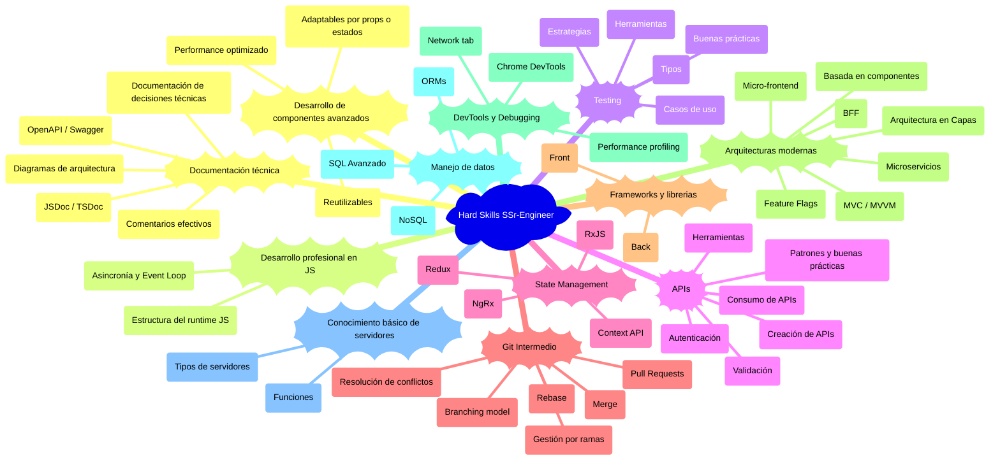

### Desarrollo de Componentes Avanzados

Los componentes avanzados son piezas fundamentales en aplicaciones modernas, especialmente en frameworks como React, Angular o Vue. Un SSr-Engineer debe no solo crearlos, sino también optimizarlos para su reutilización, rendimiento y adaptabilidad. Esta habilidad garantiza escalabilidad, mantenibilidad y consistencia en el desarrollo de interfaces.

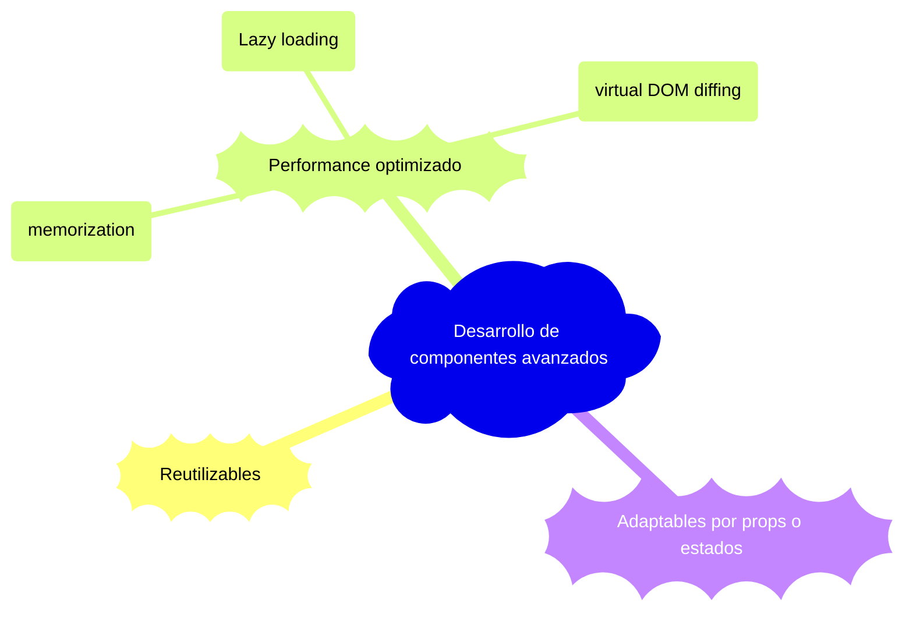

#### Reutilizables

Un componente reutilizable es una unidad de interfaz que se diseña para ser utilizada en múltiples lugares de una aplicación, sin duplicar código. Encapsula lógica, estructura y estilos, y permite la parametrización para adaptarse a distintos contextos.

**Escenario de uso**: En un e-commerce, un componente `ProductCard` puede reutilizarse tanto en la página principal como en los resultados de búsqueda o sección de favoritos como podemos ver en el siguiente ejemplo de REACT.

```jsx
const ProductCard = ({ name, price, image }) => (
  <div className="card">
    
    <h2>{name}</h2>
    <p>{price}</p>
  </div>
);
```

#### Performance optimizado

Componentes optimizados garantizan una experiencia fluida y rápida. Un SSr-Engineer debe evitar renders innecesarios, controlar efectos secundarios y aplicar técnicas como *memoization*, *lazy loading* o *virtual DOM diffing*.

**Escenario de uso**: En una lista con cientos de elementos, es crucial evitar que todos se rendericen en cada cambio del estado general, como en el siguiente ejemplo de React.memo.

```jsx
const OptimizedCard = React.memo(({ title }) => {
  console.log("Renderizado");
  return <h2>{title}</h2>;
});
```
<!-- TODO: Agregar memorization, lazy loading y virtual DOM diffing -->

#### Adaptables por props o estados

Un componente adaptable reacciona a las propiedades (`props`) o estado (`state`) para modificar su apariencia o comportamiento. Esto permite interfaces dinámicas, intuitivas y fáciles de extender.

**Escenario de uso**: Un botón puede tener variantes como “primario”, “secundario” o “deshabilitado” usando props.

```jsx
const Button = ({ variant, disabled, onClick }) => {
  const className = `btn ${variant} ${disabled ? 'btn-disabled' : ''}`;
  return <button className={className} onClick={onClick} disabled={disabled}>Click</button>;
};
```

### Desarrollo profesional en JS

El dominio de JavaScript a nivel semi senior implica un entendimiento profundo de cómo funciona el lenguaje detrás de escenas, especialmente su modelo de ejecución, asincronía, y el entorno donde se ejecuta (navegador o Node.js).

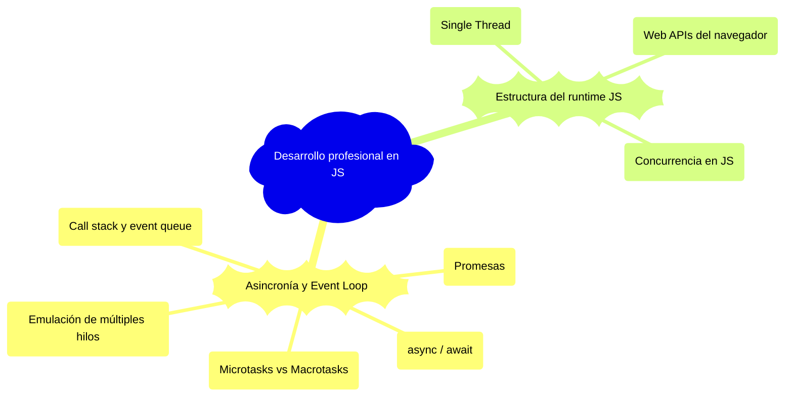

#### Asincronía y Event Loop

Comprender cómo JS maneja operaciones asincrónicas es fundamental para evitar bloqueos, race conditions y manejar múltiples tareas concurrentemente.


Imagen del sitio [GeekForGeeks](https://www.geeksforgeeks.org/what-is-an-event-loop-in-javascript/)

##### Promesas
<!-- TODO: Agregar Observables -->
Las **promesas** permiten gestionar operaciones asincrónicas, evitando el "callback hell".

```javascript
fetch('/api/data')
  .then(res => res.json())
  .then(data => console.log(data))
  .catch(err => console.error(err));
```

**Escenario de uso**:

- Llamadas a APIs
- Acceso a bases de datos del navegador
- Carga de recursos externos

##### async / await

Una sintaxis más limpia para trabajar con promesas, compatible con `try/catch`.

```js
async function getData() {
  try {
    const res = await fetch('/api/data');
    const data = await res.json();
    console.log(data);
  } catch (err) {
    console.error(err);
  }
}
```

**Ventajas**:

- Legibilidad
- Flujo estructurado
- Manejo natural de errores

##### Microtasks vs Macrotasks

JavaScript organiza tareas asincrónicas en dos colas distintas:

- **Microtasks**: Promesas (`.then`, `async/await`, `queueMicrotask`, `MutationObserver`)  
- **Macrotasks**: `setTimeout`, `setInterval`, `setImmediate`, `requestAnimationFrame`, eventos del DOM

```js
console.log("1");
setTimeout(() => console.log("2"), 0);
Promise.resolve().then(() => console.log("3"));
console.log("4");
```

**Resultado**:

```bash
1
4
3
2
```

**Motivo**: las microtasks tienen mayor prioridad que las macrotasks.

##### Call Stack y Event Queue

El **Call Stack** es la pila de ejecución de funciones. Cuando una función termina, se saca de la pila.  
El **Event Queue** es donde esperan las tareas asincrónicas. El **Event Loop** es el encargado de mover tareas de la queue al stack cuando el stack está vacío.

```bash
[Main thread]
  └── Call Stack
        └── función actual

[Asynchronous work]
  └── Event Queue
        └── tareas pendientes (promesas, timeouts, etc.)
```

```js
function saludar() {
  console.log("Hola");
}
setTimeout(() => console.log("Adiós"), 0);
saludar();
```

**Orden**:

1. `saludar()` entra y sale del stack → imprime "Hola"
2. `setTimeout` se va al Event Queue → imprime "Adiós" después

##### Emulación de múltiples hilos

JS es **single-threaded**, pero puede emular concurrencia mediante:

- Web APIs del navegador
- **Web Workers** para operaciones pesadas en segundo plano
- Uso de asincronía para liberar el hilo principal


[Imagen de Craig Buckler](https://www.sitepoint.com/developing-faster-javascript-apps-the-ultimate-guide-to-web-workers/)

---

#### Estructura del Runtime JS

<!-- TODO: Mejorar porque se repite mucho con el tema anterior y es mejor comprender todo sin repetición -->
Comprender cómo se ejecuta JS permite tomar decisiones informadas sobre rendimiento y comportamiento inesperado.


Imagen de Michael en [medum](https://soymichel.medium.com/javascript-runtime-a2b59931708e)

##### Single Thread

JavaScript ejecuta todo el código en un solo hilo por defecto. No hay paralelismo real a menos que se use `Web Workers`.

- Implica cuidado con tareas bloqueantes.
- Se debe evitar lógica pesada en el hilo principal.

##### Web APIs del navegador

Cuando JS encuentra una operación asincrónica, esta es delegada al entorno del navegador:

- Timers (`setTimeout`)
- `DOM events`
- HTTP requests (`fetch`)
- Web Storage, WebSocket, etc.

##### Concurrencia en JS

JS **no es multithread**, pero permite **concurrencia** a través del modelo de **asincronía + event loop**.

```js
console.log("Inicio");
setTimeout(() => console.log("Temporizador"), 0);
console.log("Fin");
```

---

### 🧪 Testing

El testing es una competencia fundamental para un desarrollador semi senior. En este nivel se espera que pueda escribir y mantener pruebas automatizadas, detectar puntos frágiles en la aplicación y asegurar el correcto funcionamiento del código a través de pruebas unitarias, de integración y eventualmente pruebas end-to-end.

Además, debe conocer las principales librerías de testing del ecosistema JavaScript y aplicar buenas prácticas como mocks, cobertura de código y pruebas en pipelines de integración continua.

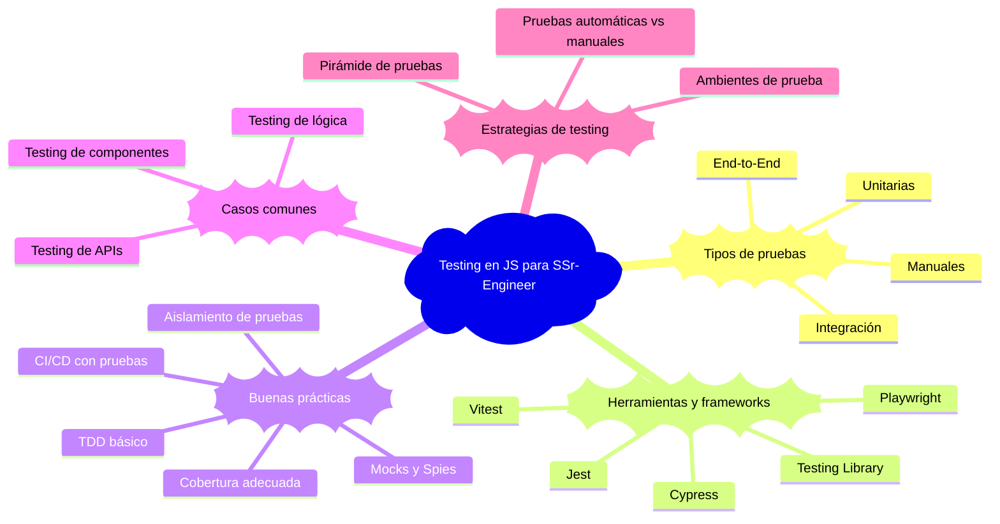

#### 🔹 Tipos de pruebas

##### 🤲 Manuales o exploratorias

Son pruebas que se realizan de manera manual con un solo flujo, se recomienda tomar evidencia y no quedan en el sistema.

##### 🧩 Pruebas unitarias

Se centran en probar funciones, clases o componentes individuales de forma aislada. Son rápidas, fáciles de ejecutar y representan la base de una buena estrategia de pruebas.

```js
function suma(a, b) {
  return a + b;
}

test('suma correctamente dos números', () => {
  expect(suma(2, 3)).toBe(5);
});
```

##### 🔗 Pruebas de integración

Verifican que varios módulos o componentes trabajen correctamente entre sí. En un contexto frontend puede ser verificar la interacción entre un formulario y el contexto global.

```js
import { render, screen } from '@testing-library/react';
import App from './App';

test('la aplicación muestra la pantalla principal', () => {
  render(<App />);
  expect(screen.getByText('Bienvenido')).toBeInTheDocument();
});
```

##### 🌐 Pruebas end-to-end (E2E)

Simulan una experiencia de usuario completa a través del navegador. Validan flujos reales desde el inicio hasta el fin, como el login, navegación o el checkout de un carrito.

```js
// Usando Cypress
describe('Login flow', () => {
  it('permite que el usuario inicie sesión', () => {
    cy.visit('/login');
    cy.get('input[name=email]').type('usuario@ejemplo.com');
    cy.get('input[name=password]').type('123456');
    cy.get('button[type=submit]').click();
    cy.contains('Dashboard');
  });
});
```

#### 🔹 Herramientas y Frameworks

- **Jest:** Framework de pruebas muy popular en el ecosistema React, ideal para unit tests y mocks.
- **Vitest:** Alternativa moderna y rápida a Jest, altamente compatible con Vite.
- **Testing Library:** Herramienta para pruebas de componentes enfocada en la accesibilidad y experiencia del usuario.
- **Cypress:** Para pruebas E2E potentes y fáciles de escribir.
- **Playwright:** Alternativa más moderna y poderosa a Cypress con capacidades más amplias (multi-browser, screenshots, trazas).

#### 🔹 Buenas prácticas

- **Cobertura adecuada:** No es necesario llegar al 100%, pero sí cubrir los flujos críticos de la aplicación.
- **Pruebas aisladas:** Evitar efectos colaterales o dependencia entre tests.
- **Mocks y Spies:** Simular dependencias externas ([API](/others/glossary.md#a), localStorage, etc.) para controlar los escenarios de prueba.
- **[TDD](/others/glossary.md#t) (Desarrollo guiado por pruebas):** Aunque no obligatorio, se recomienda comenzar pruebas antes o durante el desarrollo.
- **Integración con [CI/CD](/others/glossary.md#c):** Asegurar que los tests se ejecuten automáticamente en pipelines de integración continua.

#### 🔹 Casos comunes

- **Testing de componentes:** Verificar que rendericen correctamente según `props` o estado.
- **Testing de lógica:** Funciones puras o utilitarias independientes del [DOM](/others/glossary.md#d).
- **Testing de [API](/others/glossary.md#a)s:** Mock de respuestas externas con herramientas como [MSW](https://mswjs.io/) o [axios-mock-adapter](https://www.npmjs.com/package/axios-mock-adapter).

#### 🔹 Estrategias de testing

- **Pirámide de pruebas:** Tener más pruebas unitarias que de integración y estas más que E2E.
- **Automáticas vs Manuales:** Las pruebas automatizadas deben cubrir lo repetible; las manuales lo exploratorio.
- **Ambientes de prueba:** Separar entornos de desarrollo y producción para realizar pruebas sin afectar usuarios reales.

#### 📌 Recomendaciones finales

Un SSr-Engineer debe escribir pruebas como parte natural de su flujo de trabajo. No se trata solo de que "todo pase el test", sino de que los tests representen una forma sólida de prevenir errores, facilitar refactorizaciones y mantener la calidad a largo plazo.

La capacidad de diagnosticar un error con ayuda de los tests o identificar una zona no cubierta en un módulo complejo marca una gran diferencia entre un perfil junior y uno semi-senior.

### APIs

En el rol de SSr-Engineer, se espera un conocimiento sólido sobre [API](/others/glossary.md#a)s, especialmente en la integración, consumo eficiente, diseño básico y herramientas asociadas. No se requiere aún dominio arquitectónico completo, pero sí experiencia práctica, comprensión de buenas prácticas y capacidad para manejar complejidades medias.

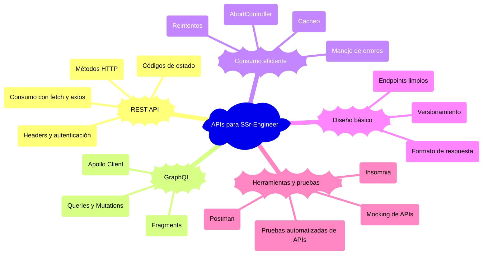

#### REST API

Una REST API es una interfaz que sigue los principios de la arquitectura REST. Permite que sistemas interactúen usando HTTP como protocolo principal, utilizando recursos identificables mediante URLs y operaciones estándar (GET, POST, PUT, DELETE).

##### Métodos HTTP

- `GET`: Obtener datos.
- `POST`: Crear nuevos recursos.
- `PUT` / `PATCH`: Modificar recursos existentes.
- `DELETE`: Eliminar recursos.

```js
fetch('/api/user/1', {
  method: 'GET'
})
  .then(res => res.json())
  .then(data => console.log(data))
```

##### Códigos de estado

- `200`: OK
- `201`: Created
- `400`: Bad Request
- `401`: Unauthorized
- `404`: Not Found
- `500`: Internal Server Error

##### Headers y autenticación

- Autenticación con `Authorization: Bearer <token>`.
- Headers para `Content-Type`, `Accept`.

```js
fetch('/api/private', {
  headers: {
    'Authorization': 'Bearer TOKEN123',
    'Content-Type': 'application/json'
  }
})
```

##### Consumo con `fetch` y `axios`

- `fetch`: nativo del navegador, promesas limpias.
- `axios`: librería externa con manejo de errores, interceptores y soporte para cancelación.

```js
import axios from 'axios';

axios.get('/api/data')
  .then(res => console.log(res.data))
  .catch(err => console.error(err));
```

#### GraphQL

GraphQL es un lenguaje de consultas para APIs que permite al cliente especificar qué datos necesita. Se utiliza comúnmente en lugar de REST cuando se busca eficiencia en las transferencias de datos.

##### Queries y Mutations

- **Query**: Para obtener datos.
- **Mutation**: Para modificar datos.

```js
const query = `
  query {
    user(id: 1) {
      name
      email
    }
  }
`;
```

##### Fragments

Permiten reutilizar estructuras de datos en varias queries.

```graphql
fragment UserInfo on User {
  name
  email
}
```

##### Apollo Client

Librería para consumir APIs GraphQL con facilidad desde React u otros frameworks. Administra caché, errores, suscripciones, etc.

```js
import { gql, useQuery } from '@apollo/client';

const GET_USERS = gql`
  query {
    users {
      id
      name
    }
  }
`;

const { loading, error, data } = useQuery(GET_USERS);
```

#### Consumo eficiente

##### Cacheo

- Evitar consultas innecesarias mediante almacenamiento en memoria.
- Apollo y SWR ofrecen caché automatizado.

##### Reintentos

- Automatizar reintentos con backoff exponencial ante errores temporales.

```js
const retryFetch = (url, retries = 3) =>
  fetch(url).catch(err => {
    if (retries > 0) return retryFetch(url, retries - 1);
    throw err;
  });
```

##### AbortController

- Permite cancelar peticiones HTTP activamente.

```js
const controller = new AbortController();
fetch('/api/data', { signal: controller.signal });
controller.abort();
```

##### Manejo de errores

- Controlar errores de red, del servidor, o de formato.

```js
fetch('/api/data')
  .then(res => {
    if (!res.ok) throw new Error('Error en la respuesta');
    return res.json();
  });
```

#### Diseño básico

##### Endpoints limpios

- Rutas claras y semánticas: `/users/:id` vs `/getUserById`.

##### Versionamiento

- Buenas prácticas:
  - `/api/v1/users`
  - Cambiar versión cuando hay cambios incompatibles.

##### Formato de respuesta

- JSON consistente.
- Contener siempre estructura clara:

```json
{
  "data": {},
  "error": null,
  "meta": {
    "pagination": {}
  }
}
```

---

#### Herramientas y pruebas

##### Postman

- Enviar peticiones HTTP manuales.
- Probar respuestas, headers, autenticación.

##### Insomnia

- Similar a Postman, pero con mejor manejo de ambientes y variables.

##### Mocking de APIs

- Simular respuestas de API durante el desarrollo.

```js
import { setupServer } from 'msw/node';
import { rest } from 'msw';

const server = setupServer(
  rest.get('/api/user', (req, res, ctx) => {
    return res(ctx.json({ name: 'John' }));
  })
);
```

##### Pruebas automatizadas de APIs

- Pruebas integradas con herramientas como:
  - Jest + Supertest (Node.js).
  - Cypress (e2e testing en frontend).
  - Playwright.

```js
import request from 'supertest';
import app from './app';

test('GET /user', async () => {
  const res = await request(app).get('/user');
  expect(res.statusCode).toBe(200);
});
```

### State Management

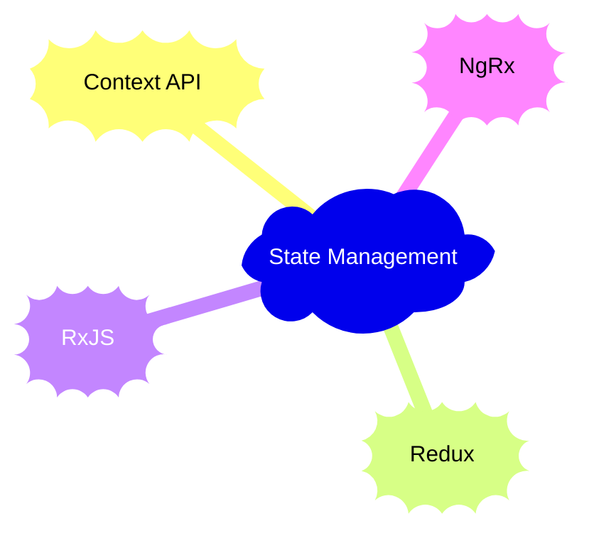

**State Management** o **gestión del estado** es una disciplina fundamental en el desarrollo de interfaces modernas, ya que permite controlar y coordinar cómo fluye y se actualiza la información dentro de una aplicación.

En aplicaciones frontend, especialmente aquellas construidas con frameworks como React o Angular, el manejo adecuado del estado garantiza que los componentes respondan correctamente a las interacciones del usuario, a los datos externos (como APIs) y a los cambios internos del sistema.

Existen distintas estrategias y herramientas para la gestión del estado, que varían en complejidad y alcance:

- Desde soluciones integradas y ligeras como la **Context API**,
- Hasta librerías robustas y estructuradas como **Redux** y **NgRx**,
- Y herramientas especializadas para flujos de datos reactivos como **RxJS**.

La elección de una u otra depende del tamaño de la aplicación, la complejidad de los flujos de datos, el equipo de trabajo y las necesidades de escalabilidad.

A continuación, se desglosan las principales herramientas y conceptos utilizados para la gestión del estado en aplicaciones frontend modernas.

#### 1. **Context API**

La **Context API** es una solución integrada en React para el manejo de estado global. Su uso es ideal en aplicaciones pequeñas a medianas o cuando el manejo del estado no es extremadamente complejo.

##### Detalles clave context

- **Propósito:** Permite compartir datos entre componentes sin necesidad de prop-drilling (pasar props manualmente a través de muchos niveles de componentes).
- **Estructura:**
  - **React.createContext:** Se crea el contexto donde se almacenará el estado.
  - **Provider:** Componente que define el contexto y lo hace disponible a los componentes hijos.
  - **Consumer:** Componente que se suscribe a los cambios en el contexto.

##### Ejemplo básico context

```jsx
// Definir el Contexto
const MyContext = React.createContext();

// Componente Provider
const MyProvider = ({ children }) => {
  const [state, setState] = useState('Hello World');
  
  return (
    <MyContext.Provider value={{ state, setState }}>
      {children}
    </MyContext.Provider>
  );
};

// Componente Consumer
const MyComponent = () => {
  const { state, setState } = useContext(MyContext);
  
  return (
    <div>
      <p>{state}</p>
      <button onClick={() => setState('New State')}>Update State</button>
    </div>
  );
};
```

##### Casos de uso context

- **Aplicaciones pequeñas a medianas:** Perfecto para proyectos con un manejo de estado relativamente simple.
- **Estado global leve:** Ideal para mantener valores que necesitan ser accesibles a lo largo de múltiples componentes.

#### 2. **Redux**

**Redux** es una librería para manejar el estado de manera predecible en aplicaciones JavaScript. Es útil en aplicaciones más grandes y complejas donde se requiere un flujo de datos más estructurado.

##### Detalles clave redux

- **Principios fundamentales:**
  - **Single source of truth:** Todo el estado se guarda en un único objeto llamado "store".
  - **State is read-only:** El estado solo se puede modificar a través de acciones.
  - **Changes are made with pure functions (reducers):** Las modificaciones al estado se realizan con funciones puras que reciben el estado anterior y devuelven un nuevo estado.
  
- **Acciones y Reducers:**
  - **Acciones:** Describen "qué" ocurrió.
  - **Reducers:** Son funciones que especifican cómo cambia el estado en respuesta a una acción.
  
##### Ejemplo básico redux

```javascript
// Action
const increment = { type: 'INCREMENT' };

// Reducer
const counter = (state = 0, action) => {
  switch (action.type) {
    case 'INCREMENT':
      return state + 1;
    default:
      return state;
  }
};

// Store
const store = Redux.createStore(counter);
store.dispatch(increment);
```

##### Casos de uso redux

- **Aplicaciones grandes:** Útil cuando la aplicación tiene muchos estados compartidos y requiere un flujo de datos claro y centralizado.
- **Manejo de estado complejo:** Como cuando se necesitan muchas interacciones entre componentes y acciones disparadas por usuarios.

#### 3. **RxJS**

**RxJS** (Reactive Extensions for JavaScript) es una librería para programación reactiva basada en flujos de datos asíncronos y eventos, utilizando **observables**.

##### Detalles clave RxJS

- **Observables:** Un objeto que representa un flujo de datos o eventos que pueden ser observados.
- **Operadores:** Funciones que permiten transformar, combinar y manejar los datos de los observables.
- **Efectos secundarios (side effects):** Acciones que se ejecutan como resultado de la suscripción a un observable, como actualizaciones de estado o llamadas a APIs.

##### Ejemplo básico RxJS

```javascript
import { Observable } from 'rxjs';

const observable = new Observable(subscriber => {
  subscriber.next('Hello');
  subscriber.next('World');
  subscriber.complete();
});

observable.subscribe({
  next: value => console.log(value),
  complete: () => console.log('Done'),
});
```

##### Casos de uso RxJS

- **Manejo de flujos de datos asíncronos:** Ideal para tareas como la manipulación de eventos de UI o la integración con APIs.
- **Composición de eventos complejos:** Permite manejar de manera eficiente eventos complejos como los de usuario o respuestas HTTP.

#### 4. **NgRx**

**NgRx** es una implementación de **Redux** para aplicaciones Angular. Utiliza un enfoque basado en **observables** y se adapta bien a los patrones de programación reactiva, lo que lo convierte en una opción robusta para manejar el estado en aplicaciones Angular de gran escala.

##### Detalles clave NgRx

- **Store:** Centraliza el estado de la aplicación.
- **Actions:** Describen los eventos que ocurren en la aplicación.
- **Reducers:** Determinan cómo se actualiza el estado en respuesta a las acciones.
- **Effects:** Permiten manejar efectos secundarios, como la obtención de datos de una API.

##### Ejemplo básico NgRx

```typescript
import { createAction, props } from '@ngrx/store';

// Acción
export const loadData = createAction('[Data Page] Load Data');

// Reducer
export const dataReducer = createReducer(
  initialState,
  on(loadData, state => ({ ...state, loading: true }))
);

// Efecto
@Injectable()
export class DataEffects {
  loadData$ = createEffect(() => 
    this.actions$.pipe(
      ofType(loadData),
      mergeMap(() => this.dataService.getData()
        .pipe(
          map(data => loadDataSuccess({ data })),
          catchError(() => of(loadDataFailure()))
        )
      )
    )
  );
}
```

##### Casos de uso NgRx

- **Aplicaciones Angular grandes:** Perfecto para manejar el estado centralizado y gestionar interacciones complejas.
- **Flujos reactivos avanzados:** Aprovecha el poder de RxJS para manejar efectos secundarios y flujos de datos asíncronos.

#### Resumen de **State Management**

- **Context API** es adecuado para aplicaciones simples con un manejo de estado global sin mucha complejidad.
- **Redux** es ideal para aplicaciones grandes y complejas que requieren un manejo claro y centralizado del estado, con un flujo de datos unidireccional.
- **RxJS** es una librería poderosa para la programación reactiva, donde los flujos de datos asíncronos y los efectos secundarios son esenciales.
- **NgRx** es la solución recomendada para aplicaciones Angular grandes, aprovechando la programación reactiva y el patrón Redux.

Este enfoque no solo cubre la implementación básica de estas tecnologías, sino también las prácticas avanzadas y cómo se pueden combinar de manera eficiente para aplicaciones más grandes y complejas.

### Git Intermedio

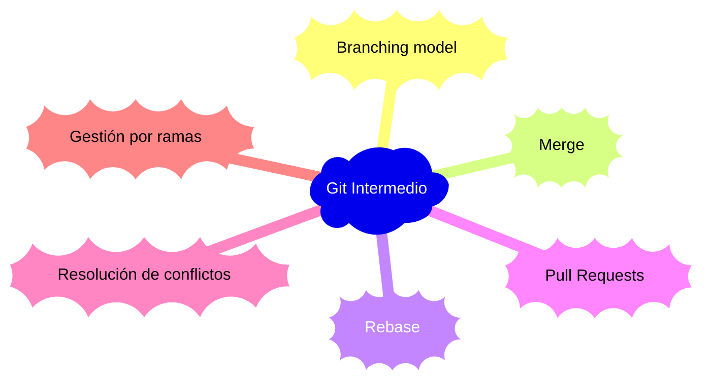

- Flujo Git colaborativo: branching, merge, rebase, pull requests.
- Resolución de conflictos de forma autónoma.
- Propuesta y revisión de cambios en revisiones de código.

### Frameworks avanzados

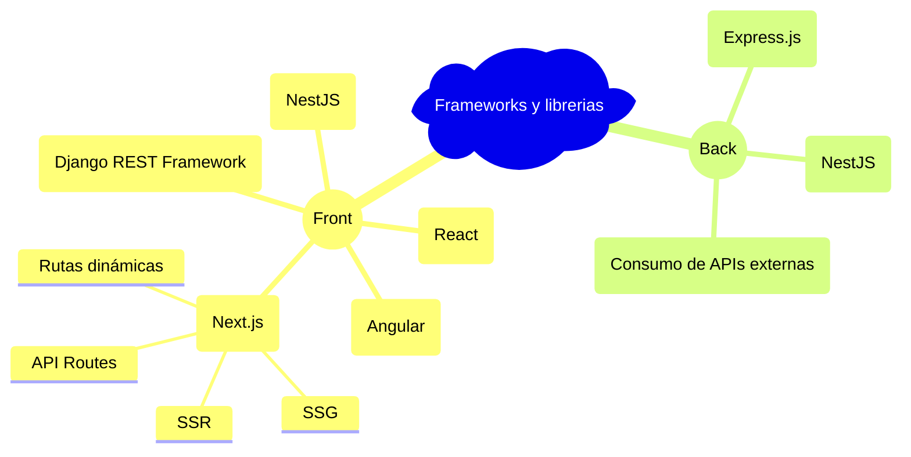

- Conocimiento práctico de frameworks como Next.js (SSR, SSG, rutas dinámicas).
- Implementación de API Routes y renderizado híbrido.
- Uso de NestJS o Django REST para estructurar APIs robustas.

### Arquitecturas modernas

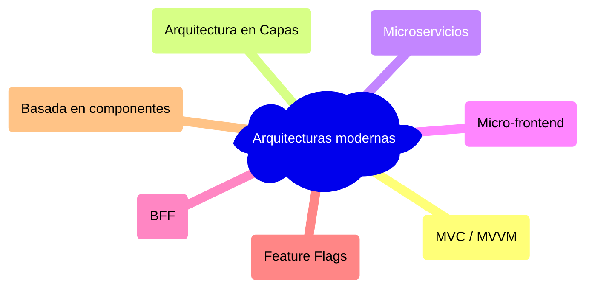

- Aplicación de patrones como MVC, MVVM y arquitectura en capas.
- Introducción a microservicios, micro-frontend y BFF.
- Uso de feature flags para experimentación controlada y despliegue progresivo.

### DevTools y Debugging

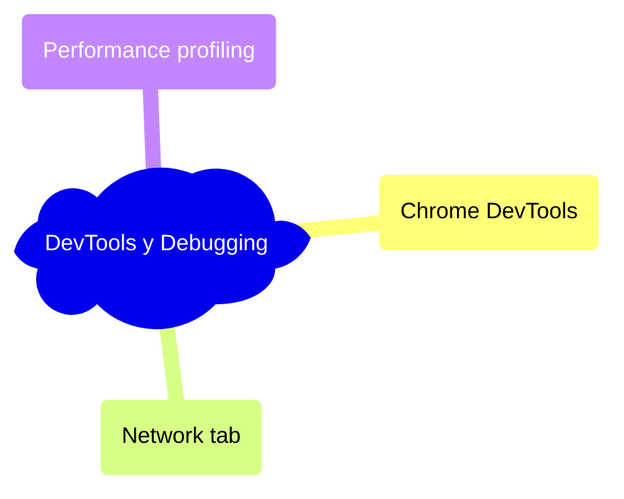

- Uso de herramientas como Chrome DevTools, Lighthouse o React DevTools.
- Inspección de flujos de red, eventos, performance y errores.
- Trazabilidad de flujo de datos para diagnosticar bugs.

### Manejo de datos

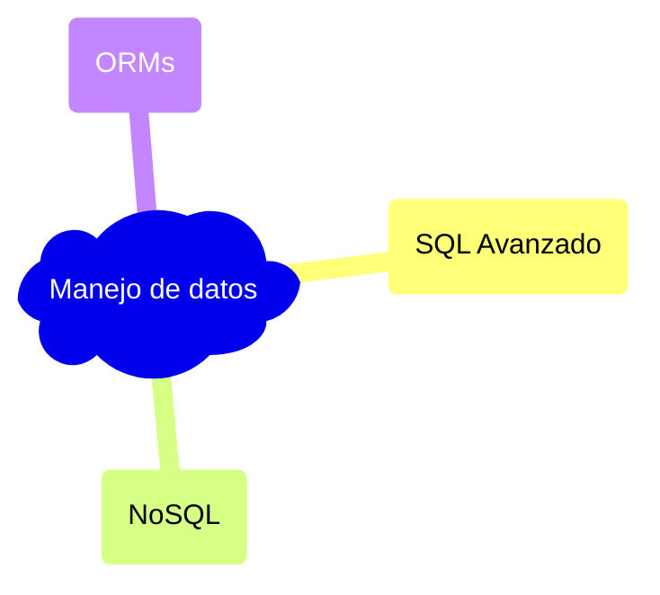

### Conocimiento básico de servidores

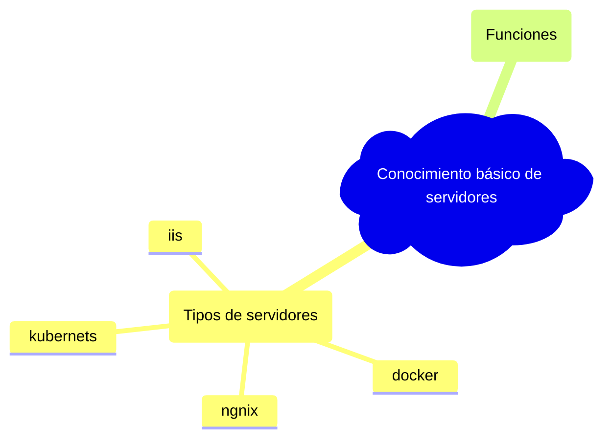

### Documentación técnica

```mermaid
mindmap
  root (Manejo de datos))
    (SQL Avanzado)
    (NoSQL)
    (ORMs)
  (Documentación técnica))
    (OpenAPI / Swagger)
    (JSDoc / TSDoc)
    (Diagramas de arquitectura)
    (Comentarios efectivos)
    (Documentación de decisiones técnicas)
  (Conocimiento básico de servidores))
    (Tipos de servidores)
      ngnix
      docker
      kubernets
      iis
    (Funciones)
```

- Uso de Swagger/OpenAPI para describir endpoints.
- Documentación de funciones y componentes con TSDoc o JSDoc.
- Diagramas de arquitectura con C4 Model o Mermaid para comunicar diseño.

---

## 🧠 Essential Skills (Ssr Engineer)

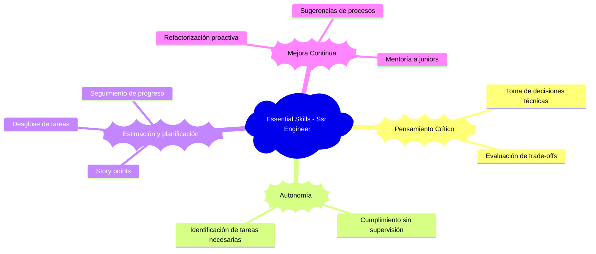

---

## ✅ Criterios de Desempeño (Ssr Engineer)

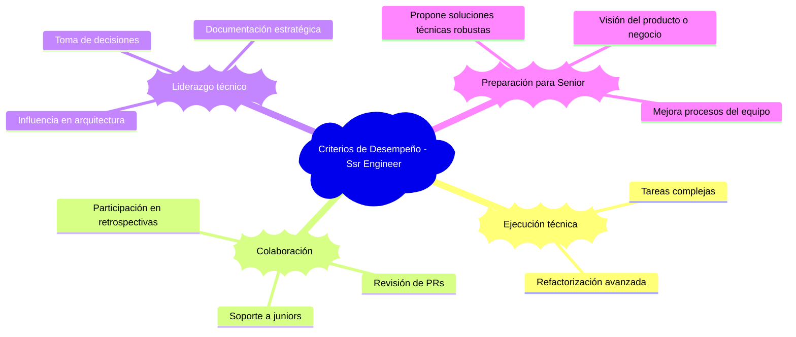

---

[Junior](./02-junior.md) | [⬆️](/knowledge.md#3-desarrollador-semi-senior--mid-level-developer) | [Senior](./04-senior.md)

<!-- TODO: Agregar

# SSr-Engineer

## 🔧 Hard Skills

- Desarrollo de componentes reutilizables, adaptables y performantes
- Testing unitario e integración
- Gestión avanzada de ramas en Git (merge, rebase, PRs)
- Documentación técnica clara y útil
- Consumo de APIs REST y GraphQL con herramientas modernas
- Uso y comprensión de:
  - NgRx (estado en Angular)
  - GraphQL (queries, mutations, fragments)
  - Next.js: SSR, SSG, rutas dinámicas, API Routes
- Ciclo de vida del event loop de JavaScript
- Programación asincrónica: Promesas, async/await, micro/macro tasks

### HTML/CSS/JS Frontend Intermedio

- Virtual DOM
- Optimización de imágenes (lazy load, WebP)
- Minificación, Uglificación y Compresión
- SASS / LESS con mixins, variables
- IndexedDB para persistencia estructurada
- React: hooks personalizados
- Angular: directivas personalizadas, pipes avanzados
- Shadow DOM
- Web Workers para tareas pesadas en segundo plano
- Sockets básicos (ej. con socket.io)

## 🧠 Essential Skills

- Pensamiento crítico para tomar decisiones técnicas
- Estimación de tiempos y esfuerzo con precisión
- Capacidad para trabajar sin supervisión cercana
- Propuesta activa de mejoras en código y procesos

## ✅ Criterios de Desempeño

- Resuelve tareas medianamente complejas de forma autónoma
- Revisa código y apoya a perfiles junior
- Participa activamente en decisiones técnicas
- Cuando todo lo anterior se realiza con fluidez → está listo para avanzar a Senior

## 🧪 Exposición recomendada (sin necesidad de dominio profundo)

- Arquitectura BFF (Backend for Frontend)
- Feature Flags
- Microservicios
- Micro-frontend

---
 -->