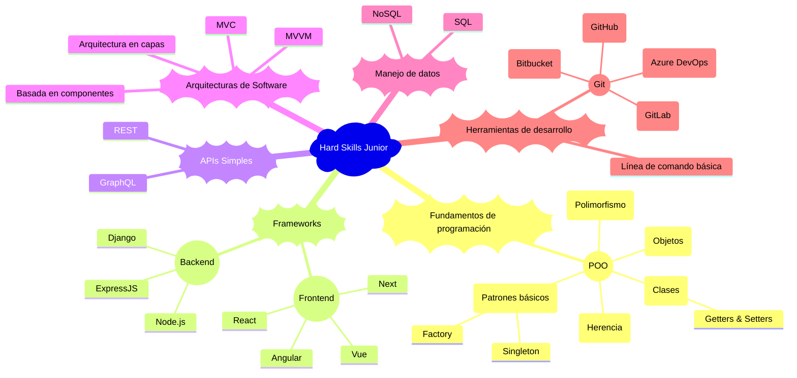

# Desarrollador Junior (Frontend / Backend / Fullstack)

El Desarrollador Junior es un rol fundamental en el inicio de la vida profesional en tecnología. Implica la transición de aprendiz a profesional capaz de entregar valor de manera consistente bajo la guía de compañeros más experimentados.

## 🔧 Hard Skills

El desarrollador junior ha superado la etapa de [aprendizaje básico](./intern.md) y ahora aplica conocimientos fundamentales para construir soluciones funcionales en entornos de desarrollo reales. Esta sección detalla las competencias técnicas clave organizadas por área.



### Fundamentos de programación

Los fundamentos de programación para un desarrollador junior se enfocan en aplicar conceptos avanzados como la programación orientada a objetos, patrones básicos de diseño y manejo de excepciones, consolidando las bases adquiridas como [practicante](intern.md) para resolver problemas más complejos y construir soluciones escalables.

#### Programación orientada a objetos (POO)

La POO permite estructurar el código de forma modular, reutilizable y fácil de mantener. Es un enfoque clave en el desarrollo profesional.

##### 📚 Clases

**Descripción:** Una clase es una plantilla o modelo que define las porpiedades (atributos) y comportamientos (métodos) que los objetos creados a partir de ella tendrán.

**Escenario de uso:** Se usan clases cuando necesitamos crear múltiples objetos que comparten las mismas características, pero cuyos datos pueden variar. Ejemplos típicos: Usuario en un sistema, Producto en un catálogo, etc.

###### Ejemplo Clases

````javascript
class Usuario {
  constructor(nombre, email) {
    this.nombre = nombre;
    this.email = email;
  }

  saludar() {
    console.log(`Hola, soy ${this.nombre}`);
  }

  actualizarEmail(nuevoEmail) {
    this.email = nuevoEmail;
  }
}

// Crear un usuario
const usuario1 = new Usuario('Ana', 'ana@email.com');
usuario1.saludar(); // Hola, soy Ana
````

```python
class Usuario:
  def __init__(self, nombre, email):
    self.nombre = nombre
    self.email = email

  def saludar(self):
    print(f"Hola, soy {self.nombre}")

  def actualizar_email(self, nuevo_email):
    self.email = nuevo_email

# Crear un usuario
usuario1 = Usuario('Ana', 'ana@email.com')
usuario1.saludar() # Hola, soy Ana
```

##### 🍱 Getters & Setters

**Descripción:** Métodos para acceder o modificar atributos privados de forma controlada.

**Escenario de uso:** Proteger acceso a variables internas como contraseñas o configuraciones.

###### Ejemplo getters & setters

```javascript
class Configuracion {
  constructor() {
    this._modo = 'producción';
  }

  get modo() {
    return this._modo;
  }

  set modo(nuevoModo) {
    if (nuevoModo === 'dev' || nuevoModo === 'producción') {
      this._modo = nuevoModo;
    }
  }
}
```

```python
class Configuracion:
  def __init__(self):
    self._modo = 'producción'

  @property
  def modo(self):
    return self._modo

  @modo.setter
  def modo(self, nuevo_modo):
    if nuevo_modo in ['dev', 'producción']:
      self._modo = nuevo_modo
```

##### 📦 Objetos

**Descripción:** Un objeto es una instancia de una clase. Es una entidad concreta que contiene datos (atributos) y comportamiento (métodos) definidos en la clase.

**Escenario de uso:** Cada vez que requerimos representar una entidad específica con datos reales en un sistema: un cliente en un CRM, un producto en una tienda online, una tarea en un sistema de gestión.

###### Ejemplo Objetos

Siguiendo el [ejemplo de clases](#ejemplo-clases), `usuario1` es un objeto creado a partir de la clase `Usuario`.

```javascript
const usuario2 = new Usuario('Carlos', 'carlos@email.com');
usuario2.saludar(); // Hola, soy Carlos
```

```python
# Crear un usuario
usuario1 = Usuario('Ana', 'ana@email.com')
usuario1.saludar() # Hola, soy Ana
```

##### 🧬 Herencia

**Descripción:** La herencia permite que una clase derive (herede) propiedades y métodos de otra clase existente. Ayuda a reutilizar código y construir jerarquías lógicas.

**Escenario de uso:** Cuando tenemos una relación "es un tipo de" entre clases. Ejemplo: Un `Administrador` es un tipo de `Usuario` pero con permisos adicionales.

###### Ejemplo Herencia

```javascript
class Administrador extends Usuario{
  constructor(nombre, email, permisos) {
    super(nombre, email); // Llama al constructor de Usuario
    this.permisos = permisos;
  }

  mostrarPermisos() {
    console.log(`${this.nombre} tiene permisos: ${this.permisos.join(', ')}`);
  }
}

const admin = new Administrador('Luis', 'luis@email.com', ['crear', 'editar', 'eliminar']);
admin.saludar(); // Hola, soy Luis
admin.mostrarPermisos(); // Luis tiene permisos: crear, editar, eliminar
```

```python
class Usuario:
  def __init__(self, nombre):
    self.nombre = nombre

class Administrador(Usuario):
  def borrar_usuario(self):
    pass
```

##### 🧩 Polimorfismo

**Descripción:** El polimorfismo permite que métodos con el mismo nombre se comporten de manera diferente según el objeto que los implemente.

**Escenario de uso:** Cuando diferentes tipos de objeto necesitan responder de manera diferente al mismo mensaje o método.
Ejemplo: Un sistema de pagos donde diferentes métodos (`Tarjeta`, `PayPal`, `Criptomoneda`) implementan un método `procesarPago()` de manera distinta.

###### Ejemplo polimorfismo

```javascript
class Pago {
  procesarPago() {
    console.log('Procesando pago genérico...');
  }
}

class PagoTarjeta extends Pago {
  procesarPago() {
    console.log('Procesando pago con Tarjeta de Crédito.');
  }
}

class PagoPayPal extends Pago {
  procesarPago() {
    console.log('Procesando pago con PayPal.');
  }
}

const pagos = [new PagoTarjeta(), new PagoPayPal()];

pagos.forEach(pago => pago.procesarPago());
// Procesando pago con Tarjeta de Crédito.
// Procesando pago con PayPal.
```

##### 🏭 Factory pathern

**Descripción:** Permite crear objetos sin especificar su clase concreta, delegando la lógica de creación a una "fábrica".

**Escenario de uso:** Cuando necesitas crear instancias de diferentes clases que comparten una interfaz común, pero no sabes cuál exactamente hasta tiempo de ejecución. Ejemplo crear diferentes tipos de pago según el método elegido.

###### Ejemplo factory

```javascript
function metodoPagoFactory(tipo) {
  if (tipo === 'tarjeta') return new PagoTarjeta();
  if (tipo === 'paypal') return new PagoPayPal();
}
```

###### Ventajas factory

- Centraliza la lógica de instanciación.
- Facilita la extensión de código.
- Mejora el desacoplamiento.

##### 👤 Singleton pathern

**Descripción:** Restringe la creación de una clase a una sola instancia global accesible en toda la aplicación.

**Escenario de uso:** Cuando necesitas una única fuente de verdad, como en el manejo de configuración, conexión a una base de datos o caché.

###### Ejemplo singleton

```javascript
class Config {
  constructor() {
    if (Config.instance) {
      return Config.instance;
    }
    this.settings = {};
    Config.instance = this;
  }

  set(key, value) {
    this.settings[key] = value;
  }

  get(key) {
    return this.settings[key];
  }
}

const config1 = new Config();
config1.set('tema', 'oscuro');

const config2 = new Config();
console.log(config2.get('tema')); // oscuro
```

###### Ventajas singleton

- Garantiza que una clase tenga solo una instancia.
- Control centralizado del estado.

#### Frameworks

En esta etapa, un Desarrollador Junior debe ser capaz de trabajar con al menos uno de los principales frameworks de frontend y/o backend, comprendiendo los fundamentos de la construcción de aplicaciones modulares, mantenibles y escalables. La expectativa no es la maestría absoluta, sino la capacidad de aprender rápido y aplicar buenas prácticas básicas.

##### Frontend

Herramientas modernas para construir interfaces dinámicas y componentes reutilizables.

Normalmente se usa en desarrollo de SPAs (Single Page Aplications) y PWA (Progressive Web Apps).

- React: Entender componentes funcionales, props, estado y hooks básicos.
- Vue: Uso de Vue CLI, componentes y sistema de binding de datos.
- Angular: Conocer el sistema de componentes, directivas, módulos y tener exposición inicial a RxJS para manejar eventos y peticiones asincrónicas.

##### Backend:
  - Node.js: Comprender su modelo asíncrono y basado en eventos.
  - ExpressJS: Crear servidores sencillos, definir rutas, middlewares básicos y manejo de errores.
- Stack Fullstack:
  - En proyectos de stack completo, se espera que un Junior pueda integrar frontend y backend, usando APIs RESTful básicas.

### Construcción de APIs simples (REST/GraphQL)

````mermaid
mindmap
  root((APIs Junior))
    REST
      CRUD Endpoints
    GraphQL
      Queries
      Mutations
    Herramientas
      Postman
      Insomnia
````

Un Junior debe ser capaz de consumir y crear APIs básicas para conectar aplicaciones frontend y backend.

- Diseño de endpoints RESTful simples (GET, POST, PUT, DELETE).
- Introducción a GraphQL: construcción de queries y mutaciones.
- Uso de herramientas como Postman para probar APIs.

### Bases de datos relacionales y NoSQL básicas

````mermaid
mindmap
  root((Bases de Datos Junior))
    Relacional
      SQL
      PostgreSQL
      MySQL
    NoSQL
      MongoDB
      Firebase
    Skills
      CRUD Operaciones
      Modelado simple
````

El conocimiento de bases de datos permite a un Junior crear aplicaciones dinámicas que almacenan y procesan información.

- Modelado de datos simple: tablas, relaciones 1:N, 1:1
- Consultas básicas en SQL (SELECT, INSERT, UPDATE, DELETE).
- Introducción a bases de datos NoSQL como MongoDB.

## 🧠 Essential Skills

Además del conocimiento técnico, los Desarrolladores Junior deben desarrollar habilidades esenciales para crecer en un entorno profesional y colaborar efectivamente.

````mermaid
mindmap
  root((Essential Skills Junior))
    Organización y Tiempo
      Planificación
        Jira
        Trello
        Azure DevOps
        ClickUP
        Notion
      Priorización
        Urgente vs Importante
    Resolución de Bugs
      Debugging
        IDEs
        Consola
      Análisis
        Logs
        Flujo de datos
    Colaboración en Equipo
      Participación
        Dailys
        Retrospectivas
      Prácticas
        Pair Programming
        Code Review
    Adaptabilidad
      Aprendizaje Rápido
      Flexibilidad de Implementación
      Cambio de Prioridades
````

### Organización personal y manejo del tiempo

El manejo de tareas y tiempos permite a un Junior ser más predecible y confiable en un proyecto.

Uso de metodologías ágiles para planificar tareas (Kanban, Scrum).

Priorización de actividades según impacto y urgencia.

````mermaid
mindmap
  root((Organización Junior))
    Planificación
      Jira
      Trello
    Priorización
      Urgente vs Importante
````

### Resolución básica de bugs o errores

El Junior debe aprender a identificar problemas en su código y resolverlos sistemáticamente.

Uso básico de herramientas de debugging en IDEs.

Análisis de logs y errores comunes en consola.

Métodos de resolución: dividir y conquistar, análisis de flujo de datos.

````mermaid
mindmap
  root((Resolución de Bugs Junior))
    Debugging
      IDEs
      Consola
    Análisis
      Logs
      Flujos de Datos
````

### Colaboración fluida con el equipo

La colaboración es clave para el éxito en entornos ágiles y multiculturales.

Participación activa en reuniones de equipo.

Prácticas de pair programming y revisiones de código.

````mermaid
mindmap
  root((Colaboración Junior))
    Participación
      Dailys
      Retrospectivas
    Prácticas
      Pair Programming
      Code Review
````

### Adaptabilidad a cambios técnicos

El entorno tecnológico cambia rápidamente; un Junior debe ser flexible ante nuevas herramientas y procesos.

Capacidad para aprender nuevas tecnologías bajo presión.

Disposición a cambiar implementaciones cuando los requisitos cambian.

````mermaid
mindmap
  root((Adaptabilidad Junior))
    Aprendizaje Rápido
    Flexibilidad de Implementación
    Cambio de Prioridades
````

## ✅ Criterios de desempeño para Junior

Los criterios de desempeño marcan el crecimiento del Junior hacia roles de mayor autonomía.

````mermaid
mindmap
  root((Criterios de Desempeño Junior))
    Cumple Tareas
      Entregables Funcionales
      Documentación
    Participa en Sprints
      Ceremonias Ágiles
        Sprint Planning
        Retrospectives
    Mejora Continua
      Feedback Constructivo
      Aprendizaje Autónomo
````

### Cumple tareas técnicas con supervisión

- Realiza entregables funcionales de complejidad baja o moderada bajo acompañamiento.
- Documenta adecuadamente las funcionalidades entregadas.

````mermaid
mindmap
  root((Cumplimiento de Tareas Junior))
    Entregables Funcionales
    Documentación
````

### Participa activamente en sprints o entregas

- Aporta de forma proactiva durante las reuniones y ceremonias ágiles.
- Propone pequeñas mejoras o soluciones.

````mermaid
mindmap
  root((Participación en Sprints Junior))
    Ceremonias Ágiles
      Sprint Planning
      Retrospectives
    Mejora de Procesos
````

### Mejora continua con base en feedback

- Recibe feedback con apertura y aplica las sugerencias en futuros entregables.
- Busca oportunidades de aprendizaje autodirigido.

````mermaid
mindmap
  root((Mejora Continua Junior))
    Feedback Constructivo
    Aprendizaje Autónomo
````
