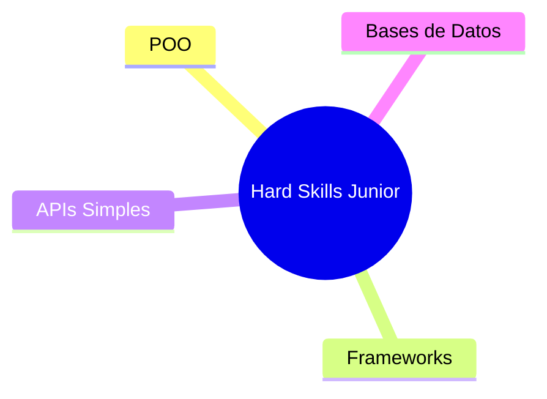

# Desarrollador Junior (Frontend / Backend / Fullstack)

El Desarrollador Junior es un rol fundamental en el inicio de la vida profesional en tecnología. Implica la transición de aprendiz a profesional capaz de entregar valor de manera consistente bajo la guía de compañeros más experimentados.

## 🔧 Hard Skills

Las Hard Skills representan los conocimientos técnicos y herramientas que debe dominar un Junior para construir soluciones de calidad, resolver problemas comunes y colaborar dentro del equipo.



### Programación orientada a objetos (POO)

````mermaid
mindmap
  root((POO Junior))
    Conceptos Básicos
      Clases
      Objetos
      Herencia
      Polimorfismo
    Patrones
      Factory
      Singleton
    Aplicación
      MVC
      Reutilización de código
````

Comprender los principios de programación orientada a objetos (POO) es esencial para escribir código organizado, extensible y mantenible.

- Aplica conceptos de clases, objetos, herencia, encapsulamiento y polimorfismo.
- Utiliza patrones básicos como "Factory" o "Singleton" para problemas comunes.
- Mejora la comprensión de arquitecturas como MVC (Modelo-Vista-Controlador).

#### Conceptos

Aplica conceptos de Clases, Objetos, Herencia, Encapsulamiento y Polimorfismo.

##### 📚 Clases

Una clase es una plantilla o modelo que define las porpiedades (atributos) y comportamientos (métodos) que los objetos creados a partir de ella tendrán.

###### Escenario Clases

Se usan clases cuando necesitamos crear múltiples objetos que comparten las mismas características, pero cuyos datos pueden variar. Ejemplos típicos: Usuario en un sistema, Producto en un catálogo, etc.

###### Ejemplo Clases

````javascript
class Usuario {
  constructor(nombre, email) {
    this.nombre = nombre;
    this.email = email;
  }

  saludar() {
    console.log(`Hola, soy ${this.nombre}`);
  }
}

// Crear un usuario
const usuario1 = new Usuario('Ana', 'ana@email.com');
usuario1.saludar(); // Hola, soy Ana
````

##### 📦 Objetos

Un objeto es una instancia de una clase. Es una entidad concreta que contiene datos (atributos) y comportamiento (métodos) definidos en la clase.

###### Escenario Objetos

Cada vez que requerimos representar una entidad específica con datos reales en un sistema: un cliente en un CRM, un producto en una tienda online, una tarea en un sistema de gestión.

###### Ejemplo Objetos

Siguiendo el [ejemplo de clases](#ejemplo-clases), `usuario1` es un objeto creado a partir de la clase `Usuario`.

````javascript
const usuario2 = new Usuario('Carlos', 'carlos@email.com');
usuario2.saludar(); // Hola, soy Carlos
````

##### 🧬 Herencia

La herencia permite que una clase derive (herede) propiedades y métodos de otra clase existente. Ayuda a reutilizar código y construir jerarquías lógicas.

###### Escenario Herencia

Cuando tenemos una relación "es un tipo de" entre clases. Ejemplo: Un `Administrador` es un tipo de `Usuario` pero con permisos adicionales.

###### Ejemplo Herencia

```javascript
class Administrador extends Usuario{
  constructor(nombre, email, permisos) {
    super(nombre, email); // Llama al constructor de Usuario
    this.permisos = permisos;
  }

  mostrarPermisos() {
    console.log(`${this.nombre} tiene permisos: ${this.permisos.join(', ')}`);
  }
}

const admin = new Administrador('Luis', 'luis@email.com', ['crear', 'editar', 'eliminar']);
admin.saludar(); // Hola, soy Luis
admin.mostrarPermisos(); // Luis tiene permisos: crear, editar, eliminar
```

### Uso de frameworks (React, Angular, Vue, Django, Next, etc.)

````mermaid
mindmap
  root((Frameworks Junior))
    Frontend
      React
        Componentes
        Props y State
        Hooks básicos
      Vue
        Vue Cli
        Binding de datos
        Componentes
      Angular
        Componentes y módulos
        Directivas
        Introducción a RxJS
    Backend
      Django
      Node.js (Next.js)
        Modelo de eventos
      ExpressJS
        Rutas básicas
        middlewares simples
    Fullstack
      Consumo de APIs REST
      Integración Frontend/Backend
    Skills
      Gestión de estados
      CLI Tools
      Componentización
````

En esta etapa, un Desarrollador Junior debe ser capaz de trabajar con al menos uno de los principales frameworks de frontend y/o backend, comprendiendo los fundamentos de la construcción de aplicaciones modulares, mantenibles y escalables. La expectativa no es la maestría absoluta, sino la capacidad de aprender rápido y aplicar buenas prácticas básicas.

- Frontend:
  - React: Entender componentes funcionales, props, estado y hooks básicos.
  - Vue: Uso de Vue CLI, componentes y sistema de binding de datos.
  - Angular: Conocer el sistema de componentes, directivas, módulos y tener exposición inicial a RxJS para manejar eventos y peticiones asincrónicas.
- Backend:
  - Node.js: Comprender su modelo asíncrono y basado en eventos.
  - ExpressJS: Crear servidores sencillos, definir rutas, middlewares básicos y manejo de errores.
- Stack Fullstack:
  - En proyectos de stack completo, se espera que un Junior pueda integrar frontend y backend, usando APIs RESTful básicas.

### Construcción de APIs simples (REST/GraphQL)

````mermaid
mindmap
  root((APIs Junior))
    REST
      CRUD Endpoints
    GraphQL
      Queries
      Mutations
    Herramientas
      Postman
      Insomnia
````

Un Junior debe ser capaz de consumir y crear APIs básicas para conectar aplicaciones frontend y backend.

- Diseño de endpoints RESTful simples (GET, POST, PUT, DELETE).
- Introducción a GraphQL: construcción de queries y mutaciones.
- Uso de herramientas como Postman para probar APIs.

### Bases de datos relacionales y NoSQL básicas

````mermaid
mindmap
  root((Bases de Datos Junior))
    Relacional
      SQL
      PostgreSQL
      MySQL
    NoSQL
      MongoDB
      Firebase
    Skills
      CRUD Operaciones
      Modelado simple
````

El conocimiento de bases de datos permite a un Junior crear aplicaciones dinámicas que almacenan y procesan información.

- Modelado de datos simple: tablas, relaciones 1:N, 1:1
- Consultas básicas en SQL (SELECT, INSERT, UPDATE, DELETE).
- Introducción a bases de datos NoSQL como MongoDB.

## 🧠 Essential Skills

Además del conocimiento técnico, los Desarrolladores Junior deben desarrollar habilidades esenciales para crecer en un entorno profesional y colaborar efectivamente.

````mermaid
mindmap
  root((Essential Skills Junior))
    Organización y Tiempo
    Resolución de Bugs
    Colaboración en Equipo
    Adaptabilidad
````

### Organización personal y manejo del tiempo

El manejo de tareas y tiempos permite a un Junior ser más predecible y confiable en un proyecto.

Uso de metodologías ágiles para planificar tareas (Kanban, Scrum).

Priorización de actividades según impacto y urgencia.

````mermaid
mindmap
  root((Organización Junior))
    Planificación
      Jira
      Trello
    Priorización
      Urgente vs Importante
````

### Resolución básica de bugs o errores

El Junior debe aprender a identificar problemas en su código y resolverlos sistemáticamente.

Uso básico de herramientas de debugging en IDEs.

Análisis de logs y errores comunes en consola.

Métodos de resolución: dividir y conquistar, análisis de flujo de datos.

````mermaid
mindmap
  root((Resolución de Bugs Junior))
    Debugging
      IDEs
      Consola
    Análisis
      Logs
      Flujos de Datos
````

### Colaboración fluida con el equipo

La colaboración es clave para el éxito en entornos ágiles y multiculturales.

Participación activa en reuniones de equipo.

Prácticas de pair programming y revisiones de código.

````mermaid
mindmap
  root((Colaboración Junior))
    Participación
      Dailys
      Retrospectivas
    Prácticas
      Pair Programming
      Code Review
````

### Adaptabilidad a cambios técnicos

El entorno tecnológico cambia rápidamente; un Junior debe ser flexible ante nuevas herramientas y procesos.

Capacidad para aprender nuevas tecnologías bajo presión.

Disposición a cambiar implementaciones cuando los requisitos cambian.

````mermaid
mindmap
  root((Adaptabilidad Junior))
    Aprendizaje Rápido
    Flexibilidad de Implementación
    Cambio de Prioridades
````

## ✅ Criterios de desempeño para Junior

Los criterios de desempeño marcan el crecimiento del Junior hacia roles de mayor autonomía.

````mermaid
mindmap
  root((Criterios de Desempeño Junior))
    Cumple Tareas
    Participa en Sprints
    Mejora Continua
````

### Cumple tareas técnicas con supervisión

- Realiza entregables funcionales de complejidad baja o moderada bajo acompañamiento.
- Documenta adecuadamente las funcionalidades entregadas.

````mermaid
mindmap
  root((Cumplimiento de Tareas Junior))
    Entregables Funcionales
    Documentación
````

### Participa activamente en sprints o entregas

- Aporta de forma proactiva durante las reuniones y ceremonias ágiles.
- Propone pequeñas mejoras o soluciones.

````mermaid
mindmap
  root((Participación en Sprints Junior))
    Ceremonias Ágiles
      Sprint Planning
      Retrospectives
    Mejora de Procesos
````

### Mejora continua con base en feedback

- Recibe feedback con apertura y aplica las sugerencias en futuros entregables.
- Busca oportunidades de aprendizaje autodirigido.

````mermaid
mindmap
  root((Mejora Continua Junior))
    Feedback Constructivo
    Aprendizaje Autónomo
````
