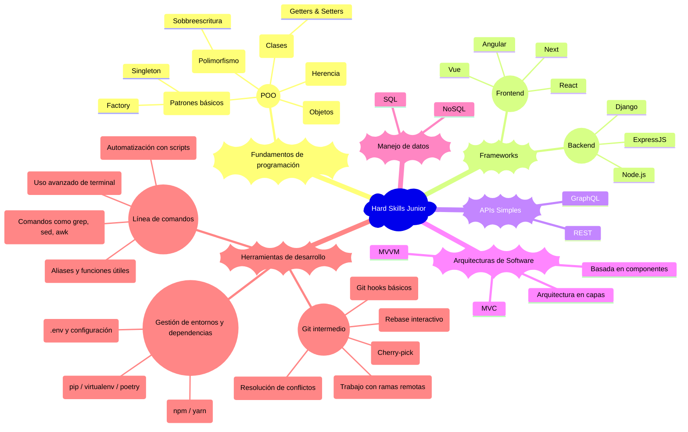
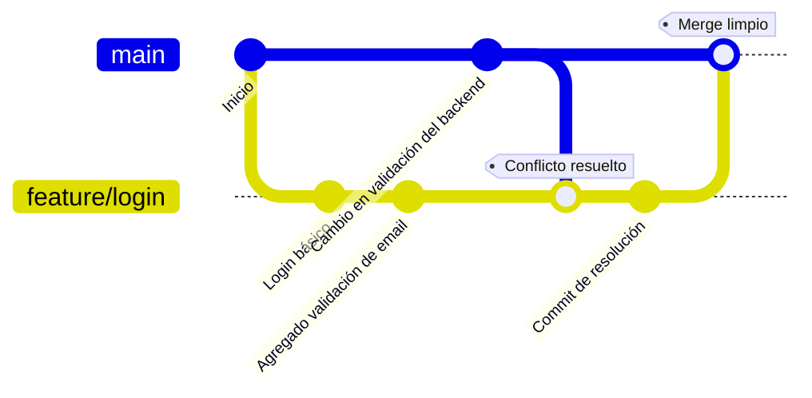
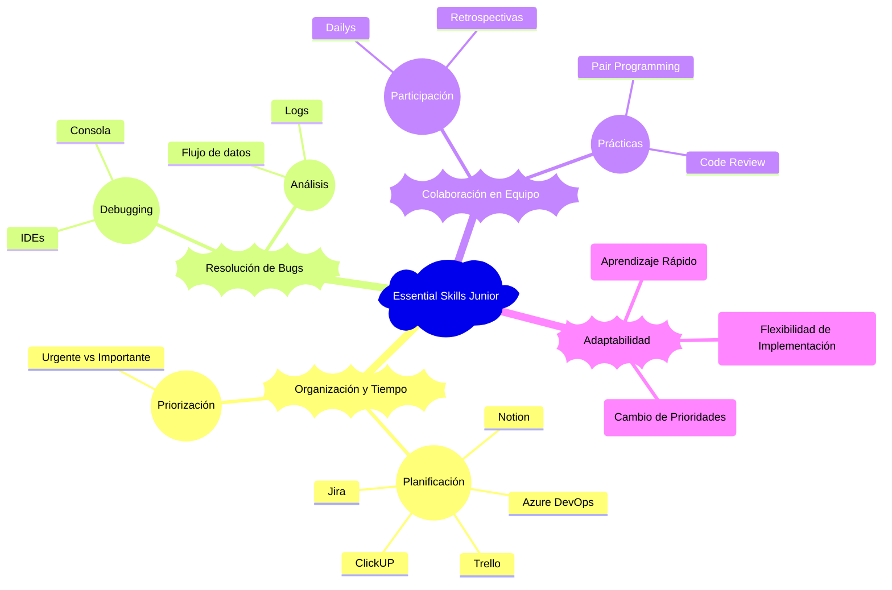
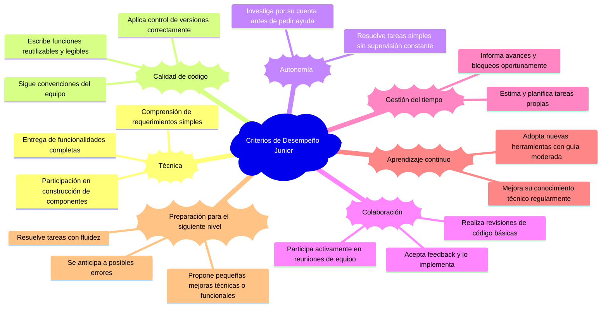

# Desarrollador Junior (Frontend / Backend / Fullstack)

El Desarrollador Junior es un rol fundamental en el inicio de la vida profesional en tecnología. Implica la transición de aprendiz a profesional capaz de entregar valor de manera consistente bajo la guía de compañeros más experimentados.

## 🔧 Hard Skills

El desarrollador junior ha superado la etapa de [aprendizaje básico](./intern.md) y ahora aplica conocimientos fundamentales para construir soluciones funcionales en entornos de desarrollo reales. Esta sección detalla las competencias técnicas clave organizadas por área.



### Fundamentos de programación

Los fundamentos de programación para un desarrollador junior se enfocan en aplicar conceptos avanzados como la programación orientada a objetos, patrones básicos de diseño y manejo de excepciones, consolidando las bases adquiridas como [practicante](intern.md) para resolver problemas más complejos y construir soluciones escalables.

#### Programación orientada a objetos (POO)

La [POO](/others/glossary.md#p) permite estructurar el código de forma modular, reutilizable y fácil de mantener. Es un enfoque clave en el desarrollo profesional.

##### 📚 Clases

**Descripción:** Una clase es una plantilla o modelo que define las porpiedades (atributos) y comportamientos (métodos) que los objetos creados a partir de ella tendrán.

**Escenario de uso:** Se usan clases cuando necesitamos crear múltiples objetos que comparten las mismas características, pero cuyos datos pueden variar. Ejemplos típicos: Usuario en un sistema, Producto en un catálogo, etc.

###### Ejemplo Clases

````javascript
class Usuario {
  constructor(nombre, email) {
    this.nombre = nombre;
    this.email = email;
  }

  saludar() {
    console.log(`Hola, soy ${this.nombre}`);
  }

  actualizarEmail(nuevoEmail) {
    this.email = nuevoEmail;
  }
}

// Crear un usuario
const usuario1 = new Usuario('Ana', 'ana@email.com');
usuario1.saludar(); // Hola, soy Ana
````

```python
class Usuario:
  def __init__(self, nombre, email):
    self.nombre = nombre
    self.email = email

  def saludar(self):
    print(f"Hola, soy {self.nombre}")

  def actualizar_email(self, nuevo_email):
    self.email = nuevo_email

# Crear un usuario
usuario1 = Usuario('Ana', 'ana@email.com')
usuario1.saludar() # Hola, soy Ana
```

##### 🍱 Getters & Setters

**Descripción:** Métodos para acceder o modificar atributos privados de forma controlada.

**Escenario de uso:** Proteger acceso a variables internas como contraseñas o configuraciones.

###### Ejemplo getters & setters

```javascript
class Configuracion {
  constructor() {
    this._modo = 'producción';
  }

  get modo() {
    return this._modo;
  }

  set modo(nuevoModo) {
    if (nuevoModo === 'dev' || nuevoModo === 'producción') {
      this._modo = nuevoModo;
    }
  }
}
```

```python
class Configuracion:
  def __init__(self):
    self._modo = 'producción'

  @property
  def modo(self):
    return self._modo

  @modo.setter
  def modo(self, nuevo_modo):
    if nuevo_modo in ['dev', 'producción']:
      self._modo = nuevo_modo
```

##### 📦 Objetos

**Descripción:** Un objeto es una instancia de una clase. Es una entidad concreta que contiene datos (atributos) y comportamiento (métodos) definidos en la clase.

**Escenario de uso:** Cada vez que requerimos representar una entidad específica con datos reales en un sistema: un cliente en un [CRM](/others/glossary.md#c), un producto en una tienda online, una tarea en un sistema de gestión.

###### Ejemplo Objetos

Siguiendo el [ejemplo de clases](#ejemplo-clases), `usuario1` es un objeto creado a partir de la clase `Usuario`.

```javascript
const usuario2 = new Usuario('Carlos', 'carlos@email.com');
usuario2.saludar(); // Hola, soy Carlos
```

```python
# Crear un usuario
usuario1 = Usuario('Ana', 'ana@email.com')
usuario1.saludar() # Hola, soy Ana
```

##### 🧬 Herencia

**Descripción:** La herencia permite que una clase derive (herede) propiedades y métodos de otra clase existente. Ayuda a reutilizar código y construir jerarquías lógicas.

**Escenario de uso:** Cuando tenemos una relación "es un tipo de" entre clases. Ejemplo: Un `Administrador` es un tipo de `Usuario` pero con permisos adicionales.

###### Ejemplo Herencia

```javascript
class Administrador extends Usuario{
  constructor(nombre, email, permisos) {
    super(nombre, email); // Llama al constructor de Usuario
    this.permisos = permisos;
  }

  mostrarPermisos() {
    console.log(`${this.nombre} tiene permisos: ${this.permisos.join(', ')}`);
  }
}

const admin = new Administrador('Luis', 'luis@email.com', ['crear', 'editar', 'eliminar']);
admin.saludar(); // Hola, soy Luis
admin.mostrarPermisos(); // Luis tiene permisos: crear, editar, eliminar
```

```python
class Usuario:
  def __init__(self, nombre):
    self.nombre = nombre

class Administrador(Usuario):
  def borrar_usuario(self):
    pass
```

##### 🧩 Polimorfismo

**Descripción:** El polimorfismo permite que métodos con el mismo nombre se comporten de manera diferente según el objeto que los implemente.

**Escenario de uso:** Cuando diferentes tipos de objeto necesitan responder de manera diferente al mismo mensaje o método.
Ejemplo: Un sistema de pagos donde diferentes métodos (`Tarjeta`, `PayPal`, `Criptomoneda`) implementan un método `procesarPago()` de manera distinta.

###### Ejemplo polimorfismo

```javascript
class Pago {
  procesarPago() {
    console.log('Procesando pago genérico...');
  }
}

class PagoTarjeta extends Pago {
  procesarPago() {
    console.log('Procesando pago con Tarjeta de Crédito.');
  }
}

class PagoPayPal extends Pago {
  procesarPago() {
    console.log('Procesando pago con PayPal.');
  }
}

const pagos = [new PagoTarjeta(), new PagoPayPal()];

pagos.forEach(pago => pago.procesarPago());
// Procesando pago con Tarjeta de Crédito.
// Procesando pago con PayPal.
```

###### 🔁 Sobreescritura de métodos

La **sobreescritura** es una forma específica de polimorfismo en la que una subclase redefine un método que ya existe en su clase base. El método en la subclase debe tener el mismo nombre y firma que el de la superclase.

###### 💡 Ejemplo

```python
class Vehiculo:
    def arrancar(self):
        print("El vehículo arranca.")

class Coche(Vehiculo):
    def arrancar(self):
        print("El coche arranca con llave.")

v = Vehiculo()
v.arrancar()  # El vehículo arranca.

c = Coche()
c.arrancar()  # El coche arranca con llave.
```

###### 🔍 Diferencia entre polimorfismo y sobreescritura

La **sobreescritura** es el mecanismo técnico, mientras que el **polimorfismo** es el principio de diseño que la aprovecha. Es decir, sin sobreescritura, no hay polimorfismo en lenguajes como Python o Java.

##### 🏭 Factory pathern

**Descripción:** Permite crear objetos sin especificar su clase concreta, delegando la lógica de creación a una "fábrica".

**Escenario de uso:** Cuando necesitas crear instancias de diferentes clases que comparten una interfaz común, pero no sabes cuál exactamente hasta tiempo de ejecución. Ejemplo crear diferentes tipos de pago según el método elegido.

###### Ejemplo factory

```javascript
function metodoPagoFactory(tipo) {
  if (tipo === 'tarjeta') return new PagoTarjeta();
  if (tipo === 'paypal') return new PagoPayPal();
}
```

###### Ventajas factory

- Centraliza la lógica de instanciación.
- Facilita la extensión de código.
- Mejora el desacoplamiento.

##### 👤 Singleton pathern

**Descripción:** Restringe la creación de una clase a una sola instancia global accesible en toda la aplicación.

**Escenario de uso:** Cuando necesitas una única fuente de verdad, como en el manejo de configuración, conexión a una base de datos o caché.

###### Ejemplo singleton

```javascript
class Config {
  constructor() {
    if (Config.instance) {
      return Config.instance;
    }
    this.settings = {};
    Config.instance = this;
  }

  set(key, value) {
    this.settings[key] = value;
  }

  get(key) {
    return this.settings[key];
  }
}

const config1 = new Config();
config1.set('tema', 'oscuro');

const config2 = new Config();
console.log(config2.get('tema')); // oscuro
```

###### Ventajas singleton

- Garantiza que una clase tenga solo una instancia.
- Control centralizado del estado.

### Frameworks

En esta etapa, un Desarrollador Junior debe ser capaz de trabajar con al menos uno de los principales frameworks de frontend y/o backend, comprendiendo los fundamentos de la construcción de aplicaciones modulares, mantenibles y escalables. La expectativa no es la maestría absoluta, sino la capacidad de aprender rápido y aplicar buenas prácticas básicas.

<!-- FIXME: Incluir frameworks de windows C#, ASPX, .Net, Core, PHP -->
#### Frontend

Herramientas modernas para construir interfaces dinámicas y componentes reutilizables.

Normalmente se usa en desarrollo de [SPA](/others/glossary.md#s)s (Single Page Aplications) y [PWA](/others/glossary.md#p) (Progressive Web Apps).

##### React

Comprender los fundamentos de React para construir interfaces dinámicas y reutilizables.

- **Componentes funcionales:** Crear componentes básicos utilizando funciones.
- **Props:** Pasar datos entre componentes.
- **Estado:** Manejar datos internos de un componente con `useState`.
- **Hooks básicos:** Uso de `useEffect` para manejar efectos secundarios.

```javascript
import React, { useState, useEffect } from 'react';

function Contador() {
  const [contador, setContador] = useState(0);

  useEffect(() => {
    console.log(`El contador cambió a: ${contador}`);
  }, [contador]);

  return (
    <div>
      <p>Contador: {contador}</p>
      <button onClick={() => setContador(contador + 1)}>Incrementar</button>
    </div>
  );
}

export default Contador;
```

##### Next

Comprender los conceptos básicos de Next.js para constuir aplicaciones web modernas.

- **Páginas**: Crear rutas basadas en el sistema de archivos.
- **Enlace entre páginas**: Uso de `next/link` para navegación.
- **Estilos**: Aplicar estilos con CSS Modules o `styled-jsx`.

```javascript
import Link from 'next/link';

function Home() {
  return (
    <div>
      <h1>Página principal</h1>
      <Link href="/about">
        <a>Ir a la página de About</a>
      </Link>
    </div>
  );
}

export default Home;
```

##### Vue

Comprender los fundamentos de Vue para constuir aplicaciones reactivas y modulares.

- **Componentes**: Crear y estructurar componentes básicos.
- **Directivas**: Usar directivas como `v-bind`, `v-if`, `v-for` y `v-model`.
- **Sistema de binding de datos reactivos**: Manejar datos y eventos con `data` y `methods`.

```html
<template>
  <div>
    <p>Contador: {{ contador }}</p>
    <button @click="incrementar">Incrementar</button>
  </div>
</template>

<script>
  export default {
    data() {
      return {
        contador: 0,
      };
    },
    methods: {
      incrementar() {
        this.contador++;
      },
    },
  };
</script>
```

##### Angular

Comprender los fundamentos de Angular como:

- **Componentes**: Crear y estructurar componentes básicos.
- **Directivas**: Usar directivas estructurales (`*ngIf`, `*ngFor`) y de atributo.

```html
<!-- Cambiar el estilo de un elemento -->
<p [style.color]="'blue'">Este texto es azul</p>

<!-- Cambiar clases dinámicamente -->
<div [class.activo]="esActivo">Contenido</div>

<script>
  export class MiComponente {
    esActivo: boolean = true;
  }
</script>
```
  
- Módulos: Organizar la aplicación en módulos reutilizables.
- Servicios: Implementar servicios básicos para manejar lógica compartida y peticiones HTTP.

#### Backend

Frameworks para construir servicios web y lógica de negocio del lado del servidor.

##### Django

Comprender los fundamentos de Django para construir aplicaciones web robustas y escalables.

- **Modelos:** Crear modelos para representar datos y generar tablas en la base de datos.
- **Vistas:** Implementar vistas para manejar la lógica de negocio.
- **URLs:** Configurar rutas para conectar vistas con [URL](/others/glossary.md#u)s específicas.
- **ORM:** Usar el [ORM](/others/glossary.md#o) de Django para realizar operaciones [CRUD](/others/glossary.md#c) en la base de datos.

```python
from django.db import models
from django.http import HttpResponse
from django.urls import path

# Modelo
class Producto(models.Model):
    nombre = models.CharField(max_length=100)
    precio = models.DecimalField(max_digits=10, decimal_places=2)

# Vista
def lista_productos(request):
    productos = Producto.objects.all()
    return HttpResponse(", ".join([p.nombre for p in productos]))

# URL
urlpatterns = [
    path('productos/', lista_productos),
]
```

##### ExpressJS

Comprender los fundamentos de ExpressJS para construir [API](/others/glossary.md#a)s y servicios web.

- **Rutas**: Definir rutas para manejar solicitudes [HTTP](/others/glossary.md#h).
- **Middlewares**: Usar middlewares básicos para manejar lógica compartida.
- **Controladores**: Implementar controladores para separar la lógica de negocio.
- **Manejo de errores**: Configurar middlewares para manejar errores.

```javascript
const express = require('express');
const app = express();

// Middleware
app.use(express.json());

// Rutas
app.get('/productos', (req, res) => {
  res.send('Lista de productos');
});

// Manejo de errores
app.use((err, req, res, next) => {
  console.error(err.stack);
  res.status(500).send('Error en el servidor');
});

// Iniciar servidor
app.listen(3000, () => {
  console.log('Servidor corriendo en el puerto 3000');
});
```

##### Node.js

Comprender el modelo asíncrono y basado en eventos de Node.js para construir aplicaciones backend.

- **Módulos**: Usar módulos nativos como `fs` y `http`.
- **Eventos**: Manejar eventos con el módulo `events`.
- **Promesas y async/await**: Trabajar con operaciones asíncronas.
- **Creación de servidores**: Crear servidores básicos con el módulo `http`.

```javascript
const http = require('http');

// Crear servidor
const server = http.createServer((req, res) => {
  res.statusCode = 200;
  res.setHeader('Content-Type', 'text/plain');
  res.end('Hola, mundo');
});

// Iniciar servidor
server.listen(3000, () => {
  console.log('Servidor corriendo en el puerto 3000');
});
```

### Construcción de APIs simples

- Diseñar endpoints RESTful simples para operaciones CRUD (GET, POST, PUT, DELETE).
- Implementar manejo básico de errores en las respuestas.
- Probar y depurar APIs usando herramientas como Postman o Insomnia.

```javascript
const express = require('express');
const app = express();
app.use(express.json());

// Endpoint GET
app.get('/productos', (req, res) => {
  res.json([{ id: 1, nombre: 'Producto 1' }]);
});

// Endpoint POST
app.post('/productos', (req, res) => {
  const nuevoProducto = req.body;
  res.status(201).json(nuevoProducto);
});

// Manejo básico de errores
app.use((err, req, res, next) => {
  console.error(err.stack);
  res.status(500).send('Error en el servidor');
});

app.listen(3000, () => {
  console.log('Servidor corriendo en el puerto 3000');
});
```

### Arquitecturas de software

Estructuras organizativas para separar responsabilidades del código.

#### MVC (Modelo-Vista-Controlador)

Ejemplo:

- Modelo: manejo de datos
- Vista: interfaz de usuario
- Controlador: lógica de interacción

#### MVVM (Model-View-ViewModel)

[MVVM](https://es.wikipedia.org/wiki/Modelo%E2%80%93vista%E2%80%93modelo_de_vista) Es un patrón de arquitectura de software. Se caracteriza por tratar de desacoplar lo máximo posible la interfaz de usuario de la lógica de la aplicación.

Ejemplo: Angular con `ngModel` enlazado a componentes.

##### Arquitectura en capas

Capas: Presentación, lógica de negocio, acceso a datos.

##### Basada en componentes

Ejemplo: Cada componente React representa una parte de la [UI](/others/glossary.md#u) reutilizable.

### Manejo de datos

El conocimiento de bases de datos permite a un Junior crear aplicaciones dinámicas que almacenan y procesan información.

- Modelado de datos simple: tablas, relaciones 1:N, 1:1
- Consultas básicas en SQL (SELECT, INSERT, UPDATE, DELETE).
- Introducción a bases de datos NoSQL como MongoDB.

#### SQL

Ejemplo: `SELECT * FROM usuarios WHERE edad > 30`

#### NoSQL

Ejemplo: MongoDB con `db.usuarios.find({ edad: { $gt: 30 } })`

### Herramientas de desarrollo

En esta etapa, el desarrollador junior debe ampliar su dominio técnico con herramientas que le permitan trabajar de forma más eficiente, automatizar tareas comunes y gestionar entornos de desarrollo complejos. Aquí se documentan los principales conocimientos esperados:

#### Git intermedio

El uso de Git va más allá de los comandos básicos. Un desarrollador junior debe poder mantener un historial de commits limpio, resolver conflictos y manejar ramas de manera eficiente en colaboración con su equipo.

##### Flujo de trabajo con Git intermedio

A continuación se representa un flujo común en el que un desarrollador junior colabora con un equipo, gestionando ramas, resolviendo conflictos y dejando un historial limpio antes de hacer `merge`.



###### Descripción del flujo

1. Se crea una nueva rama `feature/login` desde `main`.
2. Se desarrollan varias funcionalidades en esa rama.
3. Mientras tanto, se hacen cambios en `main` que afectan archivos comunes.
4. Se hace `merge main` dentro de `feature/login` para incorporar los cambios recientes y resolver cualquier conflicto antes de subir los cambios.
5. Una vez resuelto el conflicto, se finaliza el desarrollo y se hace `merge` limpio a `main`.

Este flujo promueve la integración continua sin sobrescribir trabajo de otros compañeros, facilita la resolución temprana de conflictos y asegura que `main` se mantenga en un estado estable.

##### Escenarios de uso

- Resolver conflictos de merge cuando varios colaboradores editan el mismo archivo.
- Limpiar el historial de commits antes de hacer un pull request con `rebase interactivo`.
- Aplicar cambios específicos de otra rama con `cherry-pick`.
- Usar `git stash` para guardar trabajo temporal antes de cambiar de rama.
- Automatizar tareas con *git hooks* como validar commits o ejecutar pruebas.

##### Ejemplo: uso de `rebase interactivo` para limpiar historial

```bash
git rebase -i HEAD~3
```

Esto permite combinar, editar o eliminar los últimos tres commits antes de subirlos a una rama remota.

---

#### Gestión de entornos y dependencias

Trabajar en equipo implica gestionar entornos reproducibles y evitar conflictos de versiones. Un junior debe manejar herramientas para definir y aislar dependencias del proyecto.

##### Herramientas comunes

- `npm`, `yarn` (JavaScript): para instalar y versionar paquetes.
- `pip`, `virtualenv`, `poetry` (Python): para aislar entornos y controlar versiones.
- Archivos `.env`: para definir variables sensibles como claves o rutas sin exponerlas en el código.

##### Ejemplo: instalación y uso de `dotenv` en Node.js

```bash
npm install dotenv
```

```javascript
// archivo index.js
require('dotenv').config();
console.log(process.env.SECRET_KEY);
```

#### Línea de comandos

El terminal sigue siendo una herramienta poderosa. Un desarrollador junior debería saber automatizar tareas, navegar el sistema de archivos con agilidad y emplear utilidades avanzadas de [Unix](/others/glossary.md#u).

##### Habilidades esperadas

- Crear y ejecutar scripts simples de automatización (`bash`, `sh`).
- Crear alias para comandos frecuentes.
- Usar herramientas como `grep`, `awk`, `sed`, `xargs` para manipulación de texto.
- Conocer `curl` o `wget` para pruebas de [API](/others/glossary.md#a) desde terminal.

Ejemplo: buscar una palabra en múltiples archivos

```perl
grep -rnw './src' -e 'password'
```

Esto busca la palabra "password" recursivamente en todos los archivos dentro de la carpeta `src`.

## 🧠 Essential Skills

Los essential skills de un desarrollador junior reflejan su madurez profesional, capacidad de integrarse efectivamente a un equipo y adaptarse a entornos técnicos cambiantes. Aunque ya cuenta con experiencia práctica, aún está en proceso de fortalecer hábitos clave como la autonomía, la comunicación efectiva y la colaboración estructurada.



### Organización y Tiempo

El desarrollador junior debe comenzar a manejar de forma eficiente su tiempo, tareas y prioridades, usando herramientas colaborativas que reflejen su avance en proyectos.

#### Planificación

El uso de herramientas para la gestión de tareas permite trabajar de forma ordenada, visualizar el progreso y cumplir compromisos del equipo técnico.

- **Jira**: Estándar en equipos ágiles para el manejo de sprints, tareas, bugs y backlogs.
- **Trello**: Kanban simple e intuitivo ideal para seguimiento personal y de pequeños equipos.
- **Azure DevOps**: Integración con repositorios, pipelines y tableros ágiles en proyectos Microsoft.
- **ClickUP**: Herramienta completa para planificación personal y de equipo.
- **Notion**: Versátil para documentar, planificar y registrar avances.

#### Priorización

Conforme crece la carga de trabajo, es vital entender qué tareas tienen mayor impacto.

- **Urgente vs Importante**: Técnica básica para diferenciar entre lo que necesita atención inmediata y lo que tiene un valor estratégico a mediano plazo.

### Resolución de Bugs

Se espera que el desarrollador junior pueda identificar errores en el código y comprender su origen sin depender exclusivamente del líder técnico.

#### Debugging

- **[IDE](/others/glossary.md#i)s**: Domina las funciones básicas de depuración como breakpoints, inspección de variables y paso a paso (step into/out).
- **Consola**: Capacidad de imprimir valores, rastrear el flujo y observar outputs inesperados.

#### Análisis

- **Logs**: Lectura e interpretación de registros de errores o trazas del sistema.
- **Flujo de datos**: Comprender cómo los datos viajan entre capas del sistema ayuda a encontrar errores en procesos asincrónicos, [API](/others/glossary.md#a)s o formularios.

### Colaboración en Equipo

La interacción diaria con el equipo de desarrollo es fundamental para el crecimiento del rol junior.

#### Participación

- **Dailys**: Presenta avances y obstáculos de forma clara y breve.
- **Retrospectivas**: Aporta observaciones útiles sobre lo que funcionó y lo que puede mejorar.

#### Prácticas

- **Pair Programming**: Trabajar con un compañero ayuda a nivelar conocimientos y mejorar el enfoque de resolución.
- **Code Review**: Recibir y dar feedback sobre código fortalece la calidad técnica del equipo.

### Adaptabilidad

El entorno técnico cambia con frecuencia, por lo que se espera que el junior reaccione positivamente a nuevas condiciones.

- **Aprendizaje Rápido**: Capacidad de aprender herramientas o librerías con documentación oficial y ejemplo prácticos.
- **Flexibilidad de Implementación**: Disposición para cambiar una solución técnica cuando se propone una mejor.
- **Cambio de Prioridades**: Ser capaz de retomar una tarea pausada, reordenar pendientes o asumir nuevos objetivos sin frustración.

## ✅ Criterios de Desempeño (Junior Developer)

Un desarrollador junior no solo debe cumplir técnicamente con las tareas asignadas, sino también demostrar evolución en su forma de colaborar, aprender y adaptarse a los entornos de desarrollo reales. Estos criterios permiten evaluar su madurez profesional, y sirven como guía para su crecimiento hacia el siguiente nivel: **[Ssr Engineer](./mid-developer.md) (Semi-Senior)**.

A continuación, se presentan los principales criterios de evaluación, junto con un mapa mental para visualizar el alcance esperado de este rol.



### Técnica

El desarrollador junior demuestra capacidad para desarrollar funcionalidades de principio a fin, interpretando requerimientos definidos con claridad. Aporta soluciones a problemas típicos del negocio sin necesidad de rediseñar la arquitectura ni abordar casos complejos.

- **Entrega de funcionalidades completas**: Participa en la implementación de nuevas vistas, controladores o servicios, cumpliendo con criterios de aceptación definidos.
- **Comprensión de requerimientos simples**: Interpreta historias de usuario o tareas de Jira, detecta qué se espera del resultado final.
- **Participación en construcción de componentes**: Puede trabajar en componentes frontend reutilizables o endpoints backend estandarizados.

### Calidad de código

No solo escribe código que "funciona", sino que se alinea con los estilos y convenciones del equipo, mejorando su legibilidad y mantenibilidad.

- **Sigue convenciones del equipo**: Respeta el formato de nombres, comentarios, estructura de carpetas y tipos de archivos definidos por el equipo.
- **Escribe funciones reutilizables y legibles**: Prefiere funciones pequeñas, claras y con nombres descriptivos.
- **Aplica control de versiones correctamente**: Crea ramas propias, realiza commits claros, actualiza su rama base y participa en el flujo Git del equipo.

### Autonomía

Un junior debe comenzar a resolver problemas básicos sin requerir supervisión constante, demostrando iniciativa y compromiso con sus tareas.

- **Resuelve tareas simples sin supervisión constante**: Identifica, implementa y prueba su propia solución siguiendo criterios definidos.
- **Investiga por su cuenta antes de pedir ayuda**: Busca documentación oficial, foros o ejemplos de código antes de escalar dudas.

### Colaboración

El trabajo en equipo es esencial. Se espera que el junior tenga comunicación fluida, sepa colaborar activamente y comparta conocimiento.

- **Participa activamente en reuniones de equipo**: Habla sobre su progreso en dailys y muestra apertura en retrospectivas.
- **Acepta feedback y lo implementa**: Aplica los comentarios del equipo de forma constructiva.
- **Realiza revisiones de código básicas**: Puede revisar código de pares, detectar errores simples o sugerir mejoras menores.

### Gestión del tiempo

A medida que adquiere experiencia, debe aprender a organizar su trabajo, estimar tiempos y reportar impedimentos sin necesidad de seguimiento constante.

- **Estima y planifica tareas propias**: Puede dividir tareas complejas en subtareas manejables.
- **Informa avances y bloqueos oportunamente**: Actualiza tareas en el sistema de gestión y no retrasa al equipo por falta de comunicación.

### Aprendizaje continuo

Mantiene una actitud proactiva para aprender tecnologías, patrones de diseño o buenas prácticas relevantes para su stack y entorno de trabajo.

- **Mejora su conocimiento técnico regularmente**: Realiza cursos, sigue tutoriales o consulta documentación oficial.
- **Adopta nuevas herramientas con guía moderada**: Se adapta a herramientas de testing, integración continua o despliegue automatizado.

### Preparación para el siguiente nivel: [Ssr Engineer](./mid-developer.md)

Cuando un desarrollador junior logra realizar sus tareas de forma **natural y fluida**, con **mínimo acompañamiento**, y demuestra capacidad de análisis, colaboración, anticipación de errores y propuestas de mejora, está listo para **ascender a Semi-Senior**.

- **Resuelve tareas con fluidez**: Demuestra agilidad y confianza al trabajar sobre funcionalidades conocidas o repetitivas.
- **Se anticipa a posibles errores**: Valida inputs, considera casos extremos y gestiona errores comunes sin que se lo soliciten.
- **Propone pequeñas mejoras técnicas o funcionales**: Identifica oportunidades para refactorizar código, mejorar flujos o optimizar la experiencia del usuario.

---

[Intern](./intern.md) | [⬆️](/knowledge.md#2-desarrollador-junior-frontend--backend--fullstack) | [SSr Engineer](./ssr-engineer.md)

<!-- TODO: Agregar
# Junior Developer

## 🔧 Hard Skills

- Fundamentos de Programación Orientada a Objetos
  - Clases, objetos, herencia, polimorfismo
  - Diferencia entre polimorfismo y sobreescritura
- Uso básico de Git y flujos de trabajo
- Consumo de APIs REST y GraphQL (nivel básico)
- Frameworks iniciales (React, Angular, Vue)
- Arquitecturas comunes: MVC, MVVM, arquitectura en capas
- Uso de SQL y NoSQL básico
- Manejo básico de herramientas como GitHub, GitLab
- Consola de comandos básica

## 🧠 Essential Skills

- Organización personal con herramientas como Trello, Notion, Jira
- Participación en ceremonias ágiles: dailys, retros
- Resolución de bugs con herramientas básicas (consola, logs)
- Adaptabilidad: aprendizaje rápido y respuesta a cambios

## ✅ Criterios de Desempeño

- Ejecuta tareas básicas con supervisión.
- Aprende activamente del feedback.
- Comprende flujos de trabajo del equipo.
- Colabora en tareas colectivas como code reviews.
- Cuando todo lo anterior se realiza con naturalidad y autonomía → listo para el nivel SSr.

## 🧪 Conceptos técnicos típicos

- CSS anidado (nativo y SASS)
- Bootstrap: grillas, clases, layout
- Desestructuración básica de arrays y objetos
- Mutabilidad vs inmutabilidad
- `sessionStorage` y `localStorage`
- Promesas con `.then()` y `.catch()`
- React: `useState`, `useEffect`
- Angular: `ngIf`, `ngFor`, pipes simples (`date`, `currency`)

---
 -->