# Desarrollador Junior (Frontend / Backend / Fullstack)

El Desarrollador Junior es un rol fundamental en el inicio de la vida profesional en tecnología. Implica la transición de aprendiz a profesional capaz de entregar valor de manera consistente bajo la guía de compañeros más experimentados.

## 🔧 Hard Skills

El desarrollador junior ha superado la etapa de [aprendizaje básico](./intern.md) y ahora aplica conocimientos fundamentales para construir soluciones funcionales en entornos de desarrollo reales. Esta sección detalla las competencias técnicas clave organizadas por área.

```mermaid
mindmap
  root)Hard Skills Junior((
    ))Fundamentos de programación((
      ((POO))
        (Clases)
          Getters & Setters
        (Objetos)
        (Herencia)
        (Polimorfismo)
        (Patrones básicos)
          Factory
          Singleton
    ))Frameworks((
      ((Frontend))
        React
        Angular
        Vue
        Next
      ((Backend))
        Django
        ExpressJS
        Node.js
    ))APIs Simples((
      REST
      GraphQL
    ))Arquitecturas de Software((
      MVC
      MVVM
      Arquitectura en capas
      Basada en componentes
    ))Manejo de datos((
      SQL
      NoSQL
    ))Herramientas de desarrollo((
      ((Git intermedio))
        (Resolución de conflictos)
        (Rebase interactivo)
        (Cherry-pick)
        (Trabajo con ramas remotas)
        (Git hooks básicos)
      ((Gestión de entornos y dependencias))
        (npm / yarn)
        (pip / virtualenv / poetry)
        (.env y configuración)
      ((Línea de comandos))
        (Uso avanzado de terminal)
        (Automatización con scripts)
        (Aliases y funciones útiles)
        (Comandos como grep, sed, awk)
```



### Fundamentos de programación

Los fundamentos de programación para un desarrollador junior se enfocan en aplicar conceptos avanzados como la programación orientada a objetos, patrones básicos de diseño y manejo de excepciones, consolidando las bases adquiridas como [practicante](intern.md) para resolver problemas más complejos y construir soluciones escalables.

#### Programación orientada a objetos (POO)

La [POO](/others/glossary.md#p) permite estructurar el código de forma modular, reutilizable y fácil de mantener. Es un enfoque clave en el desarrollo profesional.

##### 📚 Clases

**Descripción:** Una clase es una plantilla o modelo que define las porpiedades (atributos) y comportamientos (métodos) que los objetos creados a partir de ella tendrán.

**Escenario de uso:** Se usan clases cuando necesitamos crear múltiples objetos que comparten las mismas características, pero cuyos datos pueden variar. Ejemplos típicos: Usuario en un sistema, Producto en un catálogo, etc.

###### Ejemplo Clases

````javascript
class Usuario {
  constructor(nombre, email) {
    this.nombre = nombre;
    this.email = email;
  }

  saludar() {
    console.log(`Hola, soy ${this.nombre}`);
  }

  actualizarEmail(nuevoEmail) {
    this.email = nuevoEmail;
  }
}

// Crear un usuario
const usuario1 = new Usuario('Ana', 'ana@email.com');
usuario1.saludar(); // Hola, soy Ana
````

```python
class Usuario:
  def __init__(self, nombre, email):
    self.nombre = nombre
    self.email = email

  def saludar(self):
    print(f"Hola, soy {self.nombre}")

  def actualizar_email(self, nuevo_email):
    self.email = nuevo_email

# Crear un usuario
usuario1 = Usuario('Ana', 'ana@email.com')
usuario1.saludar() # Hola, soy Ana
```

##### 🍱 Getters & Setters

**Descripción:** Métodos para acceder o modificar atributos privados de forma controlada.

**Escenario de uso:** Proteger acceso a variables internas como contraseñas o configuraciones.

###### Ejemplo getters & setters

```javascript
class Configuracion {
  constructor() {
    this._modo = 'producción';
  }

  get modo() {
    return this._modo;
  }

  set modo(nuevoModo) {
    if (nuevoModo === 'dev' || nuevoModo === 'producción') {
      this._modo = nuevoModo;
    }
  }
}
```

```python
class Configuracion:
  def __init__(self):
    self._modo = 'producción'

  @property
  def modo(self):
    return self._modo

  @modo.setter
  def modo(self, nuevo_modo):
    if nuevo_modo in ['dev', 'producción']:
      self._modo = nuevo_modo
```

##### 📦 Objetos

**Descripción:** Un objeto es una instancia de una clase. Es una entidad concreta que contiene datos (atributos) y comportamiento (métodos) definidos en la clase.

**Escenario de uso:** Cada vez que requerimos representar una entidad específica con datos reales en un sistema: un cliente en un [CRM](/others/glossary.md#c), un producto en una tienda online, una tarea en un sistema de gestión.

###### Ejemplo Objetos

Siguiendo el [ejemplo de clases](#ejemplo-clases), `usuario1` es un objeto creado a partir de la clase `Usuario`.

```javascript
const usuario2 = new Usuario('Carlos', 'carlos@email.com');
usuario2.saludar(); // Hola, soy Carlos
```

```python
# Crear un usuario
usuario1 = Usuario('Ana', 'ana@email.com')
usuario1.saludar() # Hola, soy Ana
```

##### 🧬 Herencia

**Descripción:** La herencia permite que una clase derive (herede) propiedades y métodos de otra clase existente. Ayuda a reutilizar código y construir jerarquías lógicas.

**Escenario de uso:** Cuando tenemos una relación "es un tipo de" entre clases. Ejemplo: Un `Administrador` es un tipo de `Usuario` pero con permisos adicionales.

###### Ejemplo Herencia

```javascript
class Administrador extends Usuario{
  constructor(nombre, email, permisos) {
    super(nombre, email); // Llama al constructor de Usuario
    this.permisos = permisos;
  }

  mostrarPermisos() {
    console.log(`${this.nombre} tiene permisos: ${this.permisos.join(', ')}`);
  }
}

const admin = new Administrador('Luis', 'luis@email.com', ['crear', 'editar', 'eliminar']);
admin.saludar(); // Hola, soy Luis
admin.mostrarPermisos(); // Luis tiene permisos: crear, editar, eliminar
```

```python
class Usuario:
  def __init__(self, nombre):
    self.nombre = nombre

class Administrador(Usuario):
  def borrar_usuario(self):
    pass
```

<!-- FIXME: Duda entre polimorfismo y sobreescritura -->
##### 🧩 Polimorfismo

**Descripción:** El polimorfismo permite que métodos con el mismo nombre se comporten de manera diferente según el objeto que los implemente.

**Escenario de uso:** Cuando diferentes tipos de objeto necesitan responder de manera diferente al mismo mensaje o método.
Ejemplo: Un sistema de pagos donde diferentes métodos (`Tarjeta`, `PayPal`, `Criptomoneda`) implementan un método `procesarPago()` de manera distinta.

###### Ejemplo polimorfismo

```javascript
class Pago {
  procesarPago() {
    console.log('Procesando pago genérico...');
  }
}

class PagoTarjeta extends Pago {
  procesarPago() {
    console.log('Procesando pago con Tarjeta de Crédito.');
  }
}

class PagoPayPal extends Pago {
  procesarPago() {
    console.log('Procesando pago con PayPal.');
  }
}

const pagos = [new PagoTarjeta(), new PagoPayPal()];

pagos.forEach(pago => pago.procesarPago());
// Procesando pago con Tarjeta de Crédito.
// Procesando pago con PayPal.
```

##### 🏭 Factory pathern

**Descripción:** Permite crear objetos sin especificar su clase concreta, delegando la lógica de creación a una "fábrica".

**Escenario de uso:** Cuando necesitas crear instancias de diferentes clases que comparten una interfaz común, pero no sabes cuál exactamente hasta tiempo de ejecución. Ejemplo crear diferentes tipos de pago según el método elegido.

###### Ejemplo factory

```javascript
function metodoPagoFactory(tipo) {
  if (tipo === 'tarjeta') return new PagoTarjeta();
  if (tipo === 'paypal') return new PagoPayPal();
}
```

###### Ventajas factory

- Centraliza la lógica de instanciación.
- Facilita la extensión de código.
- Mejora el desacoplamiento.

##### 👤 Singleton pathern

**Descripción:** Restringe la creación de una clase a una sola instancia global accesible en toda la aplicación.

**Escenario de uso:** Cuando necesitas una única fuente de verdad, como en el manejo de configuración, conexión a una base de datos o caché.

###### Ejemplo singleton

```javascript
class Config {
  constructor() {
    if (Config.instance) {
      return Config.instance;
    }
    this.settings = {};
    Config.instance = this;
  }

  set(key, value) {
    this.settings[key] = value;
  }

  get(key) {
    return this.settings[key];
  }
}

const config1 = new Config();
config1.set('tema', 'oscuro');

const config2 = new Config();
console.log(config2.get('tema')); // oscuro
```

###### Ventajas singleton

- Garantiza que una clase tenga solo una instancia.
- Control centralizado del estado.

### Frameworks

En esta etapa, un Desarrollador Junior debe ser capaz de trabajar con al menos uno de los principales frameworks de frontend y/o backend, comprendiendo los fundamentos de la construcción de aplicaciones modulares, mantenibles y escalables. La expectativa no es la maestría absoluta, sino la capacidad de aprender rápido y aplicar buenas prácticas básicas.

<!-- FIXME: Incluir frameworks de windows C#, ASPX, .Net, Core, PHP -->
#### Frontend

Herramientas modernas para construir interfaces dinámicas y componentes reutilizables.

Normalmente se usa en desarrollo de [SPA](/others/glossary.md#s)s (Single Page Aplications) y [PWA](/others/glossary.md#p) (Progressive Web Apps).

##### React

Comprender los fundamentos de React para construir interfaces dinámicas y reutilizables.

- **Componentes funcionales:** Crear componentes básicos utilizando funciones.
- **Props:** Pasar datos entre componentes.
- **Estado:** Manejar datos internos de un componente con `useState`.
- **Hooks básicos:** Uso de `useEffect` para manejar efectos secundarios.

```javascript
import React, { useState, useEffect } from 'react';

function Contador() {
  const [contador, setContador] = useState(0);

  useEffect(() => {
    console.log(`El contador cambió a: ${contador}`);
  }, [contador]);

  return (
    <div>
      <p>Contador: {contador}</p>
      <button onClick={() => setContador(contador + 1)}>Incrementar</button>
    </div>
  );
}

export default Contador;
```

##### Next

Comprender los conceptos básicos de Next.js para constuir aplicaciones web modernas.

- **Páginas**: Crear rutas basadas en el sistema de archivos.
- **Enlace entre páginas**: Uso de `next/link` para navegación.
- **Estilos**: Aplicar estilos con CSS Modules o `styled-jsx`.

```javascript
import Link from 'next/link';

function Home() {
  return (
    <div>
      <h1>Página principal</h1>
      <Link href="/about">
        <a>Ir a la página de About</a>
      </Link>
    </div>
  );
}

export default Home;
```

##### Vue

Comprender los fundamentos de Vue para constuir aplicaciones reactivas y modulares.

- **Componentes**: Crear y estructurar componentes básicos.
- **Directivas**: Usar directivas como `v-bind`, `v-if`, `v-for` y `v-model`.
- **Sistema de binding de datos reactivos**: Manejar datos y eventos con `data` y `methods`.

```html
<template>
  <div>
    <p>Contador: {{ contador }}</p>
    <button @click="incrementar">Incrementar</button>
  </div>
</template>

<script>
  export default {
    data() {
      return {
        contador: 0,
      };
    },
    methods: {
      incrementar() {
        this.contador++;
      },
    },
  };
</script>
```

##### Angular

Comprender los fundamentos de Angular como:

- **Componentes**: Crear y estructurar componentes básicos.
- **Directivas**: Usar directivas estructurales (`*ngIf`, `*ngFor`) y de atributo.

```html
<!-- Cambiar el estilo de un elemento -->
<p [style.color]="'blue'">Este texto es azul</p>

<!-- Cambiar clases dinámicamente -->
<div [class.activo]="esActivo">Contenido</div>

<script>
  export class MiComponente {
    esActivo: boolean = true;
  }
</script>
```
  
- Módulos: Organizar la aplicación en módulos reutilizables.
- Servicios: Implementar servicios básicos para manejar lógica compartida y peticiones HTTP.
<!-- FIXME: Para el desarrollador semi-senior

##### - Angular: exposición inicial a [RxJS](https://rxjs.dev/) y [NgRx](https://ngrx.io/) para manejar eventos y peticiones asincrónicas.

##### Next.js

Framework basado en React que permite la creación de aplicaciones web con renderizado del lado del servidor (SSR) y generación de sitios estáticos (SSG). Es ideal para mejorar el rendimiento y la optimización SEO.

- **SSR (Server-Side Rendering):** Comprender cómo Next.js genera páginas dinámicas en el servidor antes de enviarlas al cliente.
- **SSG (Static Site Generation):** Aprender a generar páginas estáticas en tiempo de compilación para mejorar el rendimiento.
- **Rutas dinámicas:** Implementar rutas dinámicas para manejar contenido basado en parámetros.
- **API Routes:** Crear endpoints API directamente en el proyecto Next.js para manejar peticiones del backend. -->

#### Backend

Frameworks para construir servicios web y lógica de negocio del lado del servidor.

##### Django

Comprender los fundamentos de Django para construir aplicaciones web robustas y escalables.

- **Modelos:** Crear modelos para representar datos y generar tablas en la base de datos.
- **Vistas:** Implementar vistas para manejar la lógica de negocio.
- **URLs:** Configurar rutas para conectar vistas con [URL](/others/glossary.md#u)s específicas.
- **ORM:** Usar el [ORM](/others/glossary.md#o) de Django para realizar operaciones [CRUD](/others/glossary.md#c) en la base de datos.

```python
from django.db import models
from django.http import HttpResponse
from django.urls import path

# Modelo
class Producto(models.Model):
    nombre = models.CharField(max_length=100)
    precio = models.DecimalField(max_digits=10, decimal_places=2)

# Vista
def lista_productos(request):
    productos = Producto.objects.all()
    return HttpResponse(", ".join([p.nombre for p in productos]))

# URL
urlpatterns = [
    path('productos/', lista_productos),
]
```

##### ExpressJS

Comprender los fundamentos de ExpressJS para construir [API](/others/glossary.md#a)s y servicios web.

- **Rutas**: Definir rutas para manejar solicitudes [HTTP](/others/glossary.md#h).
- **Middlewares**: Usar middlewares básicos para manejar lógica compartida.
- **Controladores**: Implementar controladores para separar la lógica de negocio.
- **Manejo de errores**: Configurar middlewares para manejar errores.

```javascript
const express = require('express');
const app = express();

// Middleware
app.use(express.json());

// Rutas
app.get('/productos', (req, res) => {
  res.send('Lista de productos');
});

// Manejo de errores
app.use((err, req, res, next) => {
  console.error(err.stack);
  res.status(500).send('Error en el servidor');
});

// Iniciar servidor
app.listen(3000, () => {
  console.log('Servidor corriendo en el puerto 3000');
});
```

##### Node.js

Comprender el modelo asíncrono y basado en eventos de Node.js para construir aplicaciones backend.

- **Módulos**: Usar módulos nativos como `fs` y `http`.
- **Eventos**: Manejar eventos con el módulo `events`.
- **Promesas y async/await**: Trabajar con operaciones asíncronas.
- **Creación de servidores**: Crear servidores básicos con el módulo `http`.

```javascript
const http = require('http');

// Crear servidor
const server = http.createServer((req, res) => {
  res.statusCode = 200;
  res.setHeader('Content-Type', 'text/plain');
  res.end('Hola, mundo');
});

// Iniciar servidor
server.listen(3000, () => {
  console.log('Servidor corriendo en el puerto 3000');
});
```

<!-- FIXME: GraphQL es para ssr engineer -->
### Construcción de APIs simples

- Diseñar endpoints RESTful simples para operaciones CRUD (GET, POST, PUT, DELETE).
- Implementar manejo básico de errores en las respuestas.
- Probar y depurar APIs usando herramientas como Postman o Insomnia.

```javascript
const express = require('express');
const app = express();
app.use(express.json());

// Endpoint GET
app.get('/productos', (req, res) => {
  res.json([{ id: 1, nombre: 'Producto 1' }]);
});

// Endpoint POST
app.post('/productos', (req, res) => {
  const nuevoProducto = req.body;
  res.status(201).json(nuevoProducto);
});

// Manejo básico de errores
app.use((err, req, res, next) => {
  console.error(err.stack);
  res.status(500).send('Error en el servidor');
});

app.listen(3000, () => {
  console.log('Servidor corriendo en el puerto 3000');
});
```

### Arquitecturas de software

Estructuras organizativas para separar responsabilidades del código.

#### MVC (Modelo-Vista-Controlador)

Ejemplo:

- Modelo: manejo de datos
- Vista: interfaz de usuario
- Controlador: lógica de interacción

#### MVVM (Model-View-ViewModel)

[MVVM](https://es.wikipedia.org/wiki/Modelo%E2%80%93vista%E2%80%93modelo_de_vista) Es un patrón de arquitectura de software. Se caracteriza por tratar de desacoplar lo máximo posible la interfaz de usuario de la lógica de la aplicación.

Ejemplo: Angular con `ngModel` enlazado a componentes.

##### Arquitectura en capas

Capas: Presentación, lógica de negocio, acceso a datos.

##### Basada en componentes

Ejemplo: Cada componente React representa una parte de la [UI](/others/glossary.md#u) reutilizable.

### Manejo de datos

El conocimiento de bases de datos permite a un Junior crear aplicaciones dinámicas que almacenan y procesan información.

- Modelado de datos simple: tablas, relaciones 1:N, 1:1
- Consultas básicas en SQL (SELECT, INSERT, UPDATE, DELETE).
- Introducción a bases de datos NoSQL como MongoDB.

#### SQL

Ejemplo: `SELECT * FROM usuarios WHERE edad > 30`

#### NoSQL

Ejemplo: MongoDB con `db.usuarios.find({ edad: { $gt: 30 } })`

### Herramientas de desarrollo

En esta etapa, el desarrollador junior debe ampliar su dominio técnico con herramientas que le permitan trabajar de forma más eficiente, automatizar tareas comunes y gestionar entornos de desarrollo complejos. Aquí se documentan los principales conocimientos esperados:

#### Git intermedio

El uso de Git va más allá de los comandos básicos. Un desarrollador junior debe poder mantener un historial de commits limpio, resolver conflictos y manejar ramas de manera eficiente en colaboración con su equipo.

##### Flujo de trabajo con Git intermedio

A continuación se representa un flujo común en el que un desarrollador junior colabora con un equipo, gestionando ramas, resolviendo conflictos y dejando un historial limpio antes de hacer `merge`.

```mermaid
gitGraph
   commit id: "Inicio"
   branch feature/login
   checkout feature/login
   commit id: "Login básico"
   commit id: "Agregado validación de email"
   checkout main
   commit id: "Cambio en validación del backend"
   checkout feature/login
   merge main tag: "Conflicto resuelto"
   commit id: "Commit de resolución"
   checkout main
   merge feature/login tag: "Merge limpio"
```



###### Descripción del flujo

1. Se crea una nueva rama `feature/login` desde `main`.
2. Se desarrollan varias funcionalidades en esa rama.
3. Mientras tanto, se hacen cambios en `main` que afectan archivos comunes.
4. Se hace `merge main` dentro de `feature/login` para incorporar los cambios recientes y resolver cualquier conflicto antes de subir los cambios.
5. Una vez resuelto el conflicto, se finaliza el desarrollo y se hace `merge` limpio a `main`.

Este flujo promueve la integración continua sin sobrescribir trabajo de otros compañeros, facilita la resolución temprana de conflictos y asegura que `main` se mantenga en un estado estable.

##### Escenarios de uso

- Resolver conflictos de merge cuando varios colaboradores editan el mismo archivo.
- Limpiar el historial de commits antes de hacer un pull request con `rebase interactivo`.
- Aplicar cambios específicos de otra rama con `cherry-pick`.
- Usar `git stash` para guardar trabajo temporal antes de cambiar de rama.
- Automatizar tareas con *git hooks* como validar commits o ejecutar pruebas.

##### Ejemplo: uso de `rebase interactivo` para limpiar historial

```bash
git rebase -i HEAD~3
```

Esto permite combinar, editar o eliminar los últimos tres commits antes de subirlos a una rama remota.

---

#### Gestión de entornos y dependencias

Trabajar en equipo implica gestionar entornos reproducibles y evitar conflictos de versiones. Un junior debe manejar herramientas para definir y aislar dependencias del proyecto.

##### Herramientas comunes

- `npm`, `yarn` (JavaScript): para instalar y versionar paquetes.
- `pip`, `virtualenv`, `poetry` (Python): para aislar entornos y controlar versiones.
- Archivos `.env`: para definir variables sensibles como claves o rutas sin exponerlas en el código.

##### Ejemplo: instalación y uso de `dotenv` en Node.js

```bash
npm install dotenv
```

```javascript
// archivo index.js
require('dotenv').config();
console.log(process.env.SECRET_KEY);
```

#### Línea de comandos

El terminal sigue siendo una herramienta poderosa. Un desarrollador junior debería saber automatizar tareas, navegar el sistema de archivos con agilidad y emplear utilidades avanzadas de [Unix](/others/glossary.md#u).

##### Habilidades esperadas

- Crear y ejecutar scripts simples de automatización (`bash`, `sh`).
- Crear alias para comandos frecuentes.
- Usar herramientas como `grep`, `awk`, `sed`, `xargs` para manipulación de texto.
- Conocer `curl` o `wget` para pruebas de [API](/others/glossary.md#a) desde terminal.

Ejemplo: buscar una palabra en múltiples archivos

```perl
grep -rnw './src' -e 'password'
```

Esto busca la palabra "password" recursivamente en todos los archivos dentro de la carpeta `src`.

## 🧠 Essential Skills

Además del conocimiento técnico, los Desarrolladores Junior deben desarrollar habilidades esenciales para crecer en un entorno profesional y colaborar efectivamente.

````mermaid
mindmap
  root((Essential Skills Junior))
    Organización y Tiempo
      Planificación
        Jira
        Trello
        Azure DevOps
        ClickUP
        Notion
      Priorización
        Urgente vs Importante
    Resolución de Bugs
      Debugging
        IDEs
        Consola
      Análisis
        Logs
        Flujo de datos
    Colaboración en Equipo
      Participación
        Dailys
        Retrospectivas
      Prácticas
        Pair Programming
        Code Review
    Adaptabilidad
      Aprendizaje Rápido
      Flexibilidad de Implementación
      Cambio de Prioridades
````

### Organización personal y manejo del tiempo

El manejo de tareas y tiempos permite a un Junior ser más predecible y confiable en un proyecto.

Uso de metodologías ágiles para planificar tareas (Kanban, Scrum).

Priorización de actividades según impacto y urgencia.

````mermaid
mindmap
  root((Organización Junior))
    Planificación
      Jira
      Trello
    Priorización
      Urgente vs Importante
````

### Resolución básica de bugs o errores

El Junior debe aprender a identificar problemas en su código y resolverlos sistemáticamente.

Uso básico de herramientas de debugging en IDEs.

Análisis de logs y errores comunes en consola.

Métodos de resolución: dividir y conquistar, análisis de flujo de datos.

````mermaid
mindmap
  root((Resolución de Bugs Junior))
    Debugging
      IDEs
      Consola
    Análisis
      Logs
      Flujos de Datos
````

### Colaboración fluida con el equipo

La colaboración es clave para el éxito en entornos ágiles y multiculturales.

Participación activa en reuniones de equipo.

Prácticas de pair programming y revisiones de código.

````mermaid
mindmap
  root((Colaboración Junior))
    Participación
      Dailys
      Retrospectivas
    Prácticas
      Pair Programming
      Code Review
````

### Adaptabilidad a cambios técnicos

El entorno tecnológico cambia rápidamente; un Junior debe ser flexible ante nuevas herramientas y procesos.

Capacidad para aprender nuevas tecnologías bajo presión.

Disposición a cambiar implementaciones cuando los requisitos cambian.

````mermaid
mindmap
  root((Adaptabilidad Junior))
    Aprendizaje Rápido
    Flexibilidad de Implementación
    Cambio de Prioridades
````

## ✅ Criterios de desempeño para Junior

Los criterios de desempeño marcan el crecimiento del Junior hacia roles de mayor autonomía.

````mermaid
mindmap
  root((Criterios de Desempeño Junior))
    Cumple Tareas
      Entregables Funcionales
      Documentación
    Participa en Sprints
      Ceremonias Ágiles
        Sprint Planning
        Retrospectives
    Mejora Continua
      Feedback Constructivo
      Aprendizaje Autónomo
````

### Cumple tareas técnicas con supervisión

- Realiza entregables funcionales de complejidad baja o moderada bajo acompañamiento.
- Documenta adecuadamente las funcionalidades entregadas.

````mermaid
mindmap
  root((Cumplimiento de Tareas Junior))
    Entregables Funcionales
    Documentación
````

### Participa activamente en sprints o entregas

- Aporta de forma proactiva durante las reuniones y ceremonias ágiles.
- Propone pequeñas mejoras o soluciones.

````mermaid
mindmap
  root((Participación en Sprints Junior))
    Ceremonias Ágiles
      Sprint Planning
      Retrospectives
    Mejora de Procesos
````

### Mejora continua con base en feedback

- Recibe feedback con apertura y aplica las sugerencias en futuros entregables.
- Busca oportunidades de aprendizaje autodirigido.

````mermaid
mindmap
  root((Mejora Continua Junior))
    Feedback Constructivo
    Aprendizaje Autónomo
````

---

[Intern](./intern.md) | [⬆️](/knowledge.md#-hard-skills-junior-dev) | [SSr Engineer](./SSrEngineer.md)
