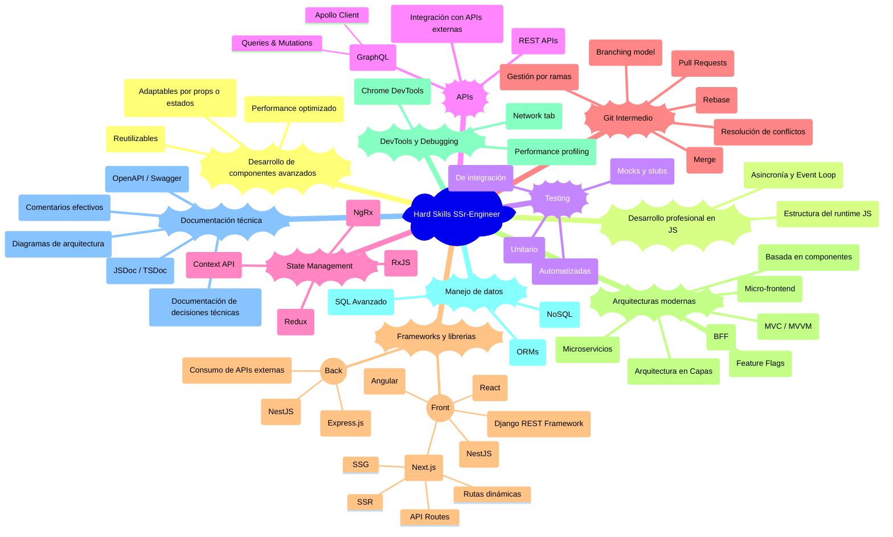
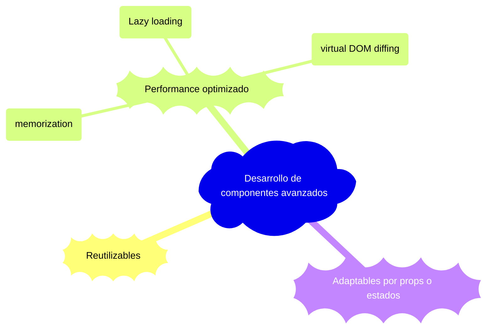
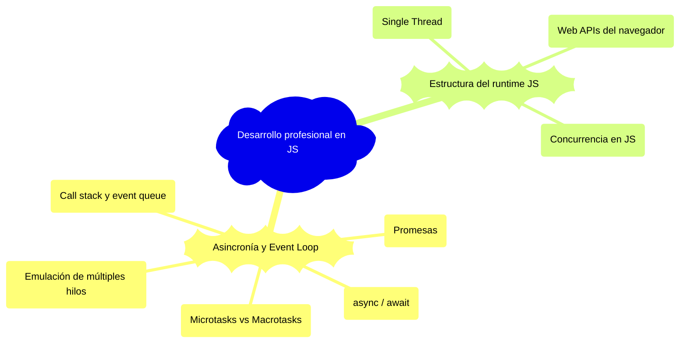
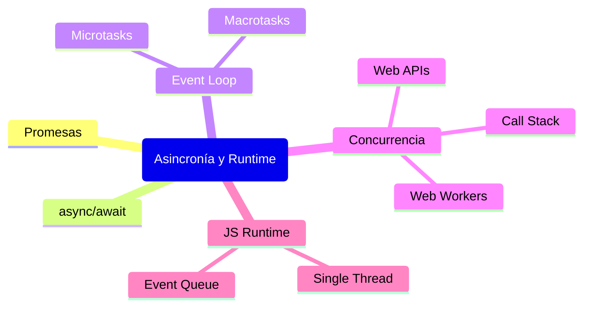
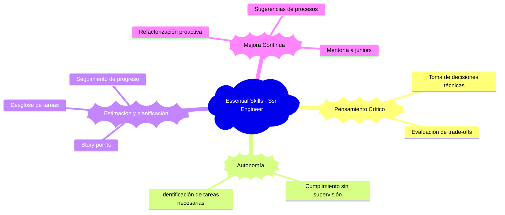
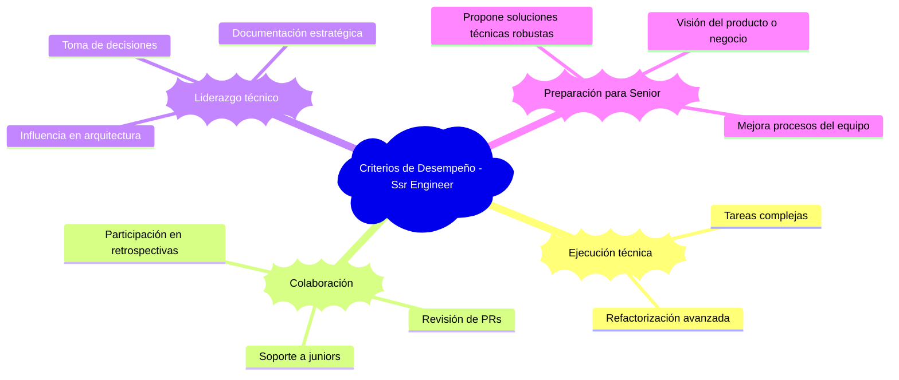

# 👨‍💻 Desarrollador Semi Senior / Mid-Level Developer

El **desarrollador semi senior** se desempeña con autonomía técnica en tareas de mediana y alta complejidad. Participa activamente en decisiones técnicas del equipo, guía a perfiles más junior y propone mejoras tanto en código como en procesos. Este nivel representa un punto de inflexión hacia roles de mayor liderazgo técnico y especialización. Se espera pensamiento crítico, compromiso con la calidad y una visión más estratégica del desarrollo.

---

## 🔧 Hard Skills – SSr-Engineer (Semi Senior)

El desarrollador semi senior domina la aplicación técnica en un marco de mayor complejidad, entendiendo el impacto de sus decisiones en el producto. Tiene la capacidad de trabajar con componentes avanzados, herramientas modernas y patrones arquitectónicos que le permiten aportar soluciones eficientes y escalables.



## Desarrollo de Componentes Avanzados

Los componentes avanzados son piezas fundamentales en aplicaciones modernas, especialmente en frameworks como React, Angular o Vue. Un SSr-Engineer debe no solo crearlos, sino también optimizarlos para su reutilización, rendimiento y adaptabilidad. Esta habilidad garantiza escalabilidad, mantenibilidad y consistencia en el desarrollo de interfaces.



### Reutilizables

Un componente reutilizable es una unidad de interfaz que se diseña para ser utilizada en múltiples lugares de una aplicación, sin duplicar código. Encapsula lógica, estructura y estilos, y permite la parametrización para adaptarse a distintos contextos.

**Escenario de uso**: En un e-commerce, un componente `ProductCard` puede reutilizarse tanto en la página principal como en los resultados de búsqueda o sección de favoritos como podemos ver en el siguiente ejemplo de REACT.

```jsx
const ProductCard = ({ name, price, image }) => (
  <div className="card">
    
    <h2>{name}</h2>
    <p>{price}</p>
  </div>
);
```

### Performance optimizado

Componentes optimizados garantizan una experiencia fluida y rápida. Un SSr-Engineer debe evitar renders innecesarios, controlar efectos secundarios y aplicar técnicas como *memoization*, *lazy loading* o *virtual DOM diffing*.

**Escenario de uso**: En una lista con cientos de elementos, es crucial evitar que todos se rendericen en cada cambio del estado general, como en el siguiente ejemplo de React.memo.

```jsx
const OptimizedCard = React.memo(({ title }) => {
  console.log("Renderizado");
  return <h2>{title}</h2>;
});
```
<!-- TODO: Agregar memorization, lazy loading y virtual DOM diffing -->

### Adaptables por props o estados

Un componente adaptable reacciona a las propiedades (`props`) o estado (`state`) para modificar su apariencia o comportamiento. Esto permite interfaces dinámicas, intuitivas y fáciles de extender.

**Escenario de uso**: Un botón puede tener variantes como “primario”, “secundario” o “deshabilitado” usando props.

```jsx
const Button = ({ variant, disabled, onClick }) => {
  const className = `btn ${variant} ${disabled ? 'btn-disabled' : ''}`;
  return <button className={className} onClick={onClick} disabled={disabled}>Click</button>;
};
```

## Desarrollo profesional en JS

El dominio de JavaScript a nivel semi senior implica un entendimiento profundo de cómo funciona el lenguaje detrás de escenas, especialmente su modelo de ejecución, asincronía, y el entorno donde se ejecuta (navegador o Node.js).



### Asincronía y Event Loop

Comprender cómo JS maneja operaciones asincrónicas es fundamental para evitar bloqueos, race conditions y manejar múltiples tareas concurrentemente.


Imagen del sitio [GeekForGeeks](https://www.geeksforgeeks.org/what-is-an-event-loop-in-javascript/)

#### Promesas
<!-- TODO: Agregar Observables -->
Las **promesas** permiten gestionar operaciones asincrónicas, evitando el "callback hell".

```javascript
fetch('/api/data')
  .then(res => res.json())
  .then(data => console.log(data))
  .catch(err => console.error(err));
```

**Escenario de uso**:

- Llamadas a APIs
- Acceso a bases de datos del navegador
- Carga de recursos externos

#### async / await

Una sintaxis más limpia para trabajar con promesas, compatible con `try/catch`.

```js
async function getData() {
  try {
    const res = await fetch('/api/data');
    const data = await res.json();
    console.log(data);
  } catch (err) {
    console.error(err);
  }
}
```

**Ventajas**:

- Legibilidad
- Flujo estructurado
- Manejo natural de errores

#### Microtasks vs Macrotasks

JavaScript organiza tareas asincrónicas en dos colas distintas:

- **Microtasks**: Promesas (`.then`, `async/await`, `queueMicrotask`, `MutationObserver`)  
- **Macrotasks**: `setTimeout`, `setInterval`, `setImmediate`, `requestAnimationFrame`, eventos del DOM

```js
console.log("1");
setTimeout(() => console.log("2"), 0);
Promise.resolve().then(() => console.log("3"));
console.log("4");
```

**Resultado**:

```bash
1
4
3
2
```

**Motivo**: las microtasks tienen mayor prioridad que las macrotasks.

#### Call Stack y Event Queue

El **Call Stack** es la pila de ejecución de funciones. Cuando una función termina, se saca de la pila.  
El **Event Queue** es donde esperan las tareas asincrónicas. El **Event Loop** es el encargado de mover tareas de la queue al stack cuando el stack está vacío.

```bash
[Main thread]
  └── Call Stack
        └── función actual

[Asynchronous work]
  └── Event Queue
        └── tareas pendientes (promesas, timeouts, etc.)
```

```js
function saludar() {
  console.log("Hola");
}
setTimeout(() => console.log("Adiós"), 0);
saludar();
```

**Orden**:

1. `saludar()` entra y sale del stack → imprime "Hola"
2. `setTimeout` se va al Event Queue → imprime "Adiós" después

#### Emulación de múltiples hilos

JS es **single-threaded**, pero puede emular concurrencia mediante:

- Web APIs del navegador
- **Web Workers** para operaciones pesadas en segundo plano
- Uso de asincronía para liberar el hilo principal


[Imagen de Craig Buckler](https://www.sitepoint.com/developing-faster-javascript-apps-the-ultimate-guide-to-web-workers/)

---

### Estructura del Runtime JS

Comprender cómo se ejecuta JS permite tomar decisiones informadas sobre rendimiento y comportamiento inesperado.

#### Single Thread

JavaScript ejecuta todo el código en un solo hilo por defecto. No hay paralelismo real a menos que se use `Web Workers`.

- Implica cuidado con tareas bloqueantes.
- Se debe evitar lógica pesada en el hilo principal.

#### Web APIs del navegador

*Funciones como `setTimeout`, `fetch`, `DOM events`, no están en JS como tal, sino que son proporcionadas por el navegador.*

Cuando JS encuentra una operación asincrónica, esta es delegada al entorno del navegador:

Timers (`setTimeout`)

`DOM events`

HTTP requests (`fetch`)

Web Storage, WebSocket, etc.

#### Concurrencia en JS

JS **no es multithread**, pero permite **concurrencia** a través del modelo de **asincronía + event loop**.

```js
console.log("Inicio");
setTimeout(() => console.log("Temporizador"), 0);
console.log("Fin");
```

---

### Resumen visual



---

**Conclusión**:  
Un SSr-Engineer debe dominar cómo funciona la asincronía en JS, desde promesas hasta el event loop, y tener criterio para escribir código no bloqueante, comprender problemas de concurrencia, y aprovechar las herramientas del entorno para tareas pesadas o asíncronas.


### Indicadores de dominio

- Aplica patrones como *presentational/container components*.
- Divide componentes en unidades testables.
- Aplica *prop drilling* con cautela o usa *context* correctamente.
- Usa hooks personalizados para lógica compartida (en React).
- Diseña APIs de componentes claras y consistentes.

---

### Buenas prácticas clave

- Evitar mutaciones directas en props o estado.
- Desacoplar lógica del renderizado.
- Nombrar componentes y props de forma semántica.
- Aplicar control de renderizado con `shouldComponentUpdate`, `React.memo`, o `useMemo`.


#### Testing unitario y de integración
- Uso de herramientas como Jest, Testing Library, Pytest o Mocha para validar comportamientos.
- Capacidad de diseñar pruebas útiles que validen funcionalidades críticas.
- Automatización básica del proceso de pruebas.

#### Integración y consumo de APIs externas
- Conexión a servicios REST y GraphQL.
- Implementación de middleware para autenticación y manejo de errores.
- Control del ciclo de vida de peticiones (loading, success, error).

#### GraphQL
- Lectura y escritura de queries, mutations, y uso de fragments.
- Integración con Apollo Client.
- Manejo básico de esquema (queries anidadas, tipado, introspección).

#### State Management avanzado
- Uso de Context API y Redux para manejar el estado global.
- Introducción a RxJS para flujos reactivos y NgRx en contextos Angular.
- Comprensión de observables, operadores y side effects.

#### Git Intermedio
- Flujo Git colaborativo: branching, merge, rebase, pull requests.
- Resolución de conflictos de forma autónoma.
- Propuesta y revisión de cambios en revisiones de código.

#### Frameworks avanzados
- Conocimiento práctico de frameworks como Next.js (SSR, SSG, rutas dinámicas).
- Implementación de API Routes y renderizado híbrido.
- Uso de NestJS o Django REST para estructurar APIs robustas.

#### Documentación técnica
- Uso de Swagger/OpenAPI para describir endpoints.
- Documentación de funciones y componentes con TSDoc o JSDoc.
- Diagramas de arquitectura con C4 Model o Mermaid para comunicar diseño.

#### Arquitecturas modernas
- Aplicación de patrones como MVC, MVVM y arquitectura en capas.
- Introducción a microservicios, micro-frontend y BFF.
- Uso de feature flags para experimentación controlada y despliegue progresivo.

#### DevTools y Debugging
- Uso de herramientas como Chrome DevTools, Lighthouse o React DevTools.
- Inspección de flujos de red, eventos, performance y errores.
- Trazabilidad de flujo de datos para diagnosticar bugs.


---

## 🧠 Essential Skills (Ssr Engineer)



---

## ✅ Criterios de Desempeño (Ssr Engineer)



---

[Junior](./junior.md) | [⬆️](/knowledge.md#3-desarrollador-semi-senior--mid-level-developer) | [Senior](./senior.md)

<!-- TODO: Agregar

# SSr-Engineer

## 🔧 Hard Skills

- Desarrollo de componentes reutilizables, adaptables y performantes
- Testing unitario e integración
- Gestión avanzada de ramas en Git (merge, rebase, PRs)
- Documentación técnica clara y útil
- Consumo de APIs REST y GraphQL con herramientas modernas
- Uso y comprensión de:
  - RxJS (observables, operadores comunes)
  - NgRx (estado en Angular)
  - GraphQL (queries, mutations, fragments)
  - Next.js: SSR, SSG, rutas dinámicas, API Routes
- Ciclo de vida del event loop de JavaScript
- Programación asincrónica: Promesas, async/await, micro/macro tasks

### HTML/CSS/JS Frontend Intermedio

- Virtual DOM
- Optimización de imágenes (lazy load, WebP)
- Minificación, Uglificación y Compresión
- SASS / LESS con mixins, variables
- IndexedDB para persistencia estructurada
- React: hooks personalizados
- Angular: directivas personalizadas, pipes avanzados
- Shadow DOM
- Web Workers para tareas pesadas en segundo plano
- Sockets básicos (ej. con socket.io)

## 🧠 Essential Skills

- Pensamiento crítico para tomar decisiones técnicas
- Estimación de tiempos y esfuerzo con precisión
- Capacidad para trabajar sin supervisión cercana
- Propuesta activa de mejoras en código y procesos

## ✅ Criterios de Desempeño

- Resuelve tareas medianamente complejas de forma autónoma
- Revisa código y apoya a perfiles junior
- Participa activamente en decisiones técnicas
- Cuando todo lo anterior se realiza con fluidez → está listo para avanzar a Senior

## 🧪 Exposición recomendada (sin necesidad de dominio profundo)

- Arquitectura BFF (Backend for Frontend)
- Feature Flags
- Microservicios
- Micro-frontend

---
 -->