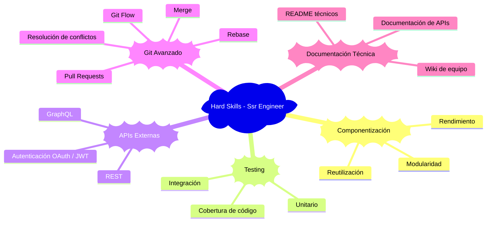
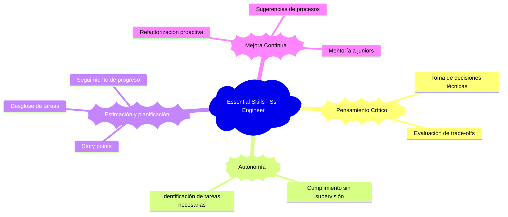
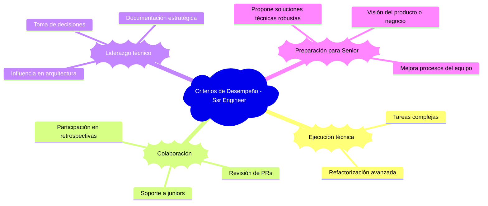

# 👨‍💻 Desarrollador Semi Senior / Mid-Level Developer

El **desarrollador semi senior** se desempeña con autonomía técnica en tareas de mediana y alta complejidad. Participa activamente en decisiones técnicas del equipo, guía a perfiles más junior y propone mejoras tanto en código como en procesos. Este nivel representa un punto de inflexión hacia roles de mayor liderazgo técnico y especialización. Se espera pensamiento crítico, compromiso con la calidad y una visión más estratégica del desarrollo.

---

## 🔧 Hard Skills (Ssr Engineer)

---

## 🧠 Essential Skills (Ssr Engineer)

---

## ✅ Criterios de Desempeño (Ssr Engineer)

---

[Junior](./junior.md) | [⬆️](/knowledge.md#3-desarrollador-semi-senior--mid-level-developer) | [Senior](./senior.md)