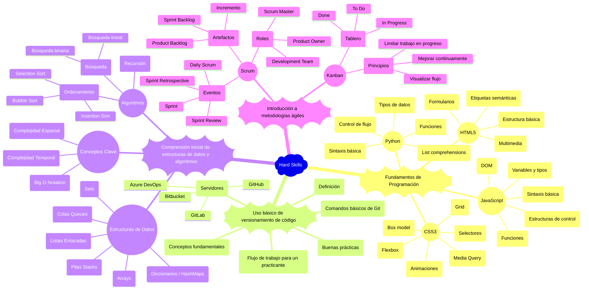
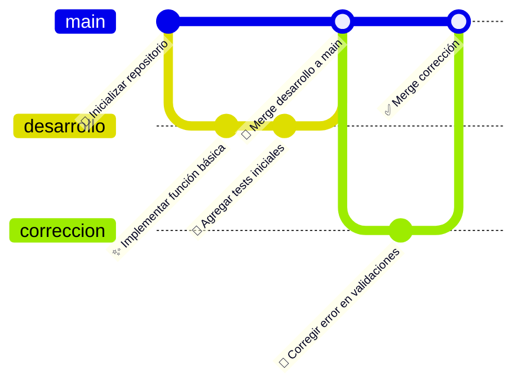
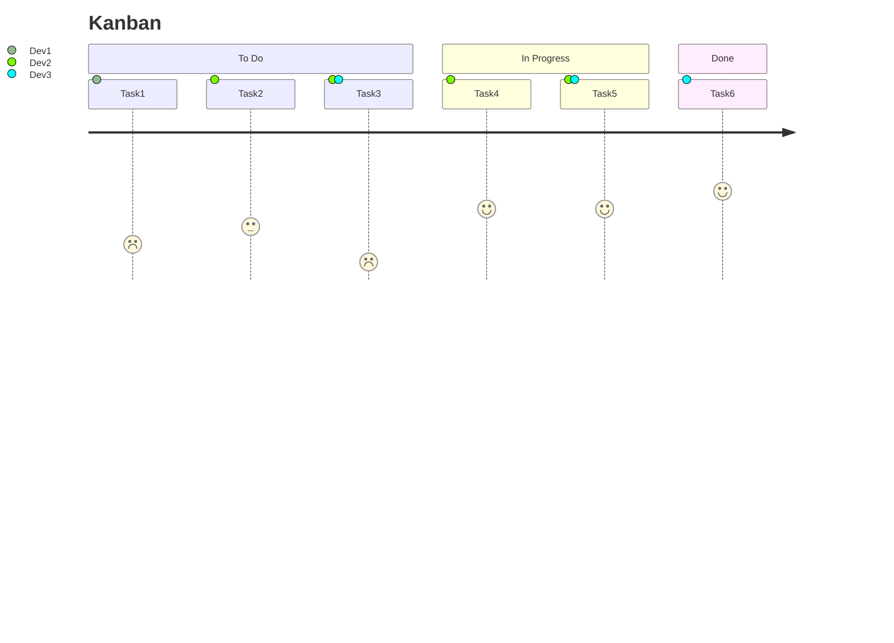
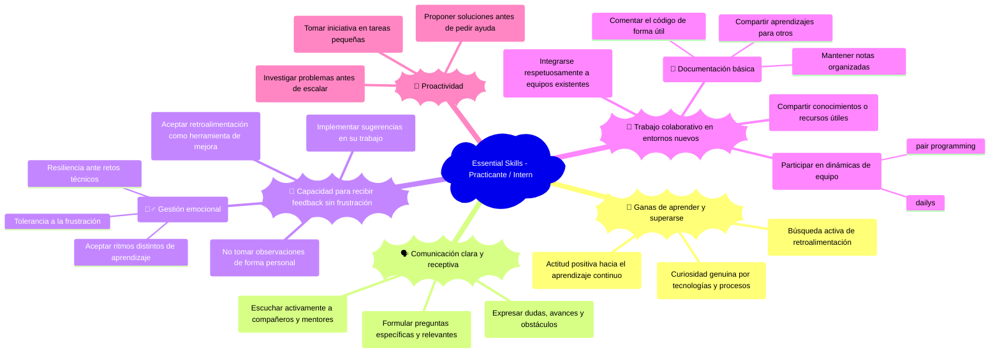
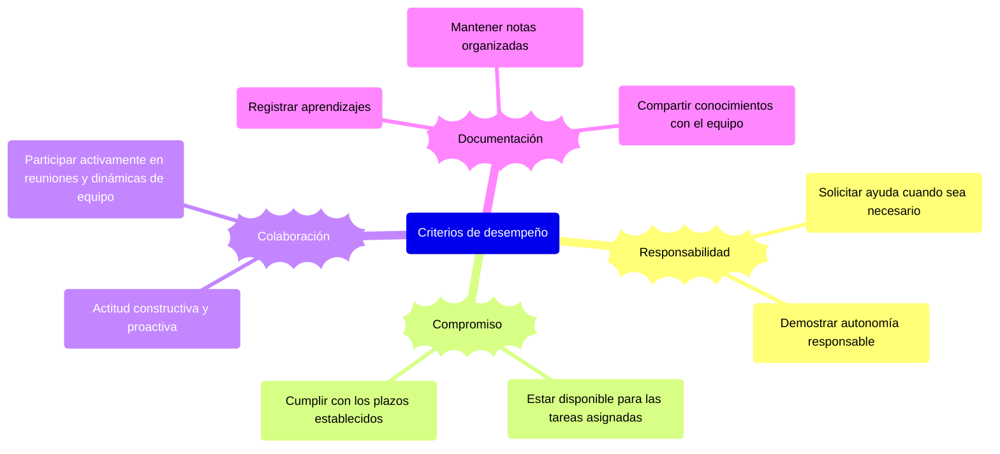

# Practicante / Intern de Desarrollo de Software

El rol de Practicante marca el primer paso dentro del camino profesional en tecnología. Es una etapa enfocada completamente en el aprendizaje, la curiosidad y la adquisición de fundamentos sólidos. El objetivo principal es entender cómo se trabaja en un entorno de desarrollo real, aplicar los conocimientos básicos adquiridos en la formación académica y comenzar a integrarse a la dinámica de equipos ágiles.

En esta fase, es normal cometer errores: lo valioso es aprender de ellos rápidamente, hacer muchas preguntas y comenzar a construir una mentalidad de mejora continua. La práctica deliberada, la observación activa y la documentación del aprendizaje son claves en este punto.

Este rol sienta las bases tanto técnicas como personales para el crecimiento profesional, permitiendo descubrir intereses, entender el flujo de trabajo colaborativo y prepararse para asumir mayores responsabilidades.

## 🔧 Hard Skills para Practicante / Intern



### 🦾Fundamentos de programación

📘 Descripción general
Los fundamentos de programación permiten adquirir la lógica y pensamiento computacional necesarios para resolver problemas con código. Esta etapa se enfoca en conocer la sintaxis básica, estructuras de control y cómo interactuar con el navegador.

#### 📌 JavaScript

- Sintaxis básica: `let`, `const`, `function`, `=>`, `if`, `for`, `while`
- Tipos de datos: `Number`, `String`, `Boolean`, `Object`, `Array`, `null`, `undefined`
- Estructuras de control: `if`, `switch`, `for`, `while`, `do while`
- Funciones: Declaración, expresión, flecha, callbacks
- [DOM](/others/glossary.md#d): ``document.querySelector``, ``addEventListener``, manipulación de nodos

#### 🐍 Python

- Tipos de datos: ``int``, ``float``, ``str``, ``list``, ``dict``, ``set``, ``tuple``, ``bool``
- Control de flujo: ``if``, ``elif``, ``else``, ``for``, ``while``
- Funciones: ``def``, parámetros, retorno, argumentos por defecto
- List comprehensions: ``new_list = [x for x in iterable if condition]``

#### 🌐 HTML5

- Estructura básica:
  - Estructura del documento: ``<html>``, ``<head>``, ``<body>``.
  - Información del documento y recursos externos: ``<title>``, ``<meta>``, ``<link>``, ``<script>``.
- Semántica:
  - Organizan el contenido de forma lógica y accesible: ``<header>``, ``<footer>``, ``<nav>``, ``<main>``, ``<article>``, ``<section>``.
  - Contenido relacionado o decorativo: ``<aside>``, ``<figure>``, ``<figcaption>``.
- Formularios: ``<form>``, ``<input>``, ``<label>``, ``<select>``, ``<textarea>``, ``<button>``.
- Nuevos tipos de input: ``<email>``, ``<date>``, ``<range>``, ``<color>``
- Multimedia: ````, ``<audio>``, ``<video>``, ``<source>``, ``<track>``
    Soporte nativo para contenido visual y sonoro sin plugins externos.
- ✏️ Atributos [HTML](/others/glossary.md#h)
    Los atributos proporcionan información adicional sobre los elementos HTML. Siempre van en la etiqueta de apertura y tienen la forma nombre="valor".

    Ejemplos comunes: ``id``, ``class``, ``style``, ``src``, ``href``, ``alt``, ``disabled``, ``placeholder``, ``type``, ``value``

    ```html
    <input type="text" placeholder="Escribe tu nombre" />
    <a href="https://openai.com" target="_blank">Ir a OpenAI</a>
    ```

- SVG (Scalable Vector Graphics)
    [SVG](/others/glossary.md#s) permite representar gráficos vectoriales directamente en HTML.

    Se utiliza para íconos, diagramas, animaciones o ilustraciones escalables.

    Ejemplo básico:

    ```html
    <svg width="100" height="100">
        <circle cx="50" cy="50" r="40" stroke="black" stroke-width="2" fill="skyblue" />
    </svg>
    ```

    <!-- markdownlint-disable MD033 MD046 -->
    <!-- FIXME: Corregir el funcionamiento HTML5 https://github.com/EdgarRangelInnovate/EdgarRangelInnovate/issues/74 -->
    <svg width="100" height="100">
        <circle cx="50" cy="50" r="40" stroke="black" stroke-width="2" fill="skyblue" />
    </svg>
    <canvas id="threejs-canvas"></canvas>
    <script src="https://cdnjs.cloudflare.com/ajax/libs/three.js/r128/three.min.js"></script>
    <script>
      const scene = new THREE.Scene();
      const camera = new THREE.PerspectiveCamera(75, window.innerWidth / window.innerHeight, 0.1, 1000);
      const renderer = new THREE.WebGLRenderer({ canvas: document.getElementById('threejs-canvas') });
      renderer.setSize(window.innerWidth, window.innerHeight);
      document.body.appendChild(renderer.domElement);
      const scene = new THREE.Scene();
      const camera = new THREE.PerspectiveCamera(75, window.innerWidth / window.innerHeight, 0.1, 1000);
      const renderer = new THREE.WebGLRenderer({ canvas: document.getElementById('threejs-canvas') });
      renderer.setSize(window.innerWidth, window.innerHeight);
      document.body.appendChild(renderer.domElement);

      const geometry = new THREE.BoxGeometry();
      const material = new THREE.MeshBasicMaterial({ color: 0x00ff00 });
      const cube = new THREE.Mesh(geometry, material);
      scene.add(cube);
      const geometry = new THREE.BoxGeometry();
      const material = new THREE.MeshBasicMaterial({ color: 0x00ff00 });
      const cube = new THREE.Mesh(geometry, material);
      scene.add(cube);

      camera.position.z = 5;
      camera.position.z = 5;

      function animate() {
          requestAnimationFrame(animate);
          cube.rotation.x += 0.01;
          cube.rotation.y += 0.01;
          renderer.render(scene, camera);
      }
      animate();
      function animate() {
          requestAnimationFrame(animate);
          cube.rotation.x += 0.01;
          cube.rotation.y += 0.01;
          renderer.render(scene, camera);
      }
      animate();
    </script>
    <!-- markdownlint-enable MD033 MD046 -->

    > 🔎 Puedes manipular [SVG](/others/glossary.md#s) con [CSS](/others/glossary.md#c) y JavaScript igual que otros elementos HTML.

#### 🎨 CSS3

- **🎯 Selectores**: Los selectores permiten aplicar estilos a elementos específicos en HTML.
  - **De tipo**: seleccionan elementos por su nombre de etiqueta (div, p, h1).
  - **De clase**: seleccionan elementos por su atributo class (.mi-clase).
  - **De id**: seleccionan un elemento único por su atributo id (#mi-id).
  - **Combinadores**: seleccionan elementos en relación con otros (por ejemplo: hijos directos >, hermanos adyacentes +, descendientes ).

  ```css
    /* Ejemplos */
    p { color: blue; }
    .button { background-color: green; }
    #header { height: 80px; }
    nav > ul { list-style: none; }
  ```

- **📦 Box Model**: El Modelo de Caja describe cómo se calcula el espacio que ocupa cada elemento en la página.
  - **``Content``**: el área donde se muestra el contenido (texto, imagen, etc.).
  - **``Padding``**: espacio interno entre el contenido y el borde.
  - **``Border``**: línea que rodea el padding (y el contenido).
  - **``Margin``**: espacio exterior entre el borde y otros elementos.

  ```css
  .box {
    margin: 10px;
    padding: 20px;
    border: 2px solid black;
  }
  ```

  Visualizar el Box Model es crucial para dominar el layout en [CSS](/others/glossary.md#c).

- **🧲 Flexbox**: Flexbox facilita la distribución de espacio y alineación de ítems en un contenedor flexible.
  - **``display``**: flex: activa el modo flex en el contenedor.
  - **``justify-content``**: alinea horizontalmente (flex-start, center, space-between, etc.).
  - **``align-items``**: alinea verticalmente (stretch, center, flex-end, etc.).

  ```css
  .container {
    display: flex;
    justify-content: center;
    align-items: center;
  }
  ````
  
  Flexbox es ideal para layouts en una dimensión (horizontal o vertical).

- **🧩 Grid Layout**: Grid es un sistema bidimensional para diseñar interfaces complejas.
  - **``display``**: grid: activa el modo grid en el contenedor.
  - **``grid-template-areas``, ``grid-template-rows``, ``grid-template-columns``**: definen las zonas y estructuras de la grilla.
  - **``gap``**: define la separación entre filas y columnas.

  ```css
  .container {
    display: grid;
    grid-template-areas: 
        "header header"
        "menu main"
        "footer footer";
  }
  ```

  Grid permite posicionar elementos en filas y columnas de forma muy precisa.

- **🎞️ Animaciones**: Las animaciones en CSS3 permiten crear efectos visuales dinámicos.
  - **``@keyframes``**: define la secuencia de cambios de estilo.
  - **``transition``**: anima cambios suaves entre valores de propiedades.
  - **``transform``**: aplica transformaciones como rotar, escalar, mover.

  ```css
  /* Usando @keyframes */
  @keyframes mover {
    from { transform: translateX(0); }
    to { transform: translateX(100px); }
  }
  
  .elemento {
    animation: mover 2s infinite alternate;
  }

  /* Usando transition */
  .boton {
    transition: background-color 0.3s;
  }
  .boton:hover {
    background-color: navy;
  }
  ```

- **📱 Media Queries**: Media queries permiten aplicar estilos adaptados al tamaño de pantalla o características del dispositivo, facilitando el diseño responsivo.
  - **Sintaxis básica**:

    ```css
    @media (max-width: 768px) {
        body {
            background-color: lightblue;
        }
    }
    ```

  - **Condiciones comunes**:
    - **max-width / min-width**: controlan el ancho del viewport.
    - **orientation**: detecta modo vertical u horizontal.
    - **prefers-color-scheme**: detecta si el usuario prefiere modo oscuro o claro.

### 🗂️ Uso básico de versionamiento de código

Git es un sistema de control de versiones distribuido que permite gestionar cambios en archivos de forma eficiente y segura a lo largo del tiempo.

Permite guardar estados de tu proyecto llamados commits.

Facilita el trabajo en equipo mediante ramas (branches).

Permite retroceder cambios, comparar versiones, fusionar trabajo de varias personas.

#### 📚 Conceptos fundamentales

| Concepto           | Descripción                                                                                                     |
| :----------------- | :-------------------------------------------------------------------------------------------------------------- |
| Repositorio (repo) | Es la base de tu proyecto. Contiene todos los archivos y el historial de cambios. Puede ser local o remoto.     |
| Commit             | Es un "snapshot" de los archivos en un momento determinado. Guarda cambios junto a un mensaje descriptivo.      |
| Branch (rama)      | Línea de desarrollo independiente. Permite trabajar en funcionalidades nuevas sin afectar la versión principal. |
| Merge              | Combina cambios de distintas ramas.                                                                             |
| Pull               | Actualiza tu repositorio local con cambios del repositorio remoto.                                              |
| Push               | Envía tus cambios locales al repositorio remoto (GitHub/GitLab).                                                |
| Clone              | Copia un repositorio remoto en tu máquina local.                                                                |

#### 🛠️ Comandos básicos de Git

```bash
git init                # Inicializar un repositorio en un directorio
git clone <url>         # Clonar un repositorio remoto
git status              # Ver archivos modificados/no rastreados
git add <archivo>       # Agregar archivos al área de preparación (staging area)
git commit -m "Mensaje" # Crear un commit
git push                # Enviar commits al servidor remoto
git pull                # Traer cambios desde el remoto
git checkout <rama>     # Cambiar de rama
git branch              # Listar ramas existentes
git merge <rama>        # Fusionar otra rama a la actual
```

#### 🌐 Servidores

Son plataformas web que alojan repositorios Git y ofrecen herramientas adicionales como:

- Repositorios remotos: espacio en la nube para tu código.
- Pull Requests (GitHub) / Merge Requests (GitLab): revisiones de código colaborativas.
- Issues: gestión de tareas o reportes de bugs.
- Pipelines ([CI/CD](/others/glossary.md#c)): automatización de pruebas, builds y despliegues (en fases más avanzadas).

#### 🚀 Flujo básico de trabajo como practicante



#### 🛠️ Buenas prácticas adicionales para Git como practicante

- Usar ramas: nunca trabajar directamente en main o master.
- Commits pequeños y claros: no guardar 10 cambios diferentes en un solo commit.
- Mensajes de commit con proposito.
- Abrir Pull Requests o Merge Requests para cada conjunto de cambios.
- Solicitar revisión y feedback antes de hacer merge.

- 🌟 Estructura de mensajes de commit con buenas prácticas:
  

    | Type     | Emoji                                         |
    | -------- | --------------------------------------------- |
    | feat     | :sparkles: `:sparkles:`                       |
    | fix      | :bug: `:bug:`                                 |
    | docs     | :memo: `:memo:`                               |
    | refactor | :recycle: `:recycle:`                         |
    | build    | :construction_worker: `:construction_worker:` |
    | test     | :white_check_mark: `:white_check_mark:`       |
    | ci       | :green_heart: `:green_heart:`                 |
    | style    | :art: `:art:`                                 |
    | chore    | :wrench: `:wrench:`                           |
    | perf     | :zap: `:zap:`                                 |

### 🧠 Comprensión inicial de estructuras de datos y algoritmos

**🎯 Objetivo**: Entender los conceptos básicos de cómo se organizan, almacenan y manipulan datos, así como las técnicas fundamentales para resolver problemas de programación de manera eficiente.

#### Estructuras de datos básicas

Las estructuras de datos básicas son fundamentales para organizar, almacenar y manipular información de manera eficiente. Comprender cómo funcionan y cuándo utilizarlas permite resolver problemas comunes en programación, optimizando tanto el tiempo de ejecución como el uso de memoria. En esta sección, se exploran conceptos clave como arreglos, listas enlazadas, pilas, colas, diccionarios y conjuntos, junto con ejemplos prácticos en lenguajes como JavaScript y Python.

##### Arreglos (Arrays)

Son colecciones ordenadas de elementos accesibles mediante índices.

**Uso típico**: listas de datos, secuencias, colecciones homogéneas.

```javascript
// Crear un array y recorrerlo
const numeros = [1, 2, 3, 4, 5];
numeros.forEach(numero => {
    console.log(numero);
});
```

```python
# Crear una lista y recorrerla
numeros = [1, 2, 3, 4, 5]
for numero in numeros:
    print(numero)
```

##### Listas enlazadas (Linked Lists)

Son estructura donde cada elemento apunta al siguiente.

**Uso**: manipulación dinámica de memoria, operaciones frecuentes de inserción/eliminación.

```javascript
// Definición de un nodo
class Nodo {
    constructor(valor) {
        this.valor = valor;
        this.siguiente = null;
    }
}

// Crear una lista enlazada
const nodo1 = new Nodo(1);
const nodo2 = new Nodo(2);
const nodo3 = new Nodo(3);

// Enlazar los nodos
nodo1.siguiente = nodo2;
nodo2.siguiente = nodo3;

// Recorrer la lista
let actual = nodo1;
while (actual !== null) {
    console.log(actual.valor);
    actual = actual.siguiente;
}
```

```python
# Definición de un nodo
class Nodo:
    def __init__(self, valor):
        self.valor = valor
        self.siguiente = None

# Crear una lista enlazada
nodo1 = Nodo(1)
nodo2 = Nodo(2)
nodo3 = Nodo(3)

# Enlazar los nodos
nodo1.siguiente = nodo2
nodo2.siguiente = nodo3

# Recorrer la lista
actual = nodo1
while actual is not None:
    print(actual.valor)
    actual = actual.siguiente
```

##### Pilas (Stacks)

Colección de elementos que sigue el principio [LIFO](/others/glossary.md#l).

**Métodos**: push(), pop()

```javascript
// Uso de pila
const pila = [];
pila.push(1);  // Agregar elemento
pila.push(2);
console.log(pila.pop()); // Remover el último elemento (2)
```

```python
# Uso de pila
pila = []
pila.append(1)  # Agregar elemento
pila.append(2)
print(pila.pop())  # Remover el último elemento (2)
```

##### Colas (Queues)

Colección que sigue el principio [FIFO](/others/glossary.md#f).

**Métodos**: enqueue(), dequeue()

**Uso**: gestionar tareas en espera (ej. impresoras).

```javascript
// Uso de cola
const cola = [];
cola.push(1);   // Agregar al final
cola.push(2);
console.log(cola.shift()); // Remover del inicio (1)
```

```python
# Uso de cola
from collections import deque

cola = deque()
cola.append(1)  # Agregar al final
cola.append(2)
print(cola.popleft())  # Remover del inicio (1)
```

##### Diccionarios / Objetos (Hash Maps)

Estructuras de clave-valor para búsquedas rápidas.

**Uso**: almacenar configuraciones, usuarios, catálogos.

```javascript
// Crear un objeto
const usuario = {
    nombre: "Alejandro",
    edad: 30
};
console.log(usuario["nombre"]); // Alejandro
```

```python
# Crear un diccionario
usuario = {
    "nombre": "Alejandro",
    "edad": 30
}
print(usuario["nombre"])  # Alejandro
```

##### Conjuntos (Sets)

Colecciones de elementos únicos sin orden específico.

**Uso**: eliminar duplicados, operaciones de unión/intersección.

```javascript
// Crear un Set
const numeros = new Set([1, 2, 3, 3, 4]);

console.log(numeros); // Set(4) {1, 2, 3, 4}

// Agregar elementos
numeros.add(5);

// Verificar existencia
console.log(numeros.has(3)); // true

// Eliminar elementos
numeros.delete(2);

// Recorrer el set
for (let numero of numeros) {
    console.log(numero);
}
```

```python
# Crear un Set
numeros = {1, 2, 3, 3, 4}

print(numeros) # {1, 2, 3, 4}

# Agregar elementos
numeros.add(5)

# Verificar existencia
print(3 in numeros) # True

# Eliminar elementos
numeros.discard(2)

# Recorrer el set
for numero in numeros:
    print(numero)
```

#### Algoritmos básicos

Los algoritmos básicos son procedimientos fundamentales que permiten resolver problemas computacionales de manera eficiente. En esta sección, se abordan técnicas esenciales como la búsqueda lineal y binaria, métodos de ordenamiento como Bubble Sort, Selection Sort e Insertion Sort, y el concepto de recursión. Estos algoritmos forman la base para desarrollar soluciones más complejas y optimizadas, ayudando a los practicantes a comprender cómo abordar problemas de programación de forma estructurada y lógica.

##### Búsqueda lineal

Recorrer secuencialmente un arreglo para encontrar un elemento.

```javascript
function busquedaLineal(arr, objetivo) {
    for (let i = 0; i < arr.length; i++) {
        if (arr[i] === objetivo) {
            return i;
        }
    }
    return -1;
}

console.log(busquedaLineal([10, 20, 30, 40], 30)); // 2
```

```python
def busqueda_lineal(arr, objetivo):
    for i in range(len(arr)):
        if arr[i] == objetivo:
            return i
    return -1

print(busqueda_lineal([10, 20, 30, 40], 30))  # 2
```

##### Búsqueda binaria

Encontrar un elemento en un arreglo ordenado dividiéndolo sucesivamente.

```javascript
function busquedaBinaria(arr, objetivo) {
    let izquierda = 0;
    let derecha = arr.length - 1;

    while (izquierda <= derecha) {
        const medio = Math.floor((izquierda + derecha) / 2);
        if (arr[medio] === objetivo) {
            return medio;
        } else if (arr[medio] < objetivo) {
            izquierda = medio + 1;
        } else {
            derecha = medio - 1;
        }
    }
    return -1;
}

console.log(busquedaBinaria([10, 20, 30, 40, 50], 30)); // 2
```

```python
def busqueda_binaria(arr, objetivo):
    izquierda = 0
    derecha = len(arr) - 1

    while izquierda <= derecha:
        medio = (izquierda + derecha) // 2
        if arr[medio] == objetivo:
            return medio
        elif arr[medio] < objetivo:
            izquierda = medio + 1
        else:
            derecha = medio - 1
    return -1

print(busqueda_binaria([10, 20, 30, 40, 50], 30))  # 2
```

##### Ordenamiento sencillo

El ordenamiento sencillo abarca algoritmos básicos diseñados para organizar elementos en una secuencia específica, como ascendente o descendente. En esta sección, se exploran métodos como Bubble Sort, Selection Sort e Insertion Sort, que son fáciles de entender e implementar. Estos algoritmos son ideales para introducir a los practicantes en los conceptos fundamentales de ordenamiento, ayudándoles a comprender cómo funcionan las comparaciones, intercambios y la eficiencia en términos de tiempo y espacio.

###### Bubble Sort

Mueve el mayor elemento al final en cada pasada (como burbujas).

```javascript
function bubbleSort(arr) {
    let n = arr.length;
    for (let i = 0; i < n-1; i++) {
        for (let j = 0; j < n-i-1; j++) {
            if (arr[j] > arr[j+1]) {
                // Intercambiar elementos
                [arr[j], arr[j+1]] = [arr[j+1], arr[j]];
            }
        }
    }
    return arr;
}

console.log(bubbleSort([5, 3, 8, 4, 2]));
```

```python
    def bubble_sort(arr):
        n = len(arr)
        for i in range(n-1):
            for j in range(n-i-1):
                if arr[j] > arr[j+1]:
                    # Intercambiar elementos
                    arr[j], arr[j+1] = arr[j+1], arr[j]
        return arr

    print(bubble_sort([5, 3, 8, 4, 2]))
```

###### Selection Sort

Encuentra el mínimo y lo coloca en su posición.

```javascript
function selectionSort(arr) {
    let n = arr.length;
    for (let i = 0; i < n-1; i++) {
        let minIndex = i;
        for (let j = i+1; j < n; j++) {
            if (arr[j] < arr[minIndex]) {
                minIndex = j;
            }
        }
        // Intercambiar el mínimo encontrado con el primer elemento
        [arr[i], arr[minIndex]] = [arr[minIndex], arr[i]];
    }
    return arr;
}

console.log(selectionSort([5, 3, 8, 4, 2]));
```

```python
def selection_sort(arr):
    n = len(arr)
    for i in range(n-1):
        min_index = i
        for j in range(i+1, n):
            if arr[j] < arr[min_index]:
                min_index = j
        # Intercambiar el mínimo encontrado con el primer elemento
        arr[i], arr[min_index] = arr[min_index], arr[i]
    return arr

print(selection_sort([5, 3, 8, 4, 2]))
```

###### Insertion Sort

Va insertando cada elemento en el lugar correcto como si ordenaras cartas en la mano.

```javascript
function insertionSort(arr) {
    let n = arr.length;
    for (let i = 1; i < n; i++) {
        let key = arr[i];
        let j = i - 1;
        // Mover elementos mayores que key una posición adelante
        while (j >= 0 && arr[j] > key) {
            arr[j + 1] = arr[j];
            j = j - 1;
        }
        arr[j + 1] = key;
    }
    return arr;
}

console.log(insertionSort([5, 3, 8, 4, 2]));
```

```python
def insertion_sort(arr):
    n = len(arr)
    for i in range(1, n):
        key = arr[i]
        j = i - 1
        # Mover elementos mayores que key una posición adelante
        while j >= 0 and arr[j] > key:
            arr[j + 1] = arr[j]
            j = j - 1
        arr[j + 1] = key
    return arr

print(insertion_sort([5, 3, 8, 4, 2]))
```

###### Recursión

Técnica donde una función se llama a sí misma para resolver subproblemas más pequeños.

```javascript
function factorial(n) {
    if (n === 0) return 1;
        return n * factorial(n - 1);
}

console.log(factorial(5)); // 120
```

```python
def factorial(n):
    if n == 0:
        return 1
    return n * factorial(n - 1)

print(factorial(5))  # 120
```

#### Conceptos de eficiencia

Los conceptos de eficiencia son fundamentales para evaluar el rendimiento de los algoritmos y estructuras de datos. En esta sección, se exploran métricas clave como la complejidad temporal y espacial, que miden el tiempo de ejecución y el uso de memoria en función del tamaño de la entrada. También se introduce la notación Big O, una herramienta esencial para describir el comportamiento de los algoritmos en el peor caso. Comprender estos conceptos permite a los practicantes diseñar soluciones más optimizadas y tomar decisiones informadas al implementar algoritmos.

##### ⏱️ Tiempo de ejecución (Time Complexity)

Es cuánto tiempo tarda un algoritmo en completarse en función del tamaño de la entrada (n).

**🤔 Análisis**: Se ejecuta n veces → Complejidad: O(n) (lineal).

```javascript
function printNumbers(n) {
    for (let i = 0; i < n; i++) {
        console.log(i);
    }
}
```

##### 🧮 Uso de memoria (Space Complexity)

Es cuánta memoria adicional necesita el algoritmo para funcionar, en función del tamaño de la entrada.
  
**Análisis**: Se guarda una lista de n elementos → Complejidad espacial: O(n) (lineal).

```python
def create_array(n):
    arr = []
    for i in range(n):
        arr.append(i)
        return arr
```
  
##### 🔍 Notación Big O

La notación Big O describe el "peor caso" de eficiencia de un algoritmo.
  
| Big O      | Descripción                        | Ejemplo práctico                         |
| :--------- | :--------------------------------- | :--------------------------------------- |
| O(1)       | Tiempo constante (no depende de n) | Acceder a un elemento de un array arr[5] |
| O(log n)   | Logarítmico                        | Búsqueda binaria en un array ordenado    |
| O(n)       | Lineal                             | Recorrer todos los elementos de un array |
| O(n log n) | Log lineal                         | Merge Sort, Quick Sort                   |
| O(n²)      | Cuadrático                         | Algoritmo Bubble Sort                    |
  
###### 🧩 Ejemplos prácticos de Big O

🛠️ Ejemplos prácticos iniciales

| Estructura / Algoritmo | Ejemplo práctico                                       |
| :--------------------- | :----------------------------------------------------- |
| Array                  | Recorrer todos los productos en un carrito de compras  |
| Stack                  | Controlar historial de navegación en un navegador web  |
| Queue                  | Gestión de usuarios en cola de soporte                 |
| Diccionario            | Relacionar nombres de usuario con contraseñas en login |
| Búsqueda binaria       | Buscar un libro en una estantería ordenada             |

- O(1) - Tiempo constante
  
  ```javascript
  function getFirstElement(arr) {
      return arr[0]; // Siempre toma el mismo tiempo
  }
  ```

- O(log n) - Logarítmico
  **Explicación**: En cada paso divides a la mitad la cantidad de elementos a revisar → eficiencia logarítmica.

  ```python
  def binary_search(arr, target):
      left, right = 0, len(arr) -1
      while left <= right:
          mid = (left + right) // 2
          if arr[mid] == target:
              return mid
          elif arr[mid] < target:
              left = mid + 1
          else:
              right = mid - 1
          return -1
  ```

- O(n) - Lineal

  ```javascript
  function findElement(arr, target) {
    for (let i = 0; i < arr.length; i++) {
        if (arr[i] === target) {
            return i;
        }
    }
    return -1;
  }
  ```

- O(n²) - Cuadrático
  **Explicación**: Dos bucles anidados → el tiempo crece al cuadrado respecto a n.

  ```python
  def print_pairs(arr):
    for i in arr:
        for j in arr:
            print(i, j)
  ```

#### 🌱 Buenas prácticas al aprender estructuras y algoritmos

- No memorizar, sino comprender patrones.
- Visualizar el flujo de datos (dibujar arrays, stacks, queues en papel o herramientas gráficas).
- Empezar resolviendo problemas simples antes de optimizar.
- Practicar en plataformas como:
  - [LeetCode](https://leetcode.com/) (Easy)
  - [HackerRank](https://www.hackerrank.com/) (Data Structures)
  - [CodeWars](https://www.codewars.com/)
  - [CodeFinity](https://codefinity.com/)
  - [AlgoExpert](https://www.algoexpert.io/)
  - [GeeksForGeeks](https://www.geeksforgeeks.org/)
  - [Excercism](https://exercism.org/)
  - [Edabit](https://edabit.com/)
  - [Project Euler](https://projecteuler.net/)

### 🚀 Introducción a Metodologías Ágiles

Las metodologías ágiles son enfoques de trabajo para gestionar proyectos de forma iterativa, colaborativa y flexible, adaptándose rápidamente a los cambios.

Para un practicante, los principales marcos de trabajo que debes conocer son:

#### 🏉 Scrum (Marco de trabajo ágil más popular)

Scrum es un marco de trabajo ágil para desarrollar productos complejos. Organiza el trabajo en ciclos cortos y repetitivos llamados Sprints.

##### Roles

- Product Owner: Define el qué (qué se necesita construir).
- Scrum Master: Facilita el proceso ágil, elimina impedimentos.
- Development Team: Equipo multidisciplinario que construye el producto.

##### Eventos

- Sprint: Ciclo de trabajo de 1 a 4 semanas.
- Sprint Planning: Planificación del Sprint.
- Daily Scrum: Reunión diaria de sincronización (15 minutos).
- Sprint Review: Revisión de lo entregado al final del Sprint.
- Sprint Retrospective: Reflexión sobre el proceso para mejorarlo.

##### Artefactos

- Product Backlog: Lista priorizada de funcionalidades.
- Sprint Backlog: Tareas seleccionadas para el Sprint.
- Increment: Producto funcional entregado.

##### 🔵 Conceptos básicos que debe conocer un practicante

- Asistir a las Dailys (Daily Stand-Up).
- Entender el concepto de Sprint y cumplir con sus tareas asignadas.
- Estar abierto a la mejora continua (en Retrospectives).

#### 🗂️ Kanban (Sistema visual de flujo de trabajo)

Kanban es un método visual para gestionar el trabajo a medida que avanza por un flujo. Ayuda a visualizar el progreso, limitar el trabajo en curso y optimizar el flujo.

##### Tablero Kanban

Representa visualmente las etapas del flujo de trabajo, normalmente:



###### Tarjetas

Cada tarea se representa como una tarjeta que se mueve entre columnas.

###### [WIP](/others/glossary.md#w) Limits (Work In Progress)

Límites para evitar trabajar en demasiadas tareas al mismo tiempo.

##### Principios básicos

- Visualizar el flujo de trabajo.
- Limitar el trabajo en curso.
- Mejorar continuamente.

##### 🟢 Conceptos básicos que debe conocer un practicante

- Actualizar el estado de sus tareas en el tablero.
- No tomar muchas tareas a la vez (respetar [WIP](/others/glossary.md#w)).
- Priorizar la finalización de tareas antes de comenzar nuevas.

#### 📚 Diferencias rápidas entre Scrum y Kanban

| Característica        | Scrum                                    | Kanban                           |
| :-------------------- | :--------------------------------------- | :------------------------------- |
| Forma de trabajo      | Iteraciones fijas (Sprints)              | Flujo continuo                   |
| Roles definidos       | Sí (PO, SM, Dev Team)                    | No necesariamente                |
| Cambios durante ciclo | Generalmente evitados                    | Se permiten en cualquier momento |
| Visualización         | Puede usar tableros Scrum (Sprint Board) | Usa tableros Kanban              |

#### 📌 Para el practicante es clave

- Entender que la agilidad implica entregas frecuentes, retroalimentación continua y adaptabilidad.
- Participar activamente en reuniones diarias y actualizar su progreso en herramientas como Azure DevOps, Jira, Trello, Asana o GitHub Projects.
- Ser receptivo a cambios y mejoras.

## 🧠 Essential Skills para Practicante / Intern



Los Soft Skills o habilidades esenciales son igual o incluso más importantes que las habilidades técnicas al inicio de la carrera profesional. Para un practicante en desarrollo de software, se espera demostrar:

### 🎯 Ganas de aprender y superarse

Demostrar una actitud positiva hacia el aprendizaje continuo, curiosidad por nuevas tecnologías y procesos, y disposición para superar retos, son cualidades clave para crecer profesional y personalmente en este rol.

#### Actitud positiva hacia el aprendizaje continuo

Adoptar una actitud positiva hacia el aprendizaje continuo permite a los practicantes desarrollar habilidades, adaptarse a nuevos desafíos y crecer tanto personal como profesionalmente en el entorno tecnológico.

#### Curiosidad genuina por las tecnologías, procesos y buenas prácticas

Demostrar curiosidad genuina por las tecnologías, procesos y buenas prácticas fomenta el aprendizaje profundo y la mejora continua. Esta actitud permite a los practicantes explorar nuevas herramientas, comprender flujos de trabajo y adoptar estándares que optimicen su desempeño en el desarrollo de software.

#### Búsqueda activa de retroalimentación

Fomentar la búsqueda activa de retroalimentación permite a los practicantes identificar áreas de mejora, fortalecer sus habilidades y construir relaciones colaborativas con sus compañeros y mentores. Esta práctica es clave para el crecimiento profesional y el aprendizaje continuo.

### 🗣️ Comunicación clara y receptiva

Fomentar una comunicación efectiva permite expresar ideas, dudas y avances de manera respetuosa, así como escuchar activamente para colaborar mejor con el equipo.

#### Expresar dudas, avances y obstáculos de forma oportuna y respetuosa

Comunicar de manera clara y respetuosa ayuda a resolver problemas rápidamente y mantener al equipo informado sobre el progreso.

#### Escuchar activamente a compañeros, líderes y mentores

Escuchar con atención fortalece la colaboración y permite aprender de las experiencias y conocimientos de los demás.

#### Formular preguntas específicas y relevantes

Hacer preguntas claras y enfocadas facilita la resolución de dudas y demuestra interés en comprender los temas a profundidad.

### 🔄 Capacidad para recibir feedback sin frustración

Desarrollar la habilidad de aceptar retroalimentación como una oportunidad de mejora, manteniendo una actitud abierta y profesional.

#### Aceptar retroalimentación como herramienta de mejora

Reconocer el feedback como una herramienta clave para el crecimiento personal y profesional.

#### No tomar observaciones de forma personal

Separar las críticas constructivas del ámbito personal para enfocarse en mejorar habilidades y resultados.

#### Implementar sugerencias en su trabajo

Aplicar las recomendaciones recibidas para optimizar el desempeño y la calidad del trabajo.

#### 🧘‍♂️ Gestión emocional

Fortalecer la capacidad de manejar emociones frente a retos y mantener la calma en situaciones complejas.

##### Tolerancia a la frustración

Enfrentar obstáculos con paciencia y perseverancia, sin desmotivarse ante los errores.

##### Resiliencia ante retos técnicos

Enfrentar desafíos técnicos con perseverancia y una mentalidad de aprendizaje permite a los practicantes superar obstáculos y mejorar continuamente sus habilidades.

##### Aceptar ritmos distintos de aprendizaje

Reconocer que cada persona tiene su propio ritmo de aprendizaje fomenta la empatía y la colaboración, ayudando a construir un entorno de trabajo más inclusivo y productivo.

### 🤝 Trabajo colaborativo en entornos nuevos

Fomentar el trabajo colaborativo en entornos desconocidos permite a los practicantes integrarse rápidamente, compartir conocimientos y contribuir al éxito del equipo. Esta habilidad es clave para adaptarse a dinámicas de equipo y construir relaciones profesionales sólidas.

#### Integrarse respetuosamente a equipos existentes

Adaptarse a la cultura y dinámica de un equipo existente, respetando sus procesos y contribuyendo de manera positiva al flujo de trabajo.

#### Compartir conocimientos o recursos útiles

Aportar información, herramientas o aprendizajes que puedan beneficiar al equipo, promoviendo un ambiente de colaboración y crecimiento mutuo.

#### Participar en dinámicas de equipo

Involucrarse activamente en actividades grupales, como reuniones, sesiones de planificación o revisiones, para fortalecer la cohesión y el entendimiento del equipo.

##### pair programming

Colaborar con otro desarrollador en tiempo real para resolver problemas, compartir ideas y mejorar la calidad del código.

##### dailys

Asistir a reuniones diarias para comunicar avances, identificar bloqueos y sincronizar esfuerzos con el equipo.

#### 📘 Documentación básica

Mantener una documentación clara y organizada es esencial para facilitar el aprendizaje, la colaboración y la continuidad del trabajo en equipo.

##### Mantener notas organizadas

Registrar información relevante de manera estructurada para facilitar su consulta y referencia futura.

##### Comentar el código de forma útil

Escribir comentarios claros y concisos en el código para explicar su propósito y facilitar su comprensión por otros desarrolladores.

##### Compartir aprendizajes para otros

Documentar y compartir conocimientos adquiridos para ayudar a otros miembros del equipo a aprender y mejorar.

## ✅ Criterios de desempeño

Los criterios de desempeño para un desarrollador practicante o Intern son fundamentales para evaluar su progreso y garantizar un aprendizaje efectivo. Estos criterios se enfocan en la responsabilidad, el compromiso, la colaboración y la documentación, elementos clave para el éxito en este rol.



### Responsabilidad

#### Solicitar ayuda cuando sea necesario

Reconocer cuándo es necesario pedir apoyo para resolver problemas, demostrando humildad y disposición para aprender.

#### Demostrar autonomía responsable

Tomar la iniciativa para avanzar en las tareas asignadas, buscando soluciones antes de escalar problemas.

### Compromiso

#### Estar disponible para las tareas asignadas

Mostrar disposición y enfoque en las actividades asignadas, asegurando un progreso constante.

#### Cumplir con los plazos establecidos

Gestionar el tiempo de manera efectiva para entregar las tareas dentro de los plazos acordados.

### Colaboración

#### Actitud constructiva y proactiva

Contribuir al equipo con ideas y soluciones, manteniendo una actitud positiva y orientada al trabajo en equipo.

#### Participar activamente en reuniones y dinámicas de equipo

Involucrarse en actividades grupales, como reuniones diarias o sesiones de planificación, para fortalecer la comunicación y el entendimiento mutuo.

### Documentación

#### Registrar aprendizajes

Anotar conocimientos adquiridos durante el proceso para facilitar su consulta y referencia futura.

#### Mantener notas organizadas (Evaluación)

Estructurar la información de manera clara y accesible para optimizar el flujo de trabajo.

#### Compartir conocimientos con el equipo

Difundir aprendizajes y recursos útiles para fomentar la colaboración y el crecimiento colectivo.

---

[⬆️](/knowledge/README.md#1-practicante--intern-de-desarrollo-de-software) | [Junior](./02-junior.md)
