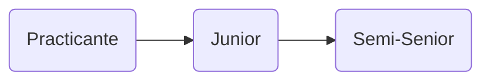
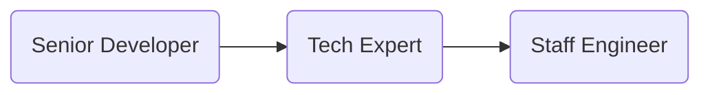
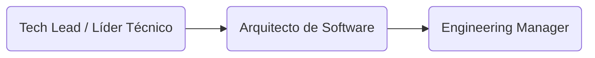
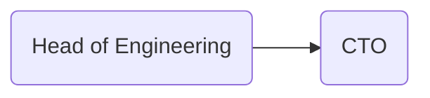
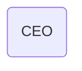

# Áreas de conocimiento y competencia

## ⚙️Path técnico en detalle

Esta sección cubre el desarrollo de capacidades técnicas a lo largo de la carrera, desde la programación y arquitectura de software hasta la dirección técnica estratégica. Se destacan las habilidades clave, herramientas, buenas prácticas y métricas de progreso para cada rol.

```mermaid
flowchart LR
  subgraph A [Phase 1: Foundations]
    A1([Intern]) -->
    A2([Junior]) -->
    A3([Semi-Senior])
  end
  style A fill:#FAD4D4,stroke:#000,stroke-width:1px

  subgraph B [Phase 2: Specialization and Seniority]
    B1([Senior]) -->
    B2([Expert]) -->
    B3([Staff Engineer])
  end
  style B fill:#B4D4FA,stroke:#000,stroke-width:1px

  subgraph C [Phase 3: Leadership and Management]
    C1([Tech Lead]) -->
    C2([Architect]) -->
    C3([Manager])
  end
  style C fill:#FFF8B0,stroke:#000,stroke-width:1px

  subgraph D [Phase 4: Technology Direction and Organizational Vision]
    D1([Head Engineering]) -->
    D2([CTO])
  end
  style D fill:#D4F4DD,stroke:#000,stroke-width:1px

  subgraph E [Phase 5: Executive Direction and Strategic Vision]
    E1([CEO])
  end
  style E fill:#EAD4F4,stroke:#000,stroke-width:1px
  %% Colores para las flechas 0-6
  linkStyle 0,1,2,3,4,5,6 stroke:#FFC300,stroke-width:2px

  %% Conexiones entre subgraphs 7-10
  A --> B
  B --> C
  C --> D
  D --> E
  linkStyle 7,8,9,10 stroke:#33FF57,stroke-width:2px

  %% Enlace de growth 11-14
  A3 --> B1
  B3 --> C1
  C3 --> D1
  D2 --> E1
  linkStyle 11,12,13,14 stroke:#3357FF,stroke-width:4px

  %% TODO: completar Eventos path técnico
  %% click A1 "#knowledge.md#1-practicante--intern-de-desarrollo-de-software" "Ir a Practicante"
  %% click A2 "#knowledge.md#2-desarrollador-junior-frontend--backend--fullstack" "Ir a Junior Dev"
  %% click A3 "#knowledge.md#3-desarrollador-semi-senior--mid-level-developer" "Ir a Ssr Senior Dev"
  %% click B1 "#knowledge.md#4-senior-developer-frontend--backend--fullstack" "Ir a Senior Engineer"
  %% click B2 "#knowledge.md#5-especialista-técnico--tech-expert" "Ir a Expert Engineer"
  %% click B3 "#knowledge.md#6-staff-engineer--principal-engineer" "Ir a Staff Engineer"
  %% click C1 "#knowledge.md#7-tech-lead--líder-técnico" "Ir a Tech Lead"
  %% click C2 "#knowledge.md#8-arquitecto-de-software--software-architect" "Ir a Architect"
  %% click C3 "#knowledge.md#9-engineering-manager" "Ir a Tech Manager"
  %% click D1 "#knowledge.md#10-head-of-engineering--director-de-tecnología" "Ir a Head Engineering"
  %% click D2 "#knowledge.md#11-cto-chief-technology-officer" "Ir a CTO"
  %% click E1 "#knowledge.md#12-ceo-chief-executive-officer" "Ir a CEO"
```

## Evaluación de habilidades técnicas

Las habilidades técnicas se pueden evaluar en plataformas con tal destino como lo son:

- [HackerRank](https://www.hackerrank.com/): Una de las plataformas más utilizadas para evaluar habilidades de programación mediante ejercicios prácticos en diversos lenguajes. Utilizada por empresas para procesos de selección técnica.
- [CodeSignal](https://codesignal.com/): Ofrece evaluaciones estandarizadas (General Coding Assessment - GCA) y personalizadas. Tiene buena cobertura para frontend, backend, estructuras de datos y algoritmos.
- [Codility](https://www.codility.com/): Ideal para evaluar habilidades algorítmicas. También ofrece casos orientados a problemas reales de desarrollo de software.
- [LeetCode](https://leetcode.com/): Aunque es más conocido como plataforma de práctica, también es usado en entrevistas técnicas. Su sección "Assessments" permite configurar y medir habilidades específicas.
- [DevSkiller](https://devskiller.com/): Permite evaluar conocimientos técnicos sobre stacks específicos (Java, .NET, Angular, etc.) y simula escenarios de desarrollo reales.
- [TestDome](https://www.testdome.com/): Enfocado en validación de habilidades con pruebas prácticas y preguntas teóricas. Buena opción para evaluar lógica, SQL y programación general.
- [Qualified.io](https://www.qualified.io/): Usado por empresas para evaluar código en tiempo real con escenarios específicos según el rol técnico.
- [Interviewing.io](https://interviewing.io/): Ofrece entrevistas técnicas simuladas de alta calidad y sesiones anónimas para practicar en condiciones reales.

### Consideraciones para elegir una plataforma

Al seleccionar una plataforma para evaluar habilidades técnicas, es importante considerar:

- **Cobertura de stack**: ¿Permite evaluar con precisión las tecnologías requeridas para el puesto?
- **Simulación del entorno real**: ¿Los ejercicios reflejan el tipo de trabajo que se espera del candidato?
- **Seguridad y antifraude**: ¿La plataforma ofrece controles que impidan respuestas copiadas o asistencia externa?
- **Experiencia del usuario**: ¿La interfaz es clara, funcional y sin fricción?
- **Reportes y métricas**: ¿Entrega informes detallados y medibles sobre el rendimiento del evaluado?

Estas herramientas son útiles no solo para reclutamiento, sino también para autoevaluación y crecimiento profesional continuo. 

## ETAPA 1: Fundamentos y crecimiento técnico

🎯**Objetivo**: Adquirir habilidades sólidas de programación, buenas prácticas y trabajo en equipo.

### 1. Practicante / Intern de Desarrollo de Software

En esta primera etapa, el [practicante][lnk-intern] se inicia en el mundo del desarrollo de software profesional. Su enfoque está en aprender, explorar herramientas básicas y comenzar a participar en tareas reales dentro de un equipo. Es un periodo fundamental para cultivar hábitos, adquirir confianza técnica y desarrollar habilidades blandas esenciales para el trabajo en equipo. Aquí se siembra la curiosidad y la capacidad de adaptación, pilares del crecimiento futuro.

### 2. Desarrollador Junior (Frontend / Backend / Fullstack)

En esta etapa, el [desarrollador junior][lnk-junior] comienza a aplicar sus conocimientos técnicos en proyectos reales con mayor autonomía. Aún requiere guía y acompañamiento frecuente, pero ya es capaz de desarrollar funcionalidades básicas, colaborar en sprints y proponer soluciones sencillas. Es un rol clave para consolidar buenas prácticas, afianzar la lógica de programación y ganar experiencia en entornos colaborativos.

### 3. Desarrollador Semi Senior / Mid-Level Developer

El [desarrollador semi senior][lnk-ssr] se desempeña con autonomía técnica en tareas de mediana y alta complejidad. Participa activamente en decisiones técnicas del equipo, guía a perfiles más junior y propone mejoras tanto en código como en procesos. Este nivel representa un punto de inflexión hacia roles de mayor liderazgo técnico y especialización. Se espera pensamiento crítico, compromiso con la calidad y una visión más estratégica del desarrollo.

---

## ETAPA 2: Especialización y seniority

🎯**Objetivo**: Convertirse en referente técnico en un stack o dominio.

### 4. Senior Developer (Frontend / Backend / Fullstack)

El [Desarrollador Senior][lnk-senior] domina su stack de tecnologías y es capaz de entregar soluciones robustas, escalables y bien estructuradas. Es autónomo, proactivo y cumple un rol clave dentro del equipo, participando en decisiones técnicas, mentoría de perfiles más juniors y contribución directa a la calidad y evolución del producto.

### 5. Especialista Técnico / Tech Expert

El [Experto en Tecnología][lnk-expert] profundiza en un área específica del desarrollo (frontend, backend, cloud, testing, performance, etc.) y se convierte en una autoridad técnica dentro de la organización. Su rol implica investigar, proponer y aplicar soluciones avanzadas, colaborar en la estandarización de prácticas, y brindar soporte técnico de alto nivel en su especialidad.

### 6. Staff Engineer / Principal Engineer

El [Staff Engineer][lnk-staff] es un líder técnico transversal que conecta equipos, proyectos y dominios. Combina visión estratégica con ejecución técnica para resolver problemas complejos a nivel de arquitectura y plataforma. Su trabajo no solo impacta un producto, sino múltiples sistemas o áreas, convirtiéndose en una figura clave en la toma de decisiones técnicas de alto nivel.

---

## ETAPA 3: Liderazgo técnico y gestión

🎯**Objetivo**: Transicionar de contribución individual a liderazgo de equipos y proyectos.

### 7. Tech Lead / Líder Técnico

El [Tech Lead][lnk-tl] es responsable de guiar técnica y estratégicamente a un equipo de desarrollo. Actúa como puente entre la ingeniería y el negocio, tomando decisiones técnicas alineadas con los objetivos del producto. Supervisa la calidad del código, impulsa buenas prácticas, facilita la planificación técnica y mentoriza al equipo.

### 8. Arquitecto de Software / Software Architect

El [Software Architect][lnk-architect] diseña y valida las decisiones estructurales que guían el desarrollo de software en términos de escalabilidad, rendimiento, seguridad y mantenibilidad. Define patrones, evalúa tecnologías y asegura la coherencia de la arquitectura en múltiples proyectos o productos. Su enfoque es holístico y de largo plazo.

### 9. Engineering Manager

El [Engineering Manager][lnk-manager] combina habilidades técnicas y de gestión para liderar equipos de ingeniería. Su foco está en el desarrollo de las personas, la entrega efectiva de proyectos y la alineación entre los objetivos técnicos y del negocio. Gestiona capacidades, facilita procesos ágiles y crea un ambiente propicio para la productividad y el crecimiento.

---

## ETAPA 4: Dirección de tecnología y visión organizacional

🎯**Objetivo**: Tener impacto en decisiones de negocio a través de la tecnología.

### 10. Head of Engineering / Director de Tecnología

El [Head of Engineering][lnk-head] es responsable de coordinar a múltiples equipos de desarrollo, asegurando la calidad técnica, la entrega eficiente y el crecimiento del talento. Actúa como puente entre la estrategia técnica y la ejecución, liderando procesos de mejora continua, planificación técnica de alto nivel y alineación con las metas de negocio. Su enfoque está en la escala, la organización del talento técnico y la madurez de los procesos de ingeniería.

### 11. CTO (Chief Technology Officer)

El [CTO][lnk-cto] define la visión tecnológica de la compañía, lidera la innovación y establece la dirección a largo plazo para el uso estratégico de la tecnología. Tiene un rol clave en la toma de decisiones a nivel ejecutivo, conectando la evolución técnica con los objetivos de negocio. Es responsable de construir una cultura técnica sólida, supervisar las arquitecturas a gran escala y representar el área técnica frente a stakeholders internos y externos.

---

## ETAPA 5: Dirección ejecutiva y/o emprendimiento

🎯**Objetivo**: Tomar decisiones integrales de negocio y crear impacto a gran escala.

### 12. CEO (Chief Executive Officer)

El [CEO][lnk-ceo] con formación técnica lidera la compañía con una perspectiva integral que fusiona tecnología, producto y negocio. Utiliza su experiencia en ingeniería para tomar decisiones estratégicas informadas sobre innovación, escalabilidad, inversión en tecnología y cultura organizacional. A diferencia de otros CEO, su enfoque está profundamente alineado con la transformación digital y el uso de la tecnología como motor de crecimiento. Es el responsable último de la visión, misión y éxito global de la organización.

---

## 🔀 ¿Puede alguien saltar entre el path técnico y el path de negocio?

✅ Sí, es posible moverse entre el path técnico y el path de negocio, pero no en cualquier momento ni de cualquier rol.
Generalmente, el salto ocurre en roles donde ya existe una intersección natural entre habilidades técnicas y de negocio.

## **De Path Técnico ➡️ a Path de Negocio**

| Rol de Origen (Técnico) | Rol de Destino (Negocio)               | Explicación                                                                                                       |
| ----------------------- | -------------------------------------- | ----------------------------------------------------------------------------------------------------------------- |
| Tech Lead               | Product Manager / Product Owner        | Un Tech Lead que domina negocio, usuarios y tecnología puede asumir la definición de producto.                    |
| Engineering Manager     | Delivery Manager / Business Lead       | Un Engineering Manager que ha gestionado entregas, KPIs y equipos puede pasar a gestionar entregas desde negocio. |
| Staff Engineer          | Business Strategist / Service Designer | Un Staff Engineer con visión de usuario y ecosistema podría especializarse en diseño de servicios.                |

> 🔥 Nota: El salto es más natural cuando la persona ya participa en discusiones de producto, clientes o roadmap.

## 📌 Consideraciones importantes

- No se recomienda saltar antes del nivel Semi-Senior o Mid-Level, porque antes no se domina lo suficiente ningún área.
- Tener habilidades híbridas (como programación + visión de usuario) facilita mucho los saltos.
- Comunicación, liderazgo y pensamiento sistémico son habilidades clave en cualquier cambio.

---

[Inicio](README.md) | [⬆️](../README.md) | [Intern](01-intern.md)

[lnk-intern]:    01-intern.md
[lnk-junior]:    02-junior.md
[lnk-ssr]:       03-ssr.md
[lnk-senior]:    04-senior.md
[lnk-expert]:    05-expert.md
[lnk-staff]:     06-staff.md
[lnk-tl]:        07-tl.md
[lnk-architect]: 08-architect.md
[lnk-manager]:   09-manager.md
[lnk-head]:      10-head.md
[lnk-cto]:       11-cto.md
[lnk-ceo]:       12-ceo.md
