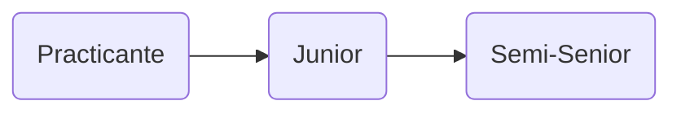
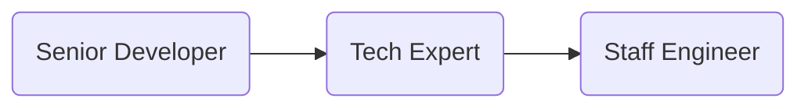
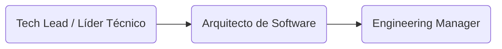
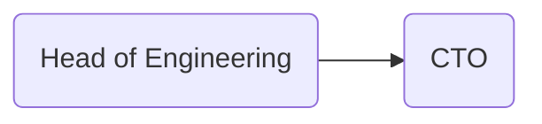
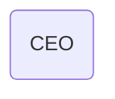
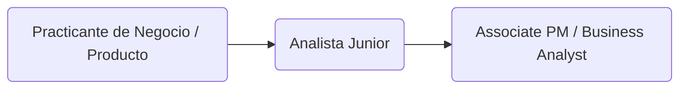
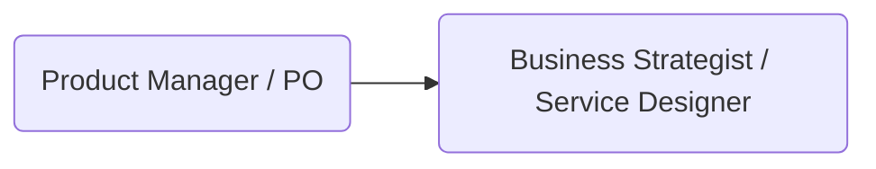
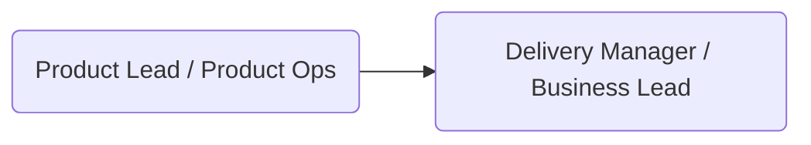
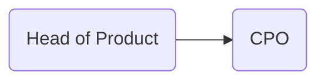
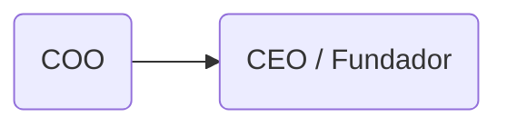

# PROFESSIONAL PATH

✨ Introducción personal al modelo Orbit5
Durante mi más reciente proceso de autoreconocimiento, sentí la necesidad de hacer una pausa en mi vida profesional. Quería entender con mayor claridad hacia dónde quería ir y cómo podía estructurar mi crecimiento. En ese camino, descubrí que el desarrollo profesional ha evolucionado: hoy contamos con modelos y marcos de referencia que no solo inspiran, sino que también facilitan tomar decisiones conscientes sobre nuestra trayectoria.

Así nace mi versión adaptada del modelo Orbit5, una forma clara, estructurada y flexible de visualizar la evolución de carrera tanto en el stack técnico como en el de negocio, desde los primeros pasos hasta roles ejecutivos como CEO.

🌟 Orbit5

Orbit5 es un modelo de progresión profesional diseñado para mapear el crecimiento desde practicante hasta CEO, integrando tanto el stack técnico como el de negocio. Basado en frameworks de empresas globales como Google, Stripe y GitLab, este modelo combina habilidades duras, esenciales y niveles de impacto organizacional.

Está dividido en cinco etapas evolutivas:

1. Fundamentos
2. Especialización y seniority
3. Liderazgo y gestión
4. Dirección y visión organizacional
5. Dirección ejecutiva y visión estratégica

> Cada etapa representa un salto no solo de responsabilidad, sino de propósito profesional sin olvidar las tareas interiorizadas en el rol anterior.
>
> *Coloquialmente hablando, solo cuando se entiende y se vive de forma natural las caracteristicas del siguiente rol, es hora de un ascenso.*

````mermaid
flowchart LR
    %% Subgraph para Phase 1
    subgraph A [Phase 1: Foundations]
      direction TB
        subgraph A1 [Tech]
          direction TB
            A11([Intern]) -->
            A12([Junior]) -->
            A13([Semi-Senior])
        end
        subgraph A2 [Business]
          direction TB
            A21([Intern]) -->
            A22([Junior]) -->
            A23([Associate PM])
        end
    end

    A13 --> B11
    A23 --> B21

    %% Subgraph para Phase 2
    subgraph B [Phase 2: Specialization and Seniority]
      direction TB
        subgraph B1 [Tech]
          direction TB
            B11([Senior]) -->
            B12([Expert]) -->
            B13([Staff Engineer])
        end
        subgraph B2 [Businnes]
          direction TB
            B21([PO]) -->
            B22([Business Strategist])
        end
    end

    B13 --> C11
    B22 --> C21

    %% Subgraph para Phase 3
    subgraph C [Phase 3: Leadership and Management]
      direction TB
        subgraph C1 [Tech]
          direction TB
            C11([Tech Lead]) -->
            C12([Architect]) -->
            C13([Manager])
        end
        subgraph C2 [Business]
          direction TB
            C21([PL]) -->
            C22([BL])
        end
    end

    C13 --> D11
    C22 --> D21

    %% Subgraph para Phase 4
    subgraph D [Phase 4: Technology Direction and Organizational Vision]
      direction TB
        subgraph D1 [Tech]
          direction TB
            D11([Head Engineering]) -->
            D12([CTO])
        end
        subgraph D2 [Business]
          direction TB
            D21([Head of Product]) -->
            D22([CPO])
        end
    end

    D12 --> E11
    D22 --> E21

    %% Subgraph para Phase 5
    subgraph E [Phase 5: Executive Direction and Strategic Vision]
      direction TB
        subgraph E1 [Tech]
          direction TB
            E11([CEO])
        end
        subgraph E2 [Business]
          direction TB
            E21([COO]) -->
            E22([CEO])
        end
    end

    %% 🔀 Cruce entre paths
    C11 -.-> C21
    C13 -.-> C22
    B13 -.-> B22

    B21 -.-> C11
    A23 -.-> A13
    C22 -.-> C13

    %% Conexiones entre subgraphs
    A --> B
    B --> C
    C --> D
    D --> E

    %% Estilos para los subgraphs
    style A fill:#FAD4D4,stroke:#000,stroke-width:1px
    style B fill:#B4D4FA,stroke:#000,stroke-width:1px
    style C fill:#FFF8B0,stroke:#000,stroke-width:1px
    style D fill:#D4F4DD,stroke:#000,stroke-width:1px
    style E fill:#EAD4F4,stroke:#000,stroke-width:1px

    %% Colores para las flechas
    linkStyle 0,1,2,3,6,7,8,11,12,13,16,17,20 stroke:#FFC300,stroke-width:2px
    linkStyle 4,5,9,10,14,15,18,19 stroke:#33FF57,stroke-width:2px
    linkStyle 21,22,23 stroke:#3357FF,stroke-width:4px
    linkStyle 24,25,26 stroke:#FF5733,stroke-width:4px
    linkStyle 27,28,29,30 stroke:#DAF7A6,stroke-width:6px
````

___

## 🪐 Las 5 Órbitas del Modelo Orbit5

### ETAPA 1: Fundamentos

🧱 “Aprender haciendo, crecer observando.”

**Propósito**: Iniciar el camino profesional con foco en adquirir buenas prácticas, adaptarse al entorno de trabajo y comenzar a colaborar con otros.

**Nivel de impacto**: Individual operativo

**🔧Hard Skills**:

- Fundamentos técnicos.
- Manejo básico de herramientas.
- Análisis de datos iniciales.

**🧠 Essential Skills**:

- Comunicación básica
- Actitud de aprendizaje.
- Responsabilidad.

**✅ Indicadores de progreso**:

- Entrega tareas con supervisión.
- Participa en ceremonias o ciclos de entrega.
- Comienza a sugerir mejoras pequeñas.

### ETAPA 2: Especialización y Seniority

🎯 “Domina una parte del sistema, aporta con confianza.”

**Propósito**: Convertirse en un contribuidor autónomo y confiable, experto en su especialidad, dueño de soluciones dentro de su área.

**Nivel de impacto**: Individual con influencia en el equipo

**🔧Hard Skills**:

- Dominio del stack.
- Testing.
- Diseño de servicios.
- Roadmapping.

**🧠 Essential Skills**:

- Pensamiento crítico.
- Resolución de problemas.
- Colaboración avanzada.

**✅ Indicadores de progreso**:

- Lidera pequeñas iniciativas.
- Mejora procesos o Soluciones existentes.
- Propone y argumenta decisiones basadas en datos.

### ETAPA 3: Liderazgo y Gestión

🤝 “Multiplica el valor a través de otros.”

**Propósito**: Coordinar a otros, facilitar colaboración entre áreas, garantizar entregas de valor con equipos diversos.

**Nivel de impacto**: Liderazgo técnico o de producto con visión transversal.

**🔧Hard Skills**:

- Arquitectura.
- Planificación.
- Gobernanza de producto.
- Colaboración, co-creación y gestión de los OKRs.

**🧠 Essential Skills**:

- Liderazgo situacional.
- Accountability.
- Manejo de conflictos.

**✅ Indicadores de progreso**:

- Coordina personas.
- Coordina objetivos.
- Define prioridades técnicas o estratégicas.
- Garantiza cumplimiento de entregas.

### ETAPA 4: Dirección y Visión Organizacional

🧭 “Define la dirección para que otros avancen.”

**Propósito**: Diseñar y ejecutar la estrategia técnica o de producto, escalar estructuras, contratar talento clave y definir dirección.

**Nivel de impacto**: Organizacional

**🔧 Hard Skills**:

- Roadmapping estratégico.
- Definición de KPIs.
- Estrategia tecnológica o de producto.

**🧠 Essential Skills**:

- Pensamiento sistémico.
- Liderazgo organizacional.
- Visión de largo plazo.

**✅ Indicadores de progreso**:

- Influye sobre múltiples equipos.
- Establece procesos globales.
- Representa la función ante dirección ejecutiva.

### ETAPA 5: Dirección Ejecutiva / Visionario

🌐 “Crea y lidera organizaciones desde la visión.”

**Propósito**: Liderar compañías o unidades de negocio con una visión integral de impacto global, sustentabilidad y cultura.

**Nivel de impacto**: Empresarial y de mercado.

**🔧 Hard Skills**:

- Estrategia de negocio.
- Escalabilidad.
- Innovación.
- Finanzas.

**🧠 Essential Skills**:

- Influencia institucional.
- Adaptabilidad.
- Liderazgo visionario.

**✅ Indicadores de progreso**:

- Define cultura organizacional.
- Decide sobre modelo de negocio y expansión.
- Lidera visión e innovación a largo plazo.

___

## 🔀 ¿Puede alguien saltar entre el path técnico y el path de negocio?

✅ Sí, es posible moverse entre el path técnico y el path de negocio, pero no en cualquier momento ni de cualquier rol.
Generalmente, el salto ocurre en roles donde ya existe una intersección natural entre habilidades técnicas y de negocio.

### 🚀 ¿Desde qué roles se puede hacer el cambio?

#### **De Path Técnico ➡️ a Path de Negocio**

| Rol de Origen (Técnico) | Rol de Destino (Negocio)               | Explicación                                                                                                       |
| ----------------------- | -------------------------------------- | ----------------------------------------------------------------------------------------------------------------- |
| Tech Lead               | Product Manager / Product Owner        | Un Tech Lead que domina negocio, usuarios y tecnología puede asumir la definición de producto.                    |
| Engineering Manager     | Delivery Manager / Business Lead       | Un Engineering Manager que ha gestionado entregas, KPIs y equipos puede pasar a gestionar entregas desde negocio. |
| Staff Engineer          | Business Strategist / Service Designer | Un Staff Engineer con visión de usuario y ecosistema podría especializarse en diseño de servicios.                |

> 🔥 Nota: El salto es más natural cuando la persona ya participa en discusiones de producto, clientes o roadmap.

#### **De Path de Negocio ➡️ a Path Técnico**

| Rol de Origen (Negocio)          | Rol de Destino (Técnico)                      | Explicación                                                                                                              |
| -------------------------------- | --------------------------------------------- | ------------------------------------------------------------------------------------------------------------------------ |
| Product Manager / Product Owner  | Tech Lead (en proyectos muy técnicos)         | Si domina muy bien aspectos técnicos de producto (APIs, arquitecturas, flujos de datos) podría liderar equipos técnicos. |
| Business Analyst / Associate PM  | Mid-Level Developer (con formación adicional) | Si decide profundizar en programación podría reinsertarse como desarrollador intermedio.                                 |
| Business Lead / Delivery Manager | Engineering Manager                           | En casos de fuerte experiencia gestionando equipos técnicos y proyectos de ingeniería.                                   |

> 🔥 Nota: Este tipo de salto requiere generalmente re-skilling técnico (aprender programación avanzada, arquitecturas, etc.).

### **🎯 Resumen visual sencillo**

````mermaid
flowchart TD
  TechLead -->|interés en negocio| ProductManager
  EngineeringManager -->|gestión de entregas| DeliveryManager
  StaffEngineer -->|visión de usuarios| BusinessStrategist

  ProductManager -->|dominio técnico| TechLead
  AssociatePM -->|formación técnica| MidDeveloper
  DeliveryManager -->|experiencia técnica| EngineeringManager
````

#### 📌 Consideraciones importantes

- No se recomienda saltar antes del nivel Semi-Senior o Mid-Level, porque antes no se domina lo suficiente ningún área.
- Tener habilidades híbridas (como programación + visión de usuario) facilita mucho los saltos.
- Comunicación, liderazgo y pensamiento sistémico son habilidades clave en cualquier cambio.

## ⚙️Path técnico en detalle

### ETAPA 1: Fundamentos y crecimiento técnico

🎯**Objetivo**: Adquirir habilidades sólidas de programación, buenas prácticas y trabajo en equipo.



1. [Practicante / Intern de Desarrollo de Software](./knowledge/intern.md)
   - 🔧 Hard Skills
     - Fundamentos de programación (ej. JavaScript, Python, HTML5/CSS3)
     - Uso básico de Git y plataformas como GitHub/GitLab
     - Comprensión inicial de estructuras de datos y algoritmos
     - Introducción a metodologías ágiles (Scrum, Kanban)
   - 🧠 Essential Skills
     - Ganas de aprender y superarse
     - Comunicación clara y receptiva
     - Capacidad para recibir feedback sin frustración
     - Trabajo colaborativo en entornos nuevos
   - ✅ Criterios de desempeño
     - Participa en tareas con acompañamiento
     - Pide ayuda oportunamente
     - Documenta lo que aprende
2. [Desarrollador Junior (Frontend / Backend / Fullstack)](./knowledge/junior.md)
   - 🔧 Hard Skills
     - Programación orientada a objetos (POO)
     - Uso de frameworks (React, Angular, Vue, Django, Next, etc.)
     - Construcción de APIs simples (REST/GraphQL)
     - Bases de datos relacionales y NoSQL básicas
   - 🧠 Essential Skills
     - Organización personal y manejo del tiempo
     - Resolución básica de bugs o errores
     - Colaboración fluida con el equipo
     - Adaptabilidad a cambios técnicos
   - ✅ Criterios de desempeño
     - Cumple tareas técnicas con supervisión
     - Participa activamente en sprints o entregas
     - Mejora continua con base en feedback
3. [Desarrollador Semi Senior / Mid-Level Developer](./knowledge/mid-developer.md)
   - 🔧 Hard Skills
     - Desarrollo de componentes reutilizables y eficientes
     - Testing unitario y de integración
     - Integración y consumo de APIs externas
     - Gestión avanzada de ramas en Git (merge, rebase, PRs)
     - Documentación técnica eficiente
   - 🧠 Essential Skills
     - Pensamiento crítico en la toma de decisiones
     - Autonomía técnica en tareas asignadas
     - Capacidad para estimar esfuerzos y tiempos
     - Propuesta activa de mejoras al código y procesos
   - ✅ Criterios de desempeño
     - Ejecuta tareas complejas con mínima supervisión
     - Apoya a desarrolladores junior
     - Participa en decisiones técnicas a nivel de equipo

___

### ETAPA 2: Especialización y seniority

🎯**Objetivo**: Convertirse en referente técnico en un stack o dominio.



<!-- markdownlint-disable MD029 -->
1. [Senior Developer (Frontend / Backend / Fullstack)](./knowledge/senior.md)
   - 🔧 Hard Skills:
     - Dominio completo de su stack (frameworks, testing, patrones).
     - CI/CD
     - Performance
     - Buenas prácticas
   - 🧠 Essential Skills:
     - Mentoring activo
     - Ownership
     - Comunicación técnica efectiva
   - ✅ Criterios de desempeño:
     - Lidera el desarrollo de módulos o features completas.
     - Mejora la calidad del código, cubrimiento de pruebas y rendimiento.
     - Apoya la evolución del stack y detecta deuda técnica.
2. [Especialista Técnico / Tech Expert](./knowledge/tech-expert)
   - 🔧 Hard Skills:
     - Experticia profunda en una tecnología o disciplina.
     - Tooling
     - Auditoría técnica, performance y escaneo continuo.
   - 🧠 Essential Skills:
     - Curiosidad profesional
     - Liderazgo técnico no jerárquico
     - Pensamiento crítico
   - ✅ Criterios de desempeño:
     - Se enfoca en un área crítica: DevOps, QA, Arquitectura, Seguridad, Data.
     - Define estándares y mejores prácticas del área.
     - Participa en la toma de decisiones estratégicas de producto desde su expertise.
3. [Staff Engineer / Principal Engineer](./knowledge/staff-engineer.md)
   - 🔧 Hard Skills:
     - Sistemas distribuidos
     - Arquitectura evolutiva
     - Diseño de plataformas
   - 🧠 Essential Skills:
     - Pensamiento sistémico
     - Influencia sin autoridad
     - Visión técnica de largo plazo
   - ✅ Criterios de desempeño:
     - Diseña e influencia la arquitectura general de sistemas.
     - Trabaja transversalmente entre múltiples equipos.
     - Promueve cultura de ingeniería, escalabilidad, y sostenibilidad del stack.

___

### ETAPA 3: Liderazgo técnico y gestión

🎯**Objetivo**: Transicionar de contribución individual a liderazgo de equipos y proyectos.



1. [Tech Lead / Líder Técnico](./knowledge/tech-lead)
   - 🔧 Hard Skills
     - Propiedad de la base de código y la arquitectura a nivel de equipo
     - Revisión y calidad de código en PRs
     - Conocimiento de metodologías ágiles y su aplicación en el equipo
     - Gestión de tareas y estimaciones técnicas
   - 🧠 Essential Skills
     - Liderazgo técnico
     - Capacidad de motivar al equipo
     - Toma de decisiones técnicas con enfoque en el impacto a largo plazo
     - Habilidad para equilibrar la mentoría con las entregas del equipo
     - Comunicación efectiva entre el equipo y otros stakeholders
   - ✅ Criterios de desempeño
     - Coordina las tareas técnicas y entrega del equipo
     - Toma decisiones técnicas informadas y justifica sus elecciones
     - Mentorea a los miembros del equipo
     - Fomenta un ambiente de colaboración
2. [Arquitecto de Software / Software Architect](./knowledge/architect.md)
    - 🔧 Hard Skills
      - Definición de la arquitectura global de sistemas y aplicaciones
      - Selección de herramientas y tecnologías adecuadas para el equipo
      - Diseño de soluciones escalables, seguras y eficientes
      - Integración de sistemas y coordinación técnica entre equipos
    - 🧠 Essential Skills
      - Pensamiento sistémico y visión a largo plazo
      - Capacidad para guiar decisiones críticas que impactan toda la organización
      - Habilidad para comunicar complejas soluciones técnicas de manera clara y accesible
      - Adaptabilidad ante cambios en la arquitectura o nuevos requerimientos
    - ✅ Criterios de desempeño
      - Toma decisiones sobre la arquitectura de alto nivel
      - Asegura la cohesión técnica entre equipos y sistemas
      - Realiza presentaciones claras a stakeholders para justificar decisiones arquitectónicas
3. [Engineering Manager](./knowledge/engineering-manager.md)
   - 🔧 Hard Skills
     - Gestión de proyectos técnicos y visión a largo plazo
     - Conocimiento profundo de procesos de contratación y gestión de recursos humanos
     - Estrategias de optimización de equipos y procesos dentro de la ingeniería
     - Evaluación y análisis de rendimiento técnico y personal
   - 🧠 Essential Skills
     - Liderazgo de personas, enfoque en el crecimiento individual del equipo
     - Toma de decisiones organizacionales en cuanto a personal y proyectos
     - Capacidad para gestionar relaciones entre múltiples equipos y stakeholders
     - Empatía y habilidades para manejar conflictos dentro del equipo
   - ✅ Criterios de desempeño
     - Lidera un equipo técnico alineado con los objetivos de la empresa
     - Mantiene la moral alta del equipo y promueve un entorno de trabajo colaborativo
     - Supervisa el desempeño y crecimiento de los miembros del equipo

___

### ETAPA 4: Dirección de tecnología y visión organizacional

🎯**Objetivo**: Tener impacto en decisiones de negocio a través de la tecnología.



10. [Head of Engineering / Director de Tecnología](./knowledge/head-of-engineering.md)
    - 🔧 Habilidades técnicas (hard skills):
      - Diseño y evolución de arquitectura a gran escala.
      - Gestión de múltiples equipos y portafolios técnicos.
      - Definición de KPIs técnicos y métricas de performance.
      - Selección y evolución del tech stack.
      - Gestión de presupuestos técnicos y decisiones de compra.
    - 🧠 Habilidades esenciales (essential skills):
      - Liderazgo organizacional y pensamiento sistémico.
      - Comunicación estratégica con otros departamentos (Producto, Negocio, Finanzas).
      - Influencia transversal.
      - Mentoreo a líderes técnicos.
      - Gestión del cambio y escalabilidad de procesos.
    - ✅ Criterios de desempeño:
      - Supervisa y empodera a Tech Leads y Engineering Managers.
      - Promueve una cultura de excelencia técnica y colaboración.
      - Participa en decisiones de negocio y roadmap estratégico.
      - Escala estructuras de equipo técnico acorde a las metas de la empresa.
11. [CTO (Chief Technology Officer)](./knowledge/cto.md)
    - 🔧 Habilidades técnicas (hard skills):
      - Definición de visión tecnológica alineada al negocio.
      - Innovación en productos y servicios desde el frente técnico.
      - Diseño de estrategia de escalamiento y transformación digital.
      - Gobernanza técnica y ciberseguridad organizacional.
      - Supervisión de arquitectura global y estándares técnicos.
    - 🧠 Habilidades esenciales (essential skills):
      - Visión holística y pensamiento estratégico de largo plazo.
      - Habilidades de comunicación ejecutiva (con CEO, inversores, etc.).
      - Capacidad de traducir conceptos técnicos a lenguaje de negocio.
      - Construcción de cultura tech-first.
      - Alta adaptabilidad al cambio tecnológico y del mercado.
    - ✅ Criterios de desempeño:
      - Representa el área técnica en el comité ejecutivo.
      - Define la visión tecnológica y coordina su implementación global.
      - Lidera decisiones fundacionales de producto, innovación y escalabilidad.
      - Influye en decisiones de inversión técnica y expansión.

___

### ETAPA 5: Dirección ejecutiva y/o emprendimiento

🎯**Objetivo**: Tomar decisiones integrales de negocio y crear impacto a gran escala.



12. [CEO (Chief Executive Officer)](./knowledge/ceo.md)
    - 🔧 Hard Skills:
      - Dirección estratégica, finanzas, cultura y relaciones públicas.
      - Toma de decisiones sobre modelo de negocio y crecimiento.
      - Supervisión de todos los C-Level (CTO, CPO, COO, etc.).
    - 🧠 Essential Skills:
      - Liderazgo visionario.
      - Inteligencia emocional y política.
      - Adaptabilidad y resiliencia.
    - ✅ Criterios observables:
      - Toma decisiones finales sobre la empresa.
      - Define la visión organizacional.
      - Lidera relaciones con inversionistas y stakeholders clave.
<!-- markdownlint-enable MD029 -->

___

## 🧭 Path de Negocio (Business & Product)

### ETAPA 1: Fundamentos de negocio

🎯**Objetivo**: Comprender procesos de producto/negocio, colaborar en validación, investigación y tareas operativas.



1. Practicante de Negocio / Producto
   - 🔧 Hard skills:
     - Conocimientos básicos en análisis.
     - Herramientas y metodologías ágiles.
   - 🧠 Essential skills:
     - Comunicación clara.
     - Curiosidad.
     - Apertura al feedback.
   - ✅ Criterios de desempeño:
     - Participa en documentación.
     - Entrevistas.
     - Pruebas o investigaciones.
2. Analista Junior / Asistente de Producto
   - 🔧 Hard skills:
     - Métricas básicas.
     - Wireframes simples.
     - Backlog grooming.
   - 🧠 Essential skills:
     - Trabajo colaborativo.
     - Responsabilidad.
     - Proactividad.
   - ✅ Criterios de desempeño:
     - Apoya definiciones funcionales.
     - Mantiene tareas operativas al día.
3. Associate Product Manager / Business Analyst
   - 🔧 Hard skills:
     - Recolección de datos.
     - Definición de requisitos.
     - Colaboración con tech.
   - 🧠 Essential skills:
     - Pensamiento crítico.
     - Iniciativa.
     - Presentación de insights.
   - ✅ Criterios de desempeño:
     - Identifica oportunidades de mejora e impacto en usuarios o negocio.

___

### ETAPA 2: Especialización y Seniority Business
<!-- markdownlint-disable MD029 -->

🎯**Objetivo**: Ser responsable de áreas funcionales, definir roadmap, trabajar con KPIs y liderar equipos pequeños.



4. Product Manager / Product Owner
   - 🔧 Hard skills:
     - Roadmapping.
     - OKRs.
     - Métricas de producto.
     - Priorización.
   - 🧠 Essential skills:
     - Visión estratégica.
     - Gestión de stakeholders.
   - ✅ Criterios de desempeño:
     - Dirige equipos de desarrollo, alinea producto con objetivos de negocio.
5. Business Strategist / Service Designer
   - 🔧 Hard skills:
     - Diseño de servicios.
     - Customer journeys.
     - Análisis de propuestas de valor.
   - 🧠 Essential skills:
     - Empatía
     - Visión de sistema.
     - Comunicación con equipos multifuncionales.
   - ✅ Criterios de desempeño:
     - Mejora experiencia.
     - Entrega de valor al cliente.

___

### ETAPA 3: Liderazgo y Gestión business

🎯**Objetivo**: Liderar equipos de producto, escalar procesos y lograr resultados medibles.



6. Product Lead / Product Operations
   - 🔧 Hard skills:
     - Gobierno de producto.
     - Alineación cross-funcional.
     - Definición de procesos.
   - 🧠 Essential skills:
     - Accountability.
     - Mentoring.
     - Toma de decisiones basadas en datos.
   - ✅ Criterios de desempeño:
     - Supervisa otros PMs.
     - Optimiza estrategia y rendimiento de producto.
7. Delivery Manager / Business Lead
   - 🔧 Hard skills:
     - Planificación.
     - Cumplimiento de entregas.
     - Seguimiento de objetivos.
   - 🧠 Essential skills:
     - Enfoque a resultados.
     - Resolución de conflictos.
     - Liderazgo operativo.
   - ✅ Criterios de desempeño:
     - Asegura el delivery de alto impacto con calidad y eficiencia.

___

### ETAPA 4: Dirección y Visión Organizacional business

🎯**Objetivo**: Escalar productos, equipos y cultura desde una perspectiva estratégica.



8. Head of Product
   - 🔧 Hard skills:
     - Dirección de portafolio.
     - Gobernanza.
     - Métricas globales.
   - 🧠 Essential skills:
     - Liderazgo organizacional.
     - Visión estratégica.
     - Influencia cultural.
   - ✅ Criterios de desempeño:
     - Define objetivos de toda el área de producto y mide impacto general.
9. CPO (Chief Product Officer)
   - 🔧 Hard skills:
     - Innovación a nivel organizacional.
     - Alineación con visión y negocio.
   - 🧠 Essential skills:
     - Influencia transversal.
     - Pensamiento sistémico.
     - Visión de impacto global.
   - ✅ Criterios de desempeño:
     - Escala la estrategia de producto con impacto en la organización completa.

___

### ETAPA 5: Dirección Ejecutiva y Visión Global

🎯**Objetivo**: Liderar o crear empresas con visión completa de negocio, crecimiento e innovación.



10. COO (Chief Operating Officer)
    - 🔧 Hard skills:
      - Estrategia operacional.
      - Gestión de recursos.
      - Procesos y eficiencia.
    - 🧠 Essential skills:
      - Coordinación de áreas.
      - Orientación al rendimiento global.
    - ✅ Criterios de desempeño:
      - Supervisa ejecución y entrega de valor en todos los frentes del negocio.
11. CEO / Fundador de Empresa
    - 🔧 Hard skills:
      - Liderazgo de alto nivel.
      - Estrategia corporativa.
      - Relaciones con inversores.
    - 🧠 Essential skills:
      - Cultura organizacional.
      - Visión de mercado.
      - Innovación constante.
    - ✅ Criterios de desempeño:
      - Representa a la empresa.
      - Toma decisiones estratégicas y asegura crecimiento.
