```mermaid
%%graph TD
flowchart LR
%%flowchart TD
    subgraph Etapa1 [ETAPA 1]
        direction TB

        style Etapa1 fill:#FAD4D4,stroke:#000,stroke-width:1px

        A1(✔️ Practicante / Intern)
        A2(✔️ Desarrollador Junior)
        A3(✔️ Desarrollador Semi Senior)
    end

    subgraph Etapa2 [ETAPA 2]
        direction TB

        style Etapa2 fill:#FFE5B4,stroke:#000,stroke-width:1px

        B1(✔️ Senior Developer)
        B2(Staff Engineer / Principal Engineer)
    end

    subgraph Etapa3 [ETAPA 3]
        style Etapa3 fill:#FFF8B0,stroke:#000,stroke-width:1px
        C1(Tech Lead) --> C2(Engineering Manager)
        C2 --> C3(Arquitecto de Software)
    end

    subgraph Etapa4 [ETAPA 4]
        style Etapa4 fill:#D4F4DD,stroke:#000,stroke-width:1px
        D1(Head of Engineering) --> D2(CTO)
    end

    subgraph Etapa5 [ETAPA 5]
        style Etapa5 fill:#EAD4F4,stroke:#000,stroke-width:1px
        E1(COO) --> E2(CEO)
        E2 --> E3(Fundador / Co-Fundador)
        E3 --> E4(Empresario / Inversionista / Mentor)
    end

    %% Enlace entre nodos
    A1 --> A2 --> A3
    B1 --> B2

    %% Enlaces entre etapas
    A3 --> B1
    B2 --> C1
    C3 --> D1
    D2 --> E1

    %% Vinculos
    click A1 "#/professional-path?id=practicante--intern-de-desarrollo-de-software" "Ir a Practicante"
    click A2 "#/professional-path?id=desarrollador-junior-frontend-backend-o-fullstack" "Ir a Junior"
    click A3 "#/professional-path?id=desarrollador-junior-frontend-backend-o-fullstack" "Ir a Semi-senior"
    click B1 "#professional-path?id=etapa-2-especialización-y-seniority" "Ir a Senior"
```

___

# ETAPA 1: Fundamentos y crecimiento técnico

Objetivo: Adquirir habilidades sólidas de programación, buenas prácticas y trabajo en equipo.

## Practicante / Intern de Desarrollo de Software
* Habilidades técnicas (duras):
  * Conocimiento básico de programación (JavaScript, Python, Java, etc.)
  * Uso de sistemas de control de versiones (Git)
  * Comprensión de algoritmos y estructuras de datos
  * Familiaridad con metodologías ágiles

* Habilidades esenciales:
  * Ganas de aprender
  * Comunicación clara
  * Capacidad para recibir feedback
  * Trabajo en equipo

## Desarrollador Junior (Frontend, Backend o Fullstack)
* Habilidades técnicas:
  * Programación orientada a objetos
  * Manejo básico de frameworks (React, Angular, Spring, Django)
  * Creación de APIs simples
  * Conocimientos básicos de bases de datos (SQL, NoSQL)
* Habilidades esenciales:
  * Organización y responsabilidad
  * Resolución básica de problemas
  * Colaboración en equipo
  * Adaptabilidad

## Desarrollador Semi Senior / Mid-Level Developer
* Habilidades técnicas:
  * Desarrollo de componentes reutilizables
  * Testing (unitario, integración)
  * Consumo e integración de APIs
  * Gestión de versiones y ramas en Git
* Habilidades esenciales:
  * Pensamiento crítico
  * Mejora continua
  * Autonomía
  * Capacidad para estimar tareas

# ETAPA 2: Especialización y seniority

Objetivo: Convertirse en referente técnico en un stack o dominio.

4. Senior Developer (Frontend / Backend / Fullstack)
  * Lidera el desarrollo de módulos completos.
  * Mentorea a juniors y semi-seniors.
  * Optimiza rendimiento, escalabilidad y arquitectura.

5. Staff Engineer / Principal Engineer (opcional si decides mantener la vía técnica)
  * Define buenas prácticas y guía a varios equipos sin rol jerárquico directo.

# ETAPA 3: Liderazgo técnico y gestión

Objetivo: Transicionar de contribución individual a liderazgo de equipos y proyectos.

6. Tech Lead / Líder Técnico
  * Coordina esfuerzos técnicos de un equipo.
  * Balancea código con mentoría y toma de decisiones técnicas.

7. Engineering Manager
  * Lidera personas, no solo proyectos.
  * Maneja contrataciones, evaluaciones de desempeño y planificación estratégica.

8. Arquitecto de Software (opcional si quieres consolidar visión técnica de alto nivel)
  * Define la arquitectura general de los sistemas.
  * Coordina con varios equipos técnicos.

# ETAPA 4: Dirección de tecnología y visión organizacional

Objetivo: Tener impacto en decisiones de negocio a través de la tecnología.

9. Head of Engineering / Director de Tecnología
  * Supervisa múltiples equipos técnicos y sus líderes.
  * Participa en decisiones estratégicas del negocio.

10. CTO (Chief Technology Officer)
  * Define la visión tecnológica de toda la organización.
  * Alinea tech con producto, negocio y estrategia a largo plazo.

# ETAPA 5: Dirección ejecutiva y/o emprendimiento

Objetivo: Tomar decisiones integrales de negocio y crear impacto a gran escala.

11. COO (Chief Operating Officer) (opcional si quieres enfocarte en operaciones más allá de tech)
  * Gestiona procesos, recursos y áreas operativas.

12. CEO (Chief Executive Officer)
  * Responsable de la visión, estrategia y resultados de toda la empresa.
  * Lidera la cultura, relaciones con inversionistas y crecimiento general.

13. Fundador / Co-Fundador de Empresa Tech
  * Crea una startup desde cero.
  * Combina visión técnica, de producto, negocio y equipo.

14. Empresario / Inversionista / Mentor (fases avanzadas)
  * Lanza o invierte en múltiples negocios.
  * Participa como mentor o board member en otras compañías.
