```mermaid
flowchart LR
  subgraph A [Phase 1: Foundations]
    subgraph A1 [Tech]
      A11([Intern]) -->
      A12([Junior]) -->
      A13([Semi-Senior])
    end
    subgraph A2 [Business]
      A21([Intern]) -->
      A22([Junior]) -->
      A23([Associate PM])
    end
  end
  style A fill:#FAD4D4,stroke:#000,stroke-width:1px

  subgraph B [Phase 2: Specialization and Seniority]
    subgraph B1 [Tech]
      B11([Senior]) -->
      B12([Expert]) -->
      B13([Staff Engineer])
    end
    subgraph B2 [Businnes]
      B21([PO]) -->
      B22([Business Strategist])
    end
  end
  style B fill:#B4D4FA,stroke:#000,stroke-width:1px

  subgraph C [Phase 3: Leadership and Management]
    subgraph C1 [Tech]
      C11([Tech Lead]) -->
      C12([Architect]) -->
      C13([Manager])
    end
    subgraph C2 [Business]
      C21([PL]) -->
      C22([BL])
    end
  end
  style C fill:#FFF8B0,stroke:#000,stroke-width:1px

  subgraph D [Phase 4: Technology Direction and Organizational Vision]
    subgraph D1 [Tech]
      D11([Head Engineering]) -->
      D12([CTO])
    end
    subgraph D2 [Business]
      D21([Head of Product]) -->
      D22([CPO])
    end
  end
  style D fill:#D4F4DD,stroke:#000,stroke-width:1px

  subgraph E [Phase 5: Executive Direction and Strategic Vision]
    E1([CEO])
    subgraph E2 [Business]
      E21([COO])
    end
    E21 --> E1
  end
  style E fill:#EAD4F4,stroke:#000,stroke-width:1px
  %% Colores para las flechas 0-12
  linkStyle 0,1,2,3,4,5,6,7,8,9,10,11,12 stroke:#FFC300,stroke-width:2px

  %% Conexiones entre subgraphs 13-16
  A --> B
  B --> C
  C --> D
  D --> E
  linkStyle 13,14,15,16 stroke:#33FF57,stroke-width:2px

  %% Enlace de growth 17-24
  A13 --> B11
  A23 --> B21
  B13 --> C11
  B22 --> C21
  C13 --> D11
  C22 --> D21
  D12 --> E1
  D22 --> E21
  linkStyle 17,18,19,20,21,22,23,24 stroke:#3357FF,stroke-width:4px

  %% 🔀 Cruce desde tech a business 25-27
  C11 -. Interés en negocio .-> C21
  C13 -. Gestión de entregas .-> C22
  B13 -. Visión de usuarios .-> B22
  linkStyle 25,26,27 stroke:#FF5733,stroke-width:4px

  %% 🔀 Cruce desde business a tech 28-31
  B21 -. Dominio técnico .-> C11
  A23 -. Formación técnica .-> A13
  C22 -. Experiencia técnica .-> C13
  D22 -.-> E1
  linkStyle 28,29,30,31 stroke:#BE74D2,stroke-width:6px

  %% Colaboraciones 32-34
  D12 -. Colaboración Estratégica .- D21
  D11 -. Visión de Producto .- D22
  E21 -. Colabora con .- E1
  linkStyle 32,33,34 stroke:#74D2C9,stroke-width:6px

  %% Eventos path técnico
  click A11 "#knowledge.md#1-practicante--intern-de-desarrollo-de-software" "Ir a Practicante"
  click A12 "#knowledge.md#2-desarrollador-junior-frontend--backend--fullstack" "Ir a Junior Dev"
  click A13 "#knowledge.md#3-desarrollador-semi-senior--mid-level-developer" "Ir a Ssr Senior Dev"
  click B11 "#knowledge.md#4-senior-developer-frontend--backend--fullstack" "Ir a Senior Engineer"
  click B12 "#knowledge.md#5-especialista-técnico--tech-expert" "Ir a Expert Engineer"
  click B13 "#knowledge.md#6-staff-engineer--principal-engineer" "Ir a Staff Engineer"
  click C11 "#knowledge.md#7-tech-lead--líder-técnico" "Ir a Tech Lead"
  click C12 "#knowledge.md#8-arquitecto-de-software--software-architect" "Ir a Architect"
  click C13 "#knowledge.md#9-engineering-manager" "Ir a Tech Manager"
  click D11 "#knowledge.md#10-head-of-engineering--director-de-tecnología" "Ir a Head Engineering"
  click D12 "#knowledge.md#11-cto-chief-technology-officer" "Ir a CTO"
  click E11 "#knowledge.md#12-ceo-chief-executive-officer" "Ir a CEO"

  %% Eventos path business
  click A21 "#knowledge.md#1-practicante-de-negocio--producto" "Ir a Practicante"
  click A22 "#knowledge.md#2-analista-junior--asistente-de-producto" "Ir a Junior Analyst"
  click A23 "#knowledge.md#3-associate-product-manager--business-analyst" "Ir a Business Analyst"
  click B21 "#knowledge.md#4-product-manager--product-owner" "Ir a Product Owner"
  click B22 "#knowledge.md#5-business-strategist--service-designer" "Ir a Service Designer"
  click C21 "#knowledge.md#6-product-lead--product-operations" "Ir a Product Lead"
  click C22 "#knowledge.md#7-delivery-manager--business-lead" "Ir a Delivery Manager"
  click D21 "#knowledge.md#8-head-of-product" "Ir a Head of product"
  click D22 "#knowledge.md#9-cpo-chief-product-officer" "Ir a CPO"
  click E21 "#knowledge.md#10-coo-chief-operating-officer" "Ir a COO"
```

# PROFESSIONAL PATH

✨ Introducción personal al modelo Orbit5
Durante mi más reciente proceso de autoreconocimiento, sentí la necesidad de hacer una pausa en mi vida profesional. Quería entender con mayor claridad hacia dónde quería ir y cómo podía estructurar mi crecimiento. En ese camino, descubrí que el desarrollo profesional ha evolucionado: hoy contamos con modelos y marcos de referencia que no solo inspiran, sino que también facilitan tomar decisiones conscientes sobre nuestra trayectoria.

Así nace mi versión adaptada del modelo Orbit5, una forma clara, estructurada y flexible de visualizar la evolución de carrera tanto en el stack técnico como en el de negocio, desde los primeros pasos hasta roles ejecutivos como CEO.

🌟 Orbit5

Orbit5 es un modelo de progresión profesional diseñado para mapear el crecimiento desde practicante hasta CEO, integrando tanto el stack técnico como el de negocio. Basado en frameworks de empresas globales como Google, Stripe y GitLab, este modelo combina habilidades duras, esenciales y niveles de impacto organizacional.

Está dividido en cinco etapas evolutivas que detallaré en el siguiente título.

---
> 🤔 **Nota**: Cada etapa representa un salto no solo de responsabilidad, sino de propósito profesional sin olvidar las tareas interiorizadas en el rol anterior.
---
> 😎 Coloquialmente hablando, *solo cuando se entiende y se vive de forma natural las caracteristicas del siguiente rol, es hora de un ascenso.*
---

---

## 🪐 Las 5 Órbitas del Modelo Orbit5

### ETAPA 1: Fundamentos

🧱 “Aprender haciendo, crecer observando.”

**Propósito**: Iniciar el camino profesional con foco en adquirir buenas prácticas, adaptarse al entorno de trabajo y comenzar a colaborar con otros.

**Nivel de impacto**: Individual operativo

**🔧Hard Skills**:

- Fundamentos técnicos.
- Manejo básico de herramientas.
- Análisis de datos iniciales.

**🧠 Essential Skills**:

- Comunicación básica
- Actitud de aprendizaje.
- Responsabilidad.

**✅ Indicadores de progreso**:

- Entrega tareas con supervisión.
- Participa en ceremonias o ciclos de entrega.
- Comienza a sugerir mejoras pequeñas.

### ETAPA 2: Especialización y Seniority

🎯 “Domina una parte del sistema, aporta con confianza.”

**Propósito**: Convertirse en un contribuidor autónomo y confiable, experto en su especialidad, dueño de soluciones dentro de su área.

**Nivel de impacto**: Individual con influencia en el equipo

**🔧Hard Skills**:

- Dominio del stack.
- Testing.
- Diseño de servicios.
- Roadmapping.

**🧠 Essential Skills**:

- Pensamiento crítico.
- Resolución de problemas.
- Colaboración avanzada.

**✅ Indicadores de progreso**:

- Lidera pequeñas iniciativas.
- Mejora procesos o Soluciones existentes.
- Propone y argumenta decisiones basadas en datos.

### ETAPA 3: Liderazgo y Gestión

🤝 “Multiplica el valor a través de otros.”

**Propósito**: Coordinar a otros, facilitar colaboración entre áreas, garantizar entregas de valor con equipos diversos.

**Nivel de impacto**: Liderazgo técnico o de producto con visión transversal.

**🔧Hard Skills**:

- Arquitectura.
- Planificación.
- Gobernanza de producto.
- Colaboración, co-creación y gestión de los OKRs.

**🧠 Essential Skills**:

- Liderazgo situacional.
- Accountability.
- Manejo de conflictos.

**✅ Indicadores de progreso**:

- Coordina personas.
- Coordina objetivos.
- Define prioridades técnicas o estratégicas.
- Garantiza cumplimiento de entregas.

### ETAPA 4: Dirección y Visión Organizacional

🧭 “Define la dirección para que otros avancen.”

**Propósito**: Diseñar y ejecutar la estrategia técnica o de producto, escalar estructuras, contratar talento clave y definir dirección.

**Nivel de impacto**: Organizacional

**🔧 Hard Skills**:

- Roadmapping estratégico.
- Definición de KPIs.
- Estrategia tecnológica o de producto.

**🧠 Essential Skills**:

- Pensamiento sistémico.
- Liderazgo organizacional.
- Visión de largo plazo.

**✅ Indicadores de progreso**:

- Influye sobre múltiples equipos.
- Establece procesos globales.
- Representa la función ante dirección ejecutiva.

### ETAPA 5: Dirección Ejecutiva / Visionario

🌐 “Crea y lidera organizaciones desde la visión.”

**Propósito**: Liderar compañías o unidades de negocio con una visión integral de impacto global, sustentabilidad y cultura.

**Nivel de impacto**: Empresarial y de mercado.

**🔧 Hard Skills**:

- Estrategia de negocio.
- Escalabilidad.
- Innovación.
- Finanzas.

**🧠 Essential Skills**:

- Influencia institucional.
- Adaptabilidad.
- Liderazgo visionario.

**✅ Indicadores de progreso**:

- Define cultura organizacional.
- Decide sobre modelo de negocio y expansión.
- Lidera visión e innovación a largo plazo.
