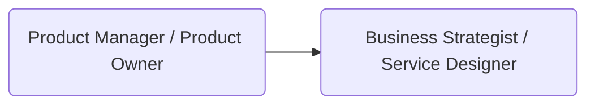
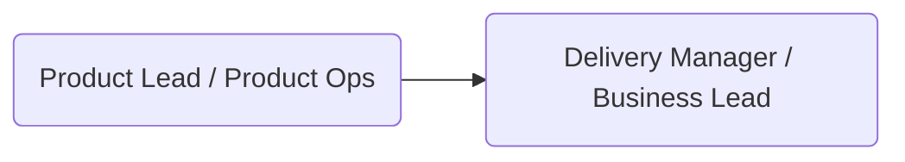
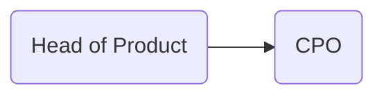

# Ruta Profesional en Negocio, Producto y Estrategia

## 🧭 Path de Negocio (Business & Product)

Aquí se detalla la evolución del perfil de negocio, incluyendo roles como Product Owner, Product Manager, y líderes de transformación digital. Se exploran competencias en estrategia, liderazgo, análisis de negocio y diseño de productos centrados en el usuario.

## Evaluación de habilidades técnicas en el path de negocios

Para roles del path de negocios (como Product Owner, Project Manager, Business Analyst, CTO, o CEO), las plataformas de evaluación están orientadas a validar competencias estratégicas, de liderazgo y de análisis. Algunas de las más utilizadas incluyen:

- [Harver](https://harver.com/): Plataforma que permite evaluar habilidades blandas y duras a través de simulaciones situacionales, resolución de problemas, pensamiento crítico y más.
- [Mettl (by Mercer)](https://mettl.com/): Evaluaciones personalizadas para roles de liderazgo, ventas, gestión de productos, y más. Permite medir habilidades cognitivas, técnicas y de comportamiento.
- [Korn Ferry](https://www.kornferry.com/): Especializada en assessments para ejecutivos y líderes. Evalúa potencial, inteligencia emocional, juicio profesional, entre otros.
- [Criteria](https://www.criteriacorp.com/): Evalúa razonamiento lógico, habilidades cognitivas, toma de decisiones, y compatibilidad con roles gerenciales.
- [Revelian (ahora Criteria)](https://www.criteriacorp.com/solutions/revelian): Se enfoca en medir competencias de negocio como toma de decisiones, lógica empresarial, y razonamiento verbal/numeral.
- [McQuaig](https://www.mcquaig.com/): Evalúa perfil de liderazgo, toma de decisiones, motivaciones y capacidades de gestión de personas.
- [SimpliLearn](https://www.simplilearn.com/skillup-free-online-courses): Aunque es una plataforma de cursos, muchas empresas lo usan para certificar habilidades clave en gestión de proyectos, transformación digital, liderazgo y estrategia de negocio.

### Habilidades que se pueden evaluar

- **Pensamiento estratégico**  
- **Gestión de proyectos (PMI, Agile, Lean, BPM)**  
- **Modelado de negocios (BMC, BPMN, Lean Canvas)**  
- **Conocimientos financieros básicos (análisis de costos, P&L, cash flow)**  
- **Negociación y comunicación efectiva**  
- **Gestión del cambio y liderazgo organizacional**

### Consideraciones

Al igual que en el path técnico, es importante que las evaluaciones de negocios estén contextualizadas al rol y etapa profesional del candidato. Algunas evaluaciones pueden complementarse con:

- **Simulaciones de casos reales**
- **Entrevistas estructuradas por competencias**
- **Evaluaciones 360º**
- **Test de juicio situacional (SJT)**

Estas herramientas no sólo sirven para contratación, sino también para planes de carrera, coaching ejecutivo y preparación para roles de mayor liderazgo.

## ETAPA 1: Fundamentos de negocio

🎯**Objetivo**: Comprender procesos de producto/negocio, colaborar en validación, investigación y tareas operativas.

### 1. Practicante de Negocio / Producto

El [practicante de negocio][lnk-intern] o producto se enfoca en observar, aprender y colaborar en tareas operativas y de soporte al equipo de producto o estrategia. Participa en actividades como la investigación de usuarios, validación de hipótesis, análisis básico de datos y documentación de procesos. Su rol es clave para adquirir una comprensión inicial del negocio, mientras desarrolla habilidades de comunicación, observación crítica y colaboración interdisciplinaria.

### 2. Analista Junior / Asistente de Producto

El [analista junior][lnk-junior] da soporte en la recopilación y análisis de datos de negocio, estudios de mercado, identificación de puntos de mejora en procesos, y documentación de requerimientos. Comienza a interactuar con stakeholders de distintas áreas y traduce necesidades del negocio en entregables accionables. Es una etapa de consolidación de habilidades analíticas, atención al detalle y pensamiento estructurado.

### 3. Associate Product Manager / Business Analyst

Este [rol][lnk-analyst] intermedio actúa como nexo entre la visión del producto y su ejecución operativa. Colabora con Product Managers, equipos técnicos y stakeholders para definir requerimientos, validar soluciones y hacer seguimiento de entregables. Participa en la priorización y aporta en la toma de decisiones con base en datos y conocimiento contextual. Es un paso clave hacia el liderazgo de producto o estrategia de negocio.

---

## ETAPA 2: Especialización y Seniority Business

🎯**Objetivo**: Ser responsable de áreas funcionales, definir roadmap, trabajar con KPIs y liderar equipos pequeños.

### 4. Product Manager / Product Owner

El [Product Manager][lnk-pm] (o Product Owner en contextos ágiles) lidera la visión, estrategia y roadmap de un producto o funcionalidad. Actúa como puente entre negocio, usuarios y equipo técnico, priorizando iniciativas con base en valor, impacto y viabilidad. Define KPIs, valida hipótesis, gestiona backlog y asegura que el producto evolucione en línea con los objetivos organizacionales. Su rol es clave para entregar soluciones útiles, usables y viables.

#### 🔧 Hard skills (Product owner)

- Roadmapping.
- OKRs.
- Métricas de producto.
- Priorización.

#### 🧠 Essential skills (Product owner)

- Visión estratégica.
- Gestión de stakeholders.

#### ✅ Criterios de desempeño (Product owner)

- Dirige equipos de desarrollo, alinea producto con objetivos de negocio.

### 5. Business Strategist / Service Designer

Este [rol][lnk-bs] se enfoca en diseñar e implementar estrategias de negocio centradas en el usuario y la sostenibilidad. A través de metodologías como Design Thinking, Service Design o Business Model Canvas, identifica oportunidades, mapea experiencias, optimiza servicios y redefine modelos de negocio. Es un perfil híbrido con visión sistémica, pensamiento creativo y fuerte orientación a resultados. Colabora de cerca con liderazgo, marketing, tecnología y operaciones.

#### 🔧 Hard skills (Service Designer)

- Diseño de servicios.
- Customer journeys.
- Análisis de propuestas de valor.

#### 🧠 Essential skills (Service Designer)

- Empatía
- Visión de sistema.
- Comunicación con equipos multifuncionales.

#### ✅ Criterios de desempeño (Service Designer)

- Mejora experiencia.
- Entrega de valor al cliente.

---

## ETAPA 3: Liderazgo y Gestión business

🎯**Objetivo**: Liderar equipos de producto, escalar procesos y lograr resultados medibles.

### 6. Product Lead / Product Operations

El [Product Lead][lnk-pl] supervisa varios equipos o líneas de producto, asegurando alineación estratégica, eficiencia en la entrega y evolución del portafolio. Coordina con stakeholders clave, gestiona objetivos compartidos y fomenta buenas prácticas de gestión de producto. En organizaciones más maduras, puede trabajar en conjunto con Product Ops, un rol orientado a escalar procesos, métricas y herramientas que optimicen el trabajo de los equipos de producto.

#### 🔧 Hard skills (Product lead)

- Gobierno de producto.
- Alineación cross-funcional.
- Definición de procesos.

#### 🧠 Essential skills (Product lead)

- Accountability.
- Mentoring.
- Toma de decisiones basadas en datos.

#### ✅ Criterios de desempeño (Product lead)

- Supervisa otros PMs.
- Optimiza estrategia y rendimiento de producto.

### 7. Delivery Manager / Business Lead

El [Delivery Manager][lnk-bl] asegura que los equipos entreguen valor de manera efectiva y predecible. Coordina personas, procesos y prioridades para cumplir compromisos y mantener la calidad. En empresas más orientadas a negocio, este rol puede tener el nombre de Business Lead: una figura híbrida que combina conocimiento técnico, visión estratégica y liderazgo operativo para llevar productos o servicios al mercado con éxito, colaborando estrechamente con áreas como ventas, marketing y operaciones.

#### 🔧 Hard skills (Delivery Manager)

- Planificación.
- Cumplimiento de entregas.
- Seguimiento de objetivos.

#### 🧠 Essential skills (Delivery Manager)

- Enfoque a resultados.
- Resolución de conflictos.
- Liderazgo operativo.

#### ✅ Criterios de desempeño (Delivery Manager)

- Asegura el delivery de alto impacto con calidad y eficiencia.

---

## ETAPA 4: Dirección y Visión Organizacional business

🎯**Objetivo**: Escalar productos, equipos y cultura desde una perspectiva estratégica.

### 8. Head of Product

El [Head of Product][lnk-head] lidera múltiples equipos de producto o áreas estratégicas dentro de la organización. Su rol combina dirección táctica y estratégica, alineando la visión del producto con los objetivos del negocio. Es responsable de formar líderes de producto, establecer frameworks de priorización y coordinarse con otras áreas clave como tecnología, ventas, marketing y operaciones. También promueve una cultura centrada en el usuario y basada en datos.

#### 🔧 Hard skills (Head of Product)

- Dirección de portafolio.
- Gobernanza.
- Métricas globales.

#### 🧠 Essential skills (Head of Product)

- Liderazgo organizacional.
- Visión estratégica.
- Influencia cultural.

#### ✅ Criterios de desempeño (Head of Product)

- Define objetivos de toda el área de producto y mide impacto general.

### 9. CPO (Chief Product Officer)

El [CPO][lnk-cpo] (Chief Product Officer) es el máximo responsable de la estrategia de producto en la organización. Define la visión, la propuesta de valor y el enfoque a largo plazo del portafolio de productos o servicios. Trabaja junto al CEO y otros ejecutivos para alinear producto, negocio y mercado. Además, crea las condiciones organizacionales para la innovación, la experimentación y la escalabilidad del producto. Es un rol fundamental en compañías con mentalidad digital o de producto.

#### 🔧 Hard skills (CPO)

- Innovación a nivel organizacional.
- Alineación con visión y negocio.

#### 🧠 Essential skills (CPO)

- Influencia transversal.
- Pensamiento sistémico.
- Visión de impacto global.

#### ✅ Criterios de desempeño (CPO)

- Escala la estrategia de producto con impacto en la organización completa.

---

## ETAPA 5: Dirección Ejecutiva y Visión Global

🎯**Objetivo**: Liderar o crear empresas con visión completa de negocio, crecimiento e innovación.

### 10. COO (Chief Operating Officer)

El [COO][lnk-coo] es responsable de la operación diaria del negocio. Su enfoque está en ejecutar la estrategia definida junto al CEO, optimizar procesos, gestionar recursos y asegurar la eficiencia de las operaciones. Actúa como puente entre la visión estratégica y la ejecución operativa, trabajando estrechamente con líderes de producto, ingeniería, ventas y otras áreas. Es un rol ideal para personas con enfoque en la entrega, resultados y coordinación de múltiples áreas funcionales.

#### 🔧 Hard skills (COO)

- Estrategia operacional.
- Gestión de recursos.
- Procesos y eficiencia.

#### 🧠 Essential skills (COO)

- Coordinación de áreas.
- Orientación al rendimiento global.

#### ✅ Criterios de desempeño (COO)

- Supervisa ejecución y entrega de valor en todos los frentes del negocio.

### 11. CEO / Fundador de Empresa

El [CEO][lnk-ceo] (Chief Executive Officer) o Fundador es quien encarna la visión global de la compañía. Su misión es guiar a la organización hacia su propósito, tomando decisiones clave sobre estrategia, cultura, alianzas, crecimiento y sostenibilidad. Es la figura de mayor influencia y responsabilidad, y su perfil puede ser técnico, de negocio o híbrido. Un CEO debe saber rodearse de líderes competentes, adaptarse a los cambios del mercado y mantener el rumbo en contextos de alta incertidumbre.

#### 🔧 Hard skills

- Liderazgo de alto nivel.
- Estrategia corporativa.
- Relaciones con inversores.

#### 🧠 Essential skills

- Cultura organizacional.
- Visión de mercado.
- Innovación constante.

#### ✅ Criterios de desempeño

- Representa a la empresa.
- Toma decisiones estratégicas y asegura crecimiento.

## 🔀 ¿Puede alguien saltar entre el path de negocio al path técnico?

✅ Sí, es posible moverse entre el path de negocio y el path técnico, pero no en cualquier momento ni de cualquier rol.
Generalmente, el salto ocurre en roles donde ya existe una intersección natural entre habilidades técnicas y de negocio.

## 🚀 ¿Desde qué roles se puede hacer el cambio?

| Rol de Origen (Negocio)          | Rol de Destino (Técnico)                      | Explicación                                                                                                              |
| -------------------------------- | --------------------------------------------- | ------------------------------------------------------------------------------------------------------------------------ |
| Product Manager / Product Owner  | Tech Lead (en proyectos muy técnicos)         | Si domina muy bien aspectos técnicos de producto (APIs, arquitecturas, flujos de datos) podría liderar equipos técnicos. |
| Business Analyst / Associate PM  | Mid-Level Developer (con formación adicional) | Si decide profundizar en programación podría reinsertarse como desarrollador intermedio.                                 |
| Business Lead / Delivery Manager | Engineering Manager                           | En casos de fuerte experiencia gestionando equipos técnicos y proyectos de ingeniería.                                   |

> 🔥 Nota: Este tipo de salto requiere generalmente re-skilling técnico (aprender programación avanzada, arquitecturas, etc.).

## 📌 Consideraciones importantes

- No se recomienda saltar antes del nivel Semi-Senior o Mid-Level, porque antes no se domina lo suficiente ningún área.
- Tener habilidades híbridas (como programación + visión de usuario) facilita mucho los saltos.
- Comunicación, liderazgo y pensamiento sistémico son habilidades clave en cualquier cambio.

---

[Inicio](README.md) | [⬆️](../README.md) | [Intern](01-intern.md)

[lnk-intern]:    01-intern.md
[lnk-junior]:    02-junior.md
[lnk-analyst]:   03-analyst.md
[lnk-pm]:        04-pm.md
[lnk-bs]:        05-bs.md
[lnk-pl]:        06-pl.md
[lnk-bl]:        07-bl.md
[lnk-head]:      08-head.md
[lnk-cpo]:       09-cpo.md
[lnk-coo]:       10-coo.md
[lnk-ceo]:       11-ceo.md
