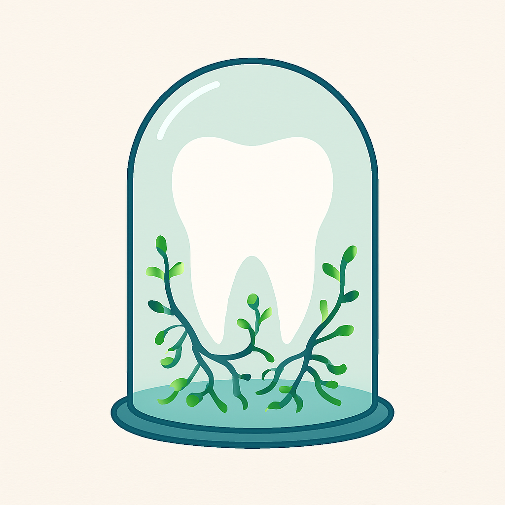

# Aplicación del Manifiesto: El Fluoruro como Paradoja Sistémica

Este artículo forma parte de la [Aventura Existencial](./existential-adventure.md), una serie de reflexiones que integran tecnología, propósito y conciencia humana. Surge como aplicación directa del Manifiesto original, donde se propone que toda herramienta —desde la inteligencia artificial hasta los compuestos químicos— debe ser analizada desde su impacto sistémico y su propósito humano.

## La Paradoja del Fluoruro: Cuando la Protección Se Convierte en Dependencia

### Una reflexión sobre la medicina moderna y los ecosistemas microbianos

Durante décadas, el fluoruro ha sido celebrado como uno de los grandes triunfos de la salud pública. Sin embargo, una mirada más profunda revela una paradoja inquietante que materializa con precisión quirúrgica los patrones sistémicos que he teorizado en mi manifiesto sobre *"[la protección como freno del potencial](./existential-adventure.md#las-paradojas-del-progreso-protección-y-eficiencia-sin-conciencia)"*.

### El Ecosistema Perdido

La investigación arqueológica del cálculo dental (tártaro mineralizado) nos muestra algo fascinante: nuestros ancestros poseían una diversidad microbiana oral significativamente mayor que las poblaciones modernas¹. Esta microbiota ancestral funcionaba como un escudo natural contra patógenos, incluyendo las bacterias causantes de caries, mediante mecanismos sofisticados:

- **Competencia por recursos**: Las bacterias beneficiosas limitaban naturalmente el crecimiento de patógenos  
- **Producción de antimicrobianos naturales**: Ciertas bacterias comensales generaban sustancias que inhibían a los microorganismos dañinos  
- **Modulación del pH oral**: Un microbioma equilibrado mantenía condiciones químicas menos favorables para la desmineralización dental  
- **Estimulación inmunitaria**: La diversidad microbiana entrenaba y fortalecía la respuesta inmune local  

### La Solución que Creó la Dependencia

El 25 de enero de 1945, Grand Rapids, Michigan, se convirtió en la primera ciudad del mundo en añadir fluoruro a su suministro de agua pública². En solo 7-8 décadas, hemos alterado radicalmente un ecosistema que evolucionó durante milenios. Y aquí surge la paradoja: necesitamos fluoruro precisamente porque hemos destruido los mecanismos naturales de protección que hacían innecesaria su intervención química.

Como escribo en mi manifiesto: *"[Reparar una sola área sin contemplar el conjunto puede llevar a soluciones incompletas, o incluso contraproducentes](./existential-adventure.md#el-cuerpo-como-sistema-una-visión-integral-para-la-medicina)"*. Tratamos los dientes como piezas aisladas que hay que "reparar", ignorando que la boca es parte de un ecosistema integral conectado con la digestión, la inmunidad y el bienestar general.

### La Eficiencia sin Conciencia

Esta situación encarna fielmente lo que mi manifiesto conceptualiza como *"[la eficiencia sin conciencia](#la-eficiencia-sin-conciencia)"*: el fluoruro es la solución "eficiente" —fácil de aplicar masivamente, mensurable en términos de reducción de caries. Pero tal como predice el marco teórico que desarrollo, *"esa eficiencia no reduce el consumo: lo amplifica"*.

Ahora dependemos de:

- Más intervenciones químicas especializadas  
- Más productos antimicrobianos  
- Mayor dependencia del sistema médico-odontológico  
- Ciclos infinitos de "protección" química  

### El Cuerpo como Sistema vs. la Medicina Fragmentada

El caso del fluoruro no es anecdótico: es una manifestación tangible de los patrones abstractos que mi manifiesto ha identificado en múltiples sistemas complejos. La medicina moderna, tal como analizo en profundidad, *"ha heredado una visión fragmentada del cuerpo humano"*, tratando a los pacientes *"como si fueran máquinas con piezas reemplazables"*. La odontología deviene en una aplicación práctica perfecta de esta abstracción teórica.

Pero *"el cuerpo humano no es una suma de partes: es un sistema complejo, interconectado y dinámico"*. La caries no es solo un "defecto dental" —es una señal sistémica que comunica desequilibrios más profundos en nuestro ecosistema microbiano, nuestra alimentación, nuestro estilo de vida.

### Hacia una Medicina Sistémica

La pregunta no debería ser "¿cómo protegemos mejor los dientes?" sino "¿qué está comunicando la caries sobre el desequilibrio del sistema? ¿Cómo podríamos restaurar la ecología natural en lugar de suplantarla químicamente?"

Como escribo: *"Sanar no es reparar: es integrar, comprender y acompañar"*. Una medicina verdaderamente avanzada buscaría restaurar los mecanismos naturales de protección, no crear dependencias químicas perpetuas.

### La Invitación al Cambio

Esta reflexión sobre el fluoruro valida empíricamente una dinámica mucho más amplia que mi manifiesto ha logrado abstraer y sistematizar. En múltiples áreas de la medicina y la tecnología, los patrones teóricos que he identificado se manifiestan con consistencia notable: soluciones que crean los problemas que supuestamente resuelven, eficiencia que genera más consumo, protección que debilita los sistemas naturales.

El caso del fluoruro confirma la tesis central de mi trabajo: **el progreso sin propósito es regresión disfrazada.** No estamos ante reflexiones aisladas, sino ante la verificación práctica de un marco conceptual que puede predecir y explicar estas paradojas sistémicas.

*Para explorar el marco teórico completo que permite estas predicciones sistémicas, te invito a examinar mi manifiesto en: [Aventura Existencial](./aventura-existencial.md)*

---

## Referencias

1. Weyrich, L.S. et al. "A new era in palaeomicrobiology: prospects for ancient dental calculus as a long-term record of the human oral microbiome." *Phil. Trans. R. Soc. B* (2015)  
   <https://royalsocietypublishing.org/doi/10.1098/rstb.2013.0376>

2. "Timeline for Community Water Fluoridation." *Centers for Disease Control and Prevention* (2024)  
   <https://www.cdc.gov/fluoridation/timeline-for-community-water-fluoridation/index.html>

---

**¿Qué opinas? ¿Has observado otras paradojas similares en tu área de experiencia?**

Te invito al botón de comentarios en el menú superior a la derecha, o a la izquierda hacia el final en los comentarios.
