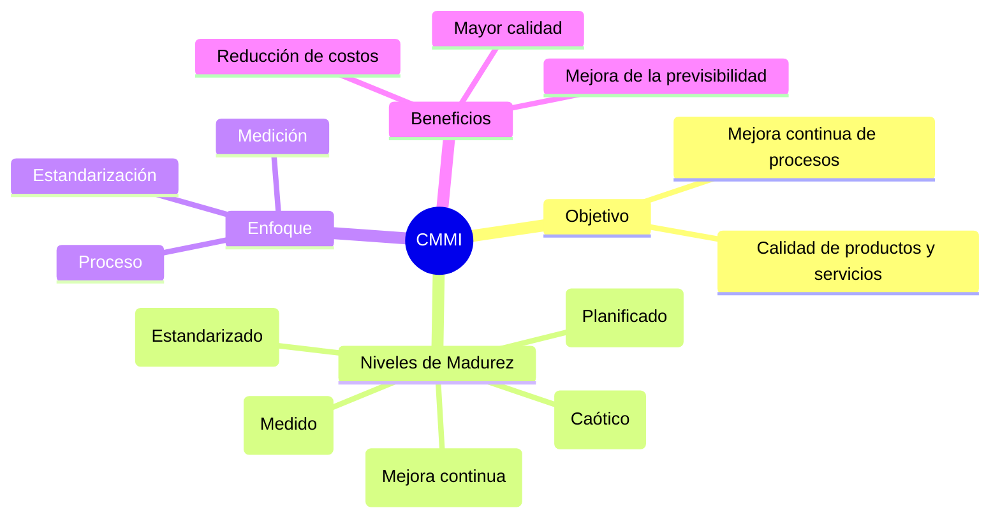
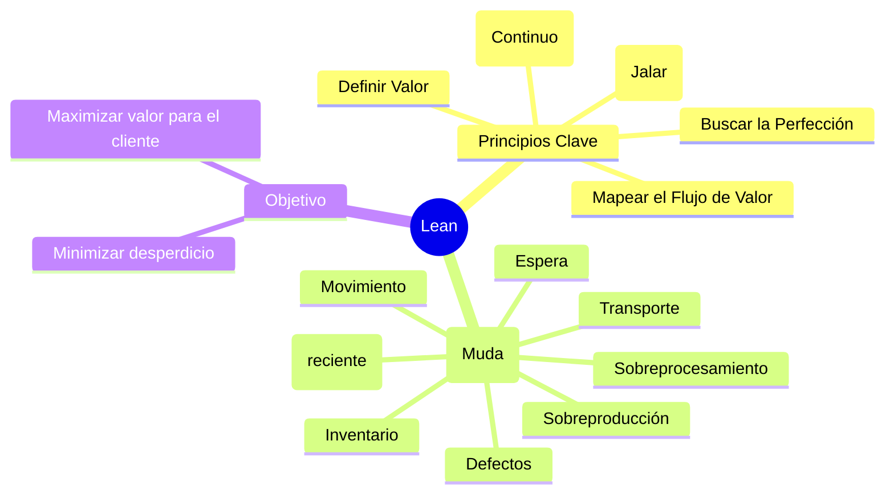
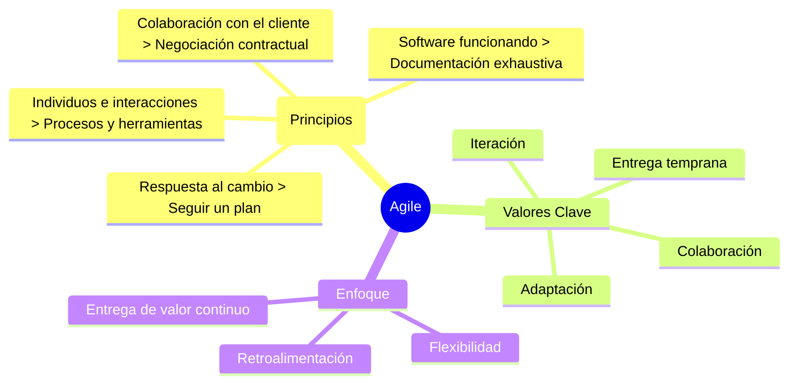
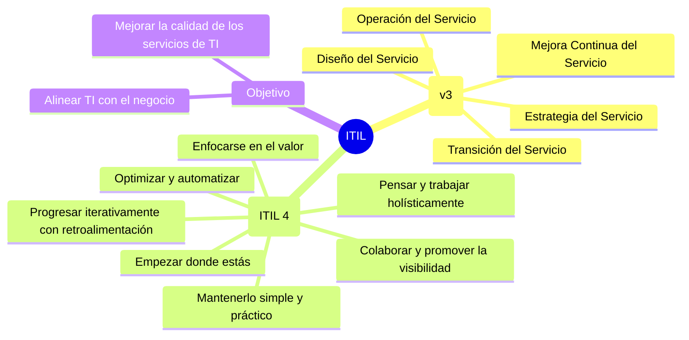
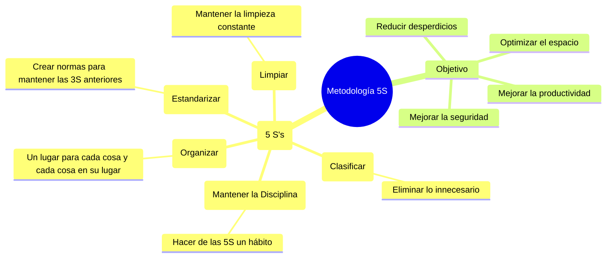
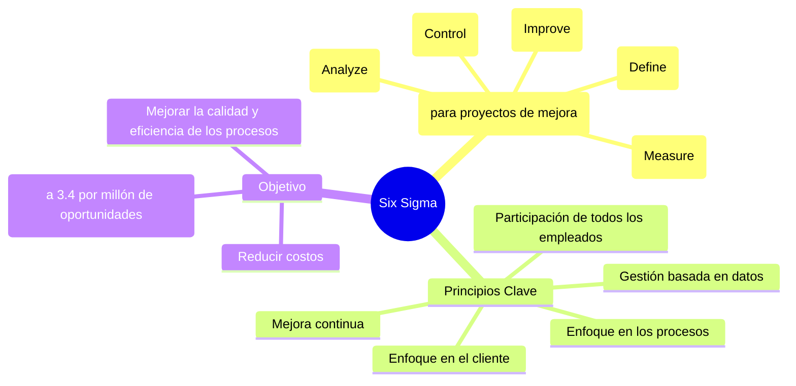

# Metodologías de Gestión de Proyectos y Mejora Continua

Este apartado resume diversas metodologías y frameworks utilizados en la gestión de proyectos, desarrollo de software y mejora de procesos.

## 1. CMMI (Capability Maturity Model Integration)

CMMI es un marco de referencia de mejora de procesos que guía a las organizaciones en el desarrollo de software y la entrega de servicios de manera más eficiente y efectiva. Se centra en la madurez de los procesos, definida en niveles.



## 2. Lean

Lean es una filosofía de trabajo que se centra en la eliminación de todo lo que no añade valor (desperdicio) en los procesos para maximizar el valor para el cliente. Su origen está en el sistema de producción de Toyota.



## 3. Agile (Agilismo)

Agile es una filosofía y un conjunto de principios para el desarrollo de software (y otros proyectos) que prioriza la entrega incremental, la colaboración, la adaptación al cambio y la retroalimentación continua sobre la planificación exhaustiva y rígida.



## 4. Scrum

Scrum es un framework ágil para el desarrollo de productos complejos. Se basa en iteraciones cortas y fijas llamadas "Sprints", con roles, eventos y artefactos bien definidos para facilitar la colaboración y la entrega incremental.

```mermaid
mindmap
  root((Scrum Framework))
    Roles
      Product Owner
      Scrum Master
      Development Team
    Eventos (Cremonias)
      Sprint Planning
      Daily Scrum
      Sprint Review
      Sprint Retrospective
    Artefactos
      Product Backlog
      Sprint Backlog
      Incremento (Producto)
    Conceptos Clave
      Sprint (Iteración corta, 1-4 semanas)
      Transparencia
      Inspección
      Adaptación
    Historias de Usuario
      Descripción
        Lo que se espera de una funcionalidad
        Punto de vista de varios Stakeholders
      Formato (Ej. como usuario, quiero, para)
      [Más sobre Historias de Usuario (Wikipedia)](https://es.wikipedia.org/wiki/Historias_de_usuario)
```

## 5. ITIL (Information Technology Infrastructure Library)

ITIL es un marco de referencia globalmente reconocido para la gestión de servicios de Tecnologías de la Información (ITSM). Se enfoca en alinear los servicios de TI con las necesidades del negocio, ofreciendo un conjunto de buenas prácticas para la entrega de servicios de TI.



## 6. 5S

La metodología 5S es una técnica de gestión visual originaria de Japón, utilizada para crear y mantener entornos de trabajo limpios, ordenados y organizados, lo que conduce a una mayor eficiencia, productividad y seguridad.



## 7. Six Sigma

Six Sigma es una metodología basada en datos para eliminar defectos y reducir la variabilidad en los procesos de negocio. Su objetivo es mejorar la calidad de los productos y servicios a través de la identificación y eliminación de las causas de los errores.



## Herramientas Comunes para la Gestión de Metodologías

Las siguientes son algunas de las herramientas más utilizadas que soportan la implementación de las metodologías mencionadas, especialmente las ágiles:

* **Jira:** Plataforma líder para la gestión de proyectos ágiles (Scrum, Kanban), seguimiento de tareas, bugs e historias de usuario.
* **Trello:** Herramienta de gestión de proyectos basada en tableros Kanban, ideal para equipos pequeños o proyectos con flujos de trabajo visuales sencillos.
* **Asana:** Software de gestión de proyectos que permite organizar tareas, colaborar en equipo y seguir el progreso. Soporta metodologías ágiles y tradicionales.
* **Azure DevOps:** Conjunto de herramientas de Microsoft que cubre todo el ciclo de vida de desarrollo de software, incluyendo la gestión de proyectos (Boards), repositorios de código, pipelines CI/CD.
* **Monday.com:** Plataforma de gestión de trabajo con alta capacidad de personalización, ideal para equipos que buscan organizar flujos de trabajo visuales y colaborativos.
* **Miro / Mural:** Pizarras blancas colaborativas online, excelentes para sesiones de brainstorming, retrospectivas, planificación de sprints y mapeo de procesos (útiles para Agile, Lean, 5S).
* **ServiceNow:** Plataforma ITSM utilizada para gestionar servicios de TI, incidentes, problemas y cambios, muy relevante para la implementación de ITIL.
* **Microsoft Excel / Google Sheets:** Aunque no son herramientas especializadas, son ampliamente utilizadas para la gestión básica de tareas, seguimiento y reportes, especialmente en etapas iniciales o proyectos pequeños.
* **[GitHub Projects](./software/github/projects.md):** Plataforma básica pero flexible implementada directamente en GitHub y con sincronización de las tareas de los desarrolladores. Es ideal para la gestión ágil de proyectos basada en código.

---

[⏪ Essential Skills](../essential/README.md) | [⏫ Subir un nivel](../README.md) | [⏩ Hobbies](/hobbies/README.md)
