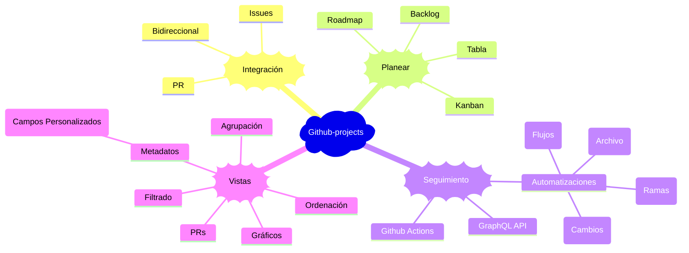

# Github projects

Es una herramienta adaptable y flexible para la planificación y el seguimeitno del trabajo en Github. (Hoja de calculos)

Para mayor detalle visite la [página oficial](https://docs.github.com/es/issues/planning-and-tracking-with-projects/learning-about-projects/about-projects)

---

[⏪ Git](../git/README.md) | [⏫ Subir un nivel](../README.md) | [⏩ npm](../npm/README.md)
