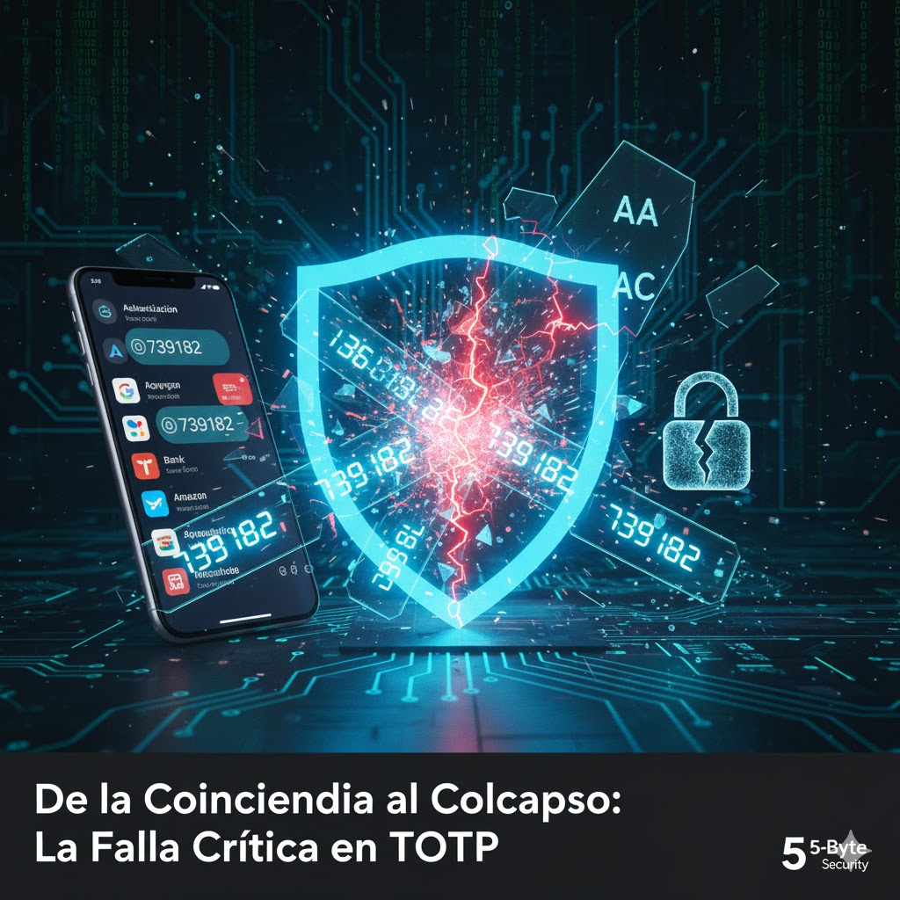

# Contraseñas de un solo uso (OTP)

Una **Contraseña de un solo uso** (OTP, por sus siglas en inglés *One-Time Password*) es una contraseña que es válida para una única sesión de inicio de sesión o transacción. Su gran ventaja es que, si un atacante la intercepta, no puede volver a utilizarla en el futuro, neutralizando los ataques de repetición (*replay attacks*).

## Índice

- [Contraseñas de un solo uso (OTP)](#contraseñas-de-un-solo-uso-otp)
  - [Índice](#índice)
  - [Tipos de Algoritmos OTP](#tipos-de-algoritmos-otp)
    - [1. HOTP (HMAC-based One-Time Password)](#1-hotp-hmac-based-one-time-password)
    - [2. TOTP (Time-based One-Time Password)](#2-totp-time-based-one-time-password)
  - [🔬 Análisis Profundo: La Entropía en Semillas TOTP Cortas](#-análisis-profundo-la-entropía-en-semillas-totp-cortas)
  - [El Problema Oculto: El Desajuste de Bits (Base32 vs. Bytes)](#el-problema-oculto-el-desajuste-de-bits-base32-vs-bytes)
  - [Demostración Práctica: La Colisión Masiva en Semillas de 2 Caracteres](#demostración-práctica-la-colisión-masiva-en-semillas-de-2-caracteres)
    - [Los "Disparadores de Cambio" (Change Triggers)](#los-disparadores-de-cambio-change-triggers)
  - [Cálculo Riguroso: Entropía Necesaria vs. Entropía Útil](#cálculo-riguroso-entropía-necesaria-vs-entropía-útil)
  - [Conclusión y Recomendación para Desarrolladores](#conclusión-y-recomendación-para-desarrolladores)
    - [Una Mirada al Futuro: Los Límites del Sistema](#una-mirada-al-futuro-los-límites-del-sistema)
      - [El Desafío Actual: Fuerza Bruta y Defensas Frágiles](#el-desafío-actual-fuerza-bruta-y-defensas-frágiles)
      - [La Amenaza Cuántica: Rompiendo los Cimientos](#la-amenaza-cuántica-rompiendo-los-cimientos)
      - [Soluciones y el Camino a Seguir](#soluciones-y-el-camino-a-seguir)
    - [🔬 El Estado de la Investigación y Uso del OTP](#-el-estado-de-la-investigación-y-uso-del-otp)
      - [1. 🌐 Uso Actual de TOTP/OTP (Sí, es muy usado)](#1--uso-actual-de-totpotp-sí-es-muy-usado)
      - [2. 🧐 Investigación en Ciberseguridad sobre OTP](#2--investigación-en-ciberseguridad-sobre-otp)
      - [3. 🧠 Investigación en la Intersección Biológica y Criptográfica](#3--investigación-en-la-intersección-biológica-y-criptográfica)
    - [Más Allá del OTP: La Revolución de la Autenticación](#más-allá-del-otp-la-revolución-de-la-autenticación)
      - [🧬 Biometría Inequívoca: El Factor "Quién Eres" Real](#-biometría-inequívoca-el-factor-quién-eres-real)
      - [🛡️ Criptografía de Canal Basada en Biología](#️-criptografía-de-canal-basada-en-biología)

---

## Tipos de Algoritmos OTP

Existen principalmente dos tipos de algoritmos para generar OTPs:

### 1. HOTP (HMAC-based One-Time Password)

Genera códigos basados en un **contador** que se incrementa con cada uso. Es como un ticket numerado: cada vez que pides uno, te dan el siguiente de la secuencia.

- **Estándar:** [RFC 4226](https://datatracker.ietf.org/doc/html/rfc4226).

### 2. TOTP (Time-based One-Time Password)

Es el más común en la autenticación de dos factores (2FA). Genera códigos basados en el **tiempo actual**. El código cambia cada 30 o 60 segundos. Aplicaciones como Google Authenticator o Authy usan este método.

- **Estándar:** [RFC 6238](https://datatracker.ietf.org/doc/html/rfc6238).

---

## 🔬 Análisis Profundo: La Entropía en Semillas TOTP Cortas

**Objetivo:** Determinar la **longitud mínima efectiva** de una semilla Base32 para cubrir el millón de posibles códigos OTP, demostrando cómo la arquitectura binaria induce colisiones masivas en semillas cortas.

## El Problema Oculto: El Desajuste de Bits (Base32 vs. Bytes)

El algoritmo HMAC, que es el motor del TOTP, no trabaja directamente con texto, sino con **bytes**. Aquí surge un problema sutil pero crítico:

- **Entrada (Semilla Base32):** Cada carácter que escribimos aporta **5 bits** de información.
- **Procesador (HMAC):** Trabaja sobre **Bytes**, que son grupos de **8 bits**.

Imagina que tienes piezas de LEGO de 5 puntos y una base que solo acepta piezas de 8 puntos. Al intentar encajarlas, te sobrarán o faltarán puntos. En el mundo del software, los bits que sobran simplemente **se descartan (truncan)**. Esta pérdida de información reduce drásticamente la seguridad real de la semilla.

## Demostración Práctica: La Colisión Masiva en Semillas de 2 Caracteres

Una semilla de 2 caracteres (ej: `AA`) genera 10 bits ($2 \times 5$). El decodificador hace lo siguiente:

1. **Forma 1 Byte (8 bits):** Usa los 5 bits del primer carácter y los **3 bits más importantes** del segundo.
2. **Descarta el resto:** Los 2 bits sobrantes del segundo carácter se tiran a la basura.

**Consecuencia:** El código OTP solo cambia cuando varían los 3 bits importantes del segundo carácter. Esto agrupa el alfabeto Base32 en **8 bloques de 4 caracteres**. Por ejemplo, las semillas `XA`, `XB`, `XC` y `XD` ¡generarán el mismo OTP porque `A`, `B`, `C` y `D` comparten los mismos 3 bits superiores (`000xx`)!

De las 1,024 combinaciones de 2 caracteres que podemos escribir, solo se generan **256 claves binarias únicas** para el algoritmo.

### Los "Disparadores de Cambio" (Change Triggers)

Un nuevo OTP solo se genera cuando el segundo carácter de la semilla es uno de los que inician un nuevo bloque de 4.

`A` (000xx), `E` (001xx), `I` (010xx), `M` (011xx), `Q` (100xx), `U` (101xx), `Y` (110xx), `4` (111xx).

## Cálculo Riguroso: Entropía Necesaria vs. Entropía Útil

El objetivo es tener suficientes claves únicas para cubrir el millón de posibles OTPs de 6 dígitos. Para ello, necesitamos al menos **20 bits de entropía** ($2^{20} \approx 1,048,576$).

Veamos cuántos "bits útiles" (los que no se descartan) obtenemos según la longitud de la semilla:

| Longitud (L) | Bits Totales ($L \times 5$) | Bytes Formados | Entropía Útil (Bits) | Total Claves Únicas ($2^{\text{Útiles}}$) | ¿Cubre $10^6$? |
| :----------: | :-------------------------: | :------------: | :------------------: | :---------------------------------------: | :------------: |
|    **2**     |           10 bits           |     1 Byte     |      **8 bits**      |                    256                    |       ❌        |
|    **3**     |           15 bits           |     1 Byte     |      **8 bits**      |                    256                    |       ❌        |
|    **4**     |           20 bits           |    2 Bytes     |     **16 bits**      |                  65,536                   |       ❌        |
|    **5**     |           25 bits           |    3 Bytes     |     **24 bits**      |           $\mathbf{16,777,216}$           |       ✅        |
|    **6**     |           30 bits           |    3 Bytes     |     **24 bits**      |               $16,777,216$                |       ✅        |
|    **7**     |           35 bits           |    4 Bytes     |     **32 bits**      |            $4.29 \times 10^9$             |       ✅        |

## Conclusión y Recomendación para Desarrolladores

La tabla demuestra con certeza matemática que solo los bits que completan un byte son realmente utilizados por el algoritmo HMAC.

Para garantizar una generación de OTP robusta y evitar las colisiones por truncamiento, se necesita una clave binaria de al menos 3 bytes (24 bits).

> **Recomendación Técnica:** La longitud mínima de una semilla TOTP debe ser de **5 caracteres Base32**. Esto genera 24 bits efectivos, proveyendo más de 16 millones de claves únicas y cubriendo de sobra el espacio del millón de OTPs.

Utilizar semillas de 4 caracteres o menos debe considerarse una **vulnerabilidad de implementación** en cualquier entorno de producción.

### Una Mirada al Futuro: Los Límites del Sistema

Es crucial entender que, aunque una semilla larga protege contra colisiones, no cambia la limitación fundamental del sistema: un OTP de 6 dígitos solo tiene **un millón de combinaciones posibles**. Este espacio de salida es el verdadero cuello de botella de la seguridad.

#### El Desafío Actual: Fuerza Bruta y Defensas Frágiles

Hoy, la principal defensa contra un ataque de fuerza bruta no es la complejidad del OTP, sino el **bloqueo de intentos (rate limiting)** impuesto por el servidor (ej. 3-5 intentos fallidos). Sin embargo, con el avance de la **Inteligencia Artificial**, es plausible que se desarrollen técnicas de ataque que logren evadir o predecir estos mecanismos de defensa, reabriendo la puerta a la viabilidad de la fuerza bruta.

#### La Amenaza Cuántica: Rompiendo los Cimientos

La computación cuántica representa una amenaza aún más profunda, no para el espacio de $10^6$ directamente, sino para los algoritmos que lo sustentan:

- **Algoritmo de Hash (SHA-1):** El **algoritmo de Grover** podría reducir drásticamente el tiempo necesario para encontrar colisiones o invertir la función hash.
- **Algoritmo Simétrico (HMAC):** La seguridad de la clave simétrica también se ve debilitada por el algoritmo de Grover.

#### Soluciones y el Camino a Seguir

Para que la autenticación multifactor siga siendo segura, la industria debe enfocarse en dos áreas clave:

1. **Aumentar la Longitud del OTP:** Es la solución más inmediata y efectiva para ampliar el espacio de búsqueda y mitigar la fuerza bruta.

    |  Longitud  | Espacio de Búsqueda ($10^N$) | Incremento de Seguridad |
    | :--------: | :--------------------------: | :---------------------: |
    | 6 dígitos  |         $1,000,000$          |         (Base)          |
    | 8 dígitos  |        $100,000,000$         |     100x más seguro     |
    | 10 dígitos |       $10,000,000,000$       |   10,000x más seguro    |

2. **Migración a Criptografía Post-Cuántica (PQC):** A largo plazo, es imperativo reemplazar los algoritmos criptográficos actuales (como SHA-1 y HMAC) por estándares PQC que sean resistentes a los ataques de computadoras cuánticas.

En resumen, tu análisis es correcto: la clave secreta de alta entropía ya no es el principal desafío. La verdadera limitación es la probabilidad de acierto en el código de salida. Los sistemas futuros deben, obligatoriamente, aumentar la longitud del OTP y adoptar estándares criptográficos resistentes a la computación cuántica.

### 🔬 El Estado de la Investigación y Uso del OTP

La investigación no solo aborda las fallas de seguridad de OTP, sino también la fricción del usuario, que es un punto de dolor importante.

#### 1. 🌐 Uso Actual de TOTP/OTP (Sí, es muy usado)

A pesar de sus limitaciones, el TOTP (y su forma más simple, OTP por SMS) sigue siendo la forma más común y aceptada de autenticación de segundo factor a nivel global.

- **Aplicaciones Empresariales:** Grandes empresas como Google, Microsoft y Amazon usan TOTP o notificaciones push como el estándar para la seguridad de cuentas.
- **Fintech:** Bancos y servicios de pago siguen usando OTP por SMS o correo electrónico para autorizar transacciones debido a su simplicidad y bajo costo.
- **Motivo de su Dominio:** La tecnología TOTP es un estándar abierto (RFC 6238), fácil de implementar en el servidor y muy barato de desplegar para el usuario.

#### 2. 🧐 Investigación en Ciberseguridad sobre OTP

La comunidad de seguridad no ve a OTP como la solución final. La investigación se centra en dos áreas principales:

**A. Ataques Exitosos y Fallas de Implementación**
La mayoría de los ataques exitosos no rompen el algoritmo TOTP en sí, sino la capa que lo rodea:

- **Phishing de Sesión (MFA Fatigue):** El atacante roba la contraseña y el código OTP en la misma sesión o satura al usuario con notificaciones push hasta que aprueba una por error.
- **SIM Swapping (Ataques a OTP-SMS):** El atacante toma control del número de teléfono del usuario, interceptando el SMS del OTP. Esto ha llevado a la recomendación de abandonar el OTP por SMS en favor de aplicaciones de autenticación.

**B. Soluciones Post-OTP (FIDO2/WebAuthn)**
La investigación se ha volcado masivamente en estándares que eliminan la necesidad de que el usuario ingrese un código, como **FIDO2 / WebAuthn**. Este es el reemplazo directo y más prometedor de TOTP, utilizando criptografía de clave pública a través de hardware (Yubikeys) o biometría del dispositivo (FaceID, huella dactilar). Su gran ventaja es que detiene los ataques de phishing, ya que la clave criptográfica nunca sale del dispositivo.

#### 3. 🧠 Investigación en la Intersección Biológica y Criptográfica

La investigación en biometría inmutable y cifrado de canal se encuentra en las áreas de **Criptografía Aplicada** y **Biometría Fuzzy**:

- **Fuzzy Extractors y Fuzzy Vaults:** Se investigan métodos matemáticos para convertir un dato biométrico inherentemente inexacto (como la lectura de un iris) en una clave criptográfica binaria perfecta y reproducible. Este es un campo activo pero aún lejos de la implementación masiva debido a la latencia y los desafíos de privacidad.

En resumen, OTP es la herramienta dominante actual, pero la investigación está enfocada en reemplazarlo con sistemas que manejan mejor la resistencia al phishing y que utilizan la clave pública (WebAuthn) o la biometría inmutable como factor de autenticación.

### Más Allá del OTP: La Revolución de la Autenticación

La discusión sobre OTPs más largos y PQC es una evolución necesaria, pero el verdadero salto disruptivo en la gestión de identidad y acceso (IAM) reside en cambiar el **factor de autenticación** mismo y la forma en que aseguramos el canal de comunicación.

#### 🧬 Biometría Inequívoca: El Factor "Quién Eres" Real

La biometría actual (huella, rostro) a menudo se puede copiar. El futuro apunta a datos biológicos únicos e inmutables que son extremadamente difíciles de falsear:

- **ADN y Marcadores Genéticos:** Aunque su uso es lento y plantea dilemas éticos, el ADN es el identificador más puro. En el futuro, se podrían usar marcadores genéticos específicos (como los SNPs) como una "clave" binaria única.
- **Biometría Ocular Avanzada (Iris/Retina):** Los patrones del iris y de los vasos sanguíneos de la retina son únicos incluso en gemelos idénticos, ofreciendo una seguridad muy superior.
- **Autenticación Comportamental:** Ya en uso, esta técnica crea un perfil continuo de cómo interactúas con tus dispositivos (velocidad al teclear, forma de sostener el teléfono, etc.). Si el comportamiento cambia, la autenticación falla.

#### 🛡️ Criptografía de Canal Basada en Biología

Esta es la fusión de la biometría y la criptografía. En lugar de solo verificar la identidad, se usa la biología para cifrar la comunicación:

1. **Extracción de Clave ("Fuzzy Extractor"):** Se extrae una clave binaria estable y de alta entropía a partir de datos biométricos "ruidosos" (que nunca son 100% idénticos en cada lectura).
2. **Cifrado de Sesión:** Esa clave biológica se usa para derivar una clave efímera que cifra el canal de comunicación (similar al *master secret* en TLS).

El resultado es un canal cifrado con una clave que solo puede ser generada por la biología del individuo, moviéndonos de la Autenticación Multifactor (MFA) a una **Autenticación Continua y Auto-Cifrante**.

---

[⏫ Subir un nivel](./README.md)
