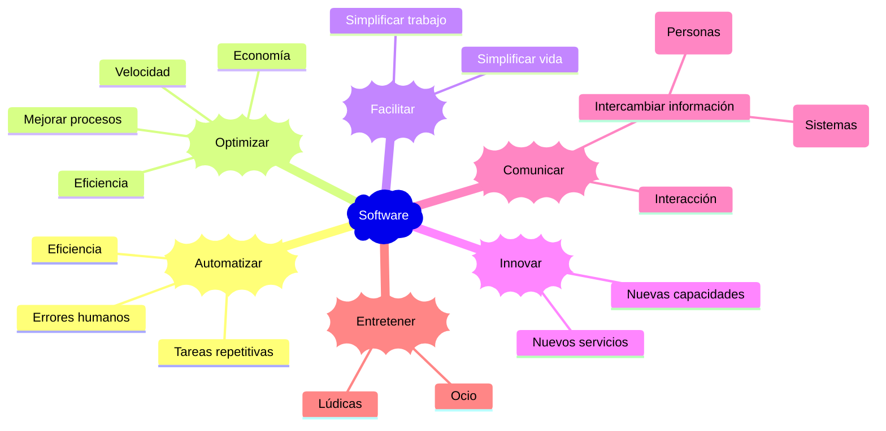
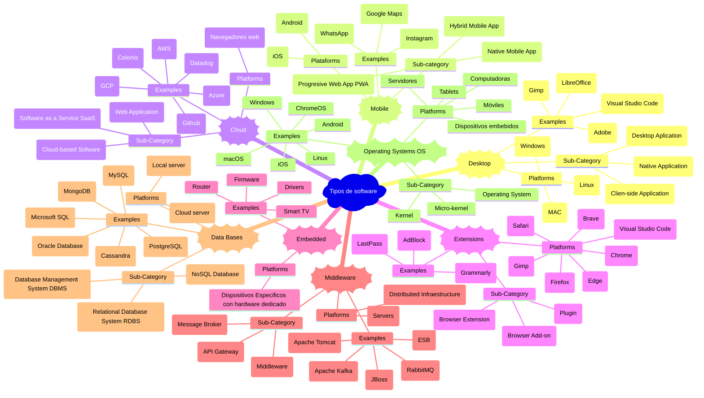

# Introducción al software

El software es un conjunto de instrucciones, datos y programas que le dicen a un hardware qué hacer y cómo hacerlo, permitiéndole realizar tareas específicas. Es la parte "lógica" e intangible de un sistema informático.

Para crear un software se debe tener bien definido su objetivo, el cúal debe estar enfocado a _resolver problemas, automatizar tareas o satisfacer una necesidad específica de usuarios o negocios_.

En última instancia, el software busca _añadir valor_ al usuario o a la organización, ya sea aumentando la productividad, mejorando la toma de decisiones, enriqueciendo la experiencia o habilitando nuevas funcionalidades.

## Clasificación del software por Tipo de Despliegue y Plataforma

Esta clasificación esta enfocada al tipo de despligue y plataforma de uso.

| Software                            | Desktop | Mobile | Cloud | Extension | Embedded | Middleware | Data Base |  OS   |
| ----------------------------------- | :-----: | :----: | :---: | :-------: | :------: | :--------: | :-------: | :---: |
| 1Password                           |   [ ]   |  [ ]   |  [ ]  |    [ ]    |   [ ]    |    [ ]     |    [ ]    |  [ ]  |
| Adobe                               |   [ ]   |  [ ]   |  [ ]  |    [ ]    |   [ ]    |    [ ]     |    [ ]    |  [ ]  |
| [Antigravity](./antigravity.md)     |   [X]   |  [ ]   |  [ ]  |    [ ]    |   [ ]    |    [ ]     |    [ ]    |  [ ]  |
| [Automate(llamalab)](./Automate.md) |   [ ]   |  [ ]   |  [ ]  |    [ ]    |   [ ]    |    [ ]     |    [ ]    |  [ ]  |
| Automator                           |   [ ]   |  [ ]   |  [ ]  |    [ ]    |   [ ]    |    [ ]     |    [ ]    |  [ ]  |
| Azure DevOps                        |   [ ]   |  [ ]   |  [ ]  |    [ ]    |   [ ]    |    [ ]     |    [ ]    |  [ ]  |
| [Appsheet](./Appsheet.md)           |   [ ]   |  [ ]   |  [ ]  |    [ ]    |   [ ]    |    [ ]     |    [ ]    |  [ ]  |
| Apromore                            |   [ ]   |  [ ]   |  [ ]  |    [ ]    |   [ ]    |    [ ]     |    [ ]    |  [ ]  |
| [Bases de datos](./dbs/README.md)   |   [ ]   |  [ ]   |  [ ]  |    [ ]    |   [ ]    |    [ ]     |    [X]    |  [ ]  |
| Bizagi                              |   [ ]   |  [ ]   |  [ ]  |    [ ]    |   [ ]    |    [ ]     |    [ ]    |  [ ]  |
| BSC Designer                        |   [ ]   |  [ ]   |  [ ]  |    [ ]    |   [ ]    |    [ ]     |    [ ]    |  [ ]  |
| Catalina                            |   [ ]   |  [ ]   |  [ ]  |    [ ]    |   [ ]    |    [ ]     |    [ ]    |  [ ]  |
| Celonis                             |   [ ]   |  [ ]   |  [ ]  |    [ ]    |   [ ]    |    [ ]     |    [ ]    |  [ ]  |
| Docker                              |   [ ]   |  [ ]   |  [ ]  |    [ ]    |   [ ]    |    [ ]     |    [ ]    |  [ ]  |
| Docsify                             |   [ ]   |  [ ]   |  [ ]  |    [ ]    |   [ ]    |    [ ]     |    [ ]    |  [ ]  |
| Excel                               |   [ ]   |  [ ]   |  [ ]  |    [ ]    |   [ ]    |    [ ]     |    [ ]    |  [ ]  |
| Figma                               |   [ ]   |  [ ]   |  [ ]  |    [ ]    |   [ ]    |    [ ]     |    [ ]    |  [ ]  |
| [Git](./git/README.md)              |   [X]   |  [ ]   |  [ ]  |    [ ]    |   [ ]    |    [ ]     |    [ ]    |  [ ]  |
| [GitHub](./github/README.md)        |   [X]   |  [X]   |  [X]  |    [ ]    |   [ ]    |    [ ]     |    [ ]    |  [ ]  |
| GMail                               |   [ ]   |  [ ]   |  [ ]  |    [ ]    |   [ ]    |    [ ]     |    [ ]    |  [ ]  |
| Google Calendar                     |   [ ]   |  [ ]   |  [ ]  |    [ ]    |   [ ]    |    [ ]     |    [ ]    |  [ ]  |
| Google Chrome                       |   [ ]   |  [ ]   |  [ ]  |    [ ]    |   [ ]    |    [ ]     |    [ ]    |  [ ]  |
| Google Drive                        |   [ ]   |  [ ]   |  [ ]  |    [ ]    |   [ ]    |    [ ]     |    [ ]    |  [ ]  |
| Google Meet                         |   [ ]   |  [ ]   |  [ ]  |    [ ]    |   [ ]    |    [ ]     |    [ ]    |  [ ]  |
| Google Sheets                       |   [ ]   |  [ ]   |  [ ]  |    [ ]    |   [ ]    |    [ ]     |    [ ]    |  [ ]  |
| Google sites                        |   [ ]   |  [ ]   |  [ ]  |    [ ]    |   [ ]    |    [ ]     |    [ ]    |  [ ]  |
| Google slides                       |   [ ]   |  [ ]   |  [ ]  |    [ ]    |   [ ]    |    [ ]     |    [ ]    |  [ ]  |
| Jira                                |   [ ]   |  [ ]   |  [ ]  |    [ ]    |   [ ]    |    [ ]     |    [ ]    |  [ ]  |
| Kie Sandbox                         |   [ ]   |  [ ]   |  [ ]  |    [ ]    |   [ ]    |    [ ]     |    [ ]    |  [ ]  |
| Kubernetes                          |   [ ]   |  [ ]   |  [ ]  |    [ ]    |   [ ]    |    [ ]     |    [ ]    |  [ ]  |
| Linux                               |   [ ]   |  [ ]   |  [ ]  |    [ ]    |   [ ]    |    [ ]     |    [ ]    |  [ ]  |
| Mac OS                              |   [ ]   |  [ ]   |  [ ]  |    [ ]    |   [ ]    |    [ ]     |    [ ]    |  [ ]  |
| [npm](./npm/README.md)              |   [ ]   |  [ ]   |  [ ]  |    [ ]    |   [ ]    |    [ ]     |    [ ]    |  [ ]  |
| Outlook                             |   [ ]   |  [ ]   |  [ ]  |    [ ]    |   [ ]    |    [ ]     |    [ ]    |  [ ]  |
| Postman                             |   [ ]   |  [ ]   |  [ ]  |    [ ]    |   [ ]    |    [ ]     |    [ ]    |  [ ]  |
| Power Automate                      |   [ ]   |  [ ]   |  [ ]  |    [ ]    |   [ ]    |    [ ]     |    [ ]    |  [ ]  |
| PowerPoint                          |   [ ]   |  [ ]   |  [ ]  |    [ ]    |   [ ]    |    [ ]     |    [ ]    |  [ ]  |
| Skype                               |   [ ]   |  [ ]   |  [ ]  |    [ ]    |   [ ]    |    [ ]     |    [ ]    |  [ ]  |
| Slack                               |   [ ]   |  [ ]   |  [ ]  |    [ ]    |   [ ]    |    [ ]     |    [ ]    |  [ ]  |
| Teams                               |   [ ]   |  [ ]   |  [ ]  |    [ ]    |   [ ]    |    [ ]     |    [ ]    |  [ ]  |
| Trello                              |   [ ]   |  [ ]   |  [ ]  |    [ ]    |   [ ]    |    [ ]     |    [ ]    |  [ ]  |
| VirtualBox                          |   [ ]   |  [ ]   |  [ ]  |    [ ]    |   [ ]    |    [ ]     |    [ ]    |  [ ]  |
| Visual Studio                       |   [ ]   |  [ ]   |  [ ]  |    [ ]    |   [ ]    |    [ ]     |    [ ]    |  [ ]  |
| Visual Studio Code                  |   [ ]   |  [ ]   |  [ ]  |    [ ]    |   [ ]    |    [ ]     |    [ ]    |  [ ]  |
| Windows                             |   [ ]   |  [ ]   |  [ ]  |    [ ]    |   [ ]    |    [ ]     |    [ ]    |  [ ]  |
| Word                                |   [ ]   |  [ ]   |  [ ]  |    [ ]    |   [ ]    |    [ ]     |    [ ]    |  [ ]  |
| WSL                                 |   [ ]   |  [ ]   |  [ ]  |    [ ]    |   [ ]    |    [ ]     |    [ ]    |  [ ]  |
| Zoom                                |   [ ]   |  [ ]   |  [ ]  |    [ ]    |   [ ]    |    [ ]     |    [ ]    |  [ ]  |

---

[⏫ Subir un nivel](../README.md)
