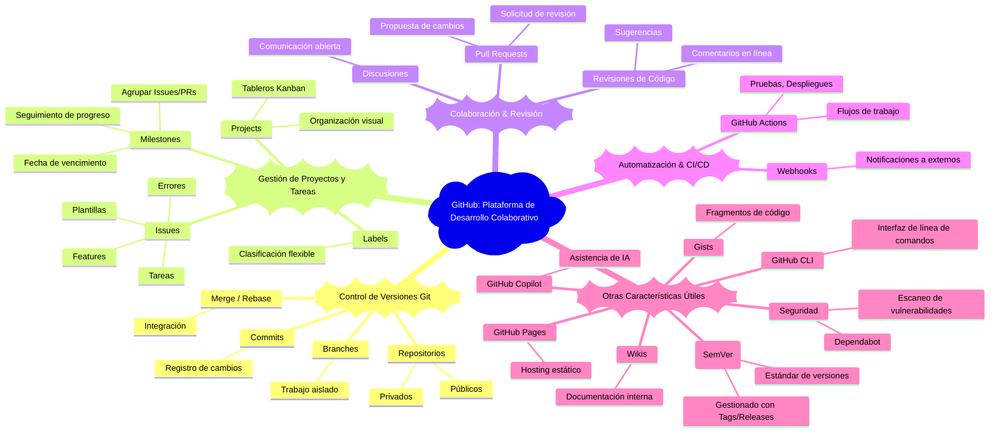

# 🐙 GitHub: La Plataforma para el Desarrollo Colaborativo

GitHub es la plataforma de desarrollo de software más grande del mundo, construida sobre el sistema de control de versiones distribuido Git. Permite a millones de desarrolladores, equipos y empresas colaborar en proyectos de código, gestionar el ciclo de vida del desarrollo de software y alojar código de manera eficiente.

----

## Características Principales de GitHub

GitHub no es solo un repositorio de código; es un ecosistema completo que facilita la colaboración y la gestión de proyectos.

### 1. **Control de Versiones con Git:**

- **Repositorios:** Almacena el código fuente de tu proyecto y todo su historial de cambios. Pueden ser públicos o privados.
- **Ramas (Branches):** Permite a los desarrolladores trabajar en nuevas características o correcciones de errores de forma aislada sin afectar la rama principal (generalmente `main` o `master`).
- **Commits:** Registran los cambios realizados en el código con un mensaje descriptivo, creando un historial lineal o ramificado del proyecto.
- **Fusionar (Merge) / Rebase:** Mecanismos para integrar cambios de una rama a otra, manteniendo la coherencia del código.

### 2. **Gestión de Proyectos y Tareas:**

- **Issues (Incidencias):** Sistema fundamental para el seguimiento de errores, solicitudes de características, preguntas y tareas pendientes. Permiten organizar, priorizar y asignar el trabajo.
  - **Plantillas (Templates) de Issues y Pull Requests:** Archivos predefinidos (ej., `.github/ISSUE_TEMPLATE/*.md`, `.github/PULL_REQUEST_TEMPLATE.md`) que guían a los usuarios al crear issues o PRs, asegurando la inclusión de información necesaria y estandarizando el proceso.
- **[Milestones](./milestones.md) (Hitos):** Agrupan Issues y Pull Requests relacionados bajo un objetivo común con una fecha de vencimiento. Son cruciales para seguir el progreso hacia fases específicas del proyecto.
- **[Projects](./projects.md) (Proyectos):** Tableros Kanban o de proyectos personalizables que permiten visualizar y organizar el flujo de trabajo de Issues, Pull Requests y notas en columnas (ej., "To Do", "In Progress", "Done").
<!-- TODO: Documentar labels -->
- **Labels (Etiquetas):** Clasifican Issues y PRs por tipo (ej., `bug`, `feature`), prioridad, área de enfoque, o cualquier otra categoría personalizada.

### 3. **Colaboración y Revisión de Código:**

- **Pull Requests (PRs) / Merge Requests:** Mecanismo central para proponer cambios a un repositorio y solicitar su revisión antes de ser fusionados.
- **Revisiones de Código:** Herramientas integradas para comentar líneas de código específicas, sugerir cambios y aprobar o solicitar más revisiones en los PRs.
- **Discusiones:** Espacios para conversaciones más generales sobre el proyecto, ideas o decisiones de diseño.

### 4. **Automatización y CI/CD:**

- **GitHub Actions:** Plataforma de CI/CD (Integración Continua/Despliegue Continuo) integrada. Permite automatizar flujos de trabajo como pruebas, despliegues y publicación de paquetes directamente desde el repositorio.
- **Webhooks:** Notificaciones automáticas a aplicaciones externas cuando ocurren eventos específicos en el repositorio (ej., un `push`, un `pull request` abierto).

### 5. **Otras Características Relevantes:**

- **GitHub Pages:** Alojamiento gratuito de sitios web estáticos directamente desde un repositorio. Ideal para blogs, documentación o portafolios personales (como este mismo sitio).
- **GitHub Copilot:** Una herramienta de programación asistida por IA que sugiere código y autocompleta líneas, acelerando el desarrollo.
- **GitHub CLI:** Herramienta de línea de comandos para interactuar con GitHub desde la terminal.
- **Seguridad:** Escaneo de vulnerabilidades, Dependabot para actualizaciones de dependencias, auditorías de seguridad.
- **Gists:** Fragmentos de código simples para compartir rápidamente.
- **Wikis:** Para documentación interna del proyecto.
- **Versionado Semántico (SemVer):** Aunque no es una característica *nativa* de GitHub, es un estándar de facto (ej. `v1.0.0`, `v2.1.3`) ampliamente adoptado y gestionado a través de *releases* y *tags* en GitHub para indicar versiones de software de manera coherente y predecible.

----

## 🧠 Mapa Mental: GitHub y sus Características Clave

----

GitHub es una herramienta indispensable para cualquier desarrollador moderno, facilitando tanto el trabajo individual como la colaboración en equipos grandes y pequeños. Su amplio conjunto de características soporta todo el ciclo de vida del desarrollo de software.

----

[⏪ Regresar a Git](../git/README.md) | [⏫ Subir a Hard Technical Skills](../README.md) | [⏩ Avanzar a npm](../npm/README.md)
