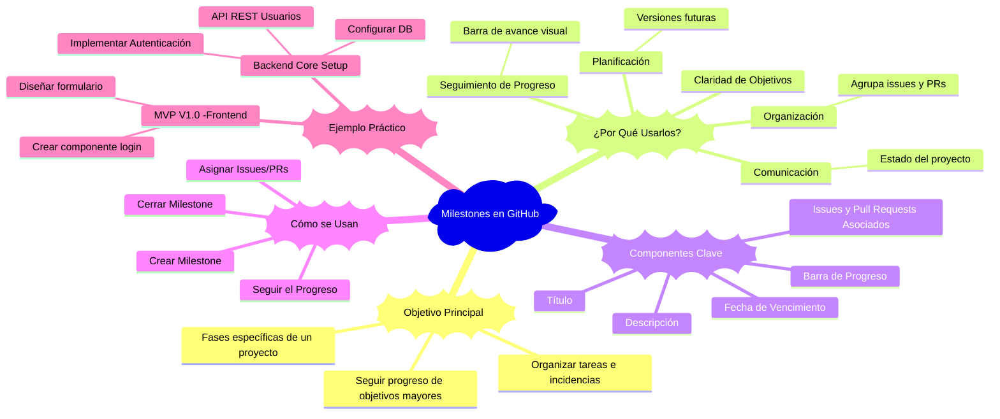

# 🚀 Milestones en GitHub

Los **Milestones (Hitos)** en GitHub son una herramienta fundamental para la gestión de proyectos, permitiendo organizar tareas e incidencias (issues y pull requests) en grupos lógicos con una fecha límite. Son una forma visual y efectiva de seguir el progreso hacia un objetivo mayor o una fase específica de un proyecto.

---

## ¿Qué son los Milestones?

Un Milestone es esencialmente un objetivo o una fase definida de un proyecto, a la que se le asigna un nombre, una descripción y una fecha de vencimiento. Actúan como contenedores para un conjunto de issues y pull requests relacionados que deben completarse para alcanzar ese objetivo.

## ¿Por qué usar Milestones?

- **Claridad de Objetivos:** Proporcionan una visión clara de los objetivos a corto y medio plazo del proyecto.
- **Seguimiento de Progreso:** Permiten ver el porcentaje de issues y pull requests completados dentro de un hito, ofreciendo una métrica de progreso.
- **Organización:** Ayudan a agrupar tareas relacionadas, haciendo que el tablero de issues sea más manejable.
- **Planificación:** Facilitan la planificación de futuras versiones o fases del proyecto.
- **Comunicación:** Mejoran la comunicación del estado del proyecto con el equipo y los colaboradores.

## Componentes de un Milestone

Un Milestone típico en GitHub incluye:

- **Título:** Nombre descriptivo del hito (ej., "MVP V1.0", "Refactorización de Autenticación", "Sprint 3").
- **Descripción:** Detalles sobre el objetivo del hito, lo que se espera lograr.
- **Fecha de Vencimiento (Due Date):** La fecha límite para completar todas las tareas asociadas al hito.
- **Issues y Pull Requests Asociados:** Listado de todas las tareas y contribuciones de código que pertenecen a este hito.
- **Barra de Progreso:** Una barra visual que muestra el porcentaje de issues completados frente al total de issues asignados al hito.

## ¿Cómo se usan?

1. **Crear un Milestone:** Desde la pestaña "Issues" o "Pull Requests" de tu repositorio, navega a la sección "Milestones" y crea uno nuevo.
2. **Asignar Issues/PRs:** Al crear o editar un issue o pull request, puedes asignarlo a uno o más Milestones existentes.
3. **Seguir el Progreso:** La página de Milestones muestra el progreso de cada hito, facilitando la identificación de cuellos de botella o hitos que están en riesgo de retrasarse.
4. **Cerrar un Milestone:** Una vez que todas las tareas asociadas a un hito están completas, se puede "cerrar" el Milestone, indicando su finalización.

---

## Ejemplo de uso práctico

Imagina que estás desarrollando una aplicación web. Podrías definir los siguientes Milestones:

- **"M-001: Backend Core Setup"**:
  - *Descripción:* Configurar la base de datos, API REST inicial para usuarios y autenticación.
  - *Fecha de Vencimiento:* 2024-06-30
  - *Issues:* "Configurar PostgreSQL", "Crear endpoint de registro de usuario", "Implementar JWT para autenticación".
- **"M-002: Frontend MVP"**:
  - *Descripción:* Desarrollar la interfaz de usuario mínima viable para el registro, login y dashboard.
  - *Fecha de Vencimiento:* 2024-07-15
  - *Issues:* "Diseñar formulario de registro", "Crear componente de login", "Mostrar datos del usuario en dashboard".

---

Los Milestones son una herramienta poderosa para mantener tus proyectos de software organizados y en camino, proporcionando una visión estructurada del trabajo por hacer.

---

[⏪ Regresar a Git](../git/README.md) | [⏫ Subir un nivel](../README.md) | [⏩ Avanzar a Github pages](./pages.md)
