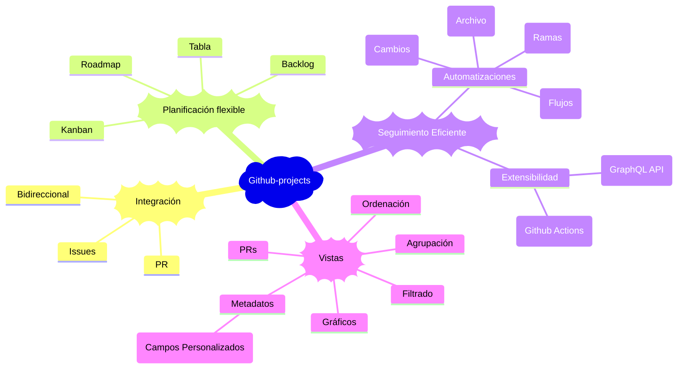

# Github projects

Es una herramienta adaptable y flexible para la planificación y el seguimeitno del trabajo en Github. (Hoja de calculos)

## Beneficios Clave

- **Centralización:** Unifica la planificación y el código en un solo lugar.
- **Flexibilidad:** Se adapta a diversas metodologías (Kanban, Scrum light, etc.).
- **Visibilidad:** Ofrece una visión clara del progreso del proyecto.
- **Automatización:** Reduce tareas manuales, mejorando la eficiencia.
- **Personalización:** Crea vistas y campos que se ajustan a tus necesidades específicas.

Para obtener una documentación más detallada y técnica, visita la [página oficial de GitHub Projects](https://docs.github.com/es/issues/planning-and-tracking-with-projects/learning-about-projects/about-projects).

---

[⏪ Regresar a Github pages](./pages.md) | [⏫ Subir un nivel](../README.md) | [⏩ Avanzar a SemVer](./semver.md)
